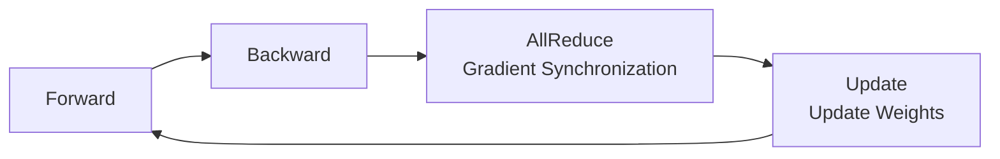
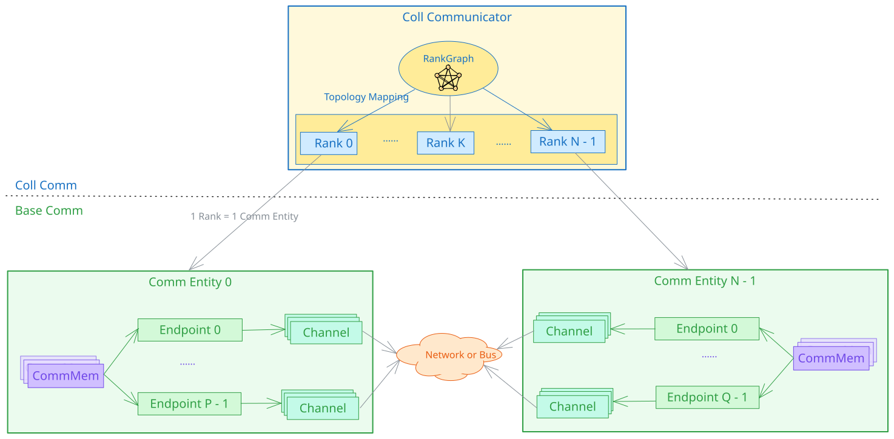
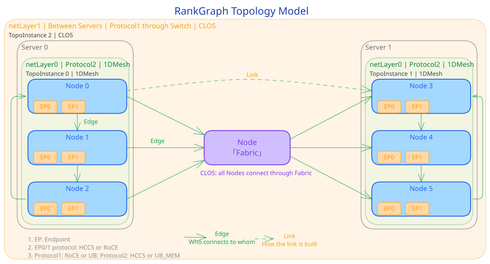
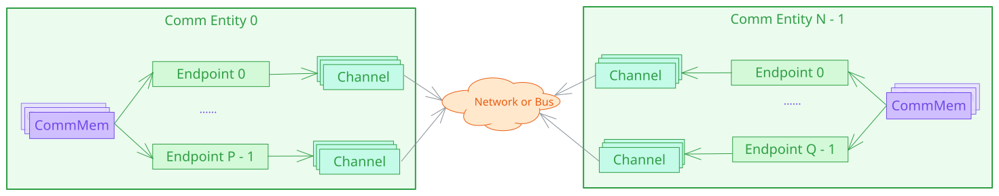
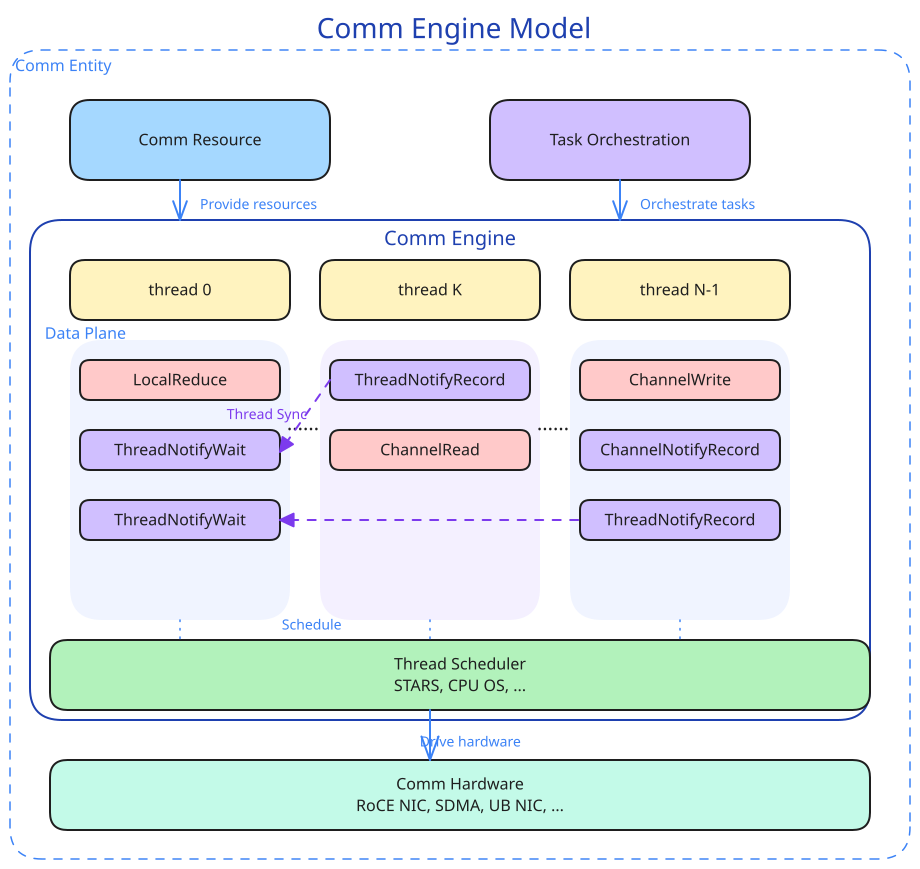
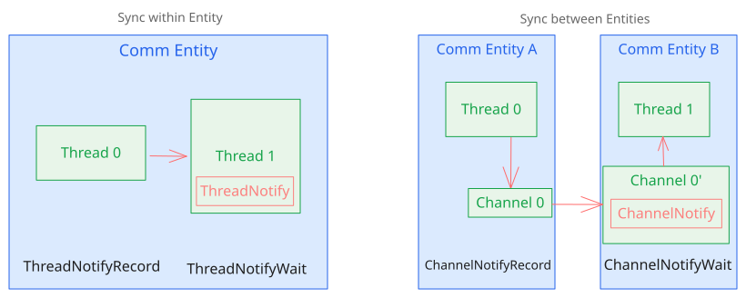
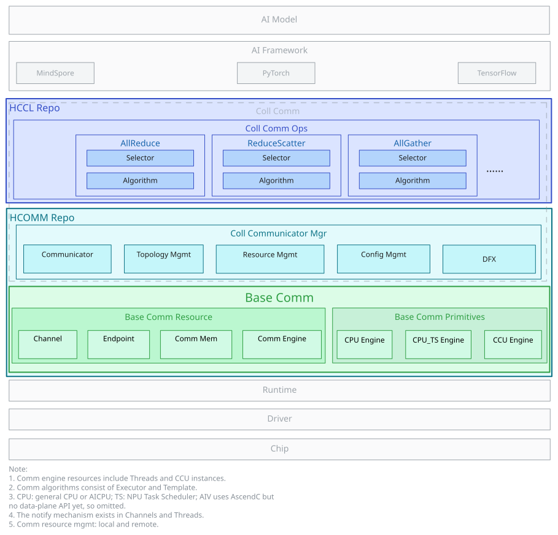
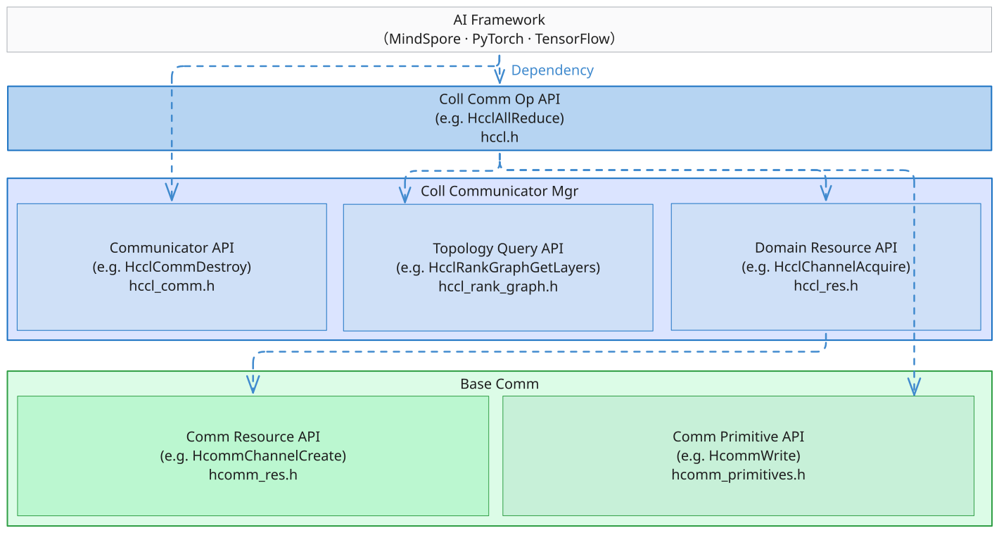

# HCCL & HCOMM Software Architecture Overview

---

## 1 Introduction to HCCL Collective Communication

### 1.1 Why Collective Communication Is Needed

Large model training and inference = multi-device collaboration, **communication is the scaling bottleneck**



- **Training side**: Under data parallelism, each NPU processes a different sample, and after each iteration, gradients are synchronized through AllReduce. Model/expert parallelism also relies on AllGather, ReduceScatter, and AlltoAll for coordination.
- **Inference side**: Large model inference also requires tensor parallelism/expert parallelism coordination, and communication latency directly affects time to first token and throughput.
- **Collective communication**: It enables all nodes to exchange data in parallel, efficiently, and in an orderly manner, greatly reducing synchronization overhead.
- HCCL = **a high-performance collective communication library for Ascend NPU clusters**, which enables multiple NPUs to work together efficiently.

### 1.2 Overview of HCCL Core Capabilities

| Dimension | Capability |
|------|------|
| **Collective communication primitives** | AllReduce, Broadcast, AllGather, ReduceScatter, AlltoAllv, Send, Receive, ... |
| **Communication algorithms** | Ring, Mesh, RHD (Halving-Doubling), Star + self-developed algorithms |
| **Communication protocols** | UBC, UB_RTP, UBoE, RoCE (v2), HCCS, UB_MEM |
| **Execution modes** | Single-operator mode + graph mode |
| **Extension capabilities** | Custom development of communication operators |
| **Application scenarios** | Collective communication for large model training (data/model/expert parallelism) and inference (TP/PP/EP) |

HCCL sits between the AI framework and the hardware drivers in the CANN software stack, serving as a bridge between them:


---

## 2 Collective Communication Model

### 2.1 Concepts and Relationships

Collective communication involves three core concepts:

| Term | One-sentence explanation | Main corresponding hardware |
|------|-----------|---------|
| **Collective communication domain** | The execution context of collective communication, managing the entities and resources that participate in communication | Composed of multiple NPUs |
| **Rank** | A member of the collective communication domain, with a unique Rank ID (starting from 0) | One NPU |
| **RankGraph** | The communication relationship graph among Ranks, describing "who connects to whom and how" | Network topology |



---

### 2.2 Introduction to the RankGraph Topology Model

RankGraph uses a graph to model the connection relationships among different Ranks in the communication domain, and introduces topology layer abstraction to adapt to the hierarchical structure of large-scale clusters. Note: The meaning of Edge/Link in RankGraph differs from that of Link/Path in NCCL. For details, see the following table.

| Concept | One-sentence explanation | Easy-to-understand analogy |
|------|-----------|------------|
| **Node** | A node in the graph, divided into communication entities and Fabrics (switching/routing abstraction) | Communication entity = NPU with a network port; Fabric = a group of switches |
| **Endpoint** | The communication device of a Node (logical concept). A Node can have multiple Endpoints. One Endpoint maps to one physical port (which can be a bonding port controlled by hardware and invisible to software). One physical port can be shared by multiple Endpoints. | A network port on an NPU; one NPU can have multiple network ports; a bonding port is transparent to software |
| **Edge** | The connection relationship between Nodes, with Endpoints at both ends (corresponding to Link in NCCL) | A network cable with its two ends plugged into the network ports of different NPUs |
| **Link** | The link-establishment information between two communication entities extracted from an Edge (including the Endpoints at both ends + the protocol), corresponding to Path in NCCL | The path description through which two NPUs can establish a link |
| **netLayer** | The topology layer. Communication quality decreases as the layer increases. Within a server it is Layer0 (for example, HCCS direct connection), and between servers it is Layer1 (for example, RoCE through switches). | The 8-device HCCS direct connection within a server is the fastest (Layer0), while crossing servers through switches is slower (Layer1) |
| **Fabric** | An abstraction of a network switching/routing group. The communication entities connected to it can communicate with one another. Two connected Fabrics do not exist on the same network layer. | A switch that enables all NPUs plugged into it to communicate with one another |
| **TopoInstance** | A topology instance within each layer | Eight NPU devices in the same equipment room form a 1DMesh instance |

> **Layer key points**: Clusters are naturally hierarchical (Layer). Each layer contains topology instances (TopoInstance). Communication quality decreases as the layer increases. Topology types include Fullmesh, 1DMesh, CLOS, Ring, and so on.
> **Progressive relationship**: Edge describes "who connects to whom" → Link describes "how to establish a link" → Channel describes "how to communicate". A Channel is instantiated based on a Link and is the actually usable data channel. For details, see 2.3.



---

### 2.3 Introduction to Basic Communication

The foundation of collective communication consists of four **primitive concepts**, which are the basic elements that form all communication operations:

| Concept | One-sentence explanation | Main corresponding hardware |
|------|-----------|---------|
| **Communication device (Endpoint)** | The logical interface for network communication, including the protocol and address | NPU network port / Host NIC |
| **Communication channel (Channel)** | The data channel between the communication devices at both ends (including synchronization Notify) | RoCE QP / UB Jetty connection |
| **Communication memory (CommMem)** | The memory segment registered to the communication domain and accessible by communication devices (Endpoints) | NPU on-chip memory / Host memory |
| **Communication engine (CommEngine)** | The module that executes communication tasks, including Thread and the thread scheduler, driving the communication hardware to move data | AICPU_TS, CCU, AIV |

> **Composition relationship**: Channel = communication devices at both ends + communication protocol + N Notifys



---

#### 2.3.1 Memory Semantics Primitives vs. Network Semantics Primitives

| | Network semantics primitives | Memory semantics primitives |
|--|---------|---------|
| **Core object** | Channel (communication channel) | Communication device + mapped memory |
| **Operation mode** | Write / Read / Notify | Local copy (operating like local memory) |
| **Communication model** | Unilateral operation, bilateral operation (requiring cooperation of both ends) | Unilateral operation (initiated by only one end) |
| **Applicable protocols** | RoCE, UB | UB_MEM, HCCS |


> The choice of semantics depends on the underlying protocol and scenario requirements

---

### 2.4 Introduction to the Communication Engine

The communication engine is **the core module that executes communication tasks** in a communication entity. As shown in the following figure, it receives **communication resources** (Endpoint/Channel/CommMem, see 2.3) and tasks dispatched by **communication task orchestration** from above, and drives the **communication hardware** through the **thread execution scheduler** to complete data movement.



- **Thread**: The execution context of communication tasks, carrying a series of data plane operators (LocalReduce, ChannelRead/Write, Notify, and so on). One engine can contain multiple Threads executing concurrently.
- **Thread execution scheduler**: Schedules the operators on Threads to run on hardware, such as TS (Task Scheduler) / STARS / operating system
- **Communication hardware**: The hardware that actually moves data, such as RoCE NIC, SDMA, and UB NIC
- **Inter-thread synchronization**: Different Threads coordinate their execution order through ThreadNotify/ChannelNotify (see 2.5 for details)

> **In one sentence**: Communication engine = Thread (execution context) + thread scheduler (scheduling execution). The AICPU_TS engine is completed through the collaboration of **AICPU running the communication Kernel and TS scheduling the Task**.

According to different Thread abstractions and scheduling methods, common communication engines include AICPU_TS, CPU_TS, AIV, and CCU:

| Communication engine | Thread abstraction | Introduction | Characteristics | Applicable scenarios |
|------|------------|------|-------|---------|
| **AICPU_TS** | NPU Stream | AICPU runs the communication Kernel and dispatches communication Task descriptors, and TS schedules them to run on hardware | Does not occupy compute cores, dispatches Task descriptors | Large-volume data communication |
| **CPU_TS** | NPU Stream | The Host CPU runs the communication logic, and TS schedules the dispatch | Does not occupy compute cores, high dispatch overhead | Dedicated to Atlas A2 |
| **AIV** | AICore Block | The Vector Core directly executes communication operators | Low latency, occupies Vector cores | Small data and low latency |
| **CCU** | Mission | Hardened communication unit that executes microcode | Hardened scheduling, executes microcode | Dedicated hardware communication |

> A single collective communication domain uses only one engine by default. Operator developers select the engine automatically through the algorithm selector.

---

#### 2.4.1 AICPU_TS Communication Engine

- Task descriptor dispatch mode


1. The Host submits the AICPU Kernel to the task queue.
2. The TS scheduler dispatches the AICPU Kernel to AICPU for execution.
3. AICPU submits the communication Task descriptor to the TS queue.
4. The TS scheduler dispatches the communication Task to the executor.

> **Key point**: AICPU dispatches communication tasks through Task descriptors, **does not occupy compute cores**, and is suitable for large-data high-bandwidth scenarios.

#### 2.4.2 CCU Communication Engine

- Dedicated acceleration unit execution mode

CCU (Collective Communication Unit) is a dedicated collective communication coprocessor located on the IO Die. Its Thread abstraction is Mission.


1. The Host dispatches the CCU instruction sequence (composed of instructions that CCU can recognize) to the CCU instruction space, and submits the CCU Kernel task to the task queue.
2. The CCU Kernel is scheduled by the scheduler and then sent to CCU for execution.
3. CCU executes the corresponding instruction stream and uses URMA (Unified Remote Memory Access) to complete data movement.

> **Key point**: CCU is a dedicated collective communication acceleration unit that executes the preset CCU instruction stream (moving data through URMA). It provides **high bandwidth and low latency** while occupying few compute cores and little memory access bandwidth. However, it is limited by on-chip resources and supports a limited number of communication domains (Ascend 950PR/950DT).

#### 2.4.3 AIV Communication Engine

- Vector Core execution mode


1. The Host submits the AIV Kernel to the task queue.
2. The TS scheduler dispatches the AIV Kernel to the Vector Core.
3. The Vector Core uses different protocols to complete data movement.

> **Key point**: AIV provides low latency but **occupies Vector compute cores**, and is suitable for small-data and low-latency scenarios.

---

### 2.5 Introduction to the Synchronization Mechanism

There are two synchronization scenarios in communication:

| Synchronization method | Scenario | Description | Interface prototype |
|---------|------|------|-----|
| **ThreadNotify** | Within the same communication entity | A Thread sends/waits for a synchronization signal to/from another Thread in the same communication entity | `ThreadNotifyRecord` / `ThreadNotifyWait` |
| **ChannelNotify** | Between different communication entities | Through the notify on the Channel and the Channel data channel, a Thread sends/waits for a synchronization signal to/from the Thread of a remote communication entity | `ChannelNotifyRecord` / `ChannelNotifyWait` |



---

## 3 Software Layering Logic

### 3.1 Layered Architecture Overview

| Software layer | Responsibility | Repository location |
|----|------|--------|
| HCCL collective communication operators | Operator entry → algorithm selection → algorithm execution | hccl |
| HCOMM collective communication domain management | Communicator + topology management + resource management | hcomm / coll_communicator_mgr (HCCM) |
| HCOMM basic communication | Resource management + communication primitive execution | hcomm / base_comm |



---

### 3.2 Target Directory Structure — Corresponding to the Software Architecture

Target directory structure of the HCCL repository:

```text
hccl
│── src                         # Source code directory of HCCL operators
|    ├── common                 # Common logic, including type definitions, the logging module, and so on
|    └── ops                    # HCCL operator implementation
|        ├── all_gather         # AllGather operator implementation
|        ├── all_gather_v       # AllGatherV operator implementation
|        ├── all_reduce         # AllReduce operator implementation
|        ├── all_to_all_v       # AlltoAll, AlltoAllV, and AlltoAllVC operator implementation
|        ├── batch_send_recv    # BatchSendRecv operator implementation
|        ├── broadcast          # Broadcast operator implementation
|        ├── op_common          # Common components of operators
|        │   ├── executor       # Algorithm executor
|        │   ├── selector       # Algorithm selector
|        │   ├── template       # Algorithm template
|        │   └── topo           # RankGraph topology information adaptation of communication operators
|        ├── recv               # Recv operator implementation
|        ├── reduce             # Reduce operator implementation
|        ├── reduce_scatter     # ReduceScatter operator implementation
|        ├── reduce_scatter_v   # ReduceScatterV operator implementation
|        ├── scatter            # Scatter operator implementation
|        └── send               # Send operator implementation
├── include                     # HCCL external header files
├── experimental                # Experimental code directory contributed by the community (the internal main directory structure is consistent with src, compatibility of new interfaces is not guaranteed, and it is not currently adopted by commercial versions)
```

Target directory structure of the HCOMM repository:

```text
hcomm
├── src                                  # Source code directory
│   ├── base_comm                        # Basic communication layer
│   │   ├── common                       # Common basic function directory of the basic communication layer
│   │   ├── config_mgr                   # Environment variable configuration management
│   │   ├── primitives                   # Basic communication primitives
│   │   └── resource                     # Basic communication resources
│   ├── coll_communicator_mgr            # Collective communication domain management
│   │   ├── api_c_adpt                   # C interface adaptation
│   │   ├── common                       # Common basic function directory of the collective communication layer
│   │   ├── communicator                 # Communicator
│   │   ├── dfx                          # DFX
│   │   ├── rank_graph                   # Topology management
│   │   ├── config_mgr                   # Configuration management
│   │   └── resource_mgr                 # Resource management
│   └── legacy                           # Historical version compatibility directory
│       ├── ascend910                    # A2 & A3 compatibility code
│       └── ascend950                    # A5 legacy process compatibility code
├── include                              # External header files
├── pkg_inc                              # Inter-package interface header files
├── experimental                         # Experimental code directory contributed by the community (the internal main directory structure is consistent with src, compatibility of new interfaces is not guaranteed, and it is not currently adopted by commercial versions)
```

> **legacy = historical compatibility, not continuously evolved**

---

### 3.3 API Layering Relationship



| Layer | Interface | Target audience | Responsibility overview |
|------|------|------|---------|
| L1 | HCCL operators (hccl.h) | AI framework adaptation layer | Provides entry points of standard collective communication operators such as AllReduce |
| L2-comm | Communicator in HCOMM collective communication domain management (hccl_comm.h) | Framework adaptation layer | Communicator creation |
| L2-res-rank_graph | HCOMM collective communication domain management (hccl_res.h / hccl_channel.h / hccl_rank_graph.h) | Operator developers | Topology query and resource (Thread/Channel) acquisition |
| L3-prim | HCOMM basic communication primitives (hcomm_primitives.h) | Operator developers, communication library developers | Data movement (Write/Read/Reduce) + synchronization (Notify) |
| L3-res | HCOMM basic communication resources (hcomm_res.h / hcomm_channel.h) | Communication library developers | Acquisition and management of basic resources such as communication devices/channels/memory |
| CCU | HCOMM CCU operator development interface (include/ccu/, including ccu_primitives.hpp, ccu_res.h, ccu_launch.h, and so on) | CCU operator developers | CCU resource object encapsulation and Kernel Launch interfaces |

- L2-res-rank_graph + L3-prim are **newly opened operator programming interfaces**, specifically for custom communication operator development.
- L3-res + L3-prim are **communication library development interfaces**, specifically for the development of collective communication libraries and so on.

## Software Architecture Constraints

| Constraint | Description |
|------|------|
| **Layering dependency direction** | Upper layers depend on lower layers, and lower layers must not depend inversely on upper layers: `base_comm` must not depend inversely on `coll_communicator_mgr`; `coll_communicator_mgr` and `base_comm` must not depend inversely on `coll_comm_ops`. |
| **Control plane/data plane separation** | Resource management and topology query belong to the control plane; data movement (Write/Read/Reduce) and synchronization (Notify) belong to the data plane. The interfaces of the two planes evolve independently and are not coupled. |
| **HCCL and HCOMM decoupling** | HCCL operators dynamically load HCOMM interfaces through dlsym, so the two repositories can be compiled independently and evolve independently. |
| **legacy not continuously evolved** | `legacy/` is used only for historical version compatibility and does not carry new capabilities. All new capabilities are placed in the standard directories. |
