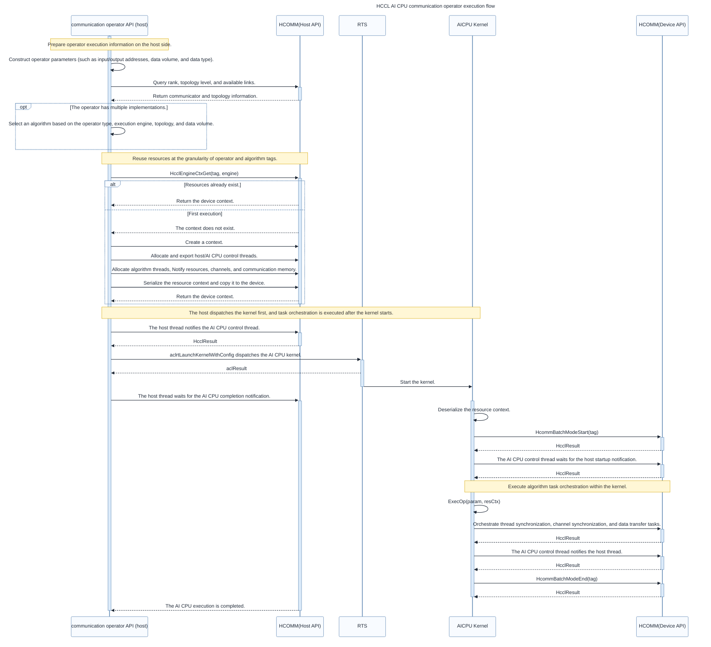

# Overall Process

<!-- md-trans-meta sourceCommit=53fdf106ef330fac6b558d13103b73026d3055b6 translatedAt=2026-09-24T07:04:54.351Z pushedAt=2026-10-08T08:31:03.155Z -->

The development and execution of HCCL AI CPU communication operators are divided into two phases: host-side preparation and AI CPU-side execution. The host side is responsible for parsing the topology, selecting algorithms, applying for resources, and dispatching AI CPU kernels. After the kernel starts, the AI CPU side orchestrates tasks based on the resource context. Therefore, ***kernel dispatch comes first, and task orchestration comes second***.

The main responsibilities of each phase are as follows:

1. ***Defining the operator API***: Specify the input and output, data size, data type, communicator, execution stream, and other information.
2. ***Querying topology information***: Obtain the number of ranks, topology levels, intra-level connections, and available links to provide a basis for algorithm selection and resource computation.
3. ***Selecting algorithms***: Select a registered algorithm implementation based on conditions such as the operator type, execution engine, topology, data size, and data type. This step can be omitted for custom operators that have only one fixed implementation.
4. ***Creating resources***: Compute and allocate threads, Notify resources, channels, communication memory, and resource context, and copy the context required for AI CPU execution to the device.
5. ***Dispatching kernels***: The host establishes a startup synchronization relationship with the AI CPU control thread, and then dispatches the AI CPU kernel to the execution stream.
6. ***Orchestrating tasks***: After the AI CPU kernel starts and obtains the resource context, it calls the algorithm execution logic to orchestrate operations such as thread synchronization, channel synchronization, and data transfer onto the corresponding threads.
7. ***Completing synchronization***: After the AI CPU side completes orchestration, it notifies the host. The host side waits for this notification to ensure the execution order between the communication task and the business stream.
