# communicator 模块代码解析

## 功能描述

communicator 模块是 HCOMM 集合通信域管理（HCCM，L2 层）的**核心模块**，负责集合通信域上下文的创建、初始化、销毁管理，以及多通信域间的资源共享。该模块横跨 Host 侧和 AICPU 侧两个运行环境：

- **Host 侧**：`CollComm` 承载单个通信域上下文（RankGraph、MyRank、通信引擎资源、对称内存、KFC 通道等）；`CollCommMgr` 以单例管理多个 `CollComm` 的注册/注销，并提供集群监控、保序下发线程、任务终止处理、CCU CcuBuffer 模式通信域预留等共享资源；`IndependentOp` 支撑独立算子（自定义算子）AICPU 通信域的公共初始化；`GroupScheduleMgr` 负责 Group P2P 任务的收发排序调度。
- **AICPU 侧**：`CollCommAicpuMgr` 以单例管理 group→`CollCommAicpu` 注册表；`CollCommAicpu` 承载 AICPU 侧通信域上下文（线程/Notify/通道资源、DFX、N 秒快恢）；`c_adpt` 提供 kernel 入口及其 C++ 适配层；`resource_mgr` 下的 `ThreadAicpuMgr`/`NotifyAicpuMgr`/`ChannelAicpuMgr` 分别管理设备流线程、本地 Notify 与 URMA 通道资源。

核心能力包括：

1. Host 侧通信域初始化（fullMode / simpleMode 两种模式）与销毁
2. 通信域初始化时按 protocol + netLayer 预制 URMA/UB Memory worldTeam
3. URMA / UB Memory 对称内存窗口的注册、注销、查询与远端内存回填
4. Host 与 AICPU 间 KFC（Kernel Function Control）H2D/D2H 命令通道
5. AICPU 侧通信域生命周期管理（创建、使用标记、销毁命令处理、背景守护线程）
6. AICPU 侧设备流线程、本地 Notify、UB/P2P/ROCE 通道资源的初始化与恢复
7. 通信域 N 秒快恢（Suspend / Clean / Resume）
8. Group P2P 任务的调度排布（按 server 分组生成 send/recv 轮次表并排序任务）
9. 多通信域共享资源管理（ClusterMonitor、OrderLaunchThreadMgr、TaskAbortHandler、CCU CcuBuffer 模式通信域预留）

---

## 目录描述

```text
communicator/
├── coll_comm.h                              # CollComm 类声明 + HcommWindow 全局索引接口
├── coll_comm.cc                             # CollComm 实现（初始化/销毁/对称内存窗口/N秒快恢）
├── coll_comm_mgr.h                          # CollCommMgr 单例类声明
├── coll_comm_mgr.cc                         # CollCommMgr 实现（多通信域注册表 + 共享资源）
├── independent_op.h                         # IndependentOp 类声明
├── independent_op.cc                        # IndependentOp 实现（独立算子AICPU通信域公共初始化）
├── legacy_op_hcom_info.h                    # legacy ascend910 历史兼容（HcclInfoTag/HcclOpInfoCtx）
├── group_schedule_mgr/
│   ├── group_schedule_mgr.h                 # GroupScheduleMgr 类声明 + thread_local P2P 任务接口
│   └── group_schedule_mgr.cc                # Group P2p 调度生成与任务排序实现
└── device/                                  # AICPU 侧
    ├── coll_comm_aicpu.h                    # CollCommAicpu 类声明
    ├── coll_comm_aicpu.cc                   # AICPU 通信域上下文实现（初始化/快恢/DFX）
    ├── coll_comm_aicpu_mgr.h                # CollCommAicpuMgr 单例类声明
    ├── coll_comm_aicpu_mgr.cc               # AICPU 通信域注册表 + 全局环境/背景线程初始化
    ├── coll_comm_aicpu_destroy_func.h       # CollCommAicpuDestroyFunc 类声明
    ├── coll_comm_aicpu_destroy_func.cc      # AICPU 守护函数：处理 DESTROY_AICPU_COMM 命令
    ├── hccl_aicpu_hdc_handler.h             # HcclAicpuHdcHandler 类声明
    ├── hccl_aicpu_hdc_handler.cc            # KFC 命令 H2D/D2H 通道封装实现
    ├── c_adpt/                              # kernel 入口与适配层
    │   ├── coll_comm_aicpu_kernel.h         # extern "C" kernel 入口声明（RunAicpuCommInit 等）
    │   ├── coll_comm_aicpu_kernel.cc        # kernel 入口实现（按设备类型分派新/旧流程）
    │   ├── coll_comm_aicpu_kernel_adpt.h    # kernel 入口 C++ 适配层声明
    │   └── coll_comm_aicpu_kernel_adpt.cc   # Acquire→操作→Release 流程封装
    └── resource_mgr/                        # AICPU 资源管理
        ├── remote/
        │   ├── channel_aicpu_mgr.h          # ChannelAicpuMgr 类声明
        │   └── channel_aicpu_mgr.cc         # URMA 通道资源管理（UB/P2P/ROCE transport 创建与恢复）
        └── local/my_rank/comm_engine_reses/
            ├── comm_engine_res_aicpu_mgr.h  # CommEngineResAicpuMgr 类声明
            ├── comm_engine_res_aicpu_mgr.cc # 线程 + Notify 资源聚合管理
            ├── threads/
            │   ├── thread_aicpu_mgr.h       # ThreadAicpuMgr 类声明
            │   └── thread_aicpu_mgr.cc      # 设备流线程管理（真线程/桩线程分流 + 回调注册）
            └── notify/
                ├── notify_aicpu_mgr.h       # NotifyAicpuMgr 类声明
                └── notify_aicpu_mgr.cc      # 本地 Notify 申请/释放管理
```

### 文件间关系

| 文件 | 功能 | 依赖关系 |
|------|------|----------|
| `coll_comm.h/.cc` | Host 侧通信域上下文：RankGraph/MyRank/资源管理器持有、worldTeam 预制、对称内存窗口管理、N 秒快恢 | 依赖 `RankGraphV2`/`MyRank`/`CommEngineResMgr`/`ChannelManager`/`HcclCommDfx`；依赖 `HcclTeamMgr`/`HcommTeam*` 接口（base_comm）管理 team 与 window；依赖 `TaskExceptionHost` 注册异常回调；依赖 `HDCommunicate` 建立 KFC 通道 |
| `coll_comm_mgr.h/.cc` | 多通信域注册表与共享资源单例 | 持有 `CollComm*` 注册表、每设备 `ClusterMonitor`/`OrderLaunchThreadMgr`、`HcclTaskAbortHandler`、`CollCommConfigMgr`；GetInstance 中先构造 base_comm 单例（`HcommResMgrInit`）并预热 `SharedJettyChannelPool` 保证析构顺序 |
| `independent_op.h/.cc` | 独立算子 AICPU 通信域公共初始化 | 组装 `CommAicpuParam` 下发参数；依赖 `CommEngineResMgr`/`ChannelManager`/`CommMemMgr`；通过 `AicpuAclKernelLaunch` 下发 `RunAicpuCommInit` kernel |
| `legacy_op_hcom_info.h` | legacy ascend910 历史兼容的算子通信域信息（`HcclOpInfoCtx`） | 被 `CollCommMgr` 的 Legacy 系列接口持有；仅 bug 修复与兼容维护，不再演进 |
| `group_schedule_mgr/group_schedule_mgr.h/.cc` | Group P2P 任务调度：按 server 分组生成收发轮次表并排序任务 | 依赖 `HcclRankGraphGetInstSizeListByLayer` 获取 server 规模；依赖 `CalGCD`（coll_alg_utils）；thread_local 维护 `hcclP2pTaskNums` 与 `hcclGroupCommListV2` |
| `device/coll_comm_aicpu.h/.cc` | AICPU 侧通信域上下文：初始化、快恢、DFX、legacy 910B wrapper | 依赖 `HcclCommDfxLite`（DFX）、`NsRecoveryLite`（快恢）、`HDCommunicate`（KFC 通道）、`CommEngineResAicpuMgr`/`ChannelAicpuMgr`（资源）；被 `CollCommAicpuMgr` 持有 |
| `device/coll_comm_aicpu_mgr.h/.cc` | AICPU 侧通信域注册表单例与全局环境初始化 | 持有 group→`CollCommAicpu` map（读写锁）；`InitBackGroundThread` 向 `AicpuDaemonService` 注册 `HcclCommTaskExceptionLite`/`CollCommAicpuDestroyFunc`/`NsRecoveryFuncLite`/`CollRtsqPollCompletionDaemon`/`StreamTaskMonitor`，并调 `StartMC2MaintenanceThread` 拉起背景线程 |
| `device/coll_comm_aicpu_destroy_func.h/.cc` | AICPU 守护函数：轮询各通信域 KFC 命令，处理 `DESTROY_AICPU_COMM` | 依赖 `CollCommAicpuMgr` 遍历与销毁通信域；依赖 `StreamTaskMonitor` 清理流监控数据；依赖 `FindTaskExpDevMem`/`EraseTaskExpDevMem` 管理 DPU taskexception 共享内存 |
| `device/hccl_aicpu_hdc_handler.h/.cc` | KFC 命令通道封装：H2D 取命令、D2H 回状态 | 依赖 `HDCommunicate` 与 `KfcCommand`/`KfcExecStatus` 数据结构；被 `NsRecoveryLite`（dfx/ns_recovery/aicpu）持有，封装 CollCommAicpu 经 `NsRecoveryLite::Init` 传入的 KFC 通道 |
| `device/c_adpt/coll_comm_aicpu_kernel.h/.cc` | extern "C" kernel 入口（6 个），按设备类型分派 | 950/960 设备走新流程（`CollCommAicpuKernelAdpt*` / `CollCommAicpuMgr`）；其他设备回退 `AicpuHcclProcess` legacy 流程 |
| `device/c_adpt/coll_comm_aicpu_kernel_adpt.h/.cc` | kernel 入口 C++ 适配层，封装 Acquire→操作→Release 骨架 | 依赖 `CollCommAicpuMgr` 获取/释放通信域；委托 `CommEngineResAicpuMgr`/`ChannelAicpuMgr`/`CollCommAicpu` 完成具体操作 |
| `device/resource_mgr/.../comm_engine_res_aicpu_mgr.h/.cc` | AICPU 通信引擎资源聚合管理（线程 + Notify） | 组合 `ThreadAicpuMgr` 与 `NotifyAicpuMgr`，被 `CollCommAicpu` 持有 |
| `device/resource_mgr/.../threads/thread_aicpu_mgr.h/.cc` | 设备流线程管理：创建 `AicpuTsThread`、真/桩线程分流、DFX 与缓存回调注册 | 依赖 `AicpuTsThread`/`StreamLite`/`RtsqA5`（base_comm）；依赖 `HcclCommDfxLite` 上报流任务；依赖 `AicpuTaskCacheManager` 注册任务缓存回调 |
| `device/resource_mgr/.../notify/notify_aicpu_mgr.h/.cc` | 本地 Notify 申请/释放管理 | 依赖 `NotifyManager::ParseBinNotifys` 解析二进制 Notify；持有 `LocalNotify` 列表 |
| `device/resource_mgr/remote/channel_aicpu_mgr.h/.cc` | URMA 通道资源管理：transport 创建、恢复、清理 | 依赖 `AicpuResPackageHelper` 解析打包数据；按 transType 创建 `UbTransportLiteImpl`/`P2PTransportLiteImpl`/`RoceTransportLiteImpl`；依赖 `AicpuTaskCacheManager` 注册通道缓存回调 |

### communicator文件交互

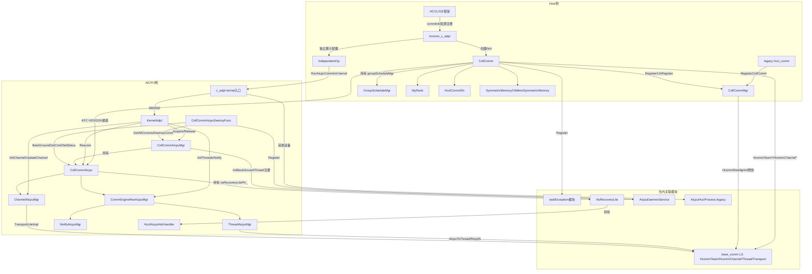

---

## 流程描述

### 通信域初始化流程

#### Host侧fullMode初始化流程（A5及后续新架构）

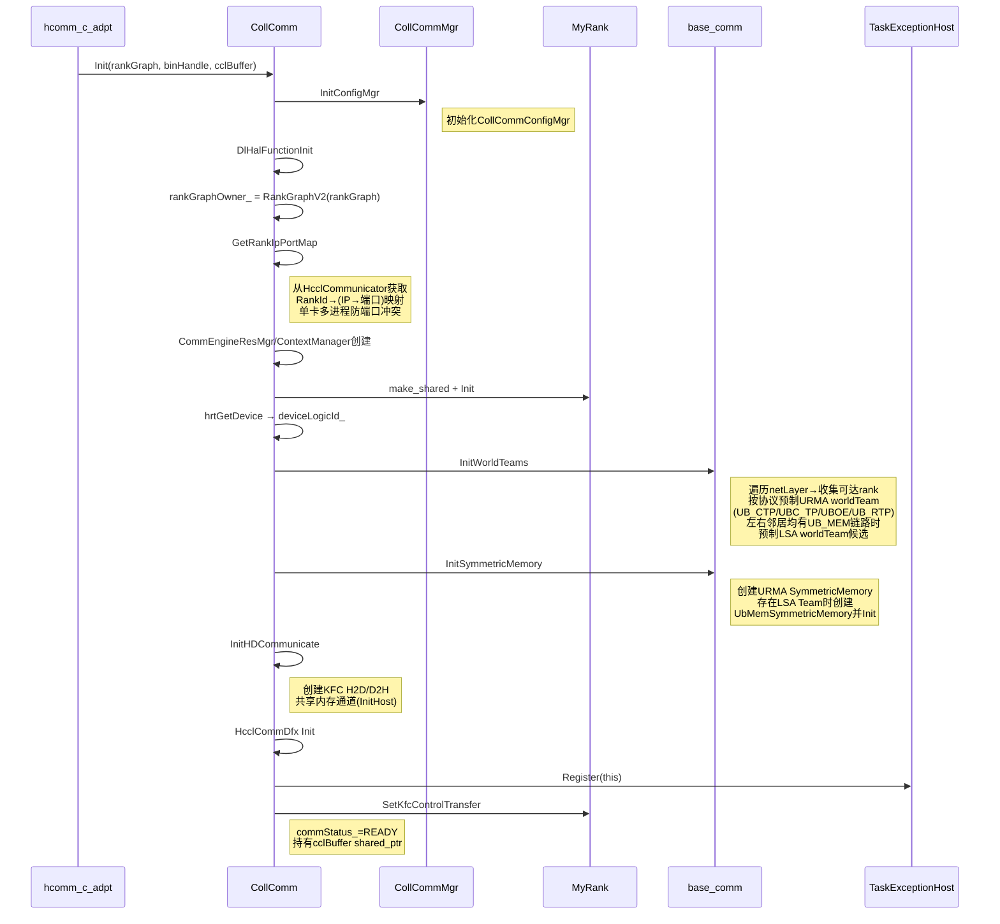

#### Host侧simpleMode初始化流程（A2/A3老芯片）

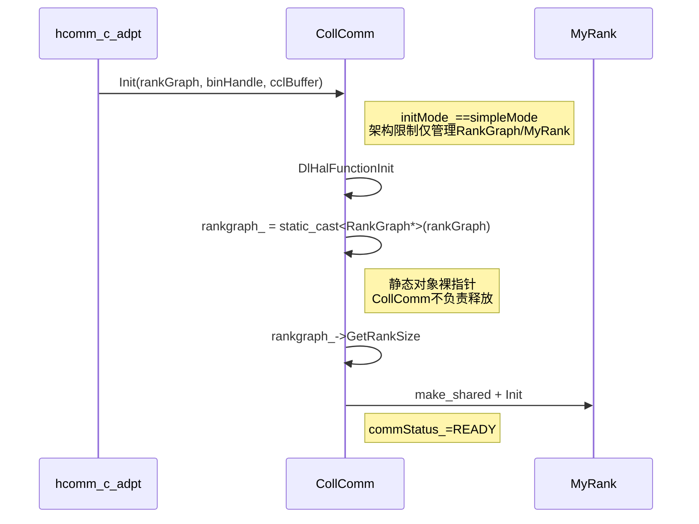

#### AICPU侧通信域初始化流程

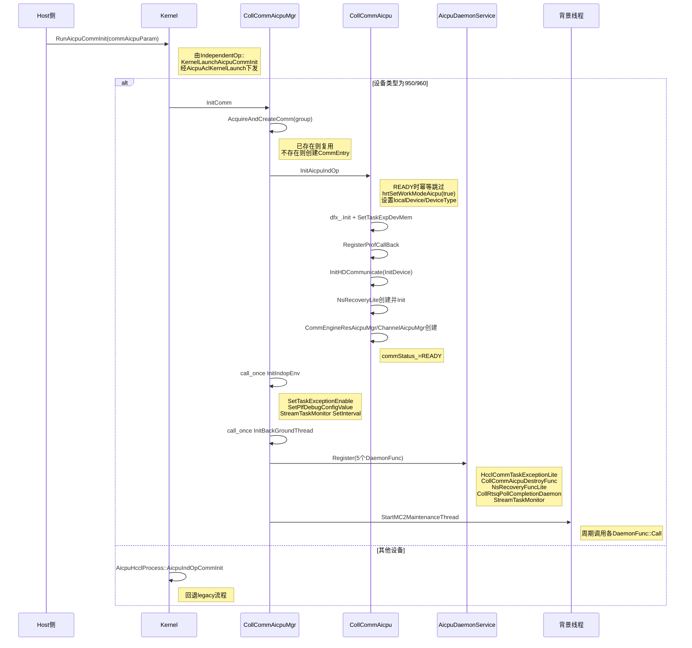

#### AICPU侧资源初始化流程（线程/Notify/通道）

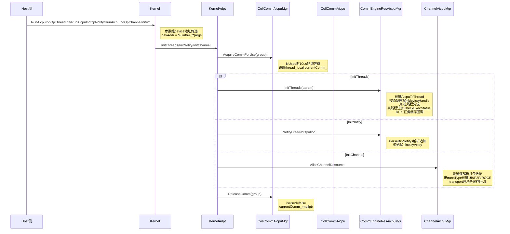

### 通信域销毁流程

#### Host侧发起销毁流程

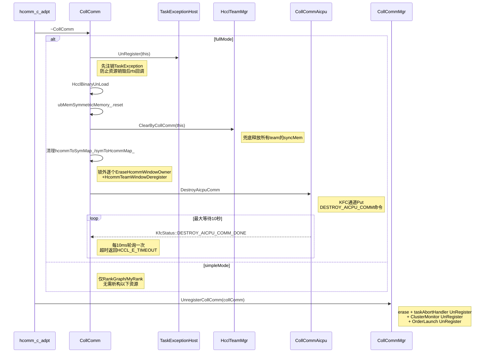

#### AICPU侧销毁命令处理流程

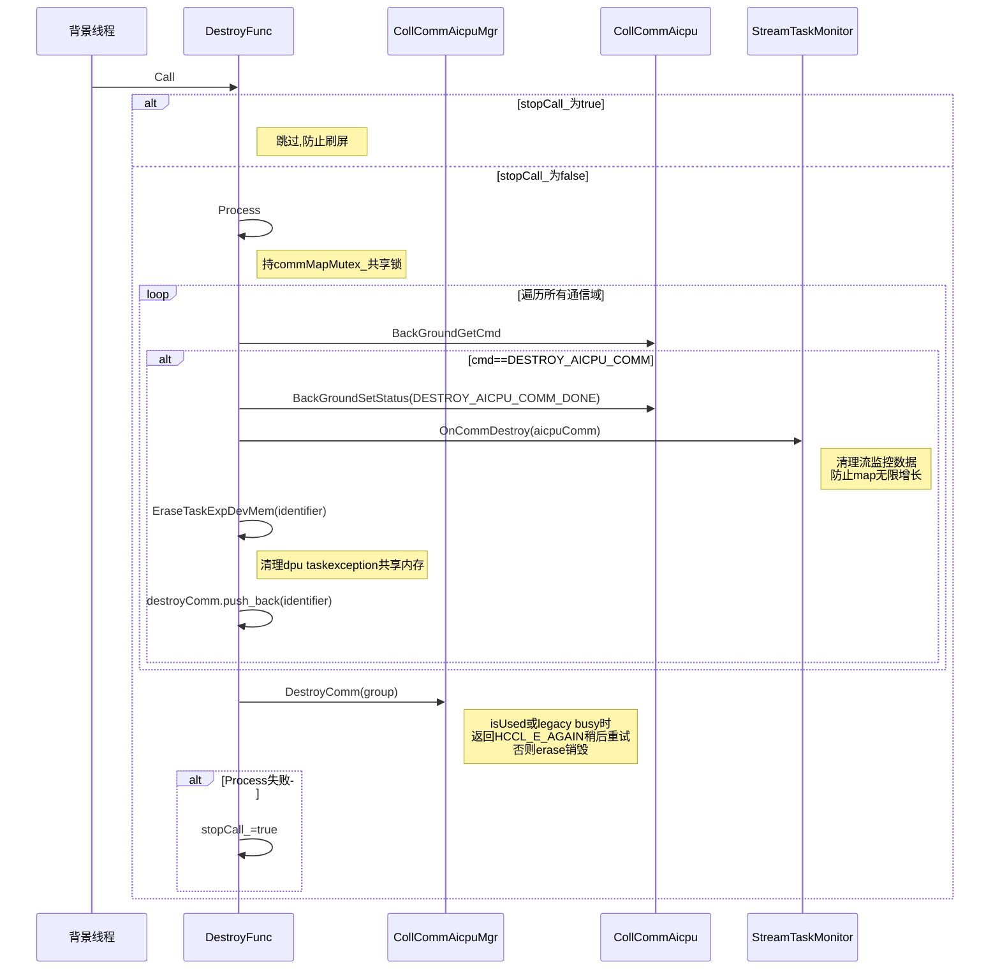

### N秒快恢流程

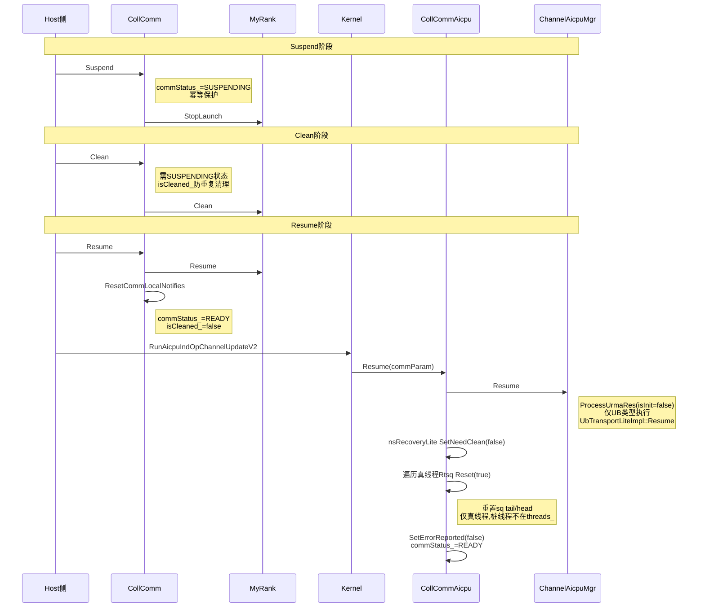

### 对称内存窗口管理流程

#### 窗口注册流程

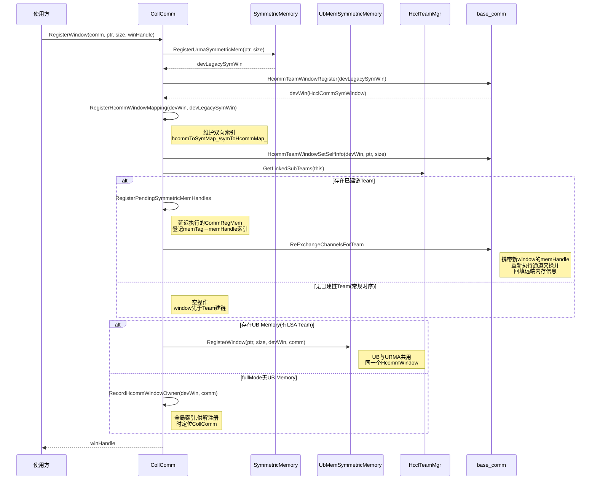

#### 窗口注销与远端内存回填流程

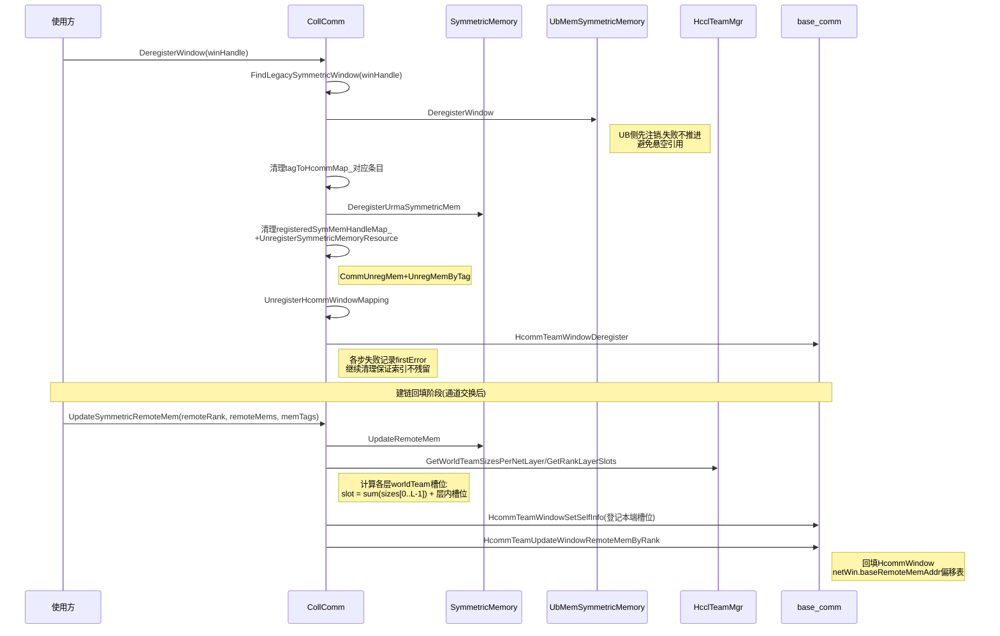

### Group P2P 任务调度流程

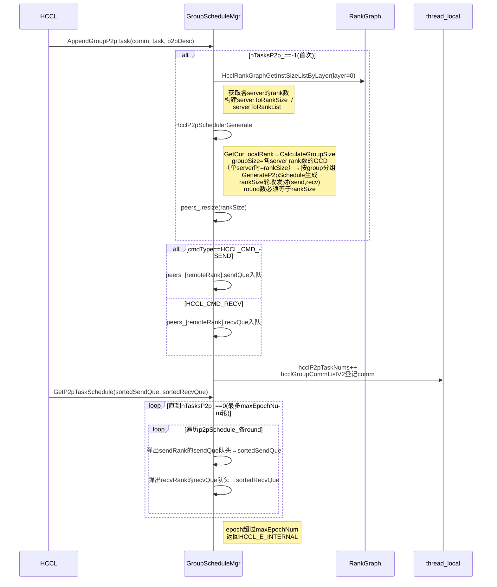

---

## 接口描述（类图）

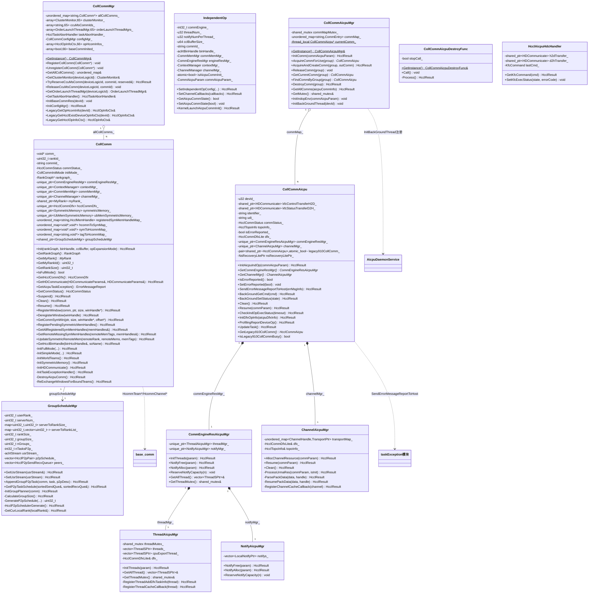

---

## 接口描述

### CollComm

| 接口 | 类型 | 参数 | 返回值 | 功能说明 |
|------|------|------|--------|----------|
| `Init(void*, aclrtBinHandle, HcclMem, uint32_t)` | 公有 | [in] rankGraph, [in] binHandle, [in] cclBuffer, [in] opExpansionMode | `HcclResult` | 初始化通信域：先调 InitConfigMgr，fullMode 走 InitFullMode，simpleMode 走 InitSimpleMode |
| `GetCommConfig()` | 公有内联 | 无 | `CommConfig&` | 获取通信域配置 |
| `GetRankGraph()` | 公有内联 | 无 | `RankGraph*` | 获取 RankGraph 指针 |
| `GetCommEngineResMgr()` | 公有内联 | 无 | `CommEngineResMgr*` | 获取通信引擎资源管理器 |
| `GetContextManager()` | 公有内联 | 无 | `ContextManager*` | 获取上下文管理器 |
| `GetCommMemMgr()` | 公有内联 | 无 | `CommMemMgr*` | 获取通信内存管理器 |
| `GetChannelManager()` | 公有内联 | 无 | `ChannelManager*` | 获取通道管理器 |
| `GetCommunicatorV2()` | 公有 | 无 | `void*` | 获取 HcclCommunicator 指针（comm_） |
| `GetMyRank()` | 公有 | 无 | `MyRank*` | 获取 MyRank 对象 |
| `GetMyRankId()` | 公有 | 无 | `uint32_t` | 获取本 rank ID |
| `GetRankSize()` | 公有内联 | 无 | `uint32_t` | 获取 rank 数量，rankgraph_ 为空或查询失败返回 0 |
| `GetDeviceLogicId()` | 公有内联 | 无 | `s32` | 获取设备逻辑 ID |
| `IsFullMode()` | 公有 | 无 | `bool` | 是否全功能模式，供外部 owner 在注册/注销前判断是否需要管理 |
| `GetHcclCommDfx()` | 公有 | 无 | `HcclCommDfx*` | 获取 DFX 对象 |
| `GetDfxCallback()` | 公有 | 无 | `std::function` | 获取 DFX 任务回调，hcclCommDfx_ 为空时返回 nullptr |
| `GetCommId()` | 公有 | 无 | `const std::string&` | 获取通信域 ID（commName） |
| `GetHDCommunicate(HDCommunicateParams&, HDCommunicateParams&)` | 公有 | [out] kfcControlTransferH2DParams, [out] kfcStatusTransferD2HParams | `HcclResult` | 获取 KFC H2D/D2H 通道参数（传给 AICPU 侧 InitDevice 使用） |
| `GetAicpuTaskException()` | 公有 | 无 | `Hccl::ErrorMessageReport` | 从 KFC D2H 通道尾部（偏移 sizeof(KfcStatus)+sizeof(KfcErrType)）读取 AICPU 上报的异常错误信息 |
| `GetParentRankId(u32&)` | 公有 | [out] parentRankId | `HcclResult` | 从 HcclCommunicator 获取父通信域中的 rank ID |
| `UpdateIndex()` | 公有 | 无 | `uint32_t` | 递增并返回内部计数 index_ |
| `GetCommStatus()` | 公有 | 无 | `HcclCommStatus` | 加 commMutex_ 锁获取通信域状态 |
| `Suspend()` | 公有 | 无 | `HcclResult` | 挂起通信域：状态置 SUSPENDING（幂等），调用 myRank_->StopLaunch |
| `Clean()` | 公有 | 无 | `HcclResult` | 清理通信域：需处于 SUSPENDING 状态且未清理过（isCleaned_），先清理 Host 侧（myRank_->Clean） |
| `Resume()` | 公有 | 无 | `HcclResult` | 恢复通信域：myRank_->Resume + ResetCommLocalNotifies，状态置 READY、isCleaned_=false |
| `RegisterWindow(HcclComm, void*, size_t, HcclCommSymWindow*)` | 公有 | [in] comm, [in] ptr, [in] size, [out] winHandle | `HcclResult` | 注册对称内存窗口：URMA 注册→HcommTeamWindowRegister→建立双向映射→window 后注册补交换→UB Memory 注册或记录全局 owner |
| `DeregisterWindow(HcclCommSymWindow)` | 公有 | [in] winHandle | `HcclResult` | 注销对称内存窗口：UB 侧先注销，再依次清理 URMA 内存、本地索引、映射与 HcommWindow；各步失败记录 firstError 继续清理 |
| `GetCommSymWin(void*, size_t, HcclCommSymWindow*, size_t*)` | 公有 | [in] ptr, [in] size, [out] winHandle, [out] offset | `HcclResult` | 按地址查询所属对称窗口：FindUrmaSymmetricWindow 后经 symToHcommMap_ 反查；未命中返回空句柄（回退普通内存路径） |
| `RegisterPendingSymmetricMemHandles()` | 公有 | 无 | `HcclResult` | 补注册 pending 窗口的内存：GetPendingRegisterInfos→CommRegMem→登记 registeredSymMemHandleMap_ 与 tagToHcommMap_ |
| `GetAllRegisteredSymMemHandles(std::vector<HcclMemHandle>&)` | 公有 | [out] memHandles | `HcclResult` | 获取本地全部已完成注册的对称内存句柄（共享锁） |
| `GetRemoteMissingSymMemHandles(remoteMemTags, memHandles&)` | 公有 | [in] remoteMemTags, [out] memHandles | `HcclResult` | 返回目标通道远端尚未拥有的本地句柄（差集） |
| `UpdateSymmetricRemoteMem(remoteRank, remoteMems, memTags)` | 公有 | [in] remoteRank, [in] remoteMems, [in] memTags | `HcclResult` | 回填远端内存：symmetricMemory_->UpdateRemoteMem + UpdateHcommWindowRemoteMem（层槽位计算与 HcommWindow 回填） |
| `GetHcclBinHandle(aclrtBinHandle&, const std::string& soName)` | 公有 | [out] binHcclHandle, [in] soName | `HcclResult` | 按 soName 推导 json 文件名（去 `.so` 后缀加 `.json` 后缀）懒加载二进制（CPU_KERNEL_MODE），binHcclmutex_ 保护；soName 为空返回 HCCL_E_PARA |
| `groupScheduleMgr` | 公有成员 | 无 | `shared_ptr<GroupScheduleMgr>` | Group P2P 调度管理器（for group） |

#### CollComm 私有方法（关键）

| 接口 | 功能说明 |
|------|----------|
| `InitFullMode(...)` | fullMode 完整初始化：DlHalFunctionInit→RankGraphV2→GetRankIpPortMap→资源管理器→MyRank→InitWorldTeams→InitSymmetricMemory→InitHDCommunicate→HcclCommDfx→InitTaskExceptionHandler→InitKfcAndRegisterCollComm |
| `InitSimpleMode(...)` | simpleMode 简化初始化：仅 DlHalFunctionInit→RankGraph 裸指针→MyRank，不创建下列 fullMode 资源 |
| `InitWorldTeams()` | 通信域初始化时按 protocol + netLayer 创建 A5 URMA/UB Memory 预制 worldTeam：遍历 netLayer→CollectLayerReachableRanks→CreateUrmaWorldTeams（UB_CTP/UBC_TP/UBOE/UB_RTP）→UB_MEM LSA 候选（左右邻居均有 UB_MEM 链路的最大 netLayer） |
| `CreatePrebuiltWorldTeam(protocol, netLayer, ranks, rankNum, selfMemberId)` | 创建并注册预制 worldTeam（不通信、不创建 syncMem，barrierCount：UB_MEM=0，其他=1），失败时销毁 team |
| `CollectLayerReachableRanks(...)` | 按协议收集本 Rank 在指定 netLayer 内的可达 Rank（GetLinks 判链路有效性），不在收集阶段创建 worldTeam |
| `InitSymmetricMemory()` | 创建 URMA SymmetricMemory；存在 LSA Team 时创建 UbMemSymmetricMemory 并 Init；未预制 LSA Team 表示仅使用 URMA（正常场景） |
| `InitHDCommunicate()` | 创建 KFC 控制通道 H2D（sizeof(KfcCommand)）与状态通道 D2H（sizeof(KfcExecStatus)）共享内存并 InitHost |
| `InitTaskExceptionHandler()` | 向 TaskExceptionHost::GetInstance(deviceLogicId_) 注册本通信域（commHandle=this 指针） |
| `InitKfcAndRegisterCollComm()` | myRank_->SetKfcControlTransfer 挂接 KFC 通道，commStatus_ 置 READY |
| `DestroyAicpuComm()` | AICPU 通信域存在（getAicpuCommState）时经 KFC 通道发送 DESTROY_AICPU_COMM，轮询等待 DESTROY_AICPU_COMM_DONE，最大 10 秒 |
| `PrepareSharedSymmetricWindow(...)` | URMA 注册→HcommTeamWindowRegister→RegisterHcommWindowMapping→SetSelfInfo，任一步失败回滚已注册资源 |
| `RegisterHcommWindowMapping / FindLegacySymmetricWindow / UnregisterHcommWindowMapping` | 维护 HcommWindow 与 URMA 底层 Window 的双向索引（hcommToSymMap_ / symToHcommMap_，hcommWindowMutex_ 读写锁） |
| `ReExchangeWindowsForBoundTeams()` | window 后注册补交换：对已建链 Team 重新调 CreateChannels，把新 window 的 memHandle 带入交换并回填；常规时序（window 先于 Team）为空操作 |
| `ReExchangeChannelsForTeam(...)` | 单 team 补交换：组装 channelDesc 建链（symm memHandle 挂 desc 参与交换），建链后 UpdateSymmetricRemoteMem 双回填 |
| `UpdateHcommWindowRemoteMem(...)` | 按各 netLayer worldTeam 大小与层槽位（sum(sizes[0..L-1])+层内槽位）计算偏移，HcommTeamWindowSetSelfInfo 登记本端槽位（幂等）、HcommTeamUpdateWindowRemoteMemByRank 回填远端内存 |
| `RegisterSymmetricMemoryResource / UnregisterSymmetricMemoryResource` | 单条对称内存的 CommRegMem（memTag = 前缀+commId+addr+size）与 CommUnregMem/UnregMemByTag |
| `HcclBinaryUnLoad()` | 析构时 aclrtBinaryUnLoad 卸载 binHcclHandle_ |

### 全局窗口索引接口（coll_comm.h/.cc）

| 接口 | 参数 | 返回值 | 功能说明 |
|------|------|--------|----------|
| `RecordHcommWindowOwner(winHandle, comm)` | [in] winHandle, [in] comm | `HcclResult` | 记录 A5 fullMode 统一 HcommWindow 所属通信域（全局 map，mutex 保护），重复注册报错 |
| `GetHcommWindowComm(winHandle, comm&)` | [in] winHandle, [out] comm | `HcclResult` | 查询 winHandle 所属通信域，未找到返回 HCCL_E_NOT_FOUND |
| `EraseHcommWindowOwner(winHandle)` | [in] winHandle | void | 移除全局窗口索引条目 |

### CollCommMgr

| 接口 | 类型 | 参数 | 返回值 | 功能说明 |
|------|------|------|--------|----------|
| `GetInstance()` | 公有静态 | 无 | `CollCommMgr&` | 获取单例；首次调用先构造 base_comm 单例（HcommResMgrInit）并预热 SharedJettyChannelPool，保证析构顺序 |
| `RegisterCollComm(CollComm*)` | 公有 | [in] collComm | void | 注册通信域：allCollComms_[commId]、taskAbortHandler_.Register、按设备注册 OrderLaunch |
| `UnregisterCollComm(CollComm*)` | 公有 | [in] collComm | void | 注销通信域：erase、taskAbortHandler UnRegister、ClusterMonitor UnRegister、OrderLaunch UnRegister |
| `GetAllCollComms()` | 公有 | 无 | `unordered_map&` | 获取全部已注册通信域（commId→CollComm*） |
| `GetClusterMonitor(s32)` | 公有 | [in] deviceLogicId | `ClusterMonitor&` | 获取指定设备的集群监控器，deviceLogicId 越界回退 [0] |
| `TryReserveCcuMsComm(s32, const std::string&, bool&)` | 公有 | [in] deviceLogicId, [in] commId, [out] reserved | `HcclResult` | 尝试为 CCU CcuBuffer 模式独占预留该设备通信域槽位；已被占用时 reserved=false |
| `ReleaseCcuMsComm(s32, const std::string&)` | 公有 | [in] deviceLogicId, [in] commId | void | 释放 CCU CcuBuffer 模式通信域预留（仅 owner 一致时清空） |
| `GetOrderLaunchThreadMgr(s32)` | 公有 | [in] deviceLogicId | `OrderLaunchThreadMgr&` | 获取指定设备的保序下发线程管理器，越界回退 [0] |
| `GetTaskAbortHandler()` | 公有 | 无 | `HcclTaskAbortHandler&` | 获取任务终止处理器 |
| `InitBaseCommRes(uint32_t)` | 公有 | [in] devId | void | 初始化 base_comm 资源（HcommResMgrInit） |
| `InitConfigMgr()` | 公有 | 无 | `HcclResult` | 初始化 CollCommConfigMgr |
| `GetConfigMgr()` | 公有内联 | 无 | `const CollCommConfigMgr&` | 获取 CollCommConfigMgr 配置管理器（HostMultiQpConfig 等配置经此读取） |
| `LegacyGetOpHcomInfo(uint32_t)` | 公有 | [in] devId | `HcclOpInfoCtx&` | legacy 接口：获取指定设备的算子通信域信息，首次访问时懒初始化 base_comm 资源 |
| `LegacyGetHcclExistDeviceOpInfoCtx(s32)` | 公有 | [in] devId | `HcclOpInfoCtx&` | legacy 接口：设置设备场景下获取 ctx，当前 devId 的 ctx 未被占用且 backup 槽位已被占用时回退 backup 槽位（MAX_MODULE_DEVICE_NUM），否则标记 isUsed=true 并返回当前 devId 的 ctx |
| `LegacyGetHcclOpInfoCtx()` | 公有 | 无 | `HcclOpInfoCtx&` | legacy 接口：未设置设备时遍历选择已占用 ctx 或 backup 槽位 |

### IndependentOp

| 接口 | 类型 | 参数 | 返回值 | 功能说明 |
|------|------|------|--------|----------|
| `SetIndependentOpConfig(...)` | 公有 | [in] commConfig, [in] rankTable, [in] topoAttr, [in] binHandle, [in/out] kfc 参数, [in] bufferManager | `HcclResult` | 初始化资源管理器：注册 AICPU 状态回调、engineResMgr_/channelMgr_ Init、组装 commAicpuParam_、设置 QoS |
| `SetChannelCallbacks(const ChannelManagerCallbacks&)` | 公有 | [in] channelCallbacks | `HcclResult` | 设置通道回调 |
| `GetThreadNum() / GetNotifyNumPerThread()` | 公有 | 无 | `u32` | 获取配置的线程数/每线程 notify 数 |
| `GetAicpuCommState() / SetAicpuCommState(bool)` | 公有 | 无 / [in] aicpuCommState | `bool` / void | 获取/设置 AICPU 通信域初始化状态（atomic，acquire/release 序） |
| `GetCommMemMgr() / GetCommEngineResMgr() / GetContextManager() / GetChannelManager()` | 公有内联 | 无 | 引用 | 获取各资源管理器 |
| `KernelLaunchAicpuCommInit()` | 公有 | 无 | `HcclResult` | 创建局部流（aicpuStreamMode=1），下发 `RunAicpuCommInit` kernel 完成 AICPU 侧通信域公共初始化，同步后上报 kernel 耗时（HcommProfilingReportKernel） |

### GroupScheduleMgr 及全局 P2P 接口

| 接口 | 类型 | 参数 | 返回值 | 功能说明 |
|------|------|------|--------|----------|
| `GetUsrStream(aclrtStream&)` | 公有 | [out] usrStream | `HcclResult` | 获取用户流（未设置时报错） |
| `SetUsrStream(const aclrtStream&)` | 公有 | [in] usrStream | `HcclResult` | 设置用户流 |
| `AppendGroupP2pTask(HcclComm, const HcclP2pTask&, const HcclOpP2pDesc&)` | 公有 | [in] comm, [in] task, [in] p2pDesc | `HcclResult` | 追加 P2P 任务：首次调用时初始化 planner 并生成调度表；按 SEND/RECV 入 peers_ 队列；维护 thread_local 计数与 comm 列表 |
| `GetP2pTaskSchedule(std::vector<HcclP2pTask>&, std::vector<HcclP2pTask>&)` | 公有 | [out] sortedSendQue, [out] sortedRecvQue | `HcclResult` | 按调度表轮次排序任务：逐 round 弹出各 peer 队头，直到任务清空；epoch 超过任务总数时报错 |
| `ClearHcclGroupCommList()` | 全局 | 无 | void | 清空 thread_local 的 group comm 列表 |
| `GetHcclGroupCommList()` | 全局 | 无 | `std::vector<HcclComm>&` | 获取 thread_local 的 group comm 列表 |
| `GetHcclP2pTaskNums() / SetHcclP2pTaskNums(int32_t)` | 全局 | 无 / [in] targetP2pTaskNums | `int32_t` / void | 获取/设置 thread_local 的 P2P 任务计数 |

### CollCommAicpu

| 接口 | 类型 | 参数 | 返回值 | 功能说明 |
|------|------|------|--------|----------|
| `InitAicpuIndOp(CommAicpuParam*)` | 公有 | [in] commAicpuParam | `HcclResult` | AICPU 通信域初始化（READY 时幂等跳过）：设置工作模式/设备→dfx Init→ProfCallBack→KFC InitDevice→NsRecoveryLite→资源 mgr 创建→READY |
| `GetCommEngineResMgr()` | 公有内联 | 无 | `CommEngineResAicpuMgr*` | 获取通信引擎资源管理器（线程/notify） |
| `GetChannelMgr()` | 公有内联 | 无 | `ChannelAicpuMgr*` | 获取通道管理器 |
| `GetLegacy910CollComm() / SetLegacy910CollComm(shared_ptr)` | 公有 | 无 / [in] comm | `HcclCommAicpu*` / void | 910B legacy 通信域 wrapper（shared_ptr 共享所有权） |
| `IsLegacy910CollCommBusy() / SetLegacy910CollCommBusy(bool)` | 公有 | 无 / [in] busy | `bool` / void | legacy 通信域使用中标记（atomic_bool） |
| `GetTopoInfo() / GetIdentifier() / GetUdi()` | 公有 | 无 | 引用 | 获取拓扑信息/通信域标识/UDI |
| `IsErrorReported() / SetErrorReported(bool)` | 公有 | 无 / [in] isErrorReported | `bool` / void | taskException 已上报标记（防重复上报） |
| `SendErrorMessageReportToHost(ErrorMessageReport&)` | 公有 | [in] errMsgInfo | `HcclResult` | 将 ErrorMessageReport 写入 KFC D2H 通道尾部上报 Host |
| `RegisterProfCallBack()` | 公有 | 无 | `HcclResult` | 注册 profiling 回调（DfxRegisterProfCallBack） |
| `GetHcclCommDfxLite()` | 公有内联 | 无 | `HcclCommDfxLite*` | 获取 AICPU 侧 DFX 对象 |
| `GetDevId()` | 公有内联 | 无 | `u32` | 获取 AICPU 侧设备 ID（devId_） |
| `BackGroundGetCmd(KfcCommand&)` | 公有 | [out] cmd | `HcclResult` | 背景线程从 KFC H2D 通道读取命令 |
| `BackGroundSetStatus(KfcStatus)` | 公有 | [in] state | `HcclResult` | 背景线程向 KFC D2H 通道写状态 |
| `GetCommmStatus() / SetCommmStatus(HcclCommStatus)` | 公有 | 无 / [in] status | `HcclCommStatus` / void | 获取/设置通信域状态 |
| `GetNsRecoveryLitePtr()` | 公有 | 无 | `NsRecoveryLitePtr` | 获取 N 秒快恢 Lite 对象 |
| `Clean()` | 公有 | 无 | `HcclResult` | 通道资源清理（channelMgr_->Clean） |
| `Resume(HcclChannelUrmaRes*)` | 公有 | [in] commParam | `HcclResult` | 快恢：channelMgr_->Resume + nsRecovery SetNeedClean(false) + 真线程 Rtsq Reset + SetErrorReported(false) + READY |
| `CheckIndOpExecStatus(bool)` | 公有 | [in] timeout | `HcclResult` | 算子执行状态检查（注册为线程回调）：超时打印 taskException 返回 HCCL_E_INTERNAL；SUSPENDING 返回 HCCL_E_SUSPENDING；非 READY 失败 |
| `InitDfxOpInfo(HcclDfxOpInfo*)` | 公有 | [in] aicpuDfxInfo | `HcclResult` | 组装 DfxDfxOpInfo（opType/count/src/dst/opIndex 等）写入 dfx_，并写 opIndex 到 taskexception 共享内存（偏移 5） |
| `ProfilingReportDeviceOp()` | 公有 | 无 | `HcclResult` | 上报设备侧算子 profiling：ReportAllTasks(threads) + ReportHcclOpInfo |
| `UpdateTask()` | 公有 | 无 | `HcclResult` | 更新 profiling 统计（dfx_.UpdateProfStat） |

### CollCommAicpuMgr

| 接口 | 类型 | 参数 | 返回值 | 功能说明 |
|------|------|------|--------|----------|
| `GetInstance()` | 公有静态 | 无 | `CollCommAicpuMgr&` | 获取单例 |
| `InitComm(CommAicpuParam*)` | 公有 | [in] commAicpuParam | `HcclResult` | 通信域初始化入口：AcquireAndCreateComm→InitAicpuIndOp→call_once InitIndopEnv / InitBackGroundThread（顺序不可颠倒，否则背景线程首轮监控被跳过） |
| `AcquireCommForUse(const std::string&)` | 公有 | [in] group | `CollCommAicpu*` | 获取并标记使用中：isUsed 时 10us 轮询等待（每 10s 打印一次等待日志），命中后设置 thread_local currentComm_ |
| `AcquireAndCreateComm(const std::string&, CollCommAicpu**)` | 公有 | [in] group, [out] outComm | `HcclResult` | 创建或获取通信域（不标记使用中） |
| `ReleaseComm(const std::string&)` | 公有 | [in] group | void | 释放使用标记（isUsed=false、currentComm_=nullptr） |
| `GetCurrentComm(const std::string&)` | 公有 | [in] group | `CollCommAicpu*` | 获取当前线程通信域：校验 currentComm_ 非空且 identifier 与 group 一致 |
| `FindCommByGroup(const std::string&)` | 公有 | [in] group | `CollCommAicpu*` | 从 map 按 group 查找（共享锁，不校验使用状态） |
| `DestroyComm(const std::string&)` | 公有 | [in] group | `HcclResult` | 销毁通信域：置 INVALID；isUsed 或 legacy busy 时返回 HCCL_E_AGAIN 让调用方稍后重试；否则 erase |
| `GetAllComms(std::vector<...>&)` | 公有 | [out] aicpuCommInfo | `HcclResult` | 导出全部通信域（调用方必须在外部持有 commMapMutex_ 共享锁） |
| `GetMutex()` | 公有 | 无 | `std::shared_mutex&` | 获取注册表读写锁（供遍历方加锁） |
| `InitIndopEnv(CommAicpuParam*)` | 公有 | [in] commAicpuParam | void | 全局环境初始化：taskExceptionEnable、plfDebugConfig、StreamTaskMonitor 监控间隔 |
| `InitBackGroundThread(u32)` | 公有 | [in] devId | void | 拉起背景线程：向 AicpuDaemonService 注册 5 个 DaemonFunc 并 StartMC2MaintenanceThread |

### kernel 入口（coll_comm_aicpu_kernel.h，extern "C"）

| 接口 | 参数 | 返回值 | 功能说明 |
|------|------|--------|----------|
| `RunAicpuCommInit(void* args)` | [in] args（CommAicpuParam*） | `uint32_t` | AICPU 通信域公共初始化：950/960 走 CollCommAicpuMgr::InitComm，其他设备回退 AicpuHcclProcess::AicpuIndOpCommInit |
| `RunAicpuIndOpThreadInit(void* args)` | [in] args（device 地址） | `uint32_t` | 设备流线程初始化：950/960 走 CollCommAicpuKernelAdptInitThreads，其他回退 AicpuIndOpThreadInit |
| `RunAicpuIndOpNotify(void* args)` | [in] args（device 地址） | `uint32_t` | Notify 申请/释放：950/960 走 CollCommAicpuKernelAdptInitNotify，其他回退 AicpuIndOpNotifyInit |
| `RunAicpuIndOpChannelInitV2(void* args)` | [in] args（device 地址） | `uint32_t` | URMA 通道初始化：委托 CollCommAicpuKernelAdptInitChannel |
| `RunAicpuIndOpChannelUpdateV2(void* args)` | [in] args（device 地址） | `uint32_t` | URMA 通道恢复（快恢）：委托 CollCommAicpuKernelAdptUpdateChannel |
| `RunAicpuDfxInitV2(void* args)` | [in] args（context + commTag） | `uint32_t` | AICPU DFX 算子信息初始化：取 currentComm 后调用 InitDfxOpInfo |

### kernel 适配层（coll_comm_aicpu_kernel_adpt.h）

| 接口 | 参数 | 返回值 | 功能说明 |
|------|------|--------|----------|
| `CollCommAicpuKernelAdptInitThreads(ThreadMgrAicpuParam*)` | [in] param | `HcclResult` | 线程初始化：Acquire→commEngineResMgr->InitThreads→Release |
| `CollCommAicpuKernelAdptInitChannel(HcclChannelUrmaRes*)` | [in] commParam | `HcclResult` | 通道初始化：Acquire→channelMgr->AllocChannelResource→Release |
| `CollCommAicpuKernelAdptUpdateChannel(HcclChannelUrmaRes*)` | [in] commParam | `HcclResult` | 通道恢复：Acquire→aicpuComm->Resume（统一处理通道恢复与状态重置）→Release |
| `CollCommAicpuKernelAdptInitNotify(NotifyMgrAicpuParam*)` | [in] param | `HcclResult` | Notify 操作：freeFlag ? NotifyFree : NotifyAlloc（Acquire→操作→Release） |

### CommEngineResAicpuMgr / ThreadAicpuMgr / NotifyAicpuMgr

| 接口 | 所属类 | 参数 | 返回值 | 功能说明 |
|------|--------|------|--------|----------|
| `InitThreads(ThreadMgrAicpuParam*)` | CommEngineResAicpuMgr | [in] param | `HcclResult` | 委托 ThreadAicpuMgr 初始化设备流线程 |
| `NotifyFree(NotifyMgrAicpuParam*)` | CommEngineResAicpuMgr | [in] param | `HcclResult` | 委托 NotifyAicpuMgr 释放 notify |
| `NotifyAlloc(NotifyMgrAicpuParam*)` | CommEngineResAicpuMgr | [in] param | `HcclResult` | 委托 NotifyAicpuMgr 申请 notify |
| `ReserveNotifyCapacity(size_t)` | CommEngineResAicpuMgr | [in] n | void | 预留 notify 容量 |
| `GetAllThread()` | CommEngineResAicpuMgr | 无 | `vector<shared_ptr<Thread>>&` | 获取全部真线程（委托 ThreadAicpuMgr） |
| `GetThreadMutex()` | CommEngineResAicpuMgr | 无 | `std::shared_mutex&` | 获取线程表读写锁 |
| `InitThreads(ThreadMgrAicpuParam*)` | ThreadAicpuMgr | [in] param | `HcclResult` | 逐个创建 AicpuTsThread 并 Init；设备句柄按原始输入序写回（真/桩都写，防句柄错位）；IsFakeDeviceRes 分流真线程（threads_）/桩线程（cpuExportThread_）；仅真线程注册 CheckExecStatus/DFX/缓存回调 |
| `RegisterThreadAddDfxTaskInfo(ThreadHandle)` | ThreadAicpuMgr | [in] thread | `HcclResult` | 注册执行状态检查回调（HcommThreadRegisterCheckExecStatus）与 DFX 回调（ReportStreamTask / GetLatestDfxOpInfo） |
| `RegisterThreadCacheCallback(AicpuTsThread*)` | ThreadAicpuMgr | [in] thread | `HcclResult` | 注册任务缓存回调：RtsqA5 SetAicpuTsThreadPtr + NeedCacheTask/AddSqeArray（AicpuTaskCacheManager） |
| `NotifyFree(NotifyMgrAicpuParam*)` | NotifyAicpuMgr | [in] param | `HcclResult` | 按 deviceHandle 中的 LocalNotify* 从 notifys_ 移除（未找到仅告警） |
| `NotifyAlloc(NotifyMgrAicpuParam*)` | NotifyAicpuMgr | [in] param | `HcclResult` | ParseBinNotifys 解析二进制追加 notifys_，校验数量后将新句柄按序写回 notifyArray |

### ChannelAicpuMgr

| 接口 | 类型 | 参数 | 返回值 | 功能说明 |
|------|------|------|--------|----------|
| `AllocChannelResource(HcclChannelUrmaRes*)` | 公有 | [in] commParam | `HcclResult` | 通道资源分配入口：InitUrmaChannel |
| `Resume(HcclChannelUrmaRes*)` | 公有 | [in] commParam | `HcclResult` | 通道恢复：ProcessUrmaRes(isInit=false)，仅支持 UB 类型 |
| `Clean()` | 公有 | 无 | `HcclResult` | 清理所有 UB 类型通道资源 |
| `ProcessUrmaRes(commParam, isInit)` | 私有 | [in] commParam, [in] isInit | `HcclResult` | 逐通道从 uniqueIdAddr 拷贝打包数据→ParsePackedData 解析→写回句柄并注册回调（init）或 ResumePackData 恢复（resume） |
| `ParsePackData(data, handle)` | 私有 | [in] data, [out] handle | `HcclResult` | 解析通道传输类型并创建 transport：UB/UBoE→UbTransportLiteImpl（+SetTaskExceptionEnable）；P2P→P2PTransportLiteImpl；ROCE→RoceTransportLiteImpl；handle=impl 指针 |
| `ResumePackData(data, handle)` | 私有 | [in] data, [in] handle | `HcclResult` | 按 handle 查找 transport，仅 UB 类型执行 UbTransportLiteImpl::Resume |
| `RegisterChannelCacheCallback(ChannelHandle)` | 私有 | [in] channel | `HcclResult` | UB 通道注册任务缓存回调（NeedCacheTask/AddWqeArray → AicpuTaskCacheManager），非 UB 静默跳过 |

### CollCommAicpuDestroyFunc / HcclAicpuHdcHandler

| 接口 | 所属类 | 参数 | 返回值 | 功能说明 |
|------|--------|------|--------|----------|
| `Call()` | CollCommAicpuDestroyFunc | 无 | void | 背景线程回调入口：调 Process，失败置 stopCall_ 防止刷屏 |
| `Process()` | CollCommAicpuDestroyFunc | 无 | `HcclResult` | 持共享锁遍历所有通信域，读取 DESTROY_AICPU_COMM 命令→回 DONE 状态→清理 StreamTaskMonitor 与 taskexception 共享内存→锁外 DestroyComm |
| `GetKfcCommand(KfcCommand&)` | HcclAicpuHdcHandler | [out] cmd | `HcclResult` | 从 H2D 通道读 KFC 命令，命令变化时打印日志（lastCmd_） |
| `SetKfcExecStatus(KfcStatus, KfcErrType)` | HcclAicpuHdcHandler | [in] state, [in] errorCode | void | 向 D2H 通道写 KfcExecStatus |

---

## 使用限制

### 支持的场景

| 芯片 | 模式 | Host 侧 | AICPU 侧 | 说明 |
|------|------|---------|----------|------|
| A5 及后续新架构（Ascend 950PR/950DT/960 等） | fullMode | 支持 | 支持（新流程） | 完整 CollComm 初始化与资源管理；kernel 入口走 CollCommAicpuKernelAdpt / CollCommAicpuMgr |
| A2/A3 老芯片 | simpleMode | 支持 | 回退 legacy | 仅将 RankGraph、MyRank 等放入 CollComm 管理；kernel 入口回退 AicpuHcclProcess |
| 910B | legacy wrapper | 不涉及 | 支持 | CollCommAicpu 通过 shared_ptr 包装 HcclCommAicpu，busy 标记（atomic_bool）防并发销毁 |

### 规格约束

1. **初始化模式**：`CollCommInitMode` 分 fullMode（A5 及后续，完整初始化）与 simpleMode（A2/A3，仅 RankGraph/MyRank）；simpleMode 析构直接返回，不清理 fullMode 资源；simpleMode 的 RankGraph 为外部静态对象裸指针，CollComm 不负责释放
2. **设备数量限制**：单 server 双模组最大支持 65 个设备（`MAX_MODULE_DEVICE_NUM = 65`）；`clusterMonitor_`/`orderLaunchThreadMgrs_` 按 65 定长数组组织，GetClusterMonitor/GetOrderLaunchThreadMgr 在 deviceLogicId 越界时回退 [0]；`ccuMsCommIds_` 亦按 65 定长数组组织，`TryReserveCcuMsComm` 越界返回 `HCCL_E_PARA`、`ReleaseCcuMsComm` 越界仅打印告警后返回；legacy `opHcomInfos_` 为 65+1（backup 槽位 `MAX_MODULE_DEVICE_NUM`）
3. **AICPU 通信域销毁超时**：Host 侧 `DestroyAicpuComm` 轮询等待 `DESTROY_AICPU_COMM_DONE` 最大 10 秒（`WAIT_CMD_TIMEOUT = 10 * 1000` ms，每 10ms 轮询一次），超时返回 `HCCL_E_TIMEOUT`
4. **AICPU 通信域占用等待**：`AcquireCommForUse` 在 isUsed 时以 10us 间隔轮询等待（`pollIntervalUs = 10`），每 10 秒（`pollTimeoutMs = 10000`）打印一次等待日志
5. **销毁重试语义**：`DestroyComm` 在通信域 isUsed 或 legacy 910B busy（防御性检查，避免与 isUsed 不同步）时返回 `HCCL_E_AGAIN`，由调用方稍后重试
6. **背景线程初始化顺序**：`InitComm` 中 `InitIndopEnv` 必须先于 `InitBackGroundThread` 执行（call_once），否则背景线程启动时 taskMonitorInterval 未赋值，首轮 Call 会跳过监控且不会自愈
7. **Group P2P 任务数量**：单线程 P2P 任务上限 2048（`MAX_P2P_TASK_NUM = 2048`，thread_local `hcclP2pTaskNums`），超出返回 `HCCL_E_INTERNAL`
8. **P2P 调度正确性约束**：`GenerateP2pSchedule` 生成的 round 数必须等于 rankSize，否则报错；`GetP2pTaskSchedule` 的 epoch 超过任务总数（maxEpochNum）时报 `HCCL_E_INTERNAL`；groupSize 取各 server rank 数的 GCD（单 server 时等于 rankSize），groupSize 为 0 报错
9. **线程/桩线程分流**：`ThreadAicpuMgr` 按 `IsFakeDeviceRes` 将线程分为真线程（threads_，持有 StreamLite/Rtsq）与桩线程（cpuExportThread_，GE 保序导出）；设备句柄必须按原始输入序写回（真/桩都写），混合批次按紧缩序写入会导致句柄整体错位；桩线程不注册 DFX/缓存回调，Resume/异常 CQE/DFX 遍历仅依赖真线程
10. **通道类型限制**：AICPU task cache 仅支持 UB.URMA 协议；`ResumePackData` 仅支持 UB 类型 transport，非 UB 报 `HCCL_E_INTERNAL`；不支持的 transType 报 `HCCL_E_INTERNAL`
11. **对称内存窗口**：memTag 格式为 `HCCL_SYMMETRIC_MEMORY_TAG_PREFIX + commId + "_addr_" + 地址 + "_size_" + 大小`；`HcclCommSymWinRegister` 只记录窗口，真正 CommRegMem 延迟到 ChannelAcquire 阶段执行；UB Memory 与 URMA 共用同一个 HcommWindow（URMA 维护 netWin/legacySymWindow，UB Memory 补充 lsaWin）；DeregisterWindow 各步失败记录 firstError 并继续清理，保证索引不残留悬空
12. **worldTeam 预制约束**：URMA 协议集合为 UB_CTP/UBC_TP/UBOE/UB_RTP（barrierCount=1）；UB_MEM worldTeam 仅在本 rank 左右邻居均有 UB_MEM 链路时按最大 netLayer 预制（barrierCount=0，不通信不建 syncMem）；未预制 LSA Team 表示该通信域仅使用 URMA，属正常场景
13. **错误上报防重**：AICPU 侧通过 `isErrorReported_` 标志位防止同一通信域重复上报（快恢 Resume 时重置为 false）；ErrorMessageReport 附加在 KFC D2H 通道尾部（偏移 sizeof(KfcStatus)+sizeof(KfcErrType)）
14. **DFX opIndex 偏移**：`WriteOpIndexToTaskExpMem` 将 opIndex 写入 DPU taskexception 共享内存的固定偏移 5（`OPINDEX_OFFSET = 5`）处
15. **Notify 容量**：`NotifyAicpuMgr` 构造时按 `HCCL_THREAD_NOTIFY_MAX_NUM` 预留容量；`NotifyAlloc` 后实际数量不足期望值（notifyNum+原有数量）时报 `HCCL_E_INTERNAL`
16. **单例析构顺序保证**：`CollCommMgr::GetInstance` 首次调用先执行 `HcommResMgrInit`（base_comm 单例先构造、后析构）并预热 `SharedJettyChannelPool`，避免 ~CollCommMgr→~CollComm→~MyRank 链路命中已析构的静态对象；获取设备 ID 失败时 devPhyId 回退 0（首要目的为保证构造顺序，后续由 LegacyGetOpHcomInfo 用正确 devId 覆盖初始化）
17. **线程安全**：`CollCommMgr` 的 `mutex_`/`ccuMsCommMutex_`/`opHcomInfosMutex_` 分别保护注册表/CCU 预留/legacy ctx；`CollCommAicpuMgr::commMapMutex_` 为读写锁（GetAllComms 需外部持共享锁）；`currentComm_` 为 thread_local；`CollComm` 的 `commMutex_`（状态）、`binHcclmutex_`（bin 句柄）、`registeredSymMemHandleMapMtx_`（句柄索引，读多写少）、`hcommWindowMutex_`（窗口映射，读写锁）分别保护对应资源；全局 `g_hcommWindowCommMapMutex_` 保护窗口 owner 索引
18. **legacy 兼容约束**：`legacy_op_hcom_info.h` 与 `CollCommMgr` 的 Legacy 系列接口仅用于 ascend910 历史兼容，只做 bug 修复与兼容维护，不承接新特性、不再演进；新增能力应落 `base_comm/` 或 `coll_communicator_mgr/` 正式目录
