# communicator Module Code Analysis

## Feature Description

The communicator module is the **core module of HCCM (HCOMM Collective Communication Domain Management, L2 layer)**, responsible for the creation, initialization, and destruction management of collective communication domain contexts, as well as resource sharing across multiple communication domains. This module spans two runtime environments: the Host side and the AICPU side.

- **Host side**: `CollComm` carries a single communication domain context (RankGraph, MyRank, communication engine resources, symmetric memory, KFC channels, and so on); `CollCommMgr` manages the registration/unregistration of multiple `CollComm` instances as a singleton, and provides shared resources such as cluster monitoring, order launch threads, task abort handling, and CCU CcuBuffer mode communication domain reservation; `IndependentOp` supports the common initialization of the independent op (custom operator) AICPU communication domain; `GroupScheduleMgr` handles the send/receive ordering and scheduling of Group P2P tasks.
- **AICPU side**: `CollCommAicpuMgr` manages the group→`CollCommAicpu` registry as a singleton; `CollCommAicpu` carries the AICPU-side communication domain context (thread/Notify/channel resources, DFX, N-second fast recovery); `c_adpt` provides kernel entry points and their C++ adapter layer; `ThreadAicpuMgr`/`NotifyAicpuMgr`/`ChannelAicpuMgr` under `resource_mgr` manage device stream threads, local Notifies, and URMA channel resources respectively.

Core capabilities include:

1. Host-side communication domain initialization (fullMode / simpleMode) and destruction
2. Prebuilt URMA/UB Memory worldTeams by protocol + netLayer during communication domain initialization
3. Registration, deregistration, query, and remote memory backfill of URMA / UB Memory symmetric memory windows
4. KFC (Kernel Function Control) H2D/D2H command channels between Host and AICPU
5. AICPU-side communication domain lifecycle management (creation, in-use marking, destruction command processing, background daemon threads)
6. Initialization and recovery of AICPU-side device stream threads, local Notifies, and UB/P2P/ROCE channel resources
7. Communication domain N-second fast recovery (Suspend / Clean / Resume)
8. Group P2P task scheduling (generates send/recv round tables grouped by server and sorts tasks)
9. Multi-communication-domain shared resource management (ClusterMonitor, OrderLaunchThreadMgr, TaskAbortHandler, CCU CcuBuffer mode communication domain reservation)

---

## Directory Description

```text
communicator/
├── coll_comm.h                              # CollComm class declaration + HcommWindow global index interfaces
├── coll_comm.cc                             # CollComm implementation (initialization/destruction/symmetric memory window/N-second fast recovery)
├── coll_comm_mgr.h                          # CollCommMgr singleton class declaration
├── coll_comm_mgr.cc                         # CollCommMgr implementation (multi-domain registry + shared resources)
├── independent_op.h                         # IndependentOp class declaration
├── independent_op.cc                        # IndependentOp implementation (common init of the independent op AICPU communication domain)
├── legacy_op_hcom_info.h                    # legacy ascend910 historical compatibility (HcclInfoTag/HcclOpInfoCtx)
├── group_schedule_mgr/
│   ├── group_schedule_mgr.h                 # GroupScheduleMgr class declaration + thread_local P2P task interfaces
│   └── group_schedule_mgr.cc                # Group P2P schedule generation and task sorting implementation
└── device/                                  # AICPU side
    ├── coll_comm_aicpu.h                    # CollCommAicpu class declaration
    ├── coll_comm_aicpu.cc                   # AICPU communication domain context implementation (init/fast recovery/DFX)
    ├── coll_comm_aicpu_mgr.h                # CollCommAicpuMgr singleton class declaration
    ├── coll_comm_aicpu_mgr.cc               # AICPU communication domain registry + global env/background thread init
    ├── coll_comm_aicpu_destroy_func.h       # CollCommAicpuDestroyFunc class declaration
    ├── coll_comm_aicpu_destroy_func.cc      # AICPU daemon function: handles the DESTROY_AICPU_COMM command
    ├── hccl_aicpu_hdc_handler.h             # HcclAicpuHdcHandler class declaration
    ├── hccl_aicpu_hdc_handler.cc            # KFC command H2D/D2H channel wrapper implementation
    ├── c_adpt/                              # Kernel entry points and adapter layer
    │   ├── coll_comm_aicpu_kernel.h         # extern "C" kernel entry declarations (RunAicpuCommInit, etc.)
    │   ├── coll_comm_aicpu_kernel.cc        # Kernel entry implementation (dispatches new/legacy flow by device type)
    │   ├── coll_comm_aicpu_kernel_adpt.h    # Kernel entry C++ adapter layer declarations
    │   └── coll_comm_aicpu_kernel_adpt.cc   # Acquire→operation→Release flow wrapper
    └── resource_mgr/                        # AICPU resource management
        ├── remote/
        │   ├── channel_aicpu_mgr.h          # ChannelAicpuMgr class declaration
        │   └── channel_aicpu_mgr.cc         # URMA channel resource management (UB/P2P/ROCE transport creation and recovery)
        └── local/my_rank/comm_engine_reses/
            ├── comm_engine_res_aicpu_mgr.h  # CommEngineResAicpuMgr class declaration
            ├── comm_engine_res_aicpu_mgr.cc # Thread + Notify resource aggregation management
            ├── threads/
            │   ├── thread_aicpu_mgr.h       # ThreadAicpuMgr class declaration
            │   └── thread_aicpu_mgr.cc      # Device stream thread management (real/stub thread splitting + callback registration)
            └── notify/
                ├── notify_aicpu_mgr.h       # NotifyAicpuMgr class declaration
                └── notify_aicpu_mgr.cc      # Local Notify allocation/release management
```

### File Relationships

| File | Function | Dependencies |
|------|------|----------|
| `coll_comm.h/.cc` | Host-side communication domain context: holds RankGraph/MyRank/resource managers, worldTeam prebuilding, symmetric memory window management, N-second fast recovery | Depends on `RankGraphV2`/`MyRank`/`CommEngineResMgr`/`ChannelManager`/`HcclCommDfx`; depends on `HcclTeamMgr`/`HcommTeam*` interfaces (base_comm) to manage teams and windows; depends on `TaskExceptionHost` to register the exception callback; depends on `HDCommunicate` to establish the KFC channel |
| `coll_comm_mgr.h/.cc` | Multi-domain registry and shared resource singleton | Holds the `CollComm*` registry, per-device `ClusterMonitor`/`OrderLaunchThreadMgr`, `HcclTaskAbortHandler`, `CollCommConfigMgr`; GetInstance constructs the base_comm singleton first (`HcommResMgrInit`) and prewarms `SharedJettyChannelPool` to guarantee destruction order |
| `independent_op.h/.cc` | Common initialization of the independent op AICPU communication domain | Assembles the `CommAicpuParam` dispatch parameters; depends on `CommEngineResMgr`/`ChannelManager`/`CommMemMgr`; dispatches the `RunAicpuCommInit` kernel through `AicpuAclKernelLaunch` |
| `legacy_op_hcom_info.h` | Legacy ascend910 historical compatibility of operator communication domain info (`HcclOpInfoCtx`) | Held by the Legacy-series interfaces of `CollCommMgr`; bug fixes and compatibility maintenance only, no further evolution |
| `group_schedule_mgr/group_schedule_mgr.h/.cc` | Group P2P task scheduling: generates send/recv round tables grouped by server and sorts tasks | Depends on `HcclRankGraphGetInstSizeListByLayer` to obtain server sizes; depends on `CalGCD` (coll_alg_utils); maintains `hcclP2pTaskNums` and `hcclGroupCommListV2` as thread_local |
| `device/coll_comm_aicpu.h/.cc` | AICPU-side communication domain context: initialization, fast recovery, DFX, legacy 910B wrapper | Depends on `HcclCommDfxLite` (DFX), `NsRecoveryLite` (fast recovery), `HDCommunicate` (KFC channel), `CommEngineResAicpuMgr`/`ChannelAicpuMgr` (resources); held by `CollCommAicpuMgr` |
| `device/coll_comm_aicpu_mgr.h/.cc` | AICPU-side communication domain registry singleton and global environment initialization | Holds the group→`CollCommAicpu` map (read-write lock); `InitBackGroundThread` registers `HcclCommTaskExceptionLite`/`CollCommAicpuDestroyFunc`/`NsRecoveryFuncLite`/`CollRtsqPollCompletionDaemon`/`StreamTaskMonitor` with `AicpuDaemonService`, and calls `StartMC2MaintenanceThread` to start the background thread |
| `device/coll_comm_aicpu_destroy_func.h/.cc` | AICPU daemon function: polls KFC commands of each communication domain and handles `DESTROY_AICPU_COMM` | Depends on `CollCommAicpuMgr` for traversal and destruction; depends on `StreamTaskMonitor` to clean stream monitoring data; depends on `FindTaskExpDevMem`/`EraseTaskExpDevMem` to manage the DPU taskexception shared memory |
| `device/hccl_aicpu_hdc_handler.h/.cc` | KFC command channel wrapper: gets commands from H2D, writes status to D2H | Depends on `HDCommunicate` and the `KfcCommand`/`KfcExecStatus` data structures; held by `NsRecoveryLite` (dfx/ns_recovery/aicpu) and wraps the KFC channels passed in by CollCommAicpu through `NsRecoveryLite::Init` |
| `device/c_adpt/coll_comm_aicpu_kernel.h/.cc` | extern "C" kernel entry points (6 in total), dispatched by device type | Devices 950/960 use the new flow (`CollCommAicpuKernelAdpt*` / `CollCommAicpuMgr`); other devices fall back to the `AicpuHcclProcess` legacy flow |
| `device/c_adpt/coll_comm_aicpu_kernel_adpt.h/.cc` | Kernel entry C++ adapter layer, wrapping the Acquire→operation→Release skeleton | Depends on `CollCommAicpuMgr` to acquire/release communication domains; delegates to `CommEngineResAicpuMgr`/`ChannelAicpuMgr`/`CollCommAicpu` for concrete operations |
| `device/resource_mgr/.../comm_engine_res_aicpu_mgr.h/.cc` | AICPU communication engine resource aggregation management (threads + Notify) | Composes `ThreadAicpuMgr` and `NotifyAicpuMgr`; held by `CollCommAicpu` |
| `device/resource_mgr/.../threads/thread_aicpu_mgr.h/.cc` | Device stream thread management: creates `AicpuTsThread`, splits real/stub threads, registers DFX and cache callbacks | Depends on `AicpuTsThread`/`StreamLite`/`RtsqA5` (base_comm); depends on `HcclCommDfxLite` to report stream tasks; depends on `AicpuTaskCacheManager` to register task cache callbacks |
| `device/resource_mgr/.../notify/notify_aicpu_mgr.h/.cc` | Local Notify allocation/release management | Depends on `NotifyManager::ParseBinNotifys` to parse binary Notifies; holds the `LocalNotify` list |
| `device/resource_mgr/remote/channel_aicpu_mgr.h/.cc` | URMA channel resource management: transport creation, recovery, cleanup | Depends on `AicpuResPackageHelper` to parse packed data; creates `UbTransportLiteImpl`/`P2PTransportLiteImpl`/`RoceTransportLiteImpl` by transType; depends on `AicpuTaskCacheManager` to register channel cache callbacks |

### communicator File Interaction

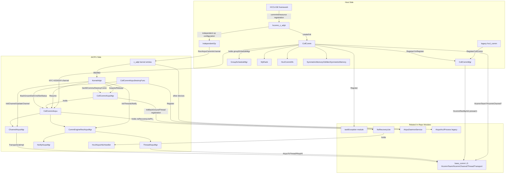

---

## Flow Description

### Communication Domain Initialization Flow

#### Host-Side fullMode Initialization Flow (A5 and Subsequent New Architectures)

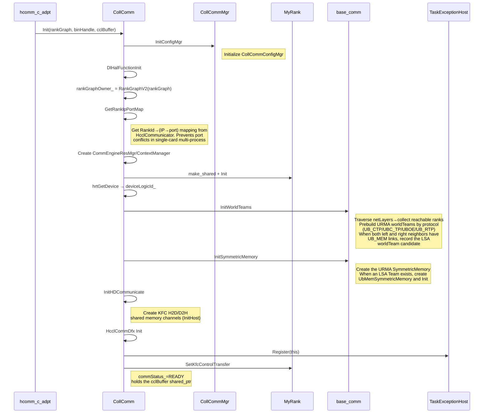

#### Host-Side simpleMode Initialization Flow (A2/A3 Legacy Chips)

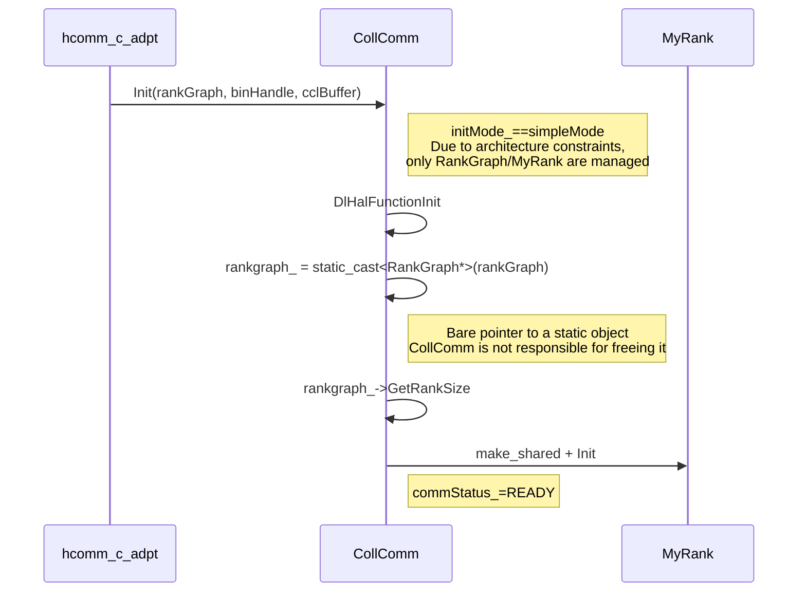

#### AICPU-Side Communication Domain Initialization Flow

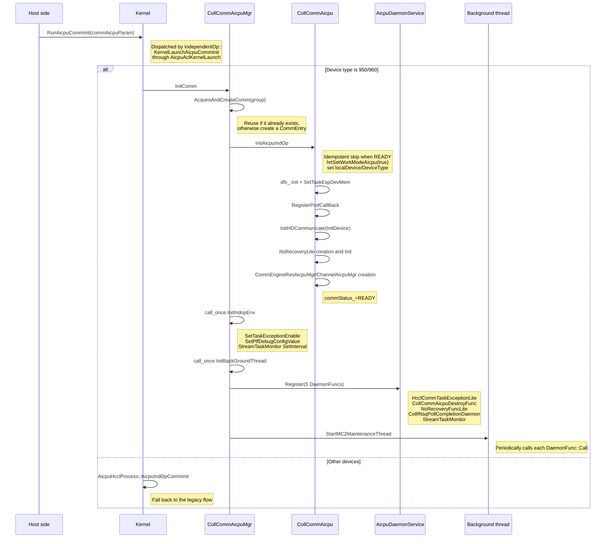

#### AICPU-Side Resource Initialization Flow (Threads/Notify/Channels)

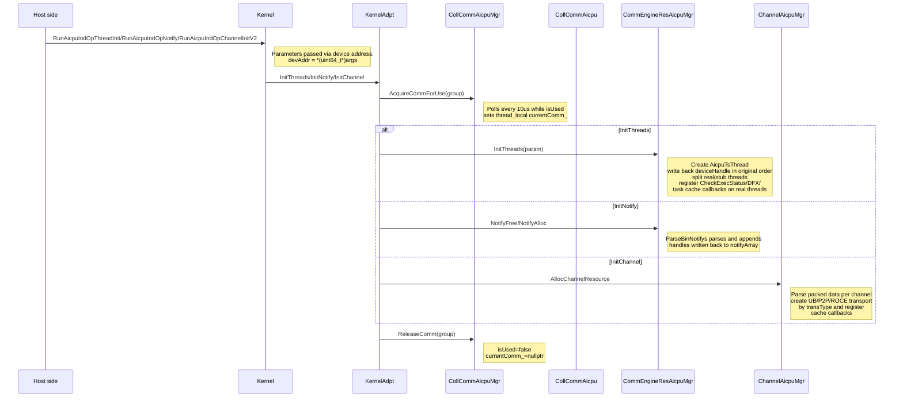

### Communication Domain Destruction Flow

#### Host-Side Initiated Destruction Flow

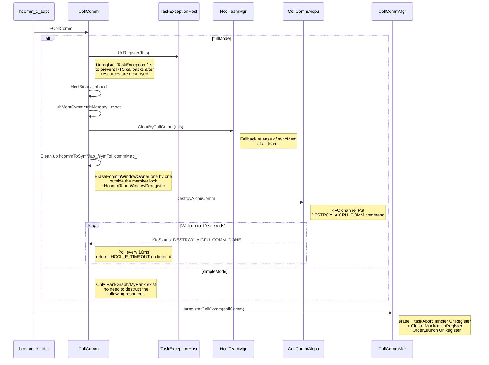

#### AICPU-Side Destruction Command Processing Flow

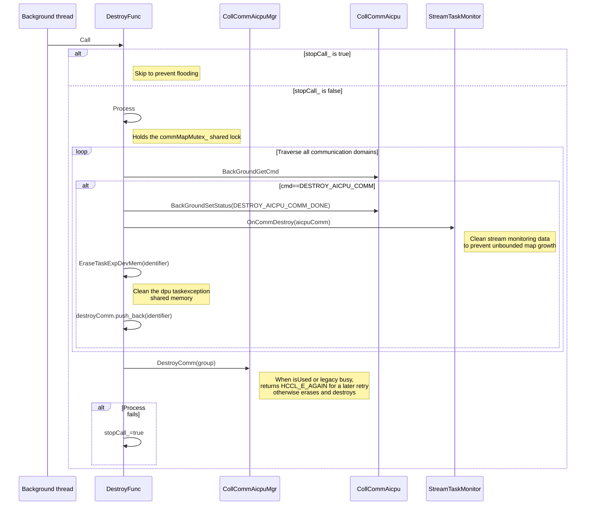

### N-Second Fast Recovery Flow

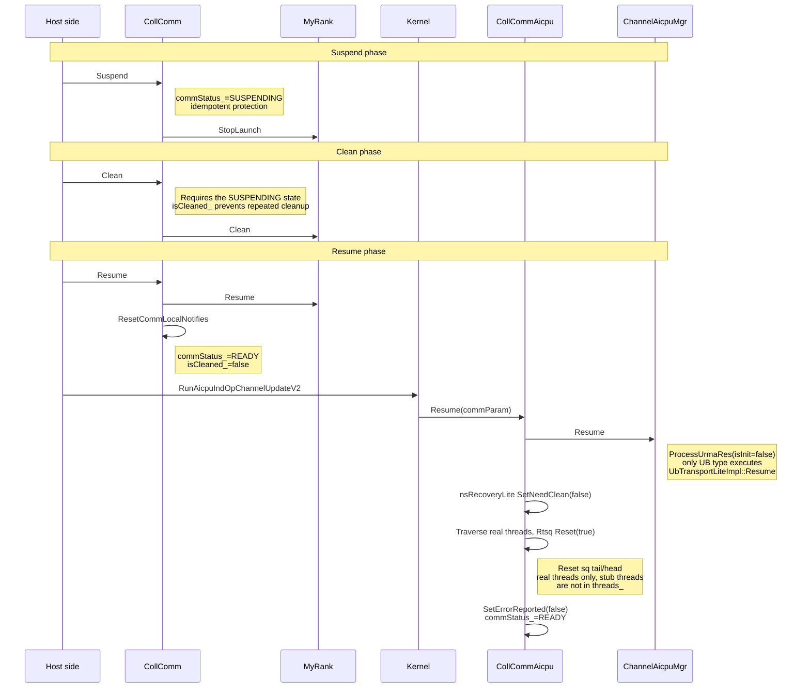

### Symmetric Memory Window Management Flow

#### Window Registration Flow

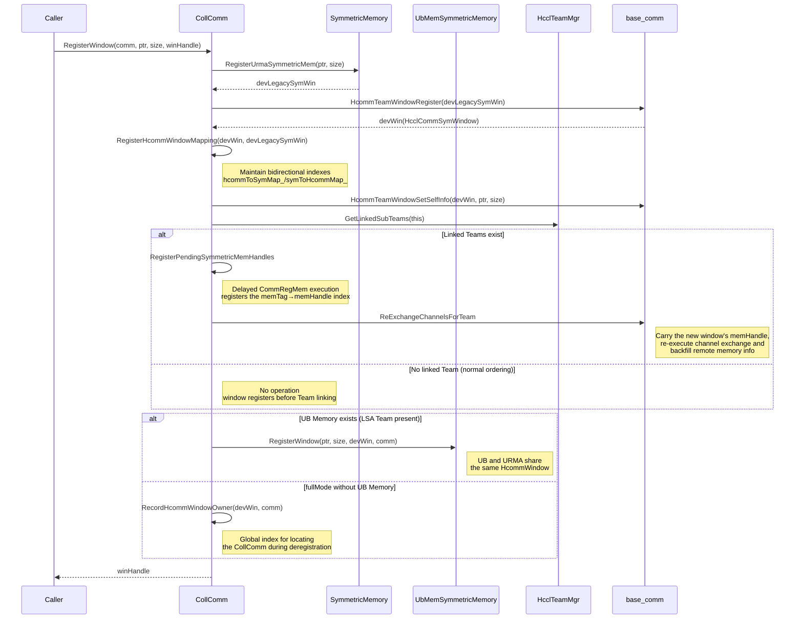

#### Window Deregistration and Remote Memory Backfill Flow

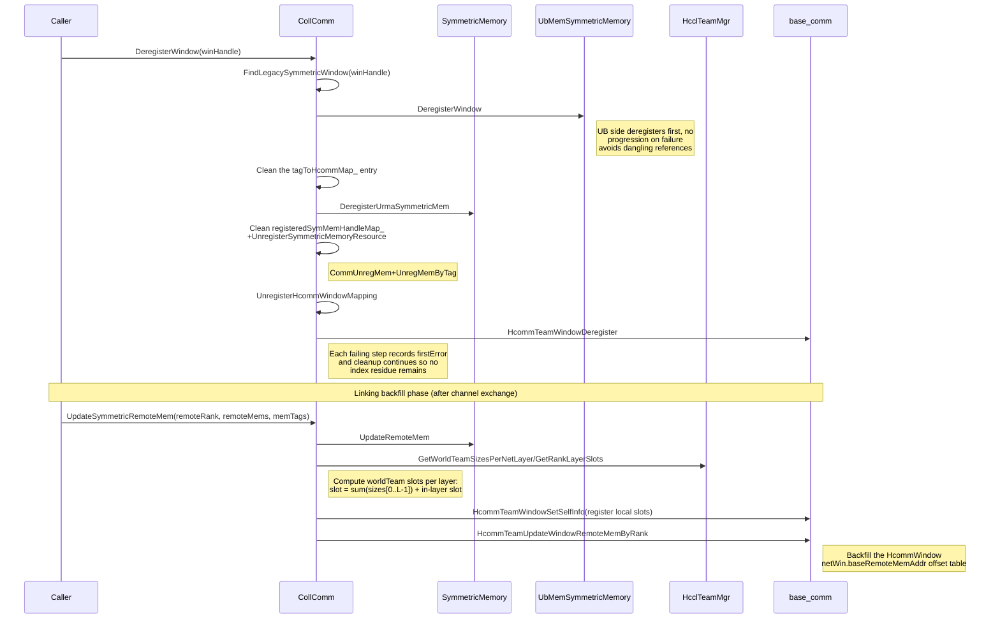

### Group P2P Task Scheduling Flow

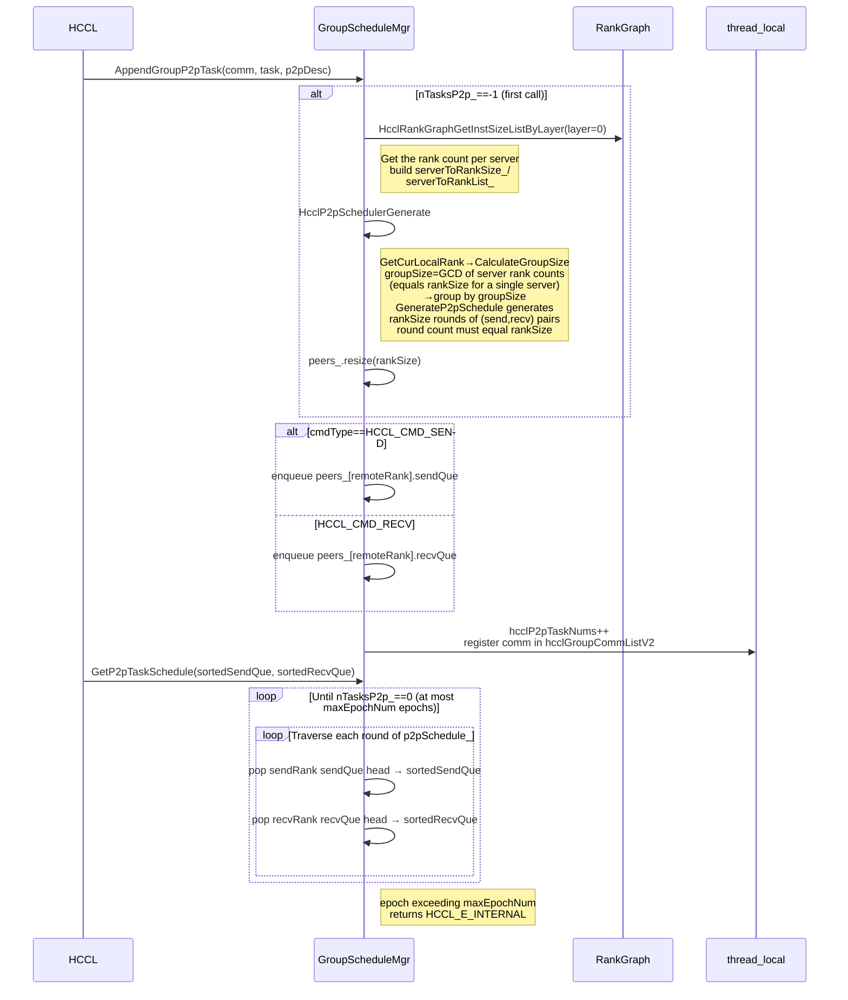

---

## Interface Description (Class Diagram)

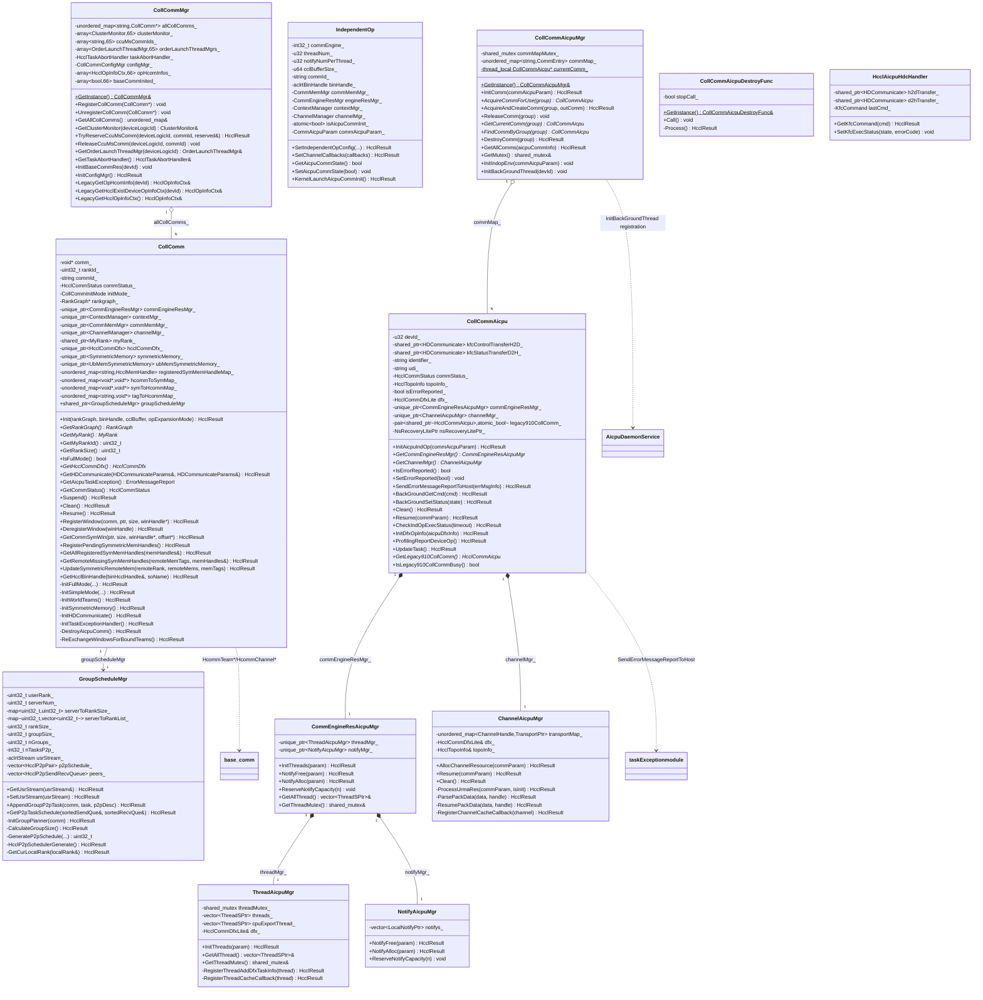

---

## Interface Description

### CollComm

| Interface | Type | Parameters | Return Value | Description |
|------|------|------|--------|----------|
| `Init(void*, aclrtBinHandle, HcclMem, uint32_t)` | Public | [in] rankGraph, [in] binHandle, [in] cclBuffer, [in] opExpansionMode | `HcclResult` | Initializes the communication domain: calls InitConfigMgr first, then InitFullMode for fullMode or InitSimpleMode for simpleMode |
| `GetCommConfig()` | Public inline | None | `CommConfig&` | Gets the communication domain configuration |
| `GetRankGraph()` | Public inline | None | `RankGraph*` | Gets the RankGraph pointer |
| `GetCommEngineResMgr()` | Public inline | None | `CommEngineResMgr*` | Gets the communication engine resource manager |
| `GetContextManager()` | Public inline | None | `ContextManager*` | Gets the context manager |
| `GetCommMemMgr()` | Public inline | None | `CommMemMgr*` | Gets the communication memory manager |
| `GetChannelManager()` | Public inline | None | `ChannelManager*` | Gets the channel manager |
| `GetCommunicatorV2()` | Public | None | `void*` | Gets the HcclCommunicator pointer (comm_) |
| `GetMyRank()` | Public | None | `MyRank*` | Gets the MyRank object |
| `GetMyRankId()` | Public | None | `uint32_t` | Gets the local rank ID |
| `GetRankSize()` | Public inline | None | `uint32_t` | Gets the rank count. Returns 0 when rankgraph_ is null or the query fails |
| `GetDeviceLogicId()` | Public inline | None | `s32` | Gets the device logical ID |
| `IsFullMode()` | Public | None | `bool` | Whether the full mode is used, so that external owners can decide whether management is needed before registration/unregistration |
| `GetHcclCommDfx()` | Public | None | `HcclCommDfx*` | Gets the DFX object |
| `GetDfxCallback()` | Public | None | `std::function` | Gets the DFX task callback. Returns nullptr when hcclCommDfx_ is null |
| `GetCommId()` | Public | None | `const std::string&` | Gets the communication domain ID (commName) |
| `GetHDCommunicate(HDCommunicateParams&, HDCommunicateParams&)` | Public | [out] kfcControlTransferH2DParams, [out] kfcStatusTransferD2HParams | `HcclResult` | Gets the KFC H2D/D2H channel parameters (passed to the AICPU side for InitDevice) |
| `GetAicpuTaskException()` | Public | None | `Hccl::ErrorMessageReport` | Reads the ErrorMessageReport reported by AICPU from the tail of the KFC D2H channel (offset sizeof(KfcStatus)+sizeof(KfcErrType)) |
| `GetParentRankId(u32&)` | Public | [out] parentRankId | `HcclResult` | Gets the rank ID in the parent communication domain from HcclCommunicator |
| `UpdateIndex()` | Public | None | `uint32_t` | Increments and returns the internal counter index_ |
| `GetCommStatus()` | Public | None | `HcclCommStatus` | Gets the communication domain status under the commMutex_ lock |
| `Suspend()` | Public | None | `HcclResult` | Suspends the communication domain: sets the status to SUSPENDING (idempotent) and calls myRank_->StopLaunch |
| `Clean()` | Public | None | `HcclResult` | Cleans the communication domain: requires the SUSPENDING status and not yet cleaned (isCleaned_); cleans the Host side first (myRank_->Clean) |
| `Resume()` | Public | None | `HcclResult` | Resumes the communication domain: myRank_->Resume + ResetCommLocalNotifies, sets the status to READY and isCleaned_=false |
| `RegisterWindow(HcclComm, void*, size_t, HcclCommSymWindow*)` | Public | [in] comm, [in] ptr, [in] size, [out] winHandle | `HcclResult` | Registers a symmetric memory window: URMA registration→HcommTeamWindowRegister→bidirectional mapping→re-exchange for late window registration→UB Memory registration or global owner recording |
| `DeregisterWindow(HcclCommSymWindow)` | Public | [in] winHandle | `HcclResult` | Deregisters the symmetric memory window: UB side deregisters first, then cleans URMA memory, local indexes, mappings, and the HcommWindow in turn; each failing step records firstError and cleanup continues |
| `GetCommSymWin(void*, size_t, HcclCommSymWindow*, size_t*)` | Public | [in] ptr, [in] size, [out] winHandle, [out] offset | `HcclResult` | Queries the owning symmetric window by address: FindUrmaSymmetricWindow followed by a symToHcommMap_ reverse lookup; a miss returns a null handle (falls back to the normal memory path) |
| `RegisterPendingSymmetricMemHandles()` | Public | None | `HcclResult` | Registers the memory of pending windows: GetPendingRegisterInfos→CommRegMem→registers registeredSymMemHandleMap_ and tagToHcommMap_ |
| `GetAllRegisteredSymMemHandles(std::vector<HcclMemHandle>&)` | Public | [out] memHandles | `HcclResult` | Gets all locally registered symmetric memory handles (shared lock) |
| `GetRemoteMissingSymMemHandles(remoteMemTags, memHandles&)` | Public | [in] remoteMemTags, [out] memHandles | `HcclResult` | Returns the local handles not yet owned by the remote side of the target channel (set difference) |
| `UpdateSymmetricRemoteMem(remoteRank, remoteMems, memTags)` | Public | [in] remoteRank, [in] remoteMems, [in] memTags | `HcclResult` | Backfills remote memory: symmetricMemory_->UpdateRemoteMem + UpdateHcommWindowRemoteMem (layer slot computation and HcommWindow backfill) |
| `GetHcclBinHandle(aclrtBinHandle&, const std::string& soName)` | Public | [out] binHcclHandle, [in] soName | `HcclResult` | Derives the json file name from soName (strips the `.so` suffix and appends `.json`) and lazily loads the binary (CPU_KERNEL_MODE), protected by binHcclmutex_; an empty soName returns HCCL_E_PARA |
| `groupScheduleMgr` | Public member | None | `shared_ptr<GroupScheduleMgr>` | Group P2P scheduling manager (for group) |

#### CollComm Private Methods (Key)

| Interface | Description |
|------|----------|
| `InitFullMode(...)` | Full initialization for fullMode: DlHalFunctionInit→RankGraphV2→GetRankIpPortMap→resource managers→MyRank→InitWorldTeams→InitSymmetricMemory→InitHDCommunicate→HcclCommDfx→InitTaskExceptionHandler→InitKfcAndRegisterCollComm |
| `InitSimpleMode(...)` | Simplified initialization for simpleMode: only DlHalFunctionInit→RankGraph bare pointer→MyRank; the fullMode resources below are not created |
| `InitWorldTeams()` | Prebuilds A5 URMA/UB Memory worldTeams by protocol + netLayer during communication domain initialization: traverses netLayers→CollectLayerReachableRanks→CreateUrmaWorldTeams (UB_CTP/UBC_TP/UBOE/UB_RTP)→UB_MEM LSA candidate (the largest netLayer where both left and right neighbors have UB_MEM links) |
| `CreatePrebuiltWorldTeam(protocol, netLayer, ranks, rankNum, selfMemberId)` | Creates and registers a prebuilt worldTeam (no communication, no syncMem created; barrierCount: UB_MEM=0, others=1); destroys the team on failure |
| `CollectLayerReachableRanks(...)` | Collects the ranks reachable by this Rank within the specified netLayer per protocol (GetLinks checks link validity); no worldTeam is created during collection |
| `InitSymmetricMemory()` | Creates the URMA SymmetricMemory; when an LSA Team exists, creates UbMemSymmetricMemory and Init; an absent prebuilt LSA Team means only URMA is used (a normal scenario) |
| `InitHDCommunicate()` | Creates the KFC control channel H2D (sizeof(KfcCommand)) and status channel D2H (sizeof(KfcExecStatus)) shared memory and calls InitHost |
| `InitTaskExceptionHandler()` | Registers this communication domain with TaskExceptionHost::GetInstance(deviceLogicId_) (commHandle=this pointer) |
| `InitKfcAndRegisterCollComm()` | Attaches the KFC channels through myRank_->SetKfcControlTransfer and sets commStatus_ to READY |
| `DestroyAicpuComm()` | When the AICPU communication domain exists (getAicpuCommState), sends DESTROY_AICPU_COMM through the KFC channel, polls for DESTROY_AICPU_COMM_DONE with a maximum wait of 10 seconds |
| `PrepareSharedSymmetricWindow(...)` | URMA registration→HcommTeamWindowRegister→RegisterHcommWindowMapping→SetSelfInfo; rolls back registered resources on any failure |
| `RegisterHcommWindowMapping / FindLegacySymmetricWindow / UnregisterHcommWindowMapping` | Maintain the bidirectional index between HcommWindow and the underlying URMA Window (hcommToSymMap_ / symToHcommMap_, hcommWindowMutex_ read-write lock) |
| `ReExchangeWindowsForBoundTeams()` | Re-exchange for late window registration: calls CreateChannels again for linked Teams, carrying the new window's memHandle into the exchange and backfilling; a no-op in the normal ordering (window before Team linking) |
| `ReExchangeChannelsForTeam(...)` | Per-team re-exchange: assembles channelDesc to create channels (symm memHandle attached to the desc for exchange), and double-backfills through UpdateSymmetricRemoteMem after linking |
| `UpdateHcommWindowRemoteMem(...)` | Computes offsets from per-netLayer worldTeam sizes and layer slots (sum(sizes[0..L-1])+in-layer slot), registers local slots through HcommTeamWindowSetSelfInfo (idempotent), and backfills remote memory through HcommTeamUpdateWindowRemoteMemByRank |
| `RegisterSymmetricMemoryResource / UnregisterSymmetricMemoryResource` | CommRegMem (memTag = prefix+commId+addr+size) and CommUnregMem/UnregMemByTag of a single symmetric memory |
| `HcclBinaryUnLoad()` | Unloads binHcclHandle_ with aclrtBinaryUnLoad during destruction |

### Global Window Index Interfaces (coll_comm.h/.cc)

| Interface | Parameters | Return Value | Description |
|------|------|--------|----------|
| `RecordHcommWindowOwner(winHandle, comm)` | [in] winHandle, [in] comm | `HcclResult` | Records the owning communication domain of the A5 fullMode unified HcommWindow (global map, mutex protected); duplicate registration reports an error |
| `GetHcommWindowComm(winHandle, comm&)` | [in] winHandle, [out] comm | `HcclResult` | Queries the communication domain owning winHandle; returns HCCL_E_NOT_FOUND when not found |
| `EraseHcommWindowOwner(winHandle)` | [in] winHandle | void | Removes the global window index entry |

### CollCommMgr

| Interface | Type | Parameters | Return Value | Description |
|------|------|------|--------|----------|
| `GetInstance()` | Public static | None | `CollCommMgr&` | Gets the singleton; the first call constructs the base_comm singleton (HcommResMgrInit) and prewarms SharedJettyChannelPool to guarantee destruction order |
| `RegisterCollComm(CollComm*)` | Public | [in] collComm | void | Registers a communication domain: allCollComms_[commId], taskAbortHandler_.Register, OrderLaunch registration per device |
| `UnregisterCollComm(CollComm*)` | Public | [in] collComm | void | Unregisters a communication domain: erase, taskAbortHandler UnRegister, ClusterMonitor UnRegister, OrderLaunch UnRegister |
| `GetAllCollComms()` | Public | None | `unordered_map&` | Gets all registered communication domains (commId→CollComm*) |
| `GetClusterMonitor(s32)` | Public | [in] deviceLogicId | `ClusterMonitor&` | Gets the cluster monitor of the specified device; falls back to [0] when deviceLogicId is out of range |
| `TryReserveCcuMsComm(s32, const std::string&, bool&)` | Public | [in] deviceLogicId, [in] commId, [out] reserved | `HcclResult` | Tries to exclusively reserve the device communication domain slot for CCU CcuBuffer mode; reserved=false when already occupied |
| `ReleaseCcuMsComm(s32, const std::string&)` | Public | [in] deviceLogicId, [in] commId | void | Releases the CCU CcuBuffer mode communication domain reservation (cleared only when the owner matches) |
| `GetOrderLaunchThreadMgr(s32)` | Public | [in] deviceLogicId | `OrderLaunchThreadMgr&` | Gets the order launch thread manager of the specified device; falls back to [0] when out of range |
| `GetTaskAbortHandler()` | Public | None | `HcclTaskAbortHandler&` | Gets the task abort handler |
| `InitBaseCommRes(uint32_t)` | Public | [in] devId | void | Initializes base_comm resources (HcommResMgrInit) |
| `InitConfigMgr()` | Public | None | `HcclResult` | Initializes CollCommConfigMgr |
| `GetConfigMgr()` | Public inline | None | `const CollCommConfigMgr&` | Gets the CollCommConfigMgr configuration manager (HostMultiQpConfig and other configs are read through it) |
| `LegacyGetOpHcomInfo(uint32_t)` | Public | [in] devId | `HcclOpInfoCtx&` | Legacy interface: gets the operator communication domain info of the specified device; lazily initializes base_comm resources on first access |
| `LegacyGetHcclExistDeviceOpInfoCtx(s32)` | Public | [in] devId | `HcclOpInfoCtx&` | Legacy interface: gets the ctx when the device is set; falls back to the backup slot (MAX_MODULE_DEVICE_NUM) only when the current devId's ctx is not in use and the backup slot is already in use, otherwise marks isUsed=true and returns the current devId's ctx |
| `LegacyGetHcclOpInfoCtx()` | Public | None | `HcclOpInfoCtx&` | Legacy interface: when no device is set, traverses to select an in-use ctx or the backup slot |

### IndependentOp

| Interface | Type | Parameters | Return Value | Description |
|------|------|------|--------|----------|
| `SetIndependentOpConfig(...)` | Public | [in] commConfig, [in] rankTable, [in] topoAttr, [in] binHandle, [in/out] kfc params, [in] bufferManager | `HcclResult` | Initializes the resource manager: registers AICPU state callbacks, engineResMgr_/channelMgr_ Init, assembles commAicpuParam_, sets QoS |
| `SetChannelCallbacks(const ChannelManagerCallbacks&)` | Public | [in] channelCallbacks | `HcclResult` | Sets the channel callbacks |
| `GetThreadNum() / GetNotifyNumPerThread()` | Public | None | `u32` | Gets the configured thread count / notify count per thread |
| `GetAicpuCommState() / SetAicpuCommState(bool)` | Public | None / [in] aicpuCommState | `bool` / void | Gets/sets the AICPU communication domain initialization state (atomic, acquire/release ordering) |
| `GetCommMemMgr() / GetCommEngineResMgr() / GetContextManager() / GetChannelManager()` | Public inline | None | Reference | Gets each resource manager |
| `KernelLaunchAicpuCommInit()` | Public | None | `HcclResult` | Creates a local stream (aicpuStreamMode=1), dispatches the `RunAicpuCommInit` kernel to complete the common initialization of the AICPU-side communication domain, and reports the kernel duration after synchronization (HcommProfilingReportKernel) |

### GroupScheduleMgr and Global P2P Interfaces

| Interface | Type | Parameters | Return Value | Description |
|------|------|------|--------|----------|
| `GetUsrStream(aclrtStream&)` | Public | [out] usrStream | `HcclResult` | Gets the user stream (reports an error when not set) |
| `SetUsrStream(const aclrtStream&)` | Public | [in] usrStream | `HcclResult` | Sets the user stream |
| `AppendGroupP2pTask(HcclComm, const HcclP2pTask&, const HcclOpP2pDesc&)` | Public | [in] comm, [in] task, [in] p2pDesc | `HcclResult` | Appends a P2P task: initializes the planner and generates the schedule on the first call; enqueues to peers_ by SEND/RECV; maintains the thread_local count and comm list |
| `GetP2pTaskSchedule(std::vector<HcclP2pTask>&, std::vector<HcclP2pTask>&)` | Public | [out] sortedSendQue, [out] sortedRecvQue | `HcclResult` | Sorts tasks by schedule rounds: pops each peer's queue head round by round until the tasks are drained; reports an error when the epoch exceeds the total task count |
| `ClearHcclGroupCommList()` | Global | None | void | Clears the thread_local group comm list |
| `GetHcclGroupCommList()` | Global | None | `std::vector<HcclComm>&` | Gets the thread_local group comm list |
| `GetHcclP2pTaskNums() / SetHcclP2pTaskNums(int32_t)` | Global | None / [in] targetP2pTaskNums | `int32_t` / void | Gets/sets the thread_local P2P task count |

### CollCommAicpu

| Interface | Type | Parameters | Return Value | Description |
|------|------|------|--------|----------|
| `InitAicpuIndOp(CommAicpuParam*)` | Public | [in] commAicpuParam | `HcclResult` | AICPU communication domain initialization (idempotent skip when READY): sets work mode/device→dfx Init→ProfCallBack→KFC InitDevice→NsRecoveryLite→creates resource mgrs→READY |
| `GetCommEngineResMgr()` | Public inline | None | `CommEngineResAicpuMgr*` | Gets the communication engine resource manager (threads/notify) |
| `GetChannelMgr()` | Public inline | None | `ChannelAicpuMgr*` | Gets the channel manager |
| `GetLegacy910CollComm() / SetLegacy910CollComm(shared_ptr)` | Public | None / [in] comm | `HcclCommAicpu*` / void | 910B legacy communication domain wrapper (shared_ptr shared ownership) |
| `IsLegacy910CollCommBusy() / SetLegacy910CollCommBusy(bool)` | Public | None / [in] busy | `bool` / void | Legacy communication domain in-use flag (atomic_bool) |
| `GetTopoInfo() / GetIdentifier() / GetUdi()` | Public | None | Reference | Gets the topology info / communication domain identifier / UDI |
| `IsErrorReported() / SetErrorReported(bool)` | Public | None / [in] isErrorReported | `bool` / void | taskException already-reported flag (prevents duplicate reporting) |
| `SendErrorMessageReportToHost(ErrorMessageReport&)` | Public | [in] errMsgInfo | `HcclResult` | Writes the ErrorMessageReport to the tail of the KFC D2H channel to report to the Host |
| `RegisterProfCallBack()` | Public | None | `HcclResult` | Registers profiling callbacks (DfxRegisterProfCallBack) |
| `GetHcclCommDfxLite()` | Public inline | None | `HcclCommDfxLite*` | Gets the AICPU-side DFX object |
| `GetDevId()` | Public inline | None | `u32` | Gets the AICPU-side device ID (devId_) |
| `BackGroundGetCmd(KfcCommand&)` | Public | [out] cmd | `HcclResult` | The background thread reads a command from the KFC H2D channel |
| `BackGroundSetStatus(KfcStatus)` | Public | [in] state | `HcclResult` | The background thread writes a status to the KFC D2H channel |
| `GetCommmStatus() / SetCommmStatus(HcclCommStatus)` | Public | None / [in] status | `HcclCommStatus` / void | Gets/sets the communication domain status |
| `GetNsRecoveryLitePtr()` | Public | None | `NsRecoveryLitePtr` | Gets the N-second fast recovery Lite object |
| `Clean()` | Public | None | `HcclResult` | Channel resource cleanup (channelMgr_->Clean) |
| `Resume(HcclChannelUrmaRes*)` | Public | [in] commParam | `HcclResult` | Fast recovery: channelMgr_->Resume + nsRecovery SetNeedClean(false) + real-thread Rtsq Reset + SetErrorReported(false) + READY |
| `CheckIndOpExecStatus(bool)` | Public | [in] timeout | `HcclResult` | Operator execution status check (registered as a thread callback): prints taskException on timeout and returns HCCL_E_INTERNAL; returns HCCL_E_SUSPENDING for SUSPENDING; fails when not READY |
| `InitDfxOpInfo(HcclDfxOpInfo*)` | Public | [in] aicpuDfxInfo | `HcclResult` | Assembles DfxDfxOpInfo (opType/count/src/dst/opIndex, etc.) into dfx_, and writes opIndex to the taskexception shared memory (offset 5) |
| `ProfilingReportDeviceOp()` | Public | None | `HcclResult` | Reports device-side operator profiling: ReportAllTasks(threads) + ReportHcclOpInfo |
| `UpdateTask()` | Public | None | `HcclResult` | Updates profiling statistics (dfx_.UpdateProfStat) |

### CollCommAicpuMgr

| Interface | Type | Parameters | Return Value | Description |
|------|------|------|--------|----------|
| `GetInstance()` | Public static | None | `CollCommAicpuMgr&` | Gets the singleton |
| `InitComm(CommAicpuParam*)` | Public | [in] commAicpuParam | `HcclResult` | Communication domain initialization entry: AcquireAndCreateComm→InitAicpuIndOp→call_once InitIndopEnv / InitBackGroundThread (the order must not be reversed, otherwise the first monitoring round of the background thread is skipped) |
| `AcquireCommForUse(const std::string&)` | Public | [in] group | `CollCommAicpu*` | Acquires and marks in-use: polls every 10us while isUsed (prints a waiting log every 10s); sets thread_local currentComm_ on hit |
| `AcquireAndCreateComm(const std::string&, CollCommAicpu**)` | Public | [in] group, [out] outComm | `HcclResult` | Creates or gets a communication domain (without marking in-use) |
| `ReleaseComm(const std::string&)` | Public | [in] group | void | Releases the in-use mark (isUsed=false, currentComm_=nullptr) |
| `GetCurrentComm(const std::string&)` | Public | [in] group | `CollCommAicpu*` | Gets the current thread's communication domain: validates that currentComm_ is non-null and its identifier matches the group |
| `FindCommByGroup(const std::string&)` | Public | [in] group | `CollCommAicpu*` | Looks up the map by group (shared lock, no in-use state validation) |
| `DestroyComm(const std::string&)` | Public | [in] group | `HcclResult` | Destroys a communication domain: sets INVALID; returns HCCL_E_AGAIN for a later retry when isUsed or legacy busy; otherwise erases |
| `GetAllComms(std::vector<...>&)` | Public | [out] aicpuCommInfo | `HcclResult` | Exports all communication domains (the caller must hold the commMapMutex_ shared lock externally) |
| `GetMutex()` | Public | None | `std::shared_mutex&` | Gets the registry read-write lock (for traversing callers to lock) |
| `InitIndopEnv(CommAicpuParam*)` | Public | [in] commAicpuParam | void | Global environment initialization: taskExceptionEnable, plfDebugConfig, StreamTaskMonitor monitoring interval |
| `InitBackGroundThread(u32)` | Public | [in] devId | void | Starts the background thread: registers 5 DaemonFuncs with AicpuDaemonService and calls StartMC2MaintenanceThread |

### Kernel Entry Points (coll_comm_aicpu_kernel.h, extern "C")

| Interface | Parameters | Return Value | Description |
|------|------|--------|----------|
| `RunAicpuCommInit(void* args)` | [in] args (CommAicpuParam*) | `uint32_t` | AICPU communication domain common initialization: devices 950/960 use CollCommAicpuMgr::InitComm; other devices fall back to AicpuHcclProcess::AicpuIndOpCommInit |
| `RunAicpuIndOpThreadInit(void* args)` | [in] args (device address) | `uint32_t` | Device stream thread initialization: devices 950/960 use CollCommAicpuKernelAdptInitThreads; others fall back to AicpuIndOpThreadInit |
| `RunAicpuIndOpNotify(void* args)` | [in] args (device address) | `uint32_t` | Notify allocation/release: devices 950/960 use CollCommAicpuKernelAdptInitNotify; others fall back to AicpuIndOpNotifyInit |
| `RunAicpuIndOpChannelInitV2(void* args)` | [in] args (device address) | `uint32_t` | URMA channel initialization: delegates to CollCommAicpuKernelAdptInitChannel |
| `RunAicpuIndOpChannelUpdateV2(void* args)` | [in] args (device address) | `uint32_t` | URMA channel recovery (fast recovery): delegates to CollCommAicpuKernelAdptUpdateChannel |
| `RunAicpuDfxInitV2(void* args)` | [in] args (context + commTag) | `uint32_t` | AICPU DFX operator info initialization: gets currentComm and calls InitDfxOpInfo |

### Kernel Adapter Layer (coll_comm_aicpu_kernel_adpt.h)

| Interface | Parameters | Return Value | Description |
|------|------|--------|----------|
| `CollCommAicpuKernelAdptInitThreads(ThreadMgrAicpuParam*)` | [in] param | `HcclResult` | Thread initialization: Acquire→commEngineResMgr->InitThreads→Release |
| `CollCommAicpuKernelAdptInitChannel(HcclChannelUrmaRes*)` | [in] commParam | `HcclResult` | Channel initialization: Acquire→channelMgr->AllocChannelResource→Release |
| `CollCommAicpuKernelAdptUpdateChannel(HcclChannelUrmaRes*)` | [in] commParam | `HcclResult` | Channel recovery: Acquire→aicpuComm->Resume (unified handling of channel recovery and status reset)→Release |
| `CollCommAicpuKernelAdptInitNotify(NotifyMgrAicpuParam*)` | [in] param | `HcclResult` | Notify operation: freeFlag ? NotifyFree : NotifyAlloc (Acquire→operation→Release) |

### CommEngineResAicpuMgr / ThreadAicpuMgr / NotifyAicpuMgr

| Interface | Class | Parameters | Return Value | Description |
|------|--------|------|--------|----------|
| `InitThreads(ThreadMgrAicpuParam*)` | CommEngineResAicpuMgr | [in] param | `HcclResult` | Delegates to ThreadAicpuMgr to initialize device stream threads |
| `NotifyFree(NotifyMgrAicpuParam*)` | CommEngineResAicpuMgr | [in] param | `HcclResult` | Delegates to NotifyAicpuMgr to free notifies |
| `NotifyAlloc(NotifyMgrAicpuParam*)` | CommEngineResAicpuMgr | [in] param | `HcclResult` | Delegates to NotifyAicpuMgr to allocate notifies |
| `ReserveNotifyCapacity(size_t)` | CommEngineResAicpuMgr | [in] n | void | Reserves notify capacity |
| `GetAllThread()` | CommEngineResAicpuMgr | None | `vector<shared_ptr<Thread>>&` | Gets all real threads (delegates to ThreadAicpuMgr) |
| `GetThreadMutex()` | CommEngineResAicpuMgr | None | `std::shared_mutex&` | Gets the thread table read-write lock |
| `InitThreads(ThreadMgrAicpuParam*)` | ThreadAicpuMgr | [in] param | `HcclResult` | Creates and Inits AicpuTsThread one by one; writes device handles back in the original input order (both real and stub, preventing handle misalignment); splits real threads (threads_) / stub threads (cpuExportThread_) by IsFakeDeviceRes; registers CheckExecStatus/DFX/cache callbacks on real threads only |
| `RegisterThreadAddDfxTaskInfo(ThreadHandle)` | ThreadAicpuMgr | [in] thread | `HcclResult` | Registers the execution status check callback (HcommThreadRegisterCheckExecStatus) and DFX callbacks (ReportStreamTask / GetLatestDfxOpInfo) |
| `RegisterThreadCacheCallback(AicpuTsThread*)` | ThreadAicpuMgr | [in] thread | `HcclResult` | Registers task cache callbacks: RtsqA5 SetAicpuTsThreadPtr + NeedCacheTask/AddSqeArray (AicpuTaskCacheManager) |
| `NotifyFree(NotifyMgrAicpuParam*)` | NotifyAicpuMgr | [in] param | `HcclResult` | Removes LocalNotify* entries from notifys_ by deviceHandle (only warns when not found) |
| `NotifyAlloc(NotifyMgrAicpuParam*)` | NotifyAicpuMgr | [in] param | `HcclResult` | ParseBinNotifys parses and appends to notifys_, validates the count, then writes the new handles back to notifyArray in order |

### ChannelAicpuMgr

| Interface | Type | Parameters | Return Value | Description |
|------|------|------|--------|----------|
| `AllocChannelResource(HcclChannelUrmaRes*)` | Public | [in] commParam | `HcclResult` | Channel resource allocation entry: InitUrmaChannel |
| `Resume(HcclChannelUrmaRes*)` | Public | [in] commParam | `HcclResult` | Channel recovery: ProcessUrmaRes(isInit=false); only the UB type is supported |
| `Clean()` | Public | None | `HcclResult` | Cleans all UB-type channel resources |
| `ProcessUrmaRes(commParam, isInit)` | Private | [in] commParam, [in] isInit | `HcclResult` | Per channel: copies packed data from uniqueIdAddr→ParsePackData→writes back the handle and registers callbacks (init) or ResumePackData (resume) |
| `ParsePackData(data, handle)` | Private | [in] data, [out] handle | `HcclResult` | Parses the channel transport type and creates the transport: UB/UBoE→UbTransportLiteImpl (+SetTaskExceptionEnable); P2P→P2PTransportLiteImpl; ROCE→RoceTransportLiteImpl; handle=impl pointer |
| `ResumePackData(data, handle)` | Private | [in] data, [in] handle | `HcclResult` | Finds the transport by handle; only the UB type executes UbTransportLiteImpl::Resume |
| `RegisterChannelCacheCallback(ChannelHandle)` | Private | [in] channel | `HcclResult` | Registers task cache callbacks on UB channels (NeedCacheTask/AddWqeArray → AicpuTaskCacheManager); non-UB silently skipped |

### CollCommAicpuDestroyFunc / HcclAicpuHdcHandler

| Interface | Class | Parameters | Return Value | Description |
|------|--------|------|--------|----------|
| `Call()` | CollCommAicpuDestroyFunc | None | void | Background thread callback entry: calls Process and sets stopCall_ on failure to prevent flooding |
| `Process()` | CollCommAicpuDestroyFunc | None | `HcclResult` | Holds the shared lock to traverse all communication domains, reads the DESTROY_AICPU_COMM command→writes back the DONE status→cleans StreamTaskMonitor and the taskexception shared memory→DestroyComm outside the lock |
| `GetKfcCommand(KfcCommand&)` | HcclAicpuHdcHandler | [out] cmd | `HcclResult` | Reads a KFC command from the H2D channel; prints a log when the command changes (lastCmd_) |
| `SetKfcExecStatus(KfcStatus, KfcErrType)` | HcclAicpuHdcHandler | [in] state, [in] errorCode | void | Writes KfcExecStatus to the D2H channel |

---

## Usage Limitations

### Supported Scenarios

| Chip | Mode | Host Side | AICPU Side | Description |
|------|------|---------|----------|------|
| A5 and subsequent new architectures (Ascend 950PR/950DT/960, etc.) | fullMode | Supported | Supported (new flow) | Full CollComm initialization and resource management; kernel entries go through CollCommAicpuKernelAdpt / CollCommAicpuMgr |
| A2/A3 legacy chips | simpleMode | Supported | Fall back to legacy | Only RankGraph, MyRank, and so on are placed under CollComm management; kernel entries fall back to AicpuHcclProcess |
| 910B | legacy wrapper | Not applicable | Supported | CollCommAicpu wraps HcclCommAicpu through shared_ptr, with a busy flag (atomic_bool) to prevent concurrent destruction |

### Constraint Specifications

1. **Initialization mode**: `CollCommInitMode` is split into fullMode (A5 and later, full initialization) and simpleMode (A2/A3, RankGraph/MyRank only); simpleMode destruction returns directly without cleaning fullMode resources; the simpleMode RankGraph is a bare pointer to an external static object and CollComm is not responsible for freeing it
2. **Device count limit**: A single server with dual modules supports up to 65 devices (`MAX_MODULE_DEVICE_NUM = 65`); `clusterMonitor_`/`orderLaunchThreadMgrs_` are fixed-size arrays of 65, and GetClusterMonitor/GetOrderLaunchThreadMgr fall back to [0] when deviceLogicId is out of range; `ccuMsCommIds_` is also a fixed-size array of 65, where `TryReserveCcuMsComm` returns `HCCL_E_PARA` and `ReleaseCcuMsComm` only prints a warning and returns when out of range; the legacy `opHcomInfos_` has 65+1 entries (backup slot `MAX_MODULE_DEVICE_NUM`)
3. **AICPU communication domain destruction timeout**: The Host-side `DestroyAicpuComm` polls for `DESTROY_AICPU_COMM_DONE` for at most 10 seconds (`WAIT_CMD_TIMEOUT = 10 * 1000` ms, polling every 10ms) and returns `HCCL_E_TIMEOUT` on timeout
4. **AICPU communication domain in-use wait**: `AcquireCommForUse` polls every 10us while isUsed (`pollIntervalUs = 10`) and prints a waiting log every 10 seconds (`pollTimeoutMs = 10000`)
5. **Destruction retry semantics**: `DestroyComm` returns `HCCL_E_AGAIN` when the communication domain isUsed or legacy 910B busy (defensive check against desynchronization with isUsed), and the caller retries later
6. **Background thread initialization order**: Within `InitComm`, `InitIndopEnv` must execute before `InitBackGroundThread` (call_once); otherwise taskMonitorInterval is unassigned when the background thread starts, the first Call skips monitoring, and it never self-heals
7. **Group P2P task count**: The per-thread P2P task limit is 2048 (`MAX_P2P_TASK_NUM = 2048`, thread_local `hcclP2pTaskNums`); exceeding it returns `HCCL_E_INTERNAL`
8. **P2P scheduling correctness constraints**: The round count generated by `GenerateP2pSchedule` must equal rankSize, otherwise an error is reported; `GetP2pTaskSchedule` reports `HCCL_E_INTERNAL` when the epoch exceeds the total task count (maxEpochNum); groupSize is the GCD of per-server rank counts (equal to rankSize for a single server), and a groupSize of 0 is an error
9. **Real/stub thread splitting**: `ThreadAicpuMgr` splits threads by `IsFakeDeviceRes` into real threads (threads_, holding StreamLite/Rtsq) and stub threads (cpuExportThread_, GE order-preserving exports); device handles must be written back in the original input order (both real and stub); writing a mixed batch in compacted order misaligns handles as a whole; stub threads register no DFX/cache callbacks, and Resume/exception CQE/DFX traversal depends on real threads only
10. **Channel type restrictions**: The AICPU task cache supports only the UB.URMA protocol; `ResumePackData` supports only the UB-type transport and reports `HCCL_E_INTERNAL` for non-UB; unsupported transTypes report `HCCL_E_INTERNAL`
11. **Symmetric memory windows**: The memTag format is `HCCL_SYMMETRIC_MEMORY_TAG_PREFIX + commId + "_addr_" + address + "_size_" + size`; `HcclCommSymWinRegister` only records the window, and the actual CommRegMem is deferred to the ChannelAcquire phase; UB Memory and URMA share the same HcommWindow (URMA maintains netWin/legacySymWindow, UB Memory supplements lsaWin); each failing step of DeregisterWindow records firstError and cleanup continues so that no dangling index remains
12. **worldTeam prebuilding constraints**: The URMA protocol set is UB_CTP/UBC_TP/UBOE/UB_RTP (barrierCount=1); the UB_MEM worldTeam is prebuilt at the largest netLayer only when both the left and right neighbors of this rank have UB_MEM links (barrierCount=0, no communication, no syncMem); an absent prebuilt LSA Team means the communication domain uses URMA only, which is a normal scenario
13. **Duplicate error report prevention**: The AICPU side uses the `isErrorReported_` flag to prevent duplicate reporting from the same communication domain (reset to false during fast-recovery Resume); the ErrorMessageReport is appended to the tail of the KFC D2H channel (offset sizeof(KfcStatus)+sizeof(KfcErrType))
14. **DFX opIndex offset**: `WriteOpIndexToTaskExpMem` writes opIndex to the fixed offset 5 (`OPINDEX_OFFSET = 5`) of the DPU taskexception shared memory
15. **Notify capacity**: `NotifyAicpuMgr` reserves capacity by `HCCL_THREAD_NOTIFY_MAX_NUM` at construction; `NotifyAlloc` reports `HCCL_E_INTERNAL` when the actual count after appending is below the expected value (notifyNum+original count)
16. **Singleton destruction order guarantee**: The first call to `CollCommMgr::GetInstance` executes `HcommResMgrInit` (the base_comm singleton is constructed first and destroyed last) and prewarms `SharedJettyChannelPool`, preventing the ~CollCommMgr→~CollComm→~MyRank chain from hitting destroyed static objects; on device ID acquisition failure, devPhyId falls back to 0 (the primary purpose is guaranteeing construction order; LegacyGetOpHcomInfo later re-initializes with the correct devId)
17. **Thread safety**: `CollCommMgr`'s `mutex_`/`ccuMsCommMutex_`/`opHcomInfosMutex_` protect the registry/CCU reservation/legacy ctx respectively; `CollCommAicpuMgr::commMapMutex_` is a read-write lock (GetAllComms requires the caller to hold the shared lock externally); `currentComm_` is thread_local; `CollComm`'s `commMutex_` (status), `binHcclmutex_` (bin handle), `registeredSymMemHandleMapMtx_` (handle index, read-mostly), and `hcommWindowMutex_` (window mapping, read-write lock) protect the corresponding resources; the global `g_hcommWindowCommMapMutex_` protects the window owner index
18. **Legacy compatibility constraints**: `legacy_op_hcom_info.h` and the Legacy-series interfaces of `CollCommMgr` are for ascend910 historical compatibility only, restricted to bug fixes and compatibility maintenance with no new features or further evolution; new capabilities should land in the official `base_comm/` or `coll_communicator_mgr/` directories
