# HCCL 模拟运行器数据模型设计

> **命名与出处约定**：实体名 = `include/runnerdb/sim_models.h` 的结构体名（CamelCase，以实现为准）；字段名 = 该文件中的字段名（snake_case）。落库表名见 `include/runnerdb/db_sim_sqlite_db.h`，部分与结构体名不同：`VirtualMemBlock`→表 `VirMem`、`PhyMemBlock`→表 `PhMem`、`IpcMemWhiteList`→表 `IpMemWhiteList`。尚未逐节替换的旧 kebab 写法（如 `phy-mem-id`）按 `-`→`_` 即为实现字段名。非 `sim_models.h` 实体（如 ACL 侧 `KernelLaunchCfg`）沿用其真实字段名，勿强行转 snake_case。
>
> **接口名写法**：文档中的 `aclrt*` 指 ACL 对外接口（`runtime/include/external/acl/acl_rt.h`）；为精简，§7 的流程图与接口表省略 `acl` 前缀（`rtLaunchKernel` 即 `aclrtLaunchKernel`）。该写法与 RTS 层真名 `rt*`（`runtime/pkg_inc/runtime/runtime/kernel.h`）同形，引用一律以 ACL 层为准；ACL 类型名（如 `aclrtLaunchKernelCfg`、`aclrtLaunchKernelAttr`）保留全名。

## 目录

- [1. 软硬件资源交互关系建模](#1-软硬件资源交互关系建模)
- [2. Device、Context、Stream 等硬件资源关系建模](#2-devicecontextstream-等硬件资源关系建模)
  - [2.1 基础设备关系建模](#21-基础设备关系建模)
    - [2.1.1 层次结构总览](#211-层次结构总览)
    - [2.1.2 网络通信资源](#212-网络通信资源)
    - [2.1.3 关键关系说明](#213-关键关系说明)
    - [2.1.4 配套接口映射表](#214-配套接口映射表)
  - [2.2 基础内存管理关系建模](#22-基础内存管理关系建模)
    - [2.2.1 关键关系说明（基础内存管理关系建模）](#221-关键关系说明基础内存管理关系建模)
    - [2.2.2 配套接口映射表（基础内存管理关系建模）](#222-配套接口映射表基础内存管理关系建模)
- [3. 在基础模型上扩展数据任务模型](#3-在基础模型上扩展数据任务模型)
  - [3.1 数据 / 任务流建模](#31-数据--任务流建模)
  - [3.2 ccu资源建模](#32-ccu资源建模)
    - [3.2.1 配套接口映射表（ccu资源建模）](#321-配套接口映射表ccu资源建模)
    - [3.2.2 CCU资源生命周期说明](#322-ccu资源生命周期说明)
  - [3.3 异步 / 同步执行建模](#33-异步--同步执行建模)
    - [3.3.1 Notify资源管理](#331-notify资源管理)
    - [3.3.2 Notify同步控制](#332-notify同步控制)
    - [3.3.3 Event资源管理](#333-event资源管理)
    - [3.3.4 Event 流程控制](#334-event-流程控制)
- [4. 通信域建模](#4-通信域建模)
  - [4.1 通信域核心概念](#41-通信域核心概念)
    - [4.1.1 通信域基础定义](#411-通信域基础定义)
    - [4.1.2 控制面：Socket通信](#412-控制面socket通信)
    - [4.1.3 数据面：RDMA通信](#413-数据面rdma通信)
    - [4.1.4 数据面：UB统一总线](#414-数据面ub统一总线)
    - [4.1.5 异步请求管理](#415-异步请求管理)
    - [4.1.6 通信域架构总结](#416-通信域架构总结)
    - [4.1.7 关键实体对照表](#417-关键实体对照表)
    - [4.1.8 HCCP接口分类](#418-hccp接口分类)
- [5. 回调与报告关系建模](#5-回调与报告关系建模)
  - [5.1 关键关系说明（回调与报告关系建模）](#51-关键关系说明回调与报告关系建模)
    - [5.1.1 配套接口映射表（回调与报告关系建模）](#511-配套接口映射表回调与报告关系建模)
- [6. 基础`设备`模型细粒度底层扩展](#6-基础设备模型细粒度底层扩展)
  - [6.1 关键关系说明（基础`设备`模型细粒度底层扩展）](#61-关键关系说明基础设备模型细粒度底层扩展)
    - [6.1.1 配套接口映射表（基础设备模型细粒度底层扩展）](#611-配套接口映射表基础设备模型细粒度底层扩展)
- [7. Kernel 运行时关系建模](#7-kernel-运行时关系建模)
  - [7.1 关键关系说明（Kernel 运行时关系建模）](#71-关键关系说明kernel-运行时关系建模)
    - [7.1.1 配套接口映射表（Kernel 运行时关系建模）](#711-配套接口映射表kernel-运行时关系建模)

## 相关文档

- [`hccl_simulator.md`](./hccl_simulator.md)：HCCL 模拟器需求分析（本文的上游需求）
- [`checker_quick_intro.md`](./checker_quick_intro.md)：Checker 上手指导（基本概念与处理流程）
- [`hccl_vm_binary_file_format.md`](./hccl_vm_binary_file_format.md)：HCCL VM 二进制流文件格式规范（落库文件格式）
- [`header_dependency.md`](./header_dependency.md)：CheckerL2 三方头文件依赖清单
- [`insightV3_guide.md`](./insightV3_guide.md)：HVRM Insight V3 使用指南
- [`ranktable_rankid_device_conflict_analysis.md`](./ranktable_rankid_device_conflict_analysis.md)：ranktable 中 rankId 与 Device 物理 ID 映射冲突分析

## 1. 软硬件资源交互关系建模

数据流交互示意图。

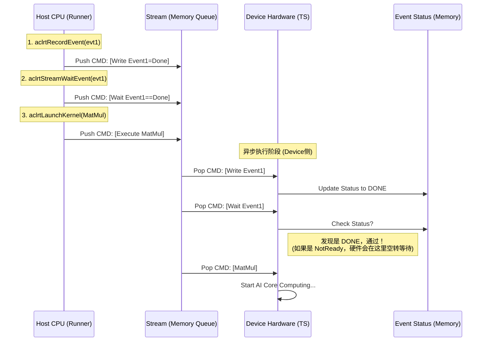
```mermaid

sequenceDiagram
    participant HostThread as Host CPU (Runner)
    participant StreamQueue as Stream (Memory Queue)
    participant DeviceScheduler as Device Hardware (TS)
    participant EventMem as Event Status (Memory)

    Note over HostThread: 1. aclrtRecordEvent(evt1)
    HostThread->>StreamQueue: Push CMD: [Write Event1=Done]

    Note over HostThread: 2. aclrtStreamWaitEvent(evt1)
    HostThread->>StreamQueue: Push CMD: [Wait Event1==Done]

    Note over HostThread: 3. aclrtLaunchKernel(MatMul)
    HostThread->>StreamQueue: Push CMD: [Execute MatMul]

    Note over DeviceScheduler: 异步执行阶段 (Device侧)

    StreamQueue->>DeviceScheduler: Pop CMD: [Write Event1]
    DeviceScheduler->>EventMem: Update Status to DONE

    StreamQueue->>DeviceScheduler: Pop CMD: [Wait Event1]
    DeviceScheduler->>EventMem: Check Status?
    Note right of DeviceScheduler: 发现是 DONE，通过！<br/>(如果是 NotReady，硬件会在这里空转等待)

    StreamQueue->>DeviceScheduler: Pop CMD: [MatMul]
    DeviceScheduler->>DeviceScheduler: Start AI Core Computing...
```

只要是塞进 Stream 里的东西，都是由 Device 硬件执行的。

## 2. Device、Context、Stream 等硬件资源关系建模

Device、Context、Stream 与用户主机线程之间的关系。通信域侧资源（Socket/RDMA/UB 接口）见 [§4 通信域建模](#4-通信域建模)。

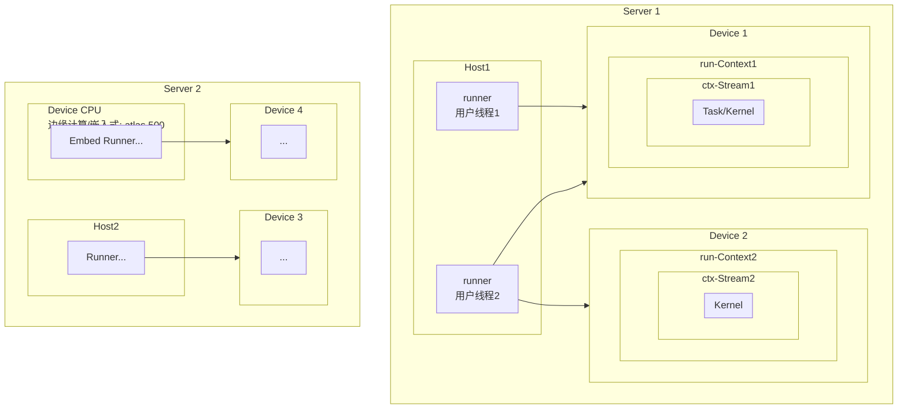
```mermaid
graph TD
    subgraph Server1[Server 1]
        Host1
        Device
        Device2
    end

    subgraph Server2[Server 2]
        Host3
        Host2
        Device3
        Device4

    end

    subgraph Host1[Host1]
        Runner1[runner<br>用户线程1]
        Runner2[runner<br>用户线程2]
    end

    subgraph Host2[Host2]
        Runner3[Runner...]
    end

    subgraph Host3[Device CPU<br>边缘计算/嵌入式: atlas 500]
        embedRunner[Embed Runner...]
    end

    subgraph Device[Device 1]
        Context1
    end

    subgraph Context1[run-Context1]
        Stream1
    end

    subgraph Stream1[ctx-Stream1]
        TaskKernel
    end

    subgraph TaskKernel[Task/Kernel]

    end

    subgraph Device2[Device 2]
        Context2
    end

    subgraph Context2[run-Context2]
        Stream2
    end

    subgraph Stream2[ctx-Stream2]
        Kernel
    end

    subgraph Kernel[Kernel]
    end

    subgraph Device3[Device 3]
        ctxM[...]
    end

    subgraph Device4[Device 4]
        ctxN[...]
    end

    Runner1-->Device
    Runner2-->Device
    Runner2-->Device2
    Runner3-->Device3
    embedRunner-->Device4

```

### 2.1 基础设备关系建模

#### 2.1.1 层次结构总览

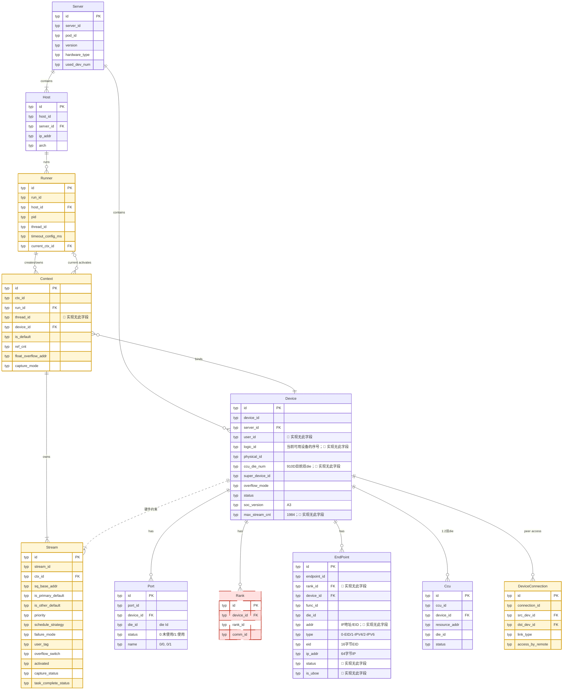
```mermaid
erDiagram
    %% ==========================================
    %% 第一层：物理拓扑层 (Server -> Host/Device)
    %% 🧠 可进程私有：Context / Stream / DeviceConnection（仅 src/proxy 访问，cmd 仅转储）
    %% ==========================================
    Server {
        typ id PK
        typ server_id
        typ pod_id
        typ version
        typ hardware_type
        typ used_dev_num
    }
    Host {
        typ id PK
        typ host_id
        typ server_id FK
        typ ip_addr
        typ arch
    }
    Device {
        typ id PK
        typ device_id
        typ server_id FK
        typ user_id "🚧 实现无此字段"
        typ logic_id "当前可用设备的序号；🚧 实现无此字段"
        typ physical_id
        typ ccu_die_num "910D目前双die；🚧 实现无此字段"
        typ super_device_id
        typ overflow_mode
        typ status
        typ soc_version "A3"
        typ max_stream_cnt "1984；🚧 实现无此字段"
    }
    %% 实现无 ccu_die_num（die 数见 §3.2）；max_stream_cnt 为能力值（aclrt_stream_stub.cc:287）
    Server ||--|{ Host : contains
    Server ||--o{ Device : contains

    %% ==========================================
    %% 第二层：进程与上下文层 (Runner -> Context -> Stream)
    %% ==========================================
    Runner {
        typ id PK
        typ run_id
        typ host_id FK
        typ pid
        typ thread_id
        typ timeout_config_ms
        typ current_ctx_id FK
    }
    Context {
        typ id PK
        typ ctx_id
        typ run_id FK
        typ thread_id "🚧 实现无此字段"
        typ device_id FK
        typ is_default
        typ ref_cnt
        typ float_overflow_addr
        typ capture_mode
    }
    %% Context 实现无 thread_id（线程字段是 Runner.thread_id）；ref_cnt 为实现的引用计数
    Stream {
        typ id PK
        typ stream_id
        typ ctx_id FK
        typ sq_base_addr
        typ is_primary_default
        typ is_other_default
        typ priority
        typ schedule_strategy
        typ failure_mode
        typ user_tag
        typ overflow_switch
        typ activated
        typ capture_status
        typ task_complete_status
    }
    Host ||--o{ Runner : runs
    Runner ||--o{ Context : "creates/owns"
    Runner |o--o{ Context : "current activates"
    Context }o--|| Device : binds
    Context ||--|{ Stream : owns
    Device ||..|{ Stream : "硬件约束"

    %% ==========================================
    %% 第三层：设备内部资源层 (Port/EndPoint/Ccu)
    %% ==========================================
    Port {
        typ id PK
        typ port_id
        typ device_id FK
        typ die_id "die Id"
        typ status "0:未使用/1:使用"
        typ name "0/0, 0/1"
    }
    Rank {
        typ id PK
        typ device_id FK
        typ rank_id
        typ comm_id
    }
    EndPoint {
        typ id PK
        typ endpoint_id
        typ rank_id FK "🚧 实现无此字段"
        typ device_id FK
        typ func_id
        typ die_id
        typ addr "IP地址/EID；🚧 实现无此字段"
        typ type "0-EID/1-IPV4/2-IPV6"
        typ eid "16字节EID"
        typ ip_addr "64字节IP"
        typ status "🚧 实现无此字段"
        typ is_uboe "🚧 实现无此字段"
    }
    Ccu {
        typ id PK
        typ ccu_id
        typ device_id FK
        typ resource_addr
        typ die_id
        typ status
    }
    DeviceConnection {
        typ id PK
        typ connection_id
        typ src_dev_id FK
        typ dst_dev_id FK
        typ link_type
        typ access_by_remote
    }
    Device ||--o{ Port : "has"
    Device ||--o{ Rank : "has"
    Device ||--o{ EndPoint : "has"
    Device ||--o{ Ccu : "1:2双die"
    Device ||--o{ DeviceConnection : "peer access"

    %% 图例：🟥 未实现（全仓无同名实体）　🟨 仅本进程/转储访问　无色 有跨进程消费
    classDef unimplemented fill:#ffe0e0,stroke:#c0392b,stroke-width:2px,stroke-dasharray:5 3
    classDef inproc fill:#fff6d6,stroke:#d4a017,stroke-width:2px
    class Rank unimplemented
    class Runner,Context,Stream,DeviceConnection inproc
```

#### 2.1.2 网络通信资源

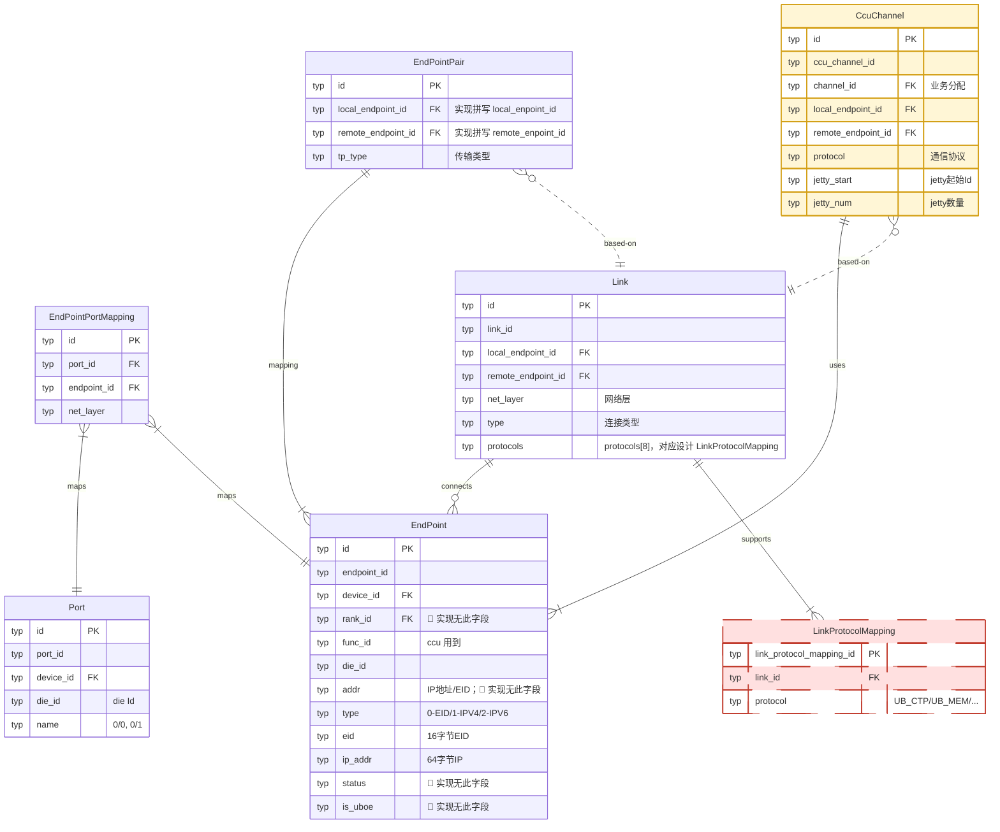
```mermaid
erDiagram
    %% ==========================================
    %% 网络拓扑与连接层
    %% CcuChannel：仅 cmd 转储访问，全仓无写入方（空表）
    %% ==========================================
    EndPoint {
        typ id PK
        typ endpoint_id
        typ device_id FK
        typ rank_id FK "🚧 实现无此字段"
        typ func_id "ccu 用到"
        typ die_id
        typ addr "IP地址/EID；🚧 实现无此字段"
        typ type "0-EID/1-IPV4/2-IPV6"
        typ eid "16字节EID"
        typ ip_addr "64字节IP"
        typ status "🚧 实现无此字段"
        typ is_uboe "🚧 实现无此字段"
    }
    Port {
        typ id PK
        typ port_id
        typ device_id FK
        typ die_id "die Id"
        typ name "0/0, 0/1"
    }
    EndPointPortMapping {
        typ id PK
        typ port_id FK
        typ endpoint_id FK
        typ net_layer
    }
    %% topo.json定义的物理连接
    Link {
        typ id PK
        typ link_id
        typ local_endpoint_id FK
        typ remote_endpoint_id FK
        typ net_layer "网络层"
        typ type "连接类型"
        typ protocols "protocols[8]，对应设计 LinkProtocolMapping"
    }
    LinkProtocolMapping {
        typ link_protocol_mapping_id PK
        typ link_id FK
        typ protocol "UB_CTP/UB_MEM/..."
    }

    EndPointPair {
        typ id PK
        typ local_endpoint_id FK "实现拼写 local_enpoint_id"
        typ remote_endpoint_id FK "实现拼写 remote_enpoint_id"
        typ tp_type "传输类型"
    }
    CcuChannel {
        typ id PK
        typ ccu_channel_id
        typ channel_id FK   "业务分配"
        typ local_endpoint_id FK
        typ remote_endpoint_id FK
        typ protocol "通信协议"
        typ jetty_start "jetty起始Id"
        typ jetty_num "jetty数量"
    }

    EndPointPortMapping }|--|| Port : maps
    EndPointPortMapping }|--|| EndPoint : maps
    Link ||--o{ EndPoint : connects
    Link ||--|{ LinkProtocolMapping : "supports"
    EndPointPair ||--|{ EndPoint : mapping
    EndPointPair }o..|| Link : "based-on"
    CcuChannel ||--|{ EndPoint : uses
    CcuChannel }o..|| Link : "based-on"

    classDef unimplemented fill:#ffe0e0,stroke:#c0392b,stroke-width:2px,stroke-dasharray:5 3
    classDef inproc fill:#fff6d6,stroke:#d4a017,stroke-width:2px
    class LinkProtocolMapping unimplemented
    class CcuChannel inproc
```

> `LinkProtocolMapping` 在实现中不是独立结构体/表，而是 `Link.protocols[8]` 数组字段（见 `include/runnerdb/sim_models.h`）—— 排障或建表时按数组字段处理，不要按本图拆独立表。

#### 2.1.3 关键关系说明

##### 第一层：物理拓扑层

| 关系 | 含义 | 说明/注意事项 |
| --- | --- | --- |
| Server → Host | 一个Server可能包含多个 Host 实例 | 比如多路 CPU 或虚拟化环境 |
| Server → Device | 一个Server包含多个 AI 设备 | 对应 /dev/davinci0, /dev/davinci1 等 |

##### 第二层：进程与上下文层

| 关系 | 含义 | 说明/注意事项 |
| --- | --- | --- |
| Host → Runner | 每个主机上有多个应用线程（Runner） | 每个 Runner 可以创建多个 Context |
| Runner → Context | 线程创建或切换到不同的 Context | 使用 aclrtCreateContext() 和 aclrtSetCurrentContext() |
| Context → Device | Context 绑定 Device | 一旦创建后不可跨设备 |
| Context → Stream | 每个 Context 可创建多个 Stream | 对应 aclrtCreateStream() |
| Runner ↔ Context (current) | 当前上下文激活状态 | aclrtGetCurrentContext()、aclrtSetCurrentContext() |
| Device .. Stream | 资源上限约束关系 | Stream 数量受硬件限制（`max_stream_cnt`，出处 `src/proxy/level2/aclrt_stream_stub.cc:244,287`） |

##### 第三层：设备内部资源层

| 关系 | 含义 | 说明/注意事项 |
| --- | --- | --- |
| Device → Port | 设备包含多个通信端口 | 用于网络拓扑连接，格式如 "0/0, 0/1" |
| Device → Rank | 设备关联通信Rank | Rank是通信域中的参与节点标识 |
| Device → EndPoint | 设备包含多个端点 | IP地址/EID寻址标识，用于网络通信 |
| Device → Ccu | 设备包含多个CCU单元 | 910D为双die架构，每个die一个CCU |
| Device → DeviceConnection | 设备间通信通道 | aclrtDeviceCanAccessPeer(), aclrtDeviceEnablePeerAccess() |

##### 网络通信资源层

| 关系 | 含义 | 说明/注意事项 |
| --- | --- | --- |
| EndPoint ↔ Port | 端点与端口映射 | 通过 EndPointPortMapping 实现多对多映射 |
| Link → EndPoint | 物理连接关联端点 | 由 topo.json 定义，描述物理拓扑 |
| Link → LinkProtocolMapping | 连接支持的协议 | 一个Link可支持多种协议（UB_CTP/UB_MEM等） |

#### 2.1.4 配套接口映射表

##### 基础与设备层 (Device / Server)

| 实体/属性                   | 关键API接口                                                                                          |
| --------------------------- | ---------------------------------------------------------------------------------------------------- |
| Server/Host                 | `aclInit`, `aclFinalize`                                                                             |
| Runner.pid                  | `rtDeviceGetBareTgid`                                                                                |
| Device                      | `rtGetDeviceCount`                                                                                   |
| Device.id             | `rtSetDevice`,`rtResetDevice`,`rtGetDevice`,`rtsGetLogicDevIdByPhyDevId`                             |
| Device.id          | `rtGetPhyDevIdByLogicDevId`                                                                          |
| Device.name             | `rtGetSocName`                                                                                       |
| Device.mode        | `rtSetDeviceSatMode`,`rtGetDeviceSatMode`                                                            |
| DeviceConnection            | `rtGetDevicesTopo`,`rtDeviceDisablePeerAccess`,`rtDeviceEnablePeerAccess`,`rtDevicePeerAccessStatus` |
| Context.id          | `rtCreateContext`,`rtDestroyContext`                                                                 |
| Context.default          | `rtSetCurrentContext`,`rtGetCurrentContext`                                                          |
| Context.addr | `rtCtxGetFloatOverflowAddr`                                                                          |
| Stream表                    | `aclrtGetStreamAvailableNum`                                                                         |
| Stream.id            | `rtCreateStream`,`rtCreateStreamWithConfig`,`rtDestroyStream`,`rtDestroyStreamForce`                 |
| Stream.status | `rtSynchronizeStream`, `rtSynchronizeStreamWithTimeout`                                              |
| Stream.activated            | `rtStreamStop`                                                                                       |
| Stream.mode         | `rtSetStreamAttribute`,`rtGetStreamAttribute`                                                        |

### 2.2 基础内存管理关系建模

本机内存块与远端内存导入（`RaCtxLmemRegister` / `RaCtxRmemImport`）对应接口见 [§4.1.4 数据面：UB统一总线](#414-数据面ub统一总线)。

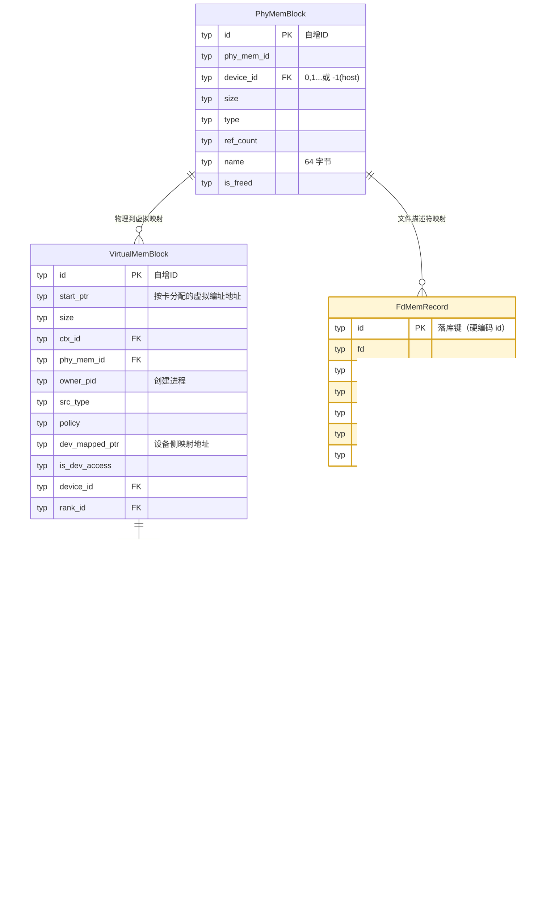
```mermaid
erDiagram
    %% 🧠 可进程私有：IpcMemRecord / IpcMemWhiteList / FdMemWhiteList（仅 src/proxy 访问）
    %% FdMemRecord 仅 cmd 转储、无写入方（空表）
    PhyMemBlock ||--o{ VirtualMemBlock : "物理到虚拟映射"
    PhyMemBlock ||--o{ FdMemRecord : "文件描述符映射"
    PhyMemBlock {
        typ id PK "自增ID"
        typ phy_mem_id
        typ device_id FK "0,1...或 -1(host)"
        typ size
        typ type
        typ ref_count
        typ name "64 字节"
        typ is_freed
    }

    VirtualMemBlock {
        typ id PK "自增ID"
        typ start_ptr "按卡分配的虚拟编址地址"
        typ size
        typ ctx_id FK
        typ phy_mem_id FK
        typ owner_pid "创建进程"
        typ src_type ""
        typ policy
        typ dev_mapped_ptr "设备侧映射地址"
        typ is_dev_access
        typ device_id FK
        typ rank_id FK
    }

    VirtualMemBlock ||--o{ IpcMemRecord : "共享内存注册"
    IpcMemRecord {
        typ id PK
        typ ipc_id
        typ vir_mem_id FK
        typ phy_mem_id FK "🚧 实现无此字段"
        typ name_or_key "🚧 实现无此字段"
        typ create_pid
        typ offset
    }

    IpcMemRecord ||--o{ IpcMemWhiteList : "进程白名单"
    IpcMemWhiteList {
        typ id PK
        typ name_or_key "承载原设计 ipc_id：存 IpcMemRecord 索引"
        typ pid
        typ create_pid
    }

    FdMemRecord {
        typ id PK "落库键（硬编码 id）"
        typ fd
        typ phy_mem_id FK
        typ name "🚧 实现无此字段"
        typ type "🚧 实现无此字段"
        typ vir_mem_id FK
        typ create_pid
    }

    FdMemRecord ||--o{ FdMemWhiteList : "进程白名单"
    FdMemWhiteList {
        typ id PK
        typ name_or_key "承载原设计 fd_id：存 shareableHandle"
        typ pid
        typ create_pid
    }

    %%VirtualMemBlock ||--o{ MemMapRecord : "映射关系"
    %%MemMapRecord {
    %%    typ ptr FK
    %%    typ phy_mem_id FK
    %%}

    classDef inproc fill:#fff6d6,stroke:#d4a017,stroke-width:2px
    class IpcMemRecord,IpcMemWhiteList,FdMemRecord,FdMemWhiteList inproc
```

> **落库表名**：本图实体在实现中落到 `include/runnerdb/db_sim_sqlite_db.h` 注册的表，查库/改表时以表名为准 —— `PhyMemBlock`→`PhMem`、`VirtualMemBlock`→`VirMem`、`IpcMemWhiteList`→`IpMemWhiteList`；字段名对照 `include/runnerdb/sim_models.h`。

#### 2.2.1 关键关系说明（基础内存管理关系建模）

1. **物理内存核心地位**。
   `PhyMemBlock`作为基础实体，通过`phy_mem_id`与所有其他实体关联，体现华为昇腾"物理内存池化"的设计理念。
2. **三层映射体系**：

   - 物理→虚拟（`VirtualMemBlock`）
   - 物理→IPC共享（`IpcMemRecord`）
   - 物理→文件描述符（`fdMemRecord`）
3. **安全控制**：
   `IpcMemWhiteList`通过进程PID白名单机制实现华为HCCS（Huawei Collective Communication Service）的安全共享。
4. **特殊映射类型**：
   `MemMapRecord`记录双虚拟地址映射场景（如`aclrtMapMem`产生的映射），支持华为NPU的零拷贝数据传输。

#### 2.2.2 配套接口映射表（基础内存管理关系建模）

| 实体                           | 关键管理接口                                                                                                                                    |
| ------------------------------ | ----------------------------------------------------------------------------------------------------------------------------------------------- |
| PhyMemBlock                    | `rtMallocPhysical`, `rtFreePhysical`                                                                                                            |
| VirtualMemBlock            | `rtMallocWithCfg`,`rtMallocForTaskScheduler`,`rtMallocHostWithCfg`,`rtFree`,`rtReserveMemAddress`,`ReleaseMemAddress`, `rtMapMem`, `rtUnmapMem` |
| VirtualMemBlock.ctx_id | `rtPointerGetAttributes`                                                                                                                        |
| FdMemRecord.fd                 | `rtMemExportToShareableHandle`, `rtMemImportFromShareableHandle`                                                                                |
| FdMemWhiteList.pid             | `rtMemSetPidToShareableHandle`                                                                                                                  |
| IpcMemRecord.name_or_key       | `rtIpcMemGetExportKey`                                                                                                                          |
| IpcMemRecord.id            | `rtIpcMemImportByKey`,`IpcMemClose`                                                                                                             |
| IpcMemWhiteList.pid            | `rtIpcMemSetImportPid`                                                                                                                          |
| MemMapRecord                   | `rtHostRegister`, `rtHostUnRegister`                                                                                                            |

## 3. 在基础模型上扩展数据任务模型

### 3.1 数据 / 任务流建模

任务（Task）在 Stream 上的排布关系；Task 家族在实现中由 `Task` / `EventSyncTask` 承载，同步原语见 [§3.3 异步 / 同步执行建模](#33-异步--同步执行建模)。

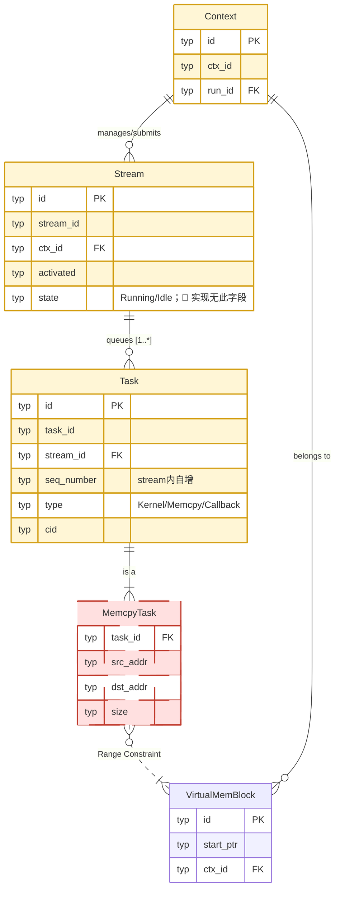
```mermaid
erDiagram
    Context {
        typ id PK
        typ ctx_id
        typ run_id FK
    }

    Stream {
        typ id PK
        typ stream_id
        typ ctx_id FK
        typ activated
        typ state "Running/Idle；🚧 实现无此字段"
    }
    %% 实现无 state 字段；运行态由 activated/capture_status/task_complete_status 表达

    %% Stream 包含有序的任务列表
    Context ||--o{ Stream : "manages/submits"
    Stream ||--o{ Task : "queues [1..*]"

    Task {
        typ id PK
        typ task_id
        typ stream_id FK
        typ seq_number "stream内自增"
        typ type "Kernel/Memcpy/Callback"
        typ cid
    }

    %% 各种具体的 Task 类型 (逻辑上的继承关系)
    MemcpyTask {
        typ task_id FK
        typ src_addr
        typ dst_addr
        typ size
    }

    %% 继承关系的逻辑表达 (Task 分为多种)
    %% 🧠 可进程私有：Context / Stream / Task（仅 src/proxy 访问）
    %% MemcpyTask 由 Task.type 判别（实现只建 Task 表）
    Task ||--|{ MemcpyTask : "is a"

    %% MemcpyTask 的地址应该在 VirtualMemBlock 可寻址
    MemcpyTask }o..|{ VirtualMemBlock : "Range Constraint"
    VirtualMemBlock {
        typ id PK
        typ start_ptr
        typ ctx_id FK
    }

    VirtualMemBlock }o--|| Context : "belongs to"

    classDef unimplemented fill:#ffe0e0,stroke:#c0392b,stroke-width:2px,stroke-dasharray:5 3
    classDef inproc fill:#fff6d6,stroke:#d4a017,stroke-width:2px
    class MemcpyTask unimplemented
    class Context,Stream,Task inproc

```

### 3.2 ccu资源建模

一个NPU device包含2个CCU，分别为die0和die1。CCU 的 die 级硬件同步资源（Notify）见 [§3.3.1 Notify资源管理](#331-notify资源管理)；UB 侧上下文接口见 [§4.1.4 数据面：UB统一总线](#414-数据面ub统一总线)。

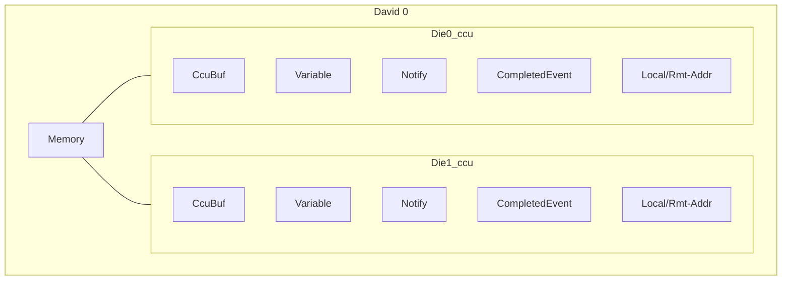
```mermaid
graph RL
    subgraph DavidDevice0[David 0]
        direction RL
        Memory0[Memory]
        David0Die0[Die0_ccu]
        David0Die1[Die1_ccu]
    end

    subgraph David0Die0[Die0_ccu]

        CcuBuf00[CcuBuf]
        Variable00[Variable]
        Notify00[Notify]
        CompletedEvent00[CompletedEvent]
        Local/Rmt-Addr00[Local/Rmt-Addr]
    end

    subgraph David0Die1[Die1_ccu]

        CcuBuf01[CcuBuf]
        Variable01[Variable]
        Notify01[Notify]
        CompletedEvent01[CompletedEvent]
        Local/Rmt-Addr01[Local/Rmt-Addr]
    end

    David0Die0---Memory0
    David0Die1---Memory0

```

#### 3.2.1 配套接口映射表（ccu资源建模）

| 实体               | 关键管理接口                                             |
| ------------------ | -------------------------------------------------------- |
| CcuBuf             | `rtCcuBufAlloc`, `rtCcuBufFree`, `rtCcuBufGetAddr`       |
| Variable           | `rtVariableCreate`, `rtVariableDestroy`, `rtVariableSet` |
| Notify             | `rtCreateNotify`, `rtDestroyNotify`                      |
| CompletedEvent     | `rtCreateEvent`, `rtDestroyEvent`                        |
| Local/Rmt-Addr     | `rtGetDeviceLocalAddr`, `rtGetDeviceRemoteAddr`          |
| CCU资源查询        | `rtGetCcudieInfo`, `rtGetCcudieNum`                      |

#### 3.2.2 CCU资源生命周期说明

**CCU初始化流程**：

1. Device启动时，两个CCU（die0/die1）自动初始化。
2. 每个CCU分配独立的CcuBuf、Variable、Notify资源池。
3. CompletedEvent用于通知任务完成状态。

**资源约束**：

- 每个CCU的CcuBuf数量有限（与Device.version相关）
- Variable用于存储通信过程中的共享变量。
- Notify用于跨CCU的同步通知机制。
- Local/Rmt-Addr用于跨die通信时的地址转换。

> 注：此处 CCU 内部的 Notify 是 die 级硬件同步资源（hcomm 侧概念）；与 §3.3.1 中由 `rtCreateNotify` 管理的 `Notify` 实体（Device/Context 级、落库表 `sim::Notify`：`create_ctx_id` + `device_notify_seq`）不是同一实体。

### 3.3 异步 / 同步执行建模

#### 3.3.1 [Notify资源管理](https://www.hiascend.com/document/detail/zh/CANNCommunityEdition/850alpha001/appdevg/acldevg/aclcppdevg_000524.html)

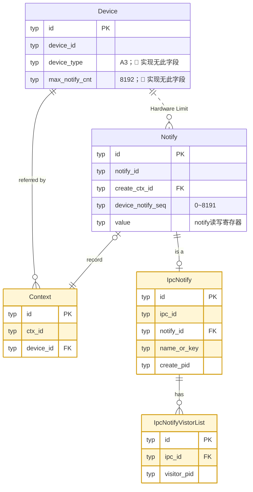
```mermaid
erDiagram
    %% 🧠 可进程私有：Context / IpcNotify / IpcNotifyVistorList（仅 src/proxy 访问）
    Device ||..o{ Notify : "Hardware Limit"
    Device ||--o{ Context : "referred by"
    Device {
        typ id PK
        typ device_id
        typ device_type "A3；🚧 实现无此字段"
        typ max_notify_cnt "8192；🚧 实现无此字段"
    }
    Context {
        typ id PK
        typ ctx_id
        typ device_id FK
    }

    %% IpcNotify：与 Notify 同源的 IPC 共享通知，实现未单独建模
    Notify o|--|| Context : "record"
    Notify {
        typ id PK
        typ notify_id
        typ create_ctx_id FK
        typ device_notify_seq "0~8191"
        typ value "notify读写寄存器"
    }

    IpcNotify {
        typ id PK
        typ ipc_id
        typ notify_id FK
        typ name_or_key
        typ create_pid
    }

    Notify ||--o| IpcNotify : "is a"
    IpcNotify ||--o{ IpcNotifyVistorList : "has"
    IpcNotifyVistorList {
        typ id PK
        typ ipc_id FK
        typ visitor_pid
    }

    classDef inproc fill:#fff6d6,stroke:#d4a017,stroke-width:2px
    class Context,IpcNotify,IpcNotifyVistorList inproc
```

##### 关键关系说明（[Notify资源管理](https://www.hiascend.com/document/detail/zh/CANNCommunityEdition/850alpha001/appdevg/acldevg/aclcppdevg_000524.html)）

**Notify与Device的硬件约束**：

- 每个Device的Notify数量上限为`max_notify_cnt`（如A3芯片为8192，出处 `src/plugin/runner/runner_utils/device_resource.h:22 MAX_NOTIFY_NUM`）
- `device_notify_seq`是Notify在Device内的物理序号（0~8191）
- Notify创建时必须指定所属Context，Context绑定到特定Device。

**Notify的IPC共享机制**：

- `IpcNotify`允许跨进程共享Notify实例。
- `name_or_key`是共享标识，通过`rtNotifyGetExportKey`获取。
- 其他进程通过`rtNotifyImportByKey`导入并使用。
- `IpcNotifyVistorList`记录有权访问该Notify的进程PID。

**Notify状态管理**：

- `value`字段映射到硬件寄存器，用于读写状态。
- `rtWaitAndResetNotify`等待Notify变为Ready状态并重置。
- Notify用于Stream间同步、跨进程同步场景。

##### 配套接口映射表（[Notify资源管理](https://www.hiascend.com/document/detail/zh/CANNCommunityEdition/850alpha001/appdevg/acldevg/aclcppdevg_000524.html)）

| 实体                       | 关键管理接口                                        |
| -------------------------- | --------------------------------------------------- |
| Notify.id           | `rtCreateNotify`,`rtDestroyNotify`，`rtGetNotifyId` |
| Notify.value               | `lrtWaitAndResetNotify`, `rtWaitAndResetNotify`     |
| IpcNotify.name_or_key      | `rtNotifyGetExportKey`,`rtNotifyImportByKey`        |
| IpcNotifyVistorList.ipc_id | `rtNotifySetImportPid`                              |

#### 3.3.2 Notify同步控制

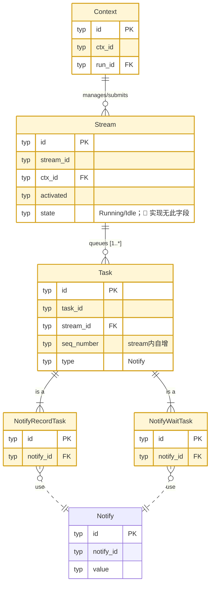
```mermaid
erDiagram
    Context {
        typ id PK
        typ ctx_id
        typ run_id FK
    }

    Stream {
        typ id PK
        typ stream_id
        typ ctx_id FK
        typ activated
        typ state "Running/Idle；🚧 实现无此字段"
    }
    %% 实现无 state 字段；运行态由 activated/capture_status/task_complete_status 表达

    %% Stream 包含有序的任务列表
    Context ||--o{ Stream : "manages/submits"
    Stream ||--o{ Task : "queues [1..*]"

    Task {
        typ id PK
        typ task_id
        typ stream_id FK
        typ seq_number "stream内自增"
        typ type "Notify"
    }

    %% 各种具体的 Task 类型 (逻辑上的继承关系)
    NotifyRecordTask {
        typ id PK
        typ notify_id FK

    }

    NotifyWaitTask {
        typ id PK
        typ notify_id FK
    }

    NotifyRecordTask }o..|| Notify : "use"
    NotifyWaitTask }o..|| Notify : "use"
    Notify {
        typ id PK
        typ notify_id
        typ value
    }
    %% 继承关系的逻辑表达 (Task 分为多种)
    %% 🧠 可进程私有：Context / Stream / Task（仅 src/proxy 访问）
    %% NotifyRecordTask/NotifyWaitTask 由 Task.type 判别（实现只建 Task 表）
    Task ||--|{ NotifyRecordTask : "is a"
    Task ||--|{ NotifyWaitTask : "is a"

    classDef inproc fill:#fff6d6,stroke:#d4a017,stroke-width:2px
    class Context,Stream,Task,NotifyRecordTask,NotifyWaitTask inproc
```

##### 关键关系说明（Notify同步控制）

**Notify任务类型**：

- `NotifyRecordTask`：将Notify状态设置为Ready，表示某个事件已完成。
- `NotifyWaitTask`：等待Notify状态变为Ready，实现Stream间的同步。

**任务执行顺序**：

- NotifyRecordTask在StreamA执行，设置Notify为Ready。
- NotifyWaitTask在StreamB执行，等待同一个Notify。
- 当Notify变为Ready后，StreamB后续任务才能继续执行。

**跨Stream同步示例**：

```text
StreamA: Task1 -> NotifyRecordTask(notify_id=1) -> Task2
StreamB: NotifyWaitTask(notify_id=1) -> Task3
// Task3必须等待Task1完成后才能执行
```

##### 配套接口映射表（Notify同步控制）

| 实体             | 关键管理接口            |
| ---------------- | ----------------------- |
| NotifyRecordTask | `rtRecordNotify`        |
| NotifyWaitTask   | `lrtWaitAndResetNotify` |

#### 3.3.3 Event资源管理

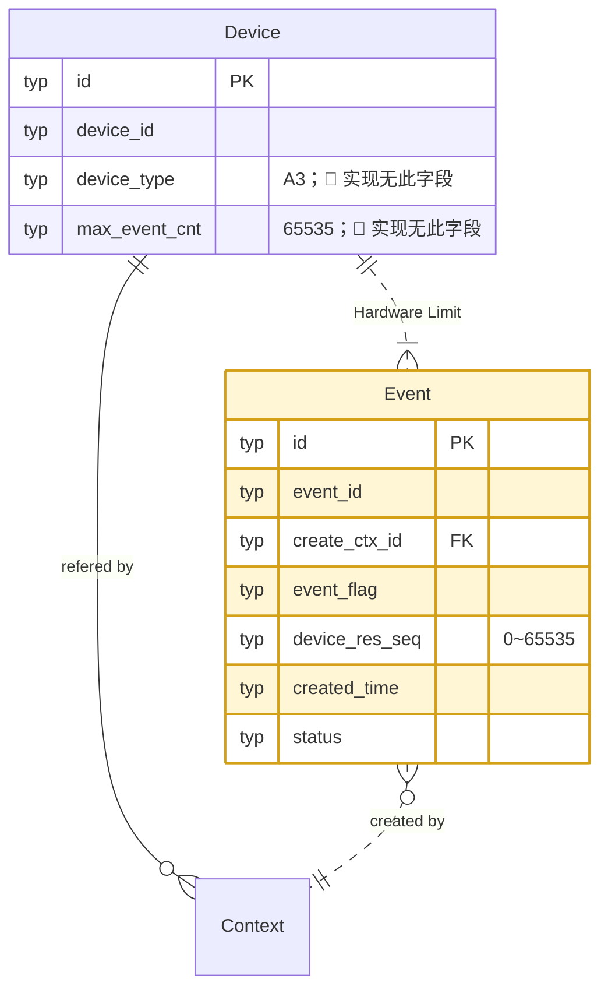
```mermaid
erDiagram
    %% 🧠 可进程私有：Event（仅 src/proxy 访问）
    Device ||..|{ Event : "Hardware Limit"
    Device ||--o{ Context : "refered by"
    Device {
        typ id PK
        typ device_id
        typ device_type "A3；🚧 实现无此字段"
        typ max_event_cnt "65535；🚧 实现无此字段"
    }

    Event }o..|| Context : "created by"
    Event {
        typ id PK
        typ event_id
        typ create_ctx_id FK
        typ event_flag
        typ device_res_seq "0~65535"
        typ created_time
        typ status
    }

    classDef inproc fill:#fff6d6,stroke:#d4a017,stroke-width:2px
    class Event inproc
```

##### 关键关系说明（Event资源管理）

**Event与Device的硬件约束**：

- 每个Device的Event数量上限为`max_event_cnt`（如A3芯片为65535，出处 `src/proxy/level2/aclrt_event_stub.cc:191,220`）
- `device_res_seq`是Event在Device内的物理序号（0~65535）
- Event创建时必须指定所属Context，Context绑定到特定Device。

**Event与Context的关系**：

- `create_ctx_id`记录Event的创建Context。
- Event可在多个Stream间共享，但必须属于同一Context。
- 跨Context的Event共享需要通过IPC机制（类似Notify）

**Event状态管理**：

- `status`字段表示Event当前状态：NotRecorded/Recorded/Completed。
- `event_flag`用于控制Event的行为（如是否自动重置）
- `created_time`用于性能统计。

##### 配套接口映射表（Event资源管理）

| 实体           | 关键管理接口                                                             |
| -------------- | ------------------------------------------------------------------------ |
| Event.id | `rtCreateEvent`, `rtCreateEventWithFlag`,`rtDestroyEvent`,`rtGetEventId` |
| Event.status   | `rtRecordEvent`,`rtQueryEventStatus`                                     |

#### 3.3.4 Event 流程控制

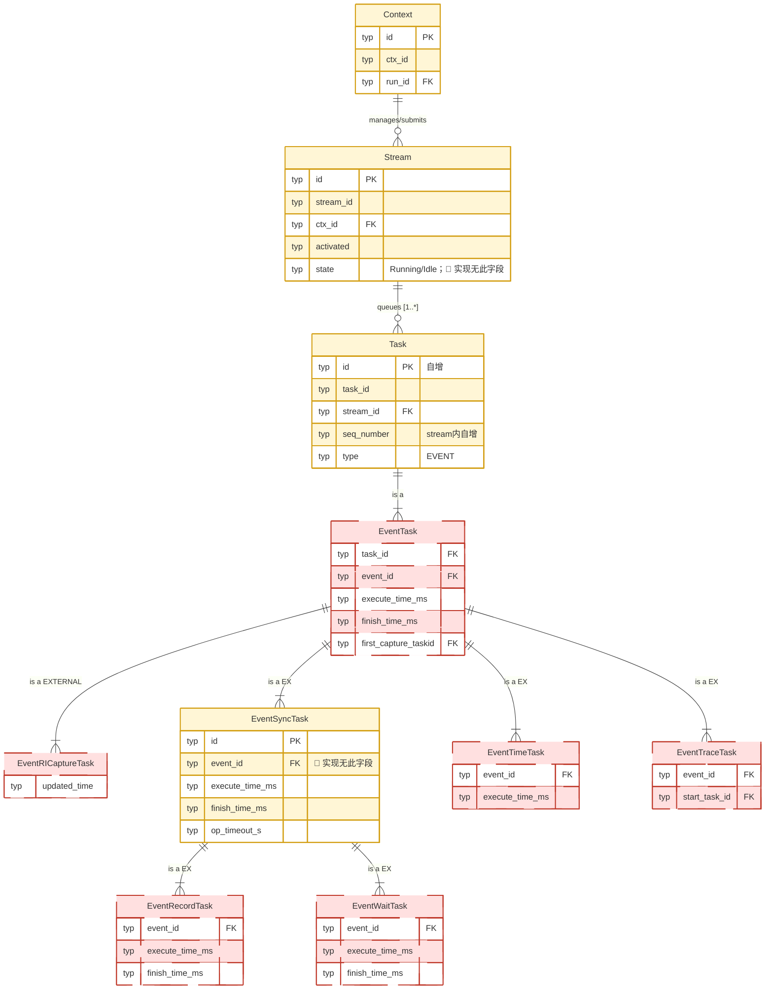
```mermaid
erDiagram
    Context {
        typ id PK
        typ ctx_id
        typ run_id FK
    }

    Stream {
        typ id PK
        typ stream_id
        typ ctx_id FK
        typ activated
        typ state "Running/Idle；🚧 实现无此字段"
    }
    %% 实现无 state 字段；运行态由 activated/capture_status/task_complete_status 表达

    %% Stream 包含有序的任务列表
    Context ||--o{ Stream : "manages/submits"
    Stream ||--o{ Task : "queues [1..*]"

    Task {
        typ id PK "自增"
        typ task_id
        typ stream_id FK
        typ seq_number "stream内自增"
        typ type "EVENT"
    }

    %% 各种具体的 Task 类型 (逻辑上的继承关系)
    EventTask {
        typ task_id FK
        typ event_id FK
        typ execute_time_ms
        typ finish_time_ms
        typ first_capture_taskid FK
    }

    EventRICaptureTask {
        typ updated_time
    }

    EventSyncTask {
        typ id PK
        typ event_id FK "🚧 实现无此字段"
        typ execute_time_ms
        typ finish_time_ms
        typ op_timeout_s
    }
    EventRecordTask {
        typ event_id FK
        typ execute_time_ms
        typ finish_time_ms
    }
    EventWaitTask {
        typ event_id FK
        typ execute_time_ms
        typ finish_time_ms
    }
    EventTimeTask {
        typ event_id FK
        typ execute_time_ms
    }
    EventTraceTask {
        typ event_id FK
        typ start_task_id FK
    }

    %% 🧠 可进程私有：Context / Stream / Task（仅 src/proxy 访问）
    %% 继承关系的逻辑表达 (Task 分为多种)：以 Task.type 判别，实现只建 Task 表
    Task ||--|{ EventTask : "is a "
    EventTask ||--|{ EventRICaptureTask : "is a EXTERNAL"
    EventTask ||--|{ EventSyncTask : "is a EX"
    EventTask ||--|{ EventTimeTask : "is a EX"
    EventTask ||--|{ EventTraceTask : "is a EX"
    EventSyncTask ||--|{ EventRecordTask : "is a EX"
    EventSyncTask ||--|{ EventWaitTask : "is a EX"

    classDef unimplemented fill:#ffe0e0,stroke:#c0392b,stroke-width:2px,stroke-dasharray:5 3
    classDef inproc fill:#fff6d6,stroke:#d4a017,stroke-width:2px
    class EventTask,EventRICaptureTask,EventRecordTask,EventWaitTask,EventTimeTask,EventTraceTask unimplemented
    class Context,Stream,Task,EventSyncTask inproc
```

##### 关键关系说明（Event 流程控制）

**Event任务类型分类**：

- `EventRecordTask`：将Event状态设置为Recorded/Completed。
- `EventWaitTask`：等待Event状态变为Completed。
- `EventSyncTask`：同步等待Event完成（阻塞调用）
- `EventRICaptureTask`：RI Capture模式下的特殊记录任务。
- `EventTimeTask`：记录时间戳相关任务。
- `EventTraceTask`：用于性能追踪的任务记录。

**Event任务继承关系**：

- `EventTask`是基类，包含 task-id、event-id、execute-time、finish-time。🚧（实现 `EventSyncTask` 无 `task_id`/`event_id`，Event 身份即 `Event.id`；时间字段实现名为 `execute_time_ms`/`finish_time_ms`）
- `EventSyncTask`继承EventTask，增加op_timeout_s超时参数。
- `EventRecordTask`和`EventWaitTask`继承EventSyncTask。
- `EventRICaptureTask`、`EventTimeTask`、`EventTraceTask`直接继承EventTask。

**Event执行流程**：

```text
StreamA: KernelTask -> EventRecordTask(event_id=1)
StreamB: EventWaitTask(event_id=1) -> KernelTask2
// StreamB的KernelTask2必须等待StreamA的KernelTask完成
```

**任务追踪关系**：

- `first_capture_task_id`记录首次Capture的Task ID。
- `EventTraceTask.id`关联追踪的开始任务。
- EventRecordTask通过EventWaitTask映射实现跨Stream同步。

##### 配套接口映射表（Event 流程控制）

| 实体            | 关键管理接口                                         |
| --------------- | ---------------------------------------------------- |
| EventTask       | `rtRecordEvent`, `rtResetEvent`,`rtSynchronizeEvent` |
| EventRecordTask | `rtRecordEvent`, `rtResetEvent`                      |
| EventWaitTask   | `rtStreamWaitEvent`, `rtQueryEventWaitStatus`        |
| EventTimeTask   | `rtResetEvent`, `rtRecordEvent`                      |
| EventTraceTask  | `rtResetEvent`, `rtRecordEvent`                      |

## 4. 通信域建模

跨机通信涉及到多通信域混合任务编排。
通信域的本质是HCCL在框架层通过Rdma_Agent提供的建链能力，维护的一张多卡的网络拓扑，保存在host进程中。各平面接口清单见 [§4.1.8 HCCP接口分类](#418-hccp接口分类)。

### 4.1 通信域核心概念

通信域（Communicator）是HCCL集合通信的基本抽象，每个通信域定义了一组参与通信的Rank及其拓扑关系。Rank / EndPoint 的实体建模见 [§2.1.2 网络通信资源](#212-网络通信资源)。

#### 4.1.1 通信域基础定义

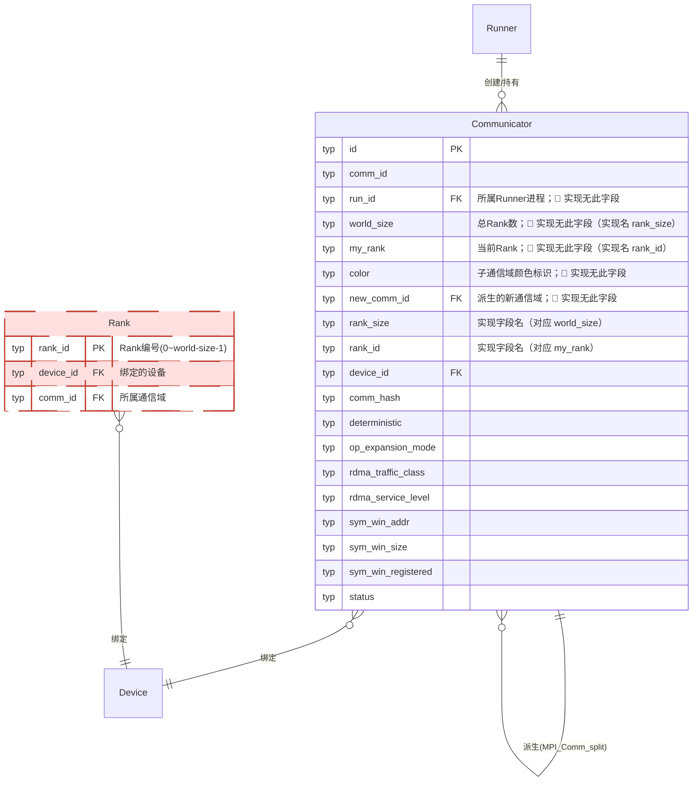
```mermaid
erDiagram
    %% ==========================================
    %% 通信域定义 (HCCL Communicator)
    %% ==========================================
    Communicator {
        typ id PK
        typ comm_id
        typ run_id FK "所属Runner进程；🚧 实现无此字段"
        typ world_size "总Rank数；🚧 实现无此字段（实现名 rank_size）"
        typ my_rank "当前Rank；🚧 实现无此字段（实现名 rank_id）"
        typ color "子通信域颜色标识；🚧 实现无此字段"
        typ new_comm_id FK "派生的新通信域；🚧 实现无此字段"
        typ rank_size "实现字段名（对应 world_size）"
        typ rank_id "实现字段名（对应 my_rank）"
        typ device_id FK
        typ comm_hash
        typ deterministic
        typ op_expansion_mode
        typ rdma_traffic_class
        typ rdma_service_level
        typ sym_win_addr
        typ sym_win_size
        typ sym_win_registered
        typ status
    }
    Rank {
        typ rank_id PK "Rank编号(0~world-size-1)"
        typ device_id FK "绑定的设备"
        typ comm_id FK "所属通信域"
    }
    Runner ||--o{ Communicator : "创建/持有"
    Communicator }o--|| Device : "绑定"
    Rank }o--|| Device : "绑定"
    Communicator ||--o{ Communicator : "派生(MPI_Comm_split)"

    classDef unimplemented fill:#ffe0e0,stroke:#c0392b,stroke-width:2px,stroke-dasharray:5 3
    class Rank unimplemented
```

#### 4.1.2 控制面：Socket通信

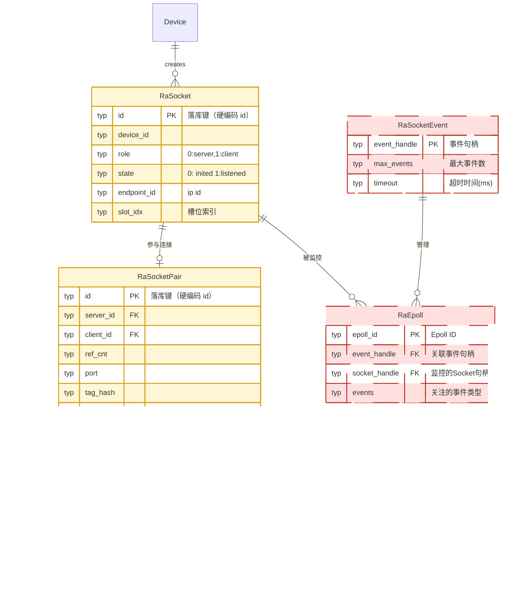
```mermaid
erDiagram
    %% ==========================================
    %% Socket通信 (RaSocket 系列接口)
    %% 🧠 可进程私有：RaSocketPair（仅 src/proxy 访问；同节 RaSocket 为 🧊）
    %% 🧊 RaSocket 表：全仓零引用（仅注册、无读写）——不需要落库
    %% ==========================================
    Device ||--o{ RaSocket : creates
    %% 🧊 零引用表：仅有结构体与注册项，无任何库读写
    RaSocket {
        typ id PK "落库键（硬编码 id）"
        typ device_id
        typ role "0:server,1:client"
        typ state "0: inited 1:listened"
        typ endpoint_id "ip id"
        typ slot_idx "槽位索引"
    }
    RaSocketPair {
        typ id PK "落库键（硬编码 id）"
        typ server_id FK
        typ client_id FK
        typ ref_cnt
        typ port
        typ tag_hash
        typ buf_status "0: buffer pending, 1: buffer ready"
        typ slot_idx "槽位索引"
    }
    RaSocket ||--o| RaSocketPair : "参与连接"
    RaSocketPair }o--|| CommMemSlot : "关联通信内存(slot_idx)"

    %% store 层通信内存池：mmap 共享内存按槽位划分（store_sim_comm_memory_manager.h），非 RunnerDB 注册表
    CommMemSlot {
        typ slot_idx PK "槽位索引（RaSocketPair.slot_idx；建连 AllocSlot、断连 CloseSlot）"
        typ ref_cnt "引用计数（同一槽位可被多个连接对共享，AddRef）"
        typ c2s_size "client→server 已写入字节数（Send/Recv）"
        typ s2c_size "server→client 已写入字节数（Send/Recv）"
    }

    %% Socket事件管理 (Epoll机制)
    RaSocketEvent {
        typ event_handle PK "事件句柄"
        typ max_events "最大事件数"
        typ timeout "超时时间(ms)"
    }
    RaEpoll {
        typ epoll_id PK "Epoll ID"
        typ event_handle FK "关联事件句柄"
        typ socket_handle FK "监控的Socket句柄"
        typ events "关注的事件类型"
    }
    RaSocketEvent ||--o{ RaEpoll : "管理"
    RaSocket ||--o{ RaEpoll : "被监控"

    classDef unimplemented fill:#ffe0e0,stroke:#c0392b,stroke-width:2px,stroke-dasharray:5 3
    classDef inproc fill:#fff6d6,stroke:#d4a017,stroke-width:2px
    class CommMemSlot,RaSocketEvent,RaEpoll unimplemented
    class RaSocket,RaSocketPair inproc
```

#### 4.1.3 数据面：RDMA通信

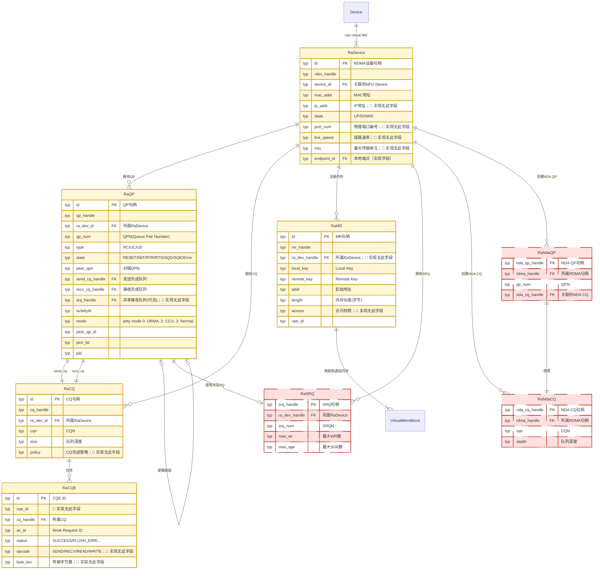
```mermaid
erDiagram
    %% ==========================================
    %% RDMA设备与资源 (RaRdev, RaQp, RaMr 接口)
    %% 🧠 可进程私有：RaQP / RaCQ / RaCQE / RaMR / RaDevice（仅 src/proxy 访问；RaQP 有对端过滤）
    %% ==========================================
    Device ||--|{ RaDevice : "has virtual NIC"
    RaDevice {
        typ id PK "RDMA设备句柄"
        typ rdev_handle
        typ device_id FK "关联的NPU Device"
        typ mac_addr "MAC地址"
        typ ip_addr "IP地址；🚧 实现无此字段"
        typ state "UP/DOWN"
        typ port_num "物理端口编号；🚧 实现无此字段"
        typ link_speed "链路速率；🚧 实现无此字段"
        typ mtu "最大传输单元；🚧 实现无此字段"
        typ endpoint_id FK "本地端点（实现字段）"
    }

    %% RDMA核心：QP (Queue Pair)
    RaQP {
        typ id PK "QP句柄"
        typ qp_handle
        typ ra_dev_id FK "所属RaDevice"
        typ qp_num "QPN(Queue Pair Number)"
        typ type "RC/UC/UD"
        typ state "RESET/INIT/RTR/RTS/SQD/SQE/Error"
        typ peer_qpn "对端QPN"
        typ send_cq_handle FK "发送完成队列"
        typ recv_cq_handle FK "接收完成队列"
        typ srq_handle FK "共享接收队列(可选)；🚧 实现无此字段"
        typ taJettyId
        typ mode "jetty mode 0: URMA, 2: CCU, 3: Normal"
        typ peer_qp_id
        typ perr_lid
        typ pid
    }
    RaDevice ||--o{ RaQP : "拥有QP"
    RaQP ||--|| RaCQ : "send_cq"
    RaQP ||--|| RaCQ : "recv_cq"
    RaQP |o--o| RaQP : "逻辑链接"
    RaQP ||--o| RaSRQ : "使用共享RQ"

    %% 完成队列 CQ
    RaCQ {
        typ id PK "CQ句柄"
        typ cq_handle
        typ ra_dev_id FK "所属RaDevice"
        typ cqn "CQN"
        typ size "队列深度"
        typ policy "CQ完成策略；🚧 实现无此字段"
    }
    RaCQE {
        typ id PK "CQE ID"
        typ cqe_id "🚧 实现无此字段"
        typ cq_handle FK "所属CQ"
        typ wr_id "Work Request ID"
        typ status "SUCCESS/FLUSH_ERR/..."
        typ opcode "SEND/RECV/READ/WRITE；🚧 实现无此字段"
        typ byte_len "传输字节数；🚧 实现无此字段"
    }
    RaDevice ||--o{ RaCQ : "拥有CQ"
    RaCQ ||--o{ RaCQE : "包含"

    %% 内存注册 MR
    RaMR {
        typ id PK "MR句柄"
        typ mr_handle
        typ ra_dev_handle FK "所属RaDevice；🚧 实现无此字段"
        typ local_key "Local Key"
        typ remote_key "Remote Key"
        typ addr "起始地址"
        typ length "内存长度(字节)"
        typ access "访问权限；🚧 实现无此字段"
        typ vptr_id
    }
    RaDevice ||--o{ RaMR : "注册内存"
    RaMR ||--|{ VirtualMemBlock : "映射到虚拟内存"

    %% 共享接收队列 SRQ
    RaSRQ {
        typ srq_handle PK "SRQ句柄"
        typ ra_dev_handle FK "所属RaDevice"
        typ srq_num "SRQN"
        typ max_wr "最大WR数"
        typ max_sge "最大SGE数"
    }
    RaDevice ||--o{ RaSRQ : "拥有SRQ"

    %% NDA直接访问
    RaNdaCQ {
        typ nda_cq_handle PK "NDA CQ句柄"
        typ rdma_handle FK "所属RDMA句柄"
        typ cqn "CQN"
        typ depth "队列深度"
    }
    RaNdaQP {
        typ nda_qp_handle PK "NDA QP句柄"
        typ rdma_handle FK "所属RDMA句柄"
        typ qp_num "QPN"
        typ nda_cq_handle FK "关联的NDA CQ"
    }
    RaDevice ||--o{ RaNdaCQ : "创建NDA CQ"
    RaDevice ||--o{ RaNdaQP : "创建NDA QP"
    RaNdaQP ||--|| RaNdaCQ : "使用"

    classDef unimplemented fill:#ffe0e0,stroke:#c0392b,stroke-width:2px,stroke-dasharray:5 3
    classDef inproc fill:#fff6d6,stroke:#d4a017,stroke-width:2px
    class RaSRQ,RaNdaCQ,RaNdaQP unimplemented
    class RaDevice,RaQP,RaCQ,RaCQE,RaMR inproc
```

#### 4.1.4 数据面：UB统一总线

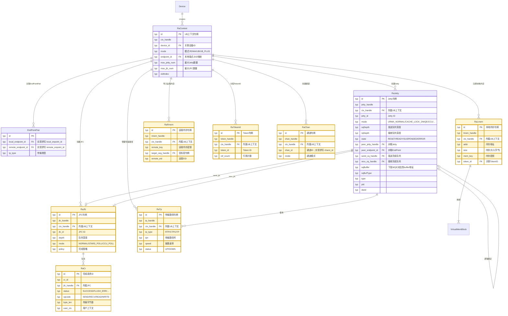
```mermaid
erDiagram
    %% ==========================================
    %% UB上下文 (RaContext 系列接口)
    %% 🧠 可进程私有：RaChan / RaLmem / RaRmem / RaTokenId / RaTp（仅 src/proxy 访问）
    %% RaCr / RaJfc：仅 cmd 转储访问，全仓无写入方（空表）
    %% ==========================================
    Device ||--o{ RaContext : creates
    RaContext {
        typ id PK "UB上下文句柄"
        typ ctx_handle
        typ device_id FK "关联设备ID"
        typ mode "模式:RDMA/UB/UB_PLUS"
        typ endpoint_id FK "本地端点,EID映射"
        typ max_jetty_num "最大Jetty数量"
        typ max_jfc_num "最大JFC数量"
        typ eidIndex
    }

    EndPointPair {
        typ id PK
        typ local_endpoint_id FK "实现拼写 local_enpoint_id"
        typ remote_endpoint_id FK "实现拼写 remote_enpoint_id"
        typ tp_type "传输类型"
    }

    %% UB核心资源
    RaContext ||--o{ RaJetty : "创建Jetty"
    RaContext ||--o{ RaJfc : "创建JFC"
    RaContext ||--o{ RaLmem : "注册本地内存"
    RaContext ||--o{ RaRmem : "导入远端内存"
    RaContext ||--o{ RaTp : "管理传输路径"
    RaContext ||--o{ RaTokenId : "分配TokenID"
    RaContext ||--o{ RaChan : "创建通道"
    RaContext ||--o{ EndPointPair : "关联EndPointPair"

    %% Jetty (QP等价物)
    RaJetty {
        typ id PK "Jetty句柄"
        typ jetty_handle
        typ ctx_handle FK "所属UB上下文"
        typ jetty_id "Jetty ID"
        typ mode "URMA_NORMAL/CACHE_LOCK_DWQE/CCU/..."
        typ sqDepth "发送队列深度"
        typ rqDepth "接收队列深度"
        typ state "RESET/READY/SUSPENDED/ERROR"
        typ peer_jetty_handle FK "对端Jetty"
        typ peer_endpoint_id FK "对端EndPoint"
        typ send_cq_handle FK "发送完成队列"
        typ recv_cq_handle FK "接收完成队列"
        typ sqBuffer "下发WQE对应的buffer地址"
        typ sqBufType
        typ type
        typ pid
        typ dieId
    }
    RaJetty ||--o| RaJfc : "send_jfc"
    RaJetty ||--o| RaJfc : "recv_jfc"
    RaJetty |o--o| RaJetty : "逻辑绑定"

    %% JFC (CQ等价物)
    RaJfc {
        typ id PK "JFC句柄"
        typ jfc_handle
        typ ctx_handle FK "所属UB上下文"
        typ jfc_id "JFC ID"
        typ depth "队列深度"
        typ mode "NORMAL/STARS_POLL/CCU_POLL"
        typ policy "完成策略"
    }
    RaCr {
        typ id PK "完成请求ID"
        typ cr_id
        typ jfc_handle FK "所属JFC"
        typ status "SUCCESS/FLUSH_ERR/..."
        typ opcode "SEND/RECV/READ/WRITE"
        typ byte_len "传输字节数"
        typ user_ctx "用户上下文"
    }
    RaJfc ||--o{ RaCr : "包含"

    %% 本地内存注册
    RaLmem {
        typ id PK "本地内存句柄"
        typ lmem_handle
        typ ctx_handle FK "所属UB上下文"
        typ addr "内存地址"
        typ size "内存大小(字节)"
        typ mem_key "内存密钥"
        typ token_id FK "关联TokenID"
    }
    RaLmem ||--|{ VirtualMemBlock : "映射"

    %% 远端内存导入
    RaRmem {
        typ id PK "远端内存句柄"
        typ rmem_handle
        typ ctx_handle FK "所属UB上下文"
        typ remote_key "远端内存密钥"
        typ target_seg_handle FK "目标段句柄"
        typ remote_eid "远端EID"
    }

    %% 传输路径
    RaTp {
        typ id PK "传输路径句柄"
        typ tp_handle
        typ ctx_handle FK "所属UB上下文"
        typ tp_type "RTP/CTP/UTP"
        typ tpn "传输路径号"
        typ speed "链路速率"
        typ status "UP/DOWN"
    }
    RaJetty ||--o{ RaTp : "使用"

    %% TokenID
    RaTokenId {
        typ id PK "Token句柄"
        typ token_handle
        typ ctx_handle FK "所属UB上下文"
        typ token_id "Token ID"
        typ ref_count "引用计数"
    }

    RaChan {
        typ id PK "通道句柄"
        typ chan_handle
        typ ctx_handle FK "所属UB上下文"
        typ chan_id "通道ID；实现拼写 chann_id"
        typ mode "通道模式"
    }

    classDef inproc fill:#fff6d6,stroke:#d4a017,stroke-width:2px
    class RaJfc,RaCr,RaLmem,RaRmem,RaTp,RaTokenId,RaChan inproc
```

#### 4.1.5 异步请求管理

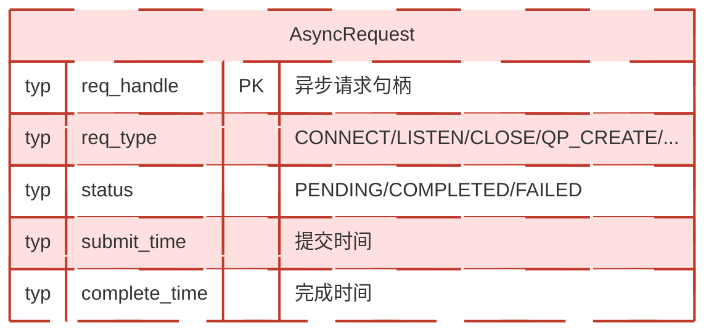
```mermaid
erDiagram
    AsyncRequest {
        typ req_handle PK "异步请求句柄"
        typ req_type "CONNECT/LISTEN/CLOSE/QP_CREATE/..."
        typ status "PENDING/COMPLETED/FAILED"
        typ submit_time "提交时间"
        typ complete_time "完成时间"
    }

    classDef unimplemented fill:#ffe0e0,stroke:#c0392b,stroke-width:2px,stroke-dasharray:5 3
    class AsyncRequest unimplemented
```

> 注：`AsyncRequest` 为内部实现对象，暂不需要建模（无对应结构体与落库表）。

#### 4.1.6 通信域架构总结

```text
┌─────────────────────────────────────────────────────────────────┐
│                    HCCL 通信域架构                               │
├─────────────────────────────────────────────────────────────────┤
│  应用层                                                          │
│  ┌──────────────────────────────────────────────────────────┐   │
│  │  Communicator (通信域)                                     │   │
│  │  └── Rank[0..N] (参与节点，每个绑定一个Device)              │   │
│  └──────────────────────────────────────────────────────────┘   │
├─────────────────────────────────────────────────────────────────┤
│  控制面 (建链/握手)                                               │
│  ┌──────────────────────────────────────────────────────────┐   │
│  │  RaSocket (Socket通信)                                     │   │
│  │  ├── RaSocketPair (连接对)                                 │   │
│  │  └── RaEpoll (事件监控)                                    │   │
│  └──────────────────────────────────────────────────────────┘   │
├─────────────────────────────────────────────────────────────────┤
│  数据面 (数据传输)                                                │
│  ┌─────────────────────┐    ┌─────────────────────┐            │
│  │  RDMA (传统模式)      │    │  UB (统一总线)       │            │
│  │  ├── RaDevice        │    │  ├── RaContext      │            │
│  │  ├── RaQP (队列对)    │    │  ├── RaJetty (QP)   │            │
│  │  ├── RaCQ (完成队列)  │    │  ├── RaJfc (CQ)     │            │
│  │  ├── RaMR (内存注册)  │    │  ├── RaLmem/Rmem    │            │
│  │  └── RaSRQ (共享RQ)   │    │  └── RaTp (传输路径) │            │
│  └─────────────────────┘    └─────────────────────┘            │
└─────────────────────────────────────────────────────────────────┘
```

#### 4.1.7 关键实体对照表

| 概念 | RDMA模式 | UB模式 | 说明 |
| --- | --- | --- | --- |
| 上下文 | RaDevice | RaContext | 设备/上下文句柄 |
| 队列对 | RaQP | RaJetty | 数据传输通道 |
| 完成队列 | RaCQ | RaJfc | 完成通知 |
| 完成元素 | RaCQE | RaCr | 完成状态 |
| 本地内存 | RaMR | RaLmem | 内存注册 |
| 远端内存 | - | RaRmem | 远端内存导入 |
| 传输路径 | - | RaTp | 物理路径管理 |
| 安全令牌 | - | RaTokenId | 访问控制 |

#### 4.1.8 HCCP接口分类

> 表格「实现对应」列：路径省略公共前缀 `src/proxy/level2/`；`仅 hcomm/` 表示本仓无实现（实现在 `hcomm/src/base_comm/resources/hccp/inc/network/hccp_nda.h`）；🚧 表示未建模。

```text
HCCP Network API
├── 控制平面 (Socket通信)
|   ├── 初始化: RaSocketInit/RaSocketDeinit (Socket)
│   ├── 连接管理: RaSocketBatchConnect/Close/Abort
│   ├── 监听管理: RaSocketListenStart/Stop
│   ├── 数据收发: RaSocketSend/Recv
│   ├── 状态查询: RaGetSockets
│   └── 事件管理: RaEpollCtlAdd/Mod/Del
├── 数据平面 - RDMA
|   ├── 初始化: RaRdevInit/RaRdevDeinit (RDMA设备)
│   ├── QP管理: RaQpCreate/Destroy/ConnectAsync
│   ├── CQ管理: RaCqCreate/Destroy
│   ├── MR管理: RaMrReg/Dereg
│   ├── 工作请求: RaSendWr/RaRecvWrlist
│   └── 完成轮询: RaPollCq
├── 数据平面 - UB
|   ├── 初始化: RaCtxInit/RaCtxDeinit (统一上下文)
│   ├── Jetty管理: RaCtxQpCreate/Destroy/Import/Bind
│   ├── JFC管理: RaCtxCqCreate/Destroy
│   ├── 内存管理: RaCtxLmemRegister/RmemImport
│   ├── Token管理: RaCtxTokenIdAlloc/Free
│   └── 工作请求: RaBatchSendWr
├── 异步操作
│   ├── RaSocketBatchConnectAsync
│   ├── RaCtxQpCreateAsync/DestroyAsync
│   └── RaGetAsyncReqResult
├── 网络诊断
|   ├── RaPingInit/RaPingDeinit (Ping)
│   ├── RaPingTargetAdd/Del
│   ├── RaPingTaskStart/Stop
│   └── RaPingGetResults
└── TLV消息
|   ├── RaTlvInit/RaTlvDeinit (TLV)
    └── RaTlvRequest
```

##### Socket通信接口

| 接口                   | 功能           | 关键参数                                                                 | 实现对应 |
| ---------------------- | -------------- | ------------------------------------------------------------------------ | -------- |
| `RaSocketInit`         | Socket初始化    | `mode`, `rdevInfo`, `socketHandle`                                      | `hccp_ra_socket_stub.cc:66` |
| `RaSocketDeinit`       | Socket去初始化 | `socketHandle`                                                           | `hccp_ra_socket_stub.cc:110` |
| `RaSocketBatchConnect` | 批量连接       | `SocketConnectInfoT[]`, `num`                                            | `hccp_ra_socket_stub.cc:138` |
| `RaSocketBatchClose`   | 批量关闭       | `SocketCloseInfoT[]`, `num`                                              | `hccp_ra_socket_stub.cc:254` |
| `RaSocketBatchAbort`   | 批量中止       | `SocketConnectInfoT[]`, `num`                                            | `hccp_ra_socket_stub.cc:279` |
| `RaSocketListenStart`  | 开始监听       | `SocketListenInfoT[]`, `num`                                             | `hccp_ra_socket_stub.cc:118` |
| `RaSocketListenStop`   | 停止监听       | `SocketListenInfoT[]`, `num`                                             | `hccp_ra_socket_stub.cc:128` |
| `RaGetSockets`         | 获取Socket状态 | `role`, `SocketInfoT[]`, `num`, `connectedNum`                           | `hccp_ra_socket_stub.cc:188` |
| `RaSocketSend`         | 发送数据       | `fdHandle`, `data`, `size`, `sentSize`                                   | `hccp_ra_socket_stub.cc:286` |
| `RaSocketRecv`         | 接收数据       | `fdHandle`, `data`, `size`, `receivedSize`                               | `hccp_ra_socket_stub.cc:298` |
| `RaEpollCtlAdd`        | 添加Epoll事件  | `fdHandle`, `event`                                                      | `hccp_ra_socket_stub.cc:313` |
| `RaEpollCtlMod`        | 修改Epoll事件  | `fdHandle`, `event`                                                      | `hccp_ra_socket_stub.cc:320` |
| `RaEpollCtlDel`        | 删除Epoll事件  | `fdHandle`                                                               | `hccp_ra_socket_stub.cc:327` |
| `RaCreateEventHandle`  | 创建事件句柄   | `eventHandle`                                                            | `hccp_stub.cc:486` |
| `RaWaitEventHandle`    | 等待事件       | `eventHandle`, `SocketEventInfoT[]`, `timeout`, `maxevents`, `eventsNum` | `hccp_stub.cc:498` |
| `RaDestroyEventHandle` | 销毁事件句柄   | `eventHandle`                                                            | `hccp_stub.cc:505` |
| `RaSocketWhiteListAdd` | 添加白名单     | `socketHandle`, `SocketWlistInfoT[]`, `num`                              | `hccp_stub.cc:1605` |
| `RaSocketWhiteListDel` | 删除白名单     | `socketHandle`, `SocketWlistInfoT[]`, `num`                              | `hccp_stub.cc:1611` |

###### RDMA操作接口

| 接口                  | 功能           | 关键参数                                                                | 实现对应 |
| --------------------- | -------------- | ----------------------------------------------------------------------- | -------- |
| `RaRdevInit`           | RDMA设备初始化       | `mode`, `notifyType`, `rdevInfo`, `rdmaHandle`      | `hccp_stub.cc:976` |
| `RaRdevInitV2`         | RDMA设备初始化(扩展) | `RdevInitInfo`, `rdevInfo`, `rdmaHandle`            | `hccp_stub.cc:948` |
| `RaRdevInitWithBackup` | 带备份的初始化       | `initInfo`, `rdevInfo`, `backupRdevInfo`            | `hccp_stub.cc:796` |
| `RaRdevDeinit`         | RDMA设备去初始化     | `rdmaHandle`, `notifyType`                          | `hccp_stub.cc:983` |
| `RaQpCreate`          | 创建QP         | `rdevHandle`, `flag`, `qpMode`, `qpHandle`                              | `hccp_stub.cc:1049` |
| `RaQpCreateWithAttrs` | 创建QP(带属性) | `rdevHandle`, `QpExtAttrs`, `qpHandle`                                  | `hccp_stub.cc:1085` |
| `RaAiQpCreate`        | 创建AI QP      | `rdevHandle`, `QpExtAttrs`, `AiQpInfo`, `qpHandle`                      | `hccp_stub.cc:1126` |
| `RaLoopbackQpCreate`  | 创建回环QP     | `rdevHandle`, `LoopbackQpPair`, `qpHandle`                              | `hccp_stub.cc:522` |
| `RaTypicalQpCreate`   | 创建典型QP     | `rdevHandle`, `flag`, `qpMode`, `TypicalQp`, `qpHandle`                 | `hccp_stub.cc:1132` |
| `RaQpDestroy`         | 销毁QP         | `qpHandle`                                                              | `hccp_stub.cc:1217` |
| `RaQpConnectAsync`    | 异步连接QP     | `qpHandle`, `fdHandle`                                                  | `hccp_stub.cc:587` |
| `RaGetQpStatus`       | 获取QP状态     | `qpHandle`, `status`                                                    | `hccp_stub.cc:803` |
| `RaTypicalQpModify`   | 修改典型QP     | `qpHandle`, `localQpInfo`, `remoteQpInfo`                               | `hccp_stub.cc:1483` |
| `RaMrReg`             | 注册MR         | `qpHandle`, `MrInfoT`                                                   | `hccp_stub.cc:324` |
| `RaMrDereg`           | 注销MR         | `qpHandle`, `MrInfoT`                                                   | `hccp_stub.cc:353` |
| `RaRegisterMr`        | 独立注册MR     | `rdmaHandle`, `MrInfoT`, `mrHandle`                                     | `hccp_stub.cc:376` |
| `RaDeregisterMr`      | 独立注销MR     | `rdmaHandle`, `mrHandle`                                                | `hccp_stub.cc:407` |
| `RaRemapMr`           | 重映射MR       | `rdmaHandle`, `MemRemapInfo[]`, `num`                                   | `hccp_stub.cc:401` |
| `RaGetNotifyMrInfo`   | 获取通知MR信息 | `rdevHandle`, `MrInfoT`                                                 | `hccp_stub.cc:918` |
| `RaSendWr`            | 发送工作请求   | `qpHandle`, `SendWr`, `SendWrRsp`                                       | `hccp_stub.cc:426` |
| `RaSendWrV2`          | 发送工作请求V2 | `qpHandle`, `SendWrV2`, `SendWrRsp`                                     | `hccp_stub.cc:607` |
| `RaSendWrlist`        | 批量发送       | `qpHandle`, `SendWrlistData[]`, `SendWrRsp[]`, `sendNum`, `completeNum` | `hccp_stub.cc:822` |
| `RaRecvWrlist`        | 批量接收       | `qpHandle`, `RecvWrlistData`, `recvNum`, `completeNum`                  | `hccp_stub.cc:669` |
| `RaPollCq`            | 轮询CQ         | `qpHandle`, `isSendCq`, `numEntries`, `wc`                              | `hccp_stub.cc:630` |
| `RaCqCreate`          | 创建CQ         | `rdevHandle`, `CqAttr`                                                  | `hccp_stub.cc:991` |
| `RaCqDestroy`         | 销毁CQ         | `rdevHandle`, `CqAttr`                                                  | `hccp_stub.cc:1025` |
| `RaCreateSrq`         | 创建SRQ        | `rdmaHandle`, `SrqAttr`                                                 | `hccp_stub.cc:474` |
| `RaDestroySrq`        | 销毁SRQ        | `rdmaHandle`, `SrqAttr`                                                 | `hccp_stub.cc:480` |
| `RaSetQpAttrQos`      | 设置QP QoS     | `qpHandle`, `QosAttr`                                                   | `hccp_stub.cc:450` |
| `RaSetQpAttrTimeout`  | 设置QP超时     | `qpHandle`, `timeout`                                                   | `hccp_stub.cc:456` |
| `RaSetQpAttrRetryCnt` | 设置QP重试次数 | `qpHandle`, `retryCnt`                                                  | `hccp_stub.cc:462` |
| `RaGetQpAttr`         | 获取QP属性     | `qpHandle`, `QpAttr`                                                    | `hccp_stub.cc:1562` |
| `RaGetQpContext`      | 获取QP上下文   | `qpHandle`, `qp`, `sendCq`, `recvCq`                                    | `hccp_stub.cc:696` |

###### UB统一总线接口

| 接口                    | 功能             | 关键参数                                                         | 实现对应 |
| ----------------------- | ---------------- | ---------------------------------------------------------------- | -------- |
| `RaCtxInit`            | 上下文初始化         | `CtxInitCfg`, `CtxInitAttr`, `ctxHandle`            | `hccp_stub.cc:1138` |
| `RaCtxDeinit`          | 上下文去初始化       | `ctxHandle`                                         | `hccp_stub.cc:1175` |
| `RaGetDevEidInfoNum`    | 获取EID数量      | `RaInfo`, `num`                                                  | `hccp_ccu_stub.cc:575` |
| `RaGetDevEidInfoList`   | 获取EID列表      | `RaInfo`, `HccpDevEidInfo[]`, `num`                              | `hccp_ccu_stub.cc:586` |
| `RaGetEidByIp`          | 通过IP获取EID    | `ctxHandle`, `IpInfo[]`, `HccpEid[]`, `num`                      | `hccp_stub.cc:2306` |
| `RaGetDevBaseAttr`      | 获取设备属性     | `ctxHandle`, `DevBaseAttr`                                       | `hccp_stub.cc:1182` |
| `RaCtxGetAsyncEvents`   | 获取异步事件     | `ctxHandle`, `AsyncEvent[]`, `num`                               | `hccp_ccu_stub.cc:553` |
| `RaCtxTokenIdAlloc`     | 分配TokenID      | `ctxHandle`, `HccpTokenId`, `tokenIdHandle`                      | `hccp_stub.cc:1885` |
| `RaCtxTokenIdFree`      | 释放TokenID      | `ctxHandle`, `tokenIdHandle`                                     | `hccp_stub.cc:2036` |
| `RaCtxLmemRegister`     | 注册本地内存     | `ctxHandle`, `MrRegInfoT`, `lmemHandle`                          | `hccp_stub.cc:2047` |
| `RaCtxLmemUnregister`   | 注销本地内存     | `ctxHandle`, `lmemHandle`                                        | `hccp_stub.cc:1906` |
| `RaCtxRmemImport`       | 导入远端内存     | `ctxHandle`, `MrImportInfoT`, `rmemHandle`                       | `hccp_stub.cc:1968` |
| `RaCtxRmemUnimport`     | 取消导入远端内存 | `ctxHandle`, `rmemHandle`                                        | `hccp_stub.cc:1919` |
| `RaCtxChanCreate`       | 创建通道         | `ctxHandle`, `ChanInfoT`, `chanHandle`                           | `hccp_stub.cc:1993` |
| `RaCtxChanDestroy`      | 销毁通道         | `ctxHandle`, `chanHandle`                                        | `hccp_stub.cc:2005` |
| `RaCtxCqCreate`         | 创建CQ           | `ctxHandle`, `CqInfoT`, `cqHandle`                               | `hccp_stub.cc:2142` |
| `RaCtxCqDestroy`        | 销毁CQ           | `ctxHandle`, `cqHandle`                                          | `hccp_stub.cc:2148` |
| `RaCtxQpCreate`         | 创建QP/Jetty     | `ctxHandle`, `QpCreateAttr`, `QpCreateInfo`, `qpHandle`          | `hccp_stub.cc:1254` |
| `RaCtxQpQueryBatch`     | 批量查询QP       | `qpHandle[]`, `JettyAttr[]`, `num`                               | `hccp_stub.cc:2106` |
| `RaCtxQpDestroy`        | 销毁QP/Jetty     | `qpHandle`                                                       | `hccp_stub.cc:2012` |
| `RaCtxQpImport`         | 导入Jetty        | `ctxHandle`, `QpImportInfoT`, `remQpHandle`                      | `hccp_stub.cc:1321` |
| `RaCtxQpUnimport`       | 取消导入Jetty    | `ctxHandle`, `remQpHandle`                                       | `hccp_stub.cc:1425` |
| `RaCtxQpBind`           | 绑定Jetty        | `qpHandle`, `remQpHandle`                                        | `hccp_stub.cc:1394` |
| `RaCtxQpUnbind`         | 解绑Jetty        | `qpHandle`                                                       | `hccp_stub.cc:2112` |
| `RaBatchSendWr`         | 批量发送         | `qpHandle`, `SendWrData[]`, `SendWrResp[]`, `num`, `completeNum` | `hccp_stub.cc:2135` |
| `RaCtxUpdateCi`         | 更新CI           | `qpHandle`, `ci`                                                 | `hccp_stub.cc:2154` |
| `RaCtxGetAuxInfo`       | 获取辅助信息     | `ctxHandle`, `HccpAuxInfoIn`, `HccpAuxInfoOut`                   | `hccp_stub.cc:2270` |
| `RaCtxGetCrErrInfoList` | 获取CR错误       | `ctxHandle`, `CrErrInfo[]`, `num`                                | `hccp_stub.cc:2276` |

###### 异步操作接口

| 接口                        | 功能           | 关键参数                                                             | 实现对应 |
| --------------------------- | -------------- | -------------------------------------------------------------------- | -------- |
| `RaGetAsyncReqResult`       | 获取异步结果   | `reqHandle`, `reqResult`                                             | `hccp_ra_socket_stub.cc:341` |
| `RaSocketBatchConnectAsync` | 异步批量连接   | `SocketConnectInfoT[]`, `num`, `reqHandle`                           | `hccp_ra_socket_stub.cc:348` |
| `RaSocketListenStartAsync`  | 异步开始监听   | `SocketListenInfoT[]`, `num`, `reqHandle`                            | `hccp_ra_socket_stub.cc:354` |
| `RaSocketListenStopAsync`   | 异步停止监听   | `SocketListenInfoT[]`, `num`, `reqHandle`                            | `hccp_ra_socket_stub.cc:362` |
| `RaSocketBatchCloseAsync`   | 异步批量关闭   | `SocketCloseInfoT[]`, `num`, `reqHandle`                             | `hccp_ra_socket_stub.cc:370` |
| `RaSocketSendAsync`         | 异步发送       | `fdHandle`, `data`, `size`, `sentSize`, `reqHandle`                  | `hccp_ra_socket_stub.cc:377` |
| `RaSocketRecvAsync`         | 异步接收       | `fdHandle`, `data`, `size`, `receivedSize`, `reqHandle`              | `hccp_ra_socket_stub.cc:384` |
| `RaCtxLmemRegisterAsync`    | 异步注册内存   | `ctxHandle`, `MrRegInfoT`, `lmemHandle`, `reqHandle`                 | `hccp_stub.cc:2075` |
| `RaCtxLmemUnregisterAsync`  | 异步注销内存   | `ctxHandle`, `lmemHandle`, `reqHandle`                               | `hccp_stub.cc:1937` |
| `RaCtxQpCreateAsync`        | 异步创建QP     | `ctxHandle`, `QpCreateAttr`, `QpCreateInfo`, `qpHandle`, `reqHandle` | `hccp_stub.cc:2239` |
| `RaCtxQpDestroyAsync`       | 异步销毁QP     | `qpHandle`, `reqHandle`                                              | `hccp_stub.cc:1943` |
| `RaCtxQpDestroyBatchAsync`  | 异步批量销毁   | `ctxHandle`, `qpHandle[]`, `num`, `reqHandle`                        | `hccp_stub.cc:1958` |
| `RaCtxQpImportAsync`        | 异步导入Jetty  | `ctxHandle`, `QpImportInfoT`, `remQpHandle`, `reqHandle`             | `hccp_stub.cc:1378` |
| `RaGetTpInfoListAsync`      | 异步获取TP信息 | `ctxHandle`, `GetTpCfg`, `HccpTpInfo[]`, `num`, `reqHandle`          | `hccp_stub.cc:2082` |
| `RaGetEidByIpAsync`         | 异步获取EID    | `ctxHandle`, `IpInfo[]`, `HccpEid[]`, `num`, `reqHandle`             | `hccp_stub.cc:2091` |
| `RaGetTpAttrAsync`          | 异步获取TP属性 | `ctxHandle`, `tpHandle`, `attrBitmap`, `TpAttr`, `reqHandle`         | `hccp_stub.cc:2098` |
| `RaSetTpAttrAsync`          | 异步设置TP属性 | `ctxHandle`, `tpHandle`, `attrBitmap`, `TpAttr`, `reqHandle`         | `hccp_stub.cc:2263` |

###### 网络诊断接口

| 接口               | 功能         | 关键参数                                     | 实现对应 |
| ------------------ | ------------ | -------------------------------------------- | -------- |
| `RaPingInit`       | Ping初始化    | `PingInitAttr`, `PingInitInfo`, `pingHandle`| `hccp_stub.cc:1843` |
| `RaPingDeinit`     | Ping去初始化  | `pingHandle`                                | `hccp_stub.cc:1849` |
| `RaPingTargetAdd`  | 添加Ping目标 | `pingHandle`, `PingTargetInfo[]`, `num`      | `hccp_stub.cc:1855` |
| `RaPingTargetDel`  | 删除Ping目标 | `pingHandle`, `PingTargetCommInfo[]`, `num`  | `hccp_stub.cc:1873` |
| `RaPingTaskStart`  | 启动Ping任务 | `pingHandle`, `PingTaskAttr`                 | `hccp_stub.cc:1861` |
| `RaPingTaskStop`   | 停止Ping任务 | `pingHandle`                                 | `hccp_stub.cc:1879` |
| `RaPingGetResults` | 获取Ping结果 | `pingHandle`, `PingTargetResult[]`, `num`    | `hccp_stub.cc:1867` |

###### TLV消息接口

| 接口           | 功能        | 关键参数                                      | 实现对应 |
| -------------- | ----------- | --------------------------------------------- | -------- |
| `RaTlvInit`    | TLV初始化   | `TlvInitInfo`, `bufferSize`, `tlvHandle`      | `hccp_stub.cc:1670` |
| `RaTlvDeinit`  | TLV反初始化 | `tlvHandle`                                   | `hccp_stub.cc:1680` |
| `RaTlvRequest` | TLV请求处理 | `tlvHandle`, `moduleType`, `TlvMsg`, `TlvMsg` | `hccp_stub.cc:1821` |

###### NDA(Network Direct Acess)直接访问接口

| 接口                 | 功能             | 关键参数                                               | 实现对应 |
| -------------------- | ---------------- | ------------------------------------------------------ | -------- |
| `RaNdaGetDirectFlag` | 获取直接访问标志 | `rdmaHandle`, `directFlag`                             | `仅 hcomm/` |
| `RaNdaCqCreate`      | 创建NDA CQ       | `rdmaHandle`, `NdaCqInitAttr`, `NdaCqInfo`, `cqHandle` | `仅 hcomm/` |
| `RaNdaCqDestroy`     | 销毁NDA CQ       | `rdmaHandle`, `cqHandle`                               | `仅 hcomm/` |
| `RaNdaQpCreate`      | 创建NDA QP       | `rdmaHandle`, `NdaQpInitAttr`, `NdaQpInfo`, `qpHandle` | `仅 hcomm/` |

###### 通用查询接口

| 接口                     | 功能           | 关键参数                                       | 实现对应 |
| ------------------------ | -------------- | ---------------------------------------------- | -------- |
| `RaGetIfnum`             | 获取接口数量   | `RaGetIfattr`, `num`                           | `hccp_stub.cc:1622` |
| `RaGetIfaddrs`           | 获取接口地址   | `RaGetIfattr`, `InterfaceInfo[]`, `num`        | `hccp_stub.cc:1640` |
| `RaSocketGetVnicIpInfos` | 获取虚拟网卡IP | `phyId`, `IdType`, `ids[]`, `num`, `IpInfo[]`  | `hccp_stub.cc:99` |
| `RaGetTlsEnable`         | 获取TLS状态    | `RaInfo`, `tlsEnable`                          | `hccp_stub.cc:936` |
| `RaGetHccnCfg`           | 获取HCCN配置   | `RaInfo`, `HccnCfgKey`, `value`, `valueLen`    | `hccp_stub.cc:942` |
| `RaGetInterfaceVersion`  | 获取接口版本   | `phyId`, `interfaceOpcode`, `interfaceVersion` | `hccp_stub.cc:130` |
| `RaRdevGetHandle`        | 获取Rdev句柄   | `phyId`, `rdmaHandle`                          | `hccp_stub.cc:759` |
| `RaRdevGetSupportLite`   | 获取Lite支持   | `rdmaHandle`, `supportLite`                    | `hccp_stub.cc:147` |
| `RaSaveSnapshot`         | 保存快照       | `RaInfo`, `SaveSnapshotAction`                 | `hccp_stub.cc:785` |
| `RaRestoreSnapshot`      | 恢复快照       | `RaInfo`                                       | `hccp_stub.cc:791` |
| `RaGetSecRandom`         | 获取安全随机数 | `RaInfo`, `value`                              | `hccp_stub.cc:1900` |

##### 关键关系说明（HCCP接口分类）

**通信域层次结构**：

- `Communicator`是HCCL集合通信的核心抽象，定义了一组参与通信的Rank。
- `Rank`是通信域中的参与节点，每个Rank绑定到具体的Device。
- 父通信域派生子通信域（如`color`属性实现分组）

**控制平面与数据平面分离**：

- **控制平面(Socket)**：用于建链、交换QP信息、控制信令，基于TCP协议。
- **数据平面(RDMA/UB)**：用于高性能数据传输，基于RDMA Verbs或UB协议。

**RDMA资源层次**：

- `RaDevice`是虚拟网卡抽象，一个Device可创建多个RaDevice。
- `RaQP`是队列对，包含Send Queue和Receive Queue。
- `RaCQ`是完成队列，用于轮询WR完成状态。
- `RaMR`是内存注册，将虚拟内存映射为RDMA可访问的物理内存。
- `RaSRQ`是共享接收队列，多个QP可共享同一SRQ以提高资源利用率。

**UB资源层次**：

- `RaContext`是UB统一上下文，替代RaDevice的设备抽象。
- `RaJetty`是QP等价物，支持多种模式（URMA_NORMAL/CCU等）
- `RaJfc`是CQ等价物，用于完成请求管理。
- `RaLmem/RaRmem`是本地/远端内存管理，替代RaMR。
- `RaTp`是传输路径管理，支持RTP/CTP/UTP三种类型。
- `RaTokenId`是安全通信令牌，用于跨进程内存访问控制。

**实体关联要点**：

1. `RaSocketPair`需要两个`RaSocket`（client端和server端）才能建立连接。
2. `RaQP.state`必须经历RESET→INIT→RTR→RTS的状态转换才能正常通信。
3. `RaMR.lkey`用于本地访问，`RaMR.rkey`用于远端RDMA访问。
4. `RaJetty`通过`Bind`操作与对端Jetty建立逻辑连接。
5. `RaLmem`必须注册后，`RaRmem`才能从对端导入并访问。

**NDA(Network Direct Access)直接访问机制**：

- `RaNdaQP`和`RaNdaCQ`是网络直接访问的QP/CQ变体。
- NDA模式允许绕过部分协议栈，降低延迟。
- `RaNdaGetDirectFlag`检查设备是否支持NDA模式。

**异步请求管理**：

- `AsyncRequest`统一管理所有异步操作的请求句柄。
- 异步操作包括：连接、监听、QP创建/销毁、内存注册等。
- `RaGetAsyncReqResult`轮询异步操作结果。

**Socket事件机制**：

- `RaSocketEvent`是事件等待机制的句柄。
- `RaEpoll`实现类似Linux Epoll的事件监控机制。
- 支持添加、修改、删除监控的Socket事件。

**网络接口与配置**：

- `InterfaceInfo`描述网络接口的IP/MAC/MTU等属性。
- `HccnConfig`存储HCCN网络配置键值对。
- `Snapshot`支持设备状态的保存和恢复。

##### 控制平面 vs 数据平面

| 维度         | 控制平面                                                      | 数据平面                                   |
| ------------ | ------------------------------------------------------------- | ------------------------------------------ |
| **核心功能** | 建链、交换QP信息、控制信令                                    | 数据传输、RDMA操作                         |
| **关键实体** | RaSocket 🧊, SocketConnection, RaEpoll                           | RaQP, RaCQ, RaMR, RaJetty                  |
| **关键接口** | `RaSocketBatchConnect`, `RaSocketListenStart`, `RaGetSockets` | `RaSendWr`, `RaPollCq`, `RaQpConnectAsync` |
| **通信方式** | TCP Socket                                                    | RDMA Verbs / UB                            |

##### RDMA模式 vs UB模式

| 对比项       | RDMA模式         | UB模式                 |
| ------------ | ---------------- | ---------------------- |
| **设备抽象** | RaDevice         | RaContext              |
| **队列对**   | RaQP (QP)        | RaJetty (Jetty)        |
| **完成队列** | RaCQ (CQ)        | RaJfc (JFC)            |
| **内存注册** | RaMR (lkey/rkey) | RaLmem/RaRmem (MemKey) |
| **地址标识** | IP + GID         | EID (Endpoint ID)      |
| **传输路径** | QPN + GID        | RaTp (TPN)             |

##### 关键点说明

1. **RaContext/RaDevice**: 统一上下文实体，支持 RDMA 和 UB 双模式。
2. **RaJetty/RaJfc/RaQP/RaCQ**: UB 模式下的 QP/CQ 等价物。
3. **RaLmem/RaRmem/RaMR**:  UB 模式下的本地/远端内存管理。
4. **RaTp**: UB 传输路径管理。
5. **RaTokenId**: 安全通信令牌。

##### 关键属性补充

- **QP Mode**: `NOR`(普通), `GDR_TMPL`(模板), `OP`(操作), `GDR_ASYN`(异步GDR)
- **Transport Mode**: `RC`(可靠连接), `RM`(可靠消息，仅UB)
- **Jetty Mode**: `URMA_NORMAL`, `CACHE_LOCK_DWQE`, `CCU`, `USER_CTL_NORMAL`
- **JFC Mode**: `NORMAL`, `STARS_POLL`, `CCU_POLL`

##### 配套接口映射表（HCCP接口分类）

| 实体             | 初始化接口                   | 创建接口                                                 | 操作接口                                   | 销毁/清理接口                               |
| --------------- | ---------------------------- | -------------------------------------------------------- | ------------------------------------------ | ------------------------------------------ |
| **Communicator** | -                            | `HcclCommInitRankInfo`, `HcclCommInitClusterInfo`        | `HcclGetRankId`, `HcclGetRankSize`         | `HcclCommDestroy`                          |
| **Rank**         | -                            | -                                          | -                   | -                        |
| **RaSocket**     | `RaSocketInit`               | `RaSocketBatchConnect`                                   | `RaSocketSend`, `RaSocketRecv`, `RaGetSockets` | `RaSocketDeinit`, `RaSocketBatchClose`, `RaSocketBatchAbort` |
| **RaSocketPair** | -                            | `RaSocketBatchConnect`                                   | `RaGetSockets`                             | `RaSocketBatchClose`                       |
| **RaSocketEvent** | `RaCreateEventHandle`       | -                                                        | `RaWaitEventHandle`                        | `RaDestroyEventHandle`                     |
| **RaEpoll**      | -                            | `RaEpollCtlAdd`                                          | `RaEpollCtlMod`                            | `RaEpollCtlDel`                            |
| **RaDevice**     | `RaRdevInit`, `RaRdevInitV2`, `RaRdevInitWithBackup` | -                                                        | `RaRdevGetHandle`, `RaRdevGetSupportLite`  | `RaRdevDeinit`                             |
| **RaQP**         | -                            | `RaQpCreate`, `RaQpCreateWithAttrs`, `RaTypicalQpCreate`, `RaAiQpCreate`, `RaLoopbackQpCreate` | `RaQpConnectAsync`, `RaSendWr`, `RaSendWrV2`, `RaSendWrlist`, `RaRecvWrlist`, `RaPollCq`, `RaGetQpStatus`, `RaTypicalQpModify` | `RaQpDestroy`                              |
| **RaCQ**         | -                            | `RaCqCreate`                                             | `RaPollCq`                                 | `RaCqDestroy`                              |
| **RaSRQ**        | -                            | `RaCreateSrq`                                            | `RaModifySrq`                              | `RaDestroySrq`                             |
| **RaMR**         | -                            | `RaMrReg`, `RaRegisterMr`                                | `RaRemapMr`, `RaGetNotifyMrInfo`           | `RaMrDereg`, `RaDeregisterMr`              |
| **RaCQE**        | -                            | -                                                        | `RaPollCq`                                 | -                                          |
| **RaQPAttr**     | -                            | -                                                        | `RaGetQpAttr`, `RaSetQpAttrQos`, `RaSetQpAttrTimeout`, `RaSetQpAttrRetryCnt`, `RaGetQpContext` | -                                          |
| **RaNdaQP**      | -                            | `RaNdaQpCreate`                                          | -                                          | -                                          |
| **RaNdaCQ**      | -                            | `RaNdaCqCreate`                                          | -                                          | `RaNdaCqDestroy`                           |
| **RaContext**    | `RaCtxInit`                  | -                                                        | `RaGetDevBaseAttr`, `RaGetDevEidInfoList`, `RaGetDevEidInfoNum`, `RaGetEidByIp`, `RaCtxGetAsyncEvents` | `RaCtxDeinit`                              |
| **RaJetty**      | -                            | `RaCtxQpCreate`                                          |  `RaBatchSendWr`, `RaCtxUpdateCi`, `RaCtxQpQueryBatch` | `RaCtxQpDestroy`        |
| **EndPointPair**      | -                            | -                                         | `RaCtxQpBind`, `RaCtxQpUnbind`, `RaCtxQpImport`, `RaCtxQpUnimport` | - |
| **RaJfc**        | -                            | `RaCtxCqCreate`                                          | `RaCtxGetAuxInfo`, `RaCtxGetCrErrInfoList` | `RaCtxCqDestroy`                           |
| **RaCr**         | -                            | -                                                        | `RaCtxGetAuxInfo`                          | -                                          |
| **RaLmem**       | -                            | `RaCtxLmemRegister`                                      | -                                          | `RaCtxLmemUnregister`                      |
| **RaRmem**       | -                            | `RaCtxRmemImport`                                        | -                                          | `RaCtxRmemUnimport`                        |
| **RaTp**         | -                            | `RaGetTpInfoListAsync`                                   | `RaGetTpAttrAsync`, `RaSetTpAttrAsync`     | -                                          |
| **RaTokenId**    | -                            | `RaCtxTokenIdAlloc`                                      | -                                          | `RaCtxTokenIdFree`                         |
| **RaChan**       | -                            | `RaCtxChanCreate`                                        | -                                          | `RaCtxChanDestroy`                         |
| **RaPing**       | `RaPingInit`                 | `RaPingTargetAdd`                                        | `RaPingTaskStart`, `RaPingGetResults`      | `RaPingDeinit`, `RaPingTargetDel`          |
| **RaTlv**        | `RaTlvInit`                  | -                                                        | `RaTlvRequest`                             | `RaTlvDeinit`                              |
| **AsyncRequest** | -                            | `RaSocketBatchConnectAsync`, `RaCtxQpCreateAsync`, `RaCtxQpDestroyAsync`, `RaCtxQpDestroyBatchAsync`, `RaCtxQpImportAsync`, `RaCtxLmemRegisterAsync`, `RaSocketListenStartAsync`, `RaSocketListenStopAsync`, `RaSocketBatchCloseAsync`, `RaSocketSendAsync`, `RaSocketRecvAsync`, `RaGetTpInfoListAsync`, `RaGetEidByIpAsync`, `RaGetTpAttrAsync`, `RaSetTpAttrAsync` | `RaGetAsyncReqResult` | - |
| **InterfaceInfo** | -                           | -                                                        | `RaGetIfnum`, `RaGetIfaddrs`, `RaSocketGetVnicIpInfos` | -                                          |
| **HccnConfig**   | -                            | -                                                        | `RaGetHccnCfg`, `RaGetTlsEnable`, `RaGetInterfaceVersion`, `RaGetSecRandom` | -                                          |
| **Snapshot**     | -                            | -                                                        | `RaSaveSnapshot`, `RaRestoreSnapshot`      | -                                          |

##### 实体属性与接口映射补充表

| 实体属性                    | 对应接口                                                                 |
| -------------------------- | ------------------------------------------------------------------------ |
| RaSocket.state             | `RaGetSockets` 返回状态                                                  |
| RaSocket.list 🚧        | `RaSocketWhiteListAdd`, `RaSocketWhiteListDel`                           |
| RaQP.qp_num/peer_qpn/perr_lid     | `RaQpConnectAsync` 交换对端信息                                          |
| RaQP.mode/type/state                  | `RaGetQpAttr`, `RaSetQpAttrQos`, `RaSetQpAttrTimeout`, `RaSetQpAttrRetryCnt` |
| RaQP.send_cq_handle/recv_cq_handle               | `RaGetQpContext` 返回QP的send_cq和recv_cq                                |
| RaCQE.wr_id                | `RaSendWr`, `RaSendWrV2`, `RaSendWrlist`, `RaRecvWrlist` 设置             |
| RaCQE.status               | `RaPollCq` 返回                                                          |
| RaJetty.state              | `RaCtxQpQueryBatch` 返回                                                 |
| RaJetty.jetty_id/peer_jetty_handle  | `RaCtxQpBind`, `RaCtxQpImport` 设置                                      |
| RaMR.local_key/remote_key                | `RaMrReg` 参数设置                                                       |
| RaLmem.id            | `RaCtxTokenIdAlloc` 预分配                                               |
| RaTp.tp_type               | `RaGetTpInfoListAsync` 返回                                              |
| RaContext.endpoint_id        | `RaGetDevEidInfoList`, `RaGetEidByIp` 获取                               |
| RaContext.mode             | `RaGetDevBaseAttr` 返回                                                  |
| AsyncRequest.status 🚧        | `RaGetAsyncReqResult` 返回                                               |
| InterfaceInfo.* 🚧            | `RaGetIfnum`, `RaGetIfaddrs`, `RaSocketGetVnicIpInfos` 获取              |
| HccnConfig.value 🚧           | `RaGetHccnCfg` 获取                                                      |
| RaNdaQP.flag 🚧    | `RaNdaGetDirectFlag` 检查NDA支持                                         |
| Snapshot.data 🚧              | `RaSaveSnapshot` 保存，`RaRestoreSnapshot` 恢复                          |
| RaSocketEvent.events 🚧       | `RaEpollCtlAdd`, `RaEpollCtlMod`, `RaEpollCtlDel` 管理                   |
| RaDevice.flag 🚧       | `RaNdaGetDirectFlag` 检查NDA支持                                         |

> 说明：表中字段名以 `include/runnerdb/sim_models.h` 为准；🚧 表示实现无该字段或实体未建模；🧠 表示只有本进程访问、可改进程私有内存；🧊 表示注册了库表但全仓零库调用（僵尸表）。分类依据见「落库必要性分类」小节。
>
> **ER 图着色**（按全仓 `struct`/`class`/`enum` 定义扫描 + 真库调用目录归属复核）：
> - 🟥 `unimplemented` 未实现：全仓无同名实体，属纯设计或概念实体（30 个，见图 31 处）。
> - 🟨 `inproc` 仅本进程/转储访问：库表运行期只被 `src/proxy` 桩或 `cmd` 转储访问，无跨进程/跨组件消费（33 个）。
> - 无色：`src/device_arm`/`src/plugin`/`src/store`/`src/topo` 等外部组件有真库调用（15 个）。

##### 落库覆盖对照（`include/runnerdb/db_sim_sqlite_db.h`）

落库注册表共 64 张表，与本文件实体对照后有三类差异：

- **表名≠结构体名**：`VirMem`(VirtualMemBlock)、`PhMem`(PhyMemBlock)、`IpMemWhiteList`(IpcMemWhiteList)。
- **落库有、本文件未建模（16 张）**：`HcclBuffer`、`HcclChannel`、`HcclEngineCtx` 🧊、`HcclMem`、`HcclThread`、`HcommEndpoint`、`HcommMemReg`、`DpuDeviceInfo`、`DpuPendingNotify`、`CommunicatorDestroySync`、`SimModelData`、`MemoryLayout`、`RunModeConfig`、`TopoMetaConfig`、`Plugin`、`RaTlv`。
- **本文件有、落库未注册（30 个）**：`AsyncRequest`、`Rank`、`ReportChannel`、`RaEpoll`、`RaSRQ`、`RaNdaCQ`、`RaNdaQP`、`RaSocketEvent`、`CommMemSlot`（store 层 mmap 通信内存池槽位，非库表）、`LinkProtocolMapping`（实现为 `Link.protocols[8]` 数组字段）、`KernelBinary`/`KernelBinaryHandle`/`KernelFuncHandle`/`KernelFuncArgsHandle`/`KernelFuncArgsParamHandle`/`KernelLaunchCfg`（ACL 侧配置类型）、`CPU`/`Scalar`/`CcuInternal`/`Cube`/`Vector`/`HybridComputeDie`（概念实体）、`MemcpyTask`/`CallbackTask`/`EventTask`/`EventRICaptureTask`/`EventRecordTask`/`EventWaitTask`/`EventTimeTask`/`EventTraceTask`（实现中以 `Task`/`EventSyncTask` 承载）。

##### 落库必要性分类（进程私有候选）

判定依据是**有没有别的进程/组件在运行期真调用库 API**（`Add`/`Get*`/`Update*`/`Delete*` `` `sim::X` ``）；某实体的名字在别的目录出现不算数——原判据把 `cmd` 的 `PrintTable` 转储、以及同名结构体的局部变量误算成了运行期使用，本节按此修正。

- **C1 跨进程共享**：`src/device_arm`（独立 aarch64 `device` 可执行，单独链接 `db_sim_sqlite_db.cc`）、`src/plugin/runner`、`src/plugin/checker`、`src/store`（shm 通道）、`src/plugin/hccl_plugin_manager.cc` 中存在真库调用 ⇒ 必须落库。
- **C2 拓扑/硬件事实**：由 `src/topo/topo_ascend_cluster_parser.cc` 写入、多进程共读同一份 ⇒ 必须落库。
- **C3 仅本进程访问**：只有 `src/proxy` 存在真库调用，`cmd` 仅 `PrintTable` 转储 ⇒ 可进程私有。
- **C4 无运行期访问**：只有 `cmd` 调用（转储 + `DeleteAll` 重置）或全仓零调用 ⇒ 不该落库。

| 分类 | 张数 | 表 |
| --- | --- | --- |
| A 必须落库（C1/C2） | 19 | `Ccu`、`Communicator`、`Device`、`DpuDeviceInfo`、`EndPoint`、`EndPointPair`、`EndPointPortMapping`、`HcclChannel`、`HcclThread`、`Host`、`Link`、`Notify`、`PhyMemBlock`、`Plugin`、`Port`、`RaContext`、`RaJetty`、`Server`、`VirtualMemBlock` |
| B 🧠 可进程私有（C3） | 29 | `Context`、`DeviceConnection`、`DeviceStatus`、`DpuPendingNotify`、`Event`、`FdMemWhiteList`、`HcclBuffer`、`HcclMem`、`HcommEndpoint`、`HcommMemReg`、`IpcMemRecord`、`IpcMemWhiteList`、`IpcNotify`、`IpcNotifyVistorList`、`RaCQ`、`RaCQE`、`RaChan`、`RaDevice`、`RaLmem`、`RaMR`、`RaQP`、`RaRmem`、`RaSocketPair`、`RaTlv`、`RaTokenId`、`RaTp`、`SimModelData`、`Stream`、`Task` |
| C 仅 cmd 访问（C4） | 9 | `CcuChannel`、`EventSyncTask`、`FdMemRecord`、`MemoryLayout`、`NotifyRecordTask`、`NotifyWaitTask`、`RaCr`、`RaJfc`、`RunModeConfig` |
| D 仅 ops 层自用（调用方待核） | 5 | `CommunicatorDestroySync`、`ComputeDie`、`Runner`、`TaskSchedulerDevice`、`TopoMetaConfig` |
| E 🧊 零库调用（僵尸注册表） | 2 | `HcclEngineCtx`：数据只活在 `src/proxy/level1/level1_proxy_common.h` 的 `unordered_map<uint64_t, sim::HcclEngineCtx>`，库层零调用；`cmd` 仅 `dlsym` 其 `HcclEngineCtxResetAll`。`RaSocket`：仅有结构体定义与注册项，实际在用是 `RaSocketPair`/`RaSocketEvent`。 |

> 23 张「仅因 dump 可见而落库」：`Context`、`Stream`、`Task`、`Event`、`Runner`、`Plugin`、`SimModelData`、`DeviceStatus`、`DeviceConnection`、`HcclBuffer`、`HcclMem`、`HcommEndpoint`、`HcommMemReg` 共 13 张只有 `src/proxy` 写、`cmd` 读，而 `cmd` 仅做 `PrintTable`（`src/cmd/cmd_table_utils.cc`）；另有 `CcuChannel`、`ComputeDie`、`CommunicatorDestroySync`、`EventSyncTask`、`MemoryLayout`、`NotifyRecordTask`、`NotifyWaitTask`、`RunModeConfig`、`TaskSchedulerDevice`、`TopoMetaConfig` 共 10 张只被 `cmd` 引用（写入方在 runner 侧，待核）。若日后改为「进程退出时导出」，这 23 张可整体转进程私有。

## 5. 回调与报告关系建模

回调（`CallbackTask`）与报告通道（`ReportChannel`）由 Host Runner 线程消费；Task 家族定义见 [§3.1 数据 / 任务流建模](#31-数据--任务流建模)。

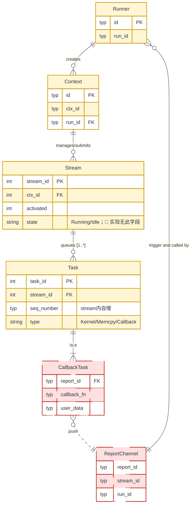
```mermaid
erDiagram
    Runner ||--o{ Context: "creates"
    Runner {
        typ id PK
        typ run_id
    }

    Context {
        typ id PK
        typ ctx_id
        typ run_id FK
    }

    Stream {
        int stream_id PK
        int ctx_id FK
        int activated
        string state "Running/Idle；🚧 实现无此字段"
    }
    %% 实现无 state 字段；运行态由 activated/capture_status/task_complete_status 表达

    %% Stream 包含有序的任务列表
    Context ||--o{ Stream : "manages/submits"
    Stream ||--o{ Task : "queues [1..*]"

    Task {
        int task_id PK
        int stream_id FK
        typ seq_number "stream内自增"
        string type "Kernel/Memcpy/Callback"
    }

    %% 各种具体的 Task 类型 (逻辑上的继承关系)
    CallbackTask {
        typ report_id FK
        typ callback_fn
        typ user_data
    }

    %% 继承关系的逻辑表达 (Task 分为多种)
    %% 🧠 可进程私有：Context / Stream / Task（仅 src/proxy 访问）
    %% CallbackTask 由 Task.type 判别（实现只建 Task 表）
    Task ||--|{ CallbackTask : "is a"

    ReportChannel {
        typ report_id
        typ stream_id
        typ run_id
    }

    CallbackTask }o..|| ReportChannel : "push"
    ReportChannel ||--o{ Runner : "trigger and called by"

    classDef unimplemented fill:#ffe0e0,stroke:#c0392b,stroke-width:2px,stroke-dasharray:5 3
    classDef inproc fill:#fff6d6,stroke:#d4a017,stroke-width:2px
    class CallbackTask,ReportChannel unimplemented
    class Runner,Context,Stream,Task inproc

```

### 5.1 关键关系说明（回调与报告关系建模）

**设备**执行到 CallbackTask 时，触发 Host Runner 线程执行回调。

#### 5.1.1 配套接口映射表（回调与报告关系建模）

| 实体          | 关键管理接口                                                          |
| ------------- | --------------------------------------------------------------------- |
| CallbackTask  | `rtSetExceptionInfoCallback`, `rtLaunchCallback`,`rtSynchronizeEvent` |
| ReportChannel | `rtSubscribeReport`, `rtUnSubscribeReport`                            |
| Runner        | `rtProcessReport`                                                     |

## 6. 基础`设备`模型细粒度底层扩展

在 [§2.1.1 层次结构总览](#211-层次结构总览) 的 Device 层次上细化的底层调度实体（`Die` / `SuperPod` / `Plane` 等概念实体在本仓实现中无对应结构体）。

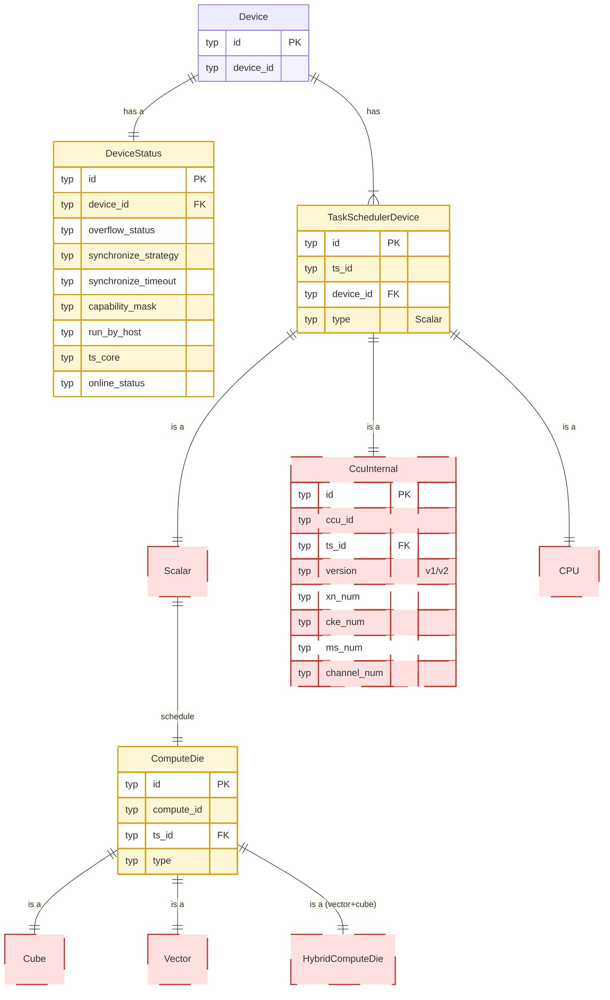
```mermaid
erDiagram

    %% 🧠 可进程私有：DeviceStatus（仅 src/proxy 访问）
    Device ||--|| DeviceStatus : "has a"
    Device ||--|{ TaskSchedulerDevice : "has "
    Device {
        typ id PK
        typ device_id
    }
    DeviceStatus {
        typ id PK
        typ device_id FK
        typ overflow_status
        typ synchronize_strategy
        typ synchronize_timeout
        typ capability_mask
        typ run_by_host
        typ ts_core
        typ online_status
    }

    %% Scalar/CcuInternal/CPU 由 TaskSchedulerDevice.type 判别（概念实体，不单独建表）
    TaskSchedulerDevice ||--|| Scalar :"is a"
    TaskSchedulerDevice ||--|| CcuInternal :"is a"
    TaskSchedulerDevice ||--|| CPU :"is a"
    TaskSchedulerDevice {
        typ id PK
        typ ts_id
        typ device_id FK
        typ type "Scalar"
    }

   CPU {
       %% 概念实体：无独立字段，由 ComputeDie.type 判别
   }

   Scalar ||--|| ComputeDie :"schedule"
   Scalar {
       %% 概念实体：无独立字段，由 ComputeDie.type 判别
   }

   CcuInternal {
        typ id PK
        typ ccu_id
        typ ts_id FK
        typ version "v1/v2"
        typ xn_num
        typ cke_num
        typ ms_num
        typ channel_num
    }

    %% Cube/Vector/HybridComputeDie 由 ComputeDie.type 判别（实现只建 ComputeDie 表）
    ComputeDie ||--|| Cube :"is a"
    ComputeDie ||--|| Vector :"is a"
    ComputeDie ||--|| HybridComputeDie :"is a (vector+cube)"
    ComputeDie {
        typ id PK
        typ compute_id
        typ ts_id FK
        typ type
    }
    Cube {
        %% 概念实体：无独立字段，由 ComputeDie.type 判别
    }
    Vector {
        %% 概念实体：无独立字段，由 ComputeDie.type 判别
    }
    HybridComputeDie {
        %% 概念实体：无独立字段，由 ComputeDie.type 判别
    }

    classDef unimplemented fill:#ffe0e0,stroke:#c0392b,stroke-width:2px,stroke-dasharray:5 3
    classDef inproc fill:#fff6d6,stroke:#d4a017,stroke-width:2px
    class CPU,Scalar,CcuInternal,Cube,Vector,HybridComputeDie unimplemented
    class DeviceStatus,TaskSchedulerDevice,ComputeDie inproc
```

### 6.1 关键关系说明（基础`设备`模型细粒度底层扩展）

**设备调度器层次结构**：

- `TaskSchedulerDevice`是设备调度器的抽象，一个Device可包含多个调度器。
- 调度器类型包括：`Scalar`（标量处理器）、`CCU`（集合通信单元）、`CPU`（AI CPU）
- 实体块中该 CCU 记为 `CcuInternal`，以区别于 §2.1.1 落库建模的 `Ccu`（CCU 资源分配表）；`type` 字段取值为 `Scalar`/`CCU`/`CPU`。
- 不同类型调度器负责不同计算任务类型。

**ComputeDie计算单元**：

- `ComputeDie`是计算单元的抽象，继承关系表示计算单元类型。
- `Vector`：向量计算单元，处理向量运算。
- `Cube`：立方计算单元，处理矩阵运算。
- `HybridComputeDie`：混合计算单元，同时支持Vector和Cube。🚧（实现无该类型，由 `ComputeDie.type` 判别；本仓与 `hcomm/` 均 0 命中）

**CCU内部结构**：

- `xn_num`：XN节点数量（跨节点通信）
- `cke_num`：CKE引擎数量（Checksum引擎）
- `ms_num`：MS模块数量（Memory Scheduler）
- `channel_num`：通信通道数量。
- `version`：CCU版本（v1/v2，决定功能差异）

**DeviceStatus状态管理**：

- `overflow_status`：溢出状态。
- `synchronize_strategy`：同步策略配置。
- `synchronize_timeout`：同步超时设置。
- `capability_mask`：设备能力掩码。
- `run_by_host`：是否运行在Host模式。
- `ts_core`：调度器核心数量。
- `online_status`：设备在线状态。

**Scalar调度关系**：

- `Scalar`调度器管理`ComputeDie`的执行。
- 不同ComputeDie类型对应不同的计算负载。

#### 6.1.1 配套接口映射表（基础设备模型细粒度底层扩展）

| 实体                | 关键管理接口                       |
| ------------------- | ---------------------------------- |
| TaskSchedulerDevice | `rtGetDeviceInfo`, `rtSetTsDevice` |
| DeviceStatus        | `rtGetRunMode`                     |

## 7. Kernel 运行时关系建模

Kernel 侧实体经 ACL 接口提交、以 Task / EventSyncTask 承载（见 [§3.1 数据 / 任务流建模](#31-数据--任务流建模)）；各实体对应接口见 [§7.1.1 配套接口映射表](#711-配套接口映射表kernel-运行时关系建模)。

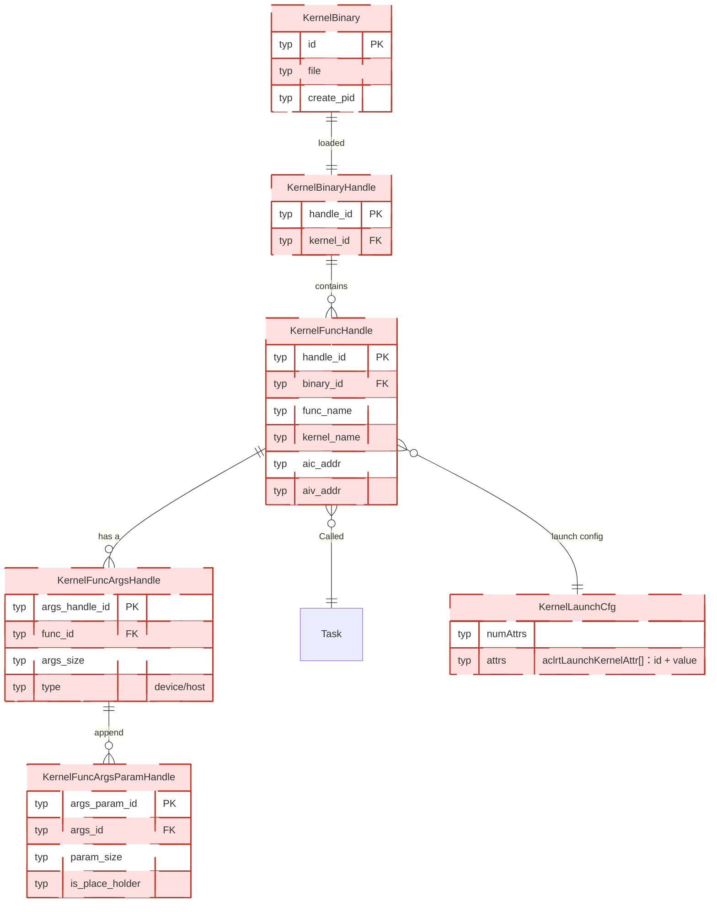
```mermaid
erDiagram
    KernelBinary {
        typ id PK
        typ file
        typ create_pid
    }

    KernelBinary  ||--|| KernelBinaryHandle :"loaded"
    KernelBinaryHandle  ||--o{ KernelFuncHandle :"contains"
    KernelBinaryHandle {
        typ handle_id PK
        typ kernel_id FK
    }

    KernelFuncHandle  ||--o{ KernelFuncArgsHandle :"has a"
    KernelFuncHandle  }o--|| Task :"Called "
    KernelFuncHandle  }o--|| KernelLaunchCfg :"launch config"
    %% KernelLaunchCfg = ACL 侧 aclrtLaunchKernelCfg（numAttrs/attrs[]），非 sim 模型、不落库
    KernelFuncHandle {
        typ handle_id PK
        typ binary_id FK
        typ func_name
        typ kernel_name
        typ aic_addr
        typ aiv_addr
    }

    KernelFuncArgsHandle  ||--o{ KernelFuncArgsParamHandle :"append"
    KernelFuncArgsHandle {
        typ args_handle_id PK
        typ func_id FK
        typ args_size
        typ type "device/host"
    }

    KernelFuncArgsParamHandle {
        typ args_param_id PK
        typ args_id FK
        typ param_size
        typ is_place_holder
    }

    KernelLaunchCfg {
        typ numAttrs
        typ attrs "aclrtLaunchKernelAttr[]：id + value"
    }

    classDef unimplemented fill:#ffe0e0,stroke:#c0392b,stroke-width:2px,stroke-dasharray:5 3
    class KernelBinary,KernelBinaryHandle,KernelFuncHandle,KernelFuncArgsHandle,KernelFuncArgsParamHandle,KernelLaunchCfg unimplemented
```

### 7.1 关键关系说明（Kernel 运行时关系建模）

**KernelBinary加载流程**：

1. `KernelBinary`存储.o/.so等二进制文件路径和创建进程PID。
2. `rtBinaryLoadFromFile`或`rtBinaryLoadFromData`将二进制加载到设备内存。
3. 加载后生成`KernelBinaryHandle`，包含handle_id和kernel_id。
4. `KernelFuncHandle`表示二进制中的具体函数，包含func_name、kernel_name、地址信息。

**Kernel函数调用关系**：

- `aic_addr`是AI Core函数地址。
- `aiv_addr`是AI Vector函数地址。
- `KernelFuncArgsHandle`存储函数参数信息。
- `KernelFuncArgsParamHandle`记录参数大小和是否占位符。
- `KernelLaunchCfg`配置Kernel启动参数（block/grid等）🚧（非 `sim_models.h` 实体、不落库；实现侧为 ACL 类型 `aclrtLaunchKernelCfg`：`numAttrs` + `attrs[]`，属性 id 共 9 种——`SCHEM_MODE`(1)/`DYN_UBUF_SIZE`(2)/`ENGINE_TYPE`(3)/`BLOCKDIM_OFFSET`(4)/`BLOCK_TASK_PREFETCH`(5)/`DATA_DUMP`(6)/`TIMEOUT`(7)/`TIMEOUT_US`(8)/`ENABLE_PROFILING`(9)，权威定义见 `runtime/include/external/acl/acl_rt.h:527-541`（`aclrtLaunchKernelAttrId`）；其中 `LOCAL_MEMORY_SIZE` 是 `DYN_UBUF_SIZE` 的 deprecated 别名（同值 2，`acl_rt.h:529-532`），`TIMEOUT` 与 `TIMEOUT_US` 不可同时携带（`acl_rt.h:538`）；本仓桩只识别前 8 种、第 9 项未实现，见 `src/proxy/level2/aclrt_kernel_stub.cc:564,1101`）

**Kernel生命周期**：

```text
rtCreateBinary -> rtBinaryLoad -> rtBinaryGetFunction
                -> rtLaunchKernel(funcHandle, argsHandle, cfg)
                -> rtBinaryUnLoad -> rtDestroyBinary
```

**参数管理机制**：

- args_handle_id支持device和host两种类型。
- is_place_holder标识参数是否为占位符（延迟绑定）
- param_size记录单个参数大小。

#### 7.1.1 配套接口映射表（Kernel 运行时关系建模）

| 实体               | 关键管理接口                                                                                                    |
| ------------------ | --------------------------------------------------------------------------------------------------------------- |
| KernelBinary       | `rtCreateBinary`, `rtDestroyBinary`                                                                             |
| KernelBinaryHandle | `rtBinaryLoad`, `rtBinaryUnLoad`,`rtBinaryLoadFromFile`,`rtBinaryLoadFromData`                                  |
| KernelFuncHandle   | `rtBinaryGetFunction`, `rtBinaryGetFunctionByEntry`,`rtGetFunctionAddr`,`rtGetFunctionName`,`rtRegisterCpuFunc` |
| KernelLaunchCfg 🚧 | `rtLaunchKernelWithConfig`（ACL 侧类型，非 sim 模型）                                                       |

## 8. 模型加载关系建模
