# HCCL Simulator Runner Data Model Design

> **Naming and Source Conventions**: Entity name = struct name from `include/runnerdb/sim_models.h` (CamelCase, as implemented); field name = field name from that file (snake_case). Database table names are found in `include/runnerdb/db_sim_sqlite_db.h`, some differ from struct names: `VirtualMemBlock`→table `VirMem`, `PhyMemBlock`→table `PhMem`, `IpcMemWhiteList`→table `IpMemWhiteList`. Old kebab-case notations not yet replaced section by section (e.g., `phy-mem-id`) can be converted to implementation field names by replacing `-` with `_`. Non-`sim_models.h` entities (e.g., ACL-side `KernelLaunchCfg`) use their real field names; do not force conversion to snake_case.
>
> **Interface Name Convention**: `aclrt*` in this document refers to ACL external interfaces (`runtime/include/external/acl/acl_rt.h`); for brevity, the flowcharts and interface tables in §7 omit the `acl` prefix (`rtLaunchKernel` means `aclrtLaunchKernel`). This notation has the same form as the RTS layer real names `rt*` (`runtime/pkg_inc/runtime/runtime/kernel.h`); all references are based on the ACL layer; ACL type names (e.g., `aclrtLaunchKernelCfg`, `aclrtLaunchKernelAttr`) retain their full names.

## Table of Contents

- [1. Software-Hardware Resource Interaction Modeling](#1-software-hardware-resource-interaction-modeling)
- [2. Device, Context, Stream and Other Hardware Resource Relationship Modeling](#2-device-context-stream-and-other-hardware-resource-relationship-modeling)
  - [2.1 Basic Device Relationship Modeling](#21-basic-device-relationship-modeling)
    - [2.1.1 Hierarchical Structure Overview](#211-hierarchical-structure-overview)
    - [2.1.2 Network Communication Resources](#212-network-communication-resources)
    - [2.1.3 Key Relationship Description](#213-key-relationship-description)
    - [2.1.4 Interface Mapping Table](#214-interface-mapping-table)
  - [2.2 Basic Memory Management Relationship Modeling](#22-basic-memory-management-relationship-modeling)
    - [2.2.1 Key Relationship Description (Basic Memory Management Relationship Modeling)](#221-key-relationship-description-basic-memory-management-relationship-modeling)
    - [2.2.2 Interface Mapping Table (Basic Memory Management Relationship Modeling)](#222-interface-mapping-table-basic-memory-management-relationship-modeling)
- [3. Extending Data Task Model on Top of Base Model](#3-extending-data-task-model-on-top-of-base-model)
  - [3.1 Data / Task Flow Modeling](#31-data--task-flow-modeling)
  - [3.2 CCU Resource Modeling](#32-ccu-resource-modeling)
    - [3.2.1 Interface Mapping Table (CCU Resource Modeling)](#321-interface-mapping-table-ccu-resource-modeling)
    - [3.2.2 CCU Resource Lifecycle Description](#322-ccu-resource-lifecycle-description)
  - [3.3 Asynchronous / Synchronous Execution Modeling](#33-asynchronous--synchronous-execution-modeling)
    - [3.3.1 Notify Resource Management](#331-notify-resource-management)
    - [3.3.2 Notify Synchronization Control](#332-notify-synchronization-control)
    - [3.3.3 Event Resource Management](#333-event-resource-management)
    - [3.3.4 Event Flow Control](#334-event-flow-control)
- [4. Communication Domain Modeling](#4-communication-domain-modeling)
  - [4.1 Communication Domain Core Concepts](#41-communication-domain-core-concepts)
    - [4.1.1 Communication Domain Basic Definition](#411-communication-domain-basic-definition)
    - [4.1.2 Control Plane: Socket Communication](#412-control-plane-socket-communication)
    - [4.1.3 Data Plane: RDMA Communication](#413-data-plane-rdma-communication)
    - [4.1.4 Data Plane: UB Unified Bus](#414-data-plane-ub-unified-bus)
    - [4.1.5 Asynchronous Request Management](#415-asynchronous-request-management)
    - [4.1.6 Communication Domain Architecture Summary](#416-communication-domain-architecture-summary)
    - [4.1.7 Key Entity Comparison Table](#417-key-entity-comparison-table)
    - [4.1.8 HCCP Interface Classification](#418-hccp-interface-classification)
- [5. Callback and Report Relationship Modeling](#5-callback-and-report-relationship-modeling)
  - [5.1 Key Relationship Description (Callback and Report Relationship Modeling)](#51-key-relationship-description-callback-and-report-relationship-modeling)
    - [5.1.1 Interface Mapping Table (Callback and Report Relationship Modeling)](#511-interface-mapping-table-callback-and-report-relationship-modeling)
- [6. Fine-Grained Low-Level Extension of Base `Device` Model](#6-fine-grained-low-level-extension-of-base-device-model)
  - [6.1 Key Relationship Description (Fine-Grained Low-Level Extension of Base `Device` Model)](#61-key-relationship-description-fine-grained-low-level-extension-of-base-device-model)
    - [6.1.1 Interface Mapping Table (Fine-Grained Low-Level Extension of Base Device Model)](#611-interface-mapping-table-fine-grained-low-level-extension-of-base-device-model)
- [7. Kernel Runtime Relationship Modeling](#7-kernel-runtime-relationship-modeling)
  - [7.1 Key Relationship Description (Kernel Runtime Relationship Modeling)](#71-key-relationship-description-kernel-runtime-relationship-modeling)
    - [7.1.1 Interface Mapping Table (Kernel Runtime Relationship Modeling)](#711-interface-mapping-table-kernel-runtime-relationship-modeling)

## Related Documents

- [`hccl_simulator.md`](./hccl_simulator.md): HCCL Simulator Requirements Analysis (upstream requirements for this document)
- [`checker_quick_intro.md`](./checker_quick_intro.md): Checker Quick Start Guide (basic concepts and processing flow)
- [`hccl_vm_binary_file_format.md`](./hccl_vm_binary_file_format.md): HCCL VM Binary File Format Specification (database file format)
- [`header_dependency.md`](./header_dependency.md): CheckerL2 Third-Party Header File Dependency List
- [`insightV3_guide.md`](./insightV3_guide.md): HVRM Insight V3 User Guide
- [`ranktable_rankid_device_conflict_analysis.md`](./ranktable_rankid_device_conflict_analysis.md): Analysis of Mapping Conflicts Between rankId and Device Physical ID in Ranktable

## 1. Software-Hardware Resource Interaction Modeling

Data flow interaction diagram.

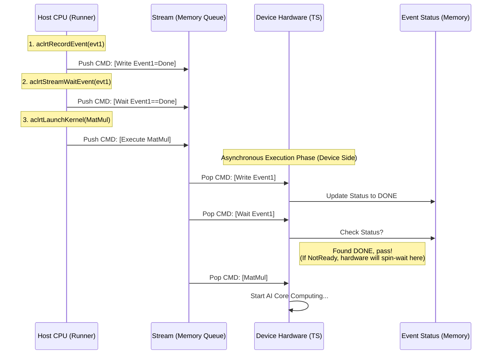
```mermaid

sequenceDiagram
    participant HostThread as Host CPU (Runner)
    participant StreamQueue as Stream (Memory Queue)
    participant DeviceScheduler as Device Hardware (TS)
    participant EventMem as Event Status (Memory)

    Note over HostThread: 1. aclrtRecordEvent(evt1)
    HostThread->>StreamQueue: Push CMD: [Write Event1=Done]

    Note over HostThread: 2. aclrtStreamWaitEvent(evt1)
    HostThread->>StreamQueue: Push CMD: [Wait Event1==Done]

    Note over HostThread: 3. aclrtLaunchKernel(MatMul)
    HostThread->>StreamQueue: Push CMD: [Execute MatMul]

    Note over DeviceScheduler: Asynchronous Execution Phase (Device Side)

    StreamQueue->>DeviceScheduler: Pop CMD: [Write Event1]
    DeviceScheduler->>EventMem: Update Status to DONE

    StreamQueue->>DeviceScheduler: Pop CMD: [Wait Event1]
    DeviceScheduler->>EventMem: Check Status?
    Note right of DeviceScheduler: Found DONE, pass!<br/>(If NotReady, hardware will spin-wait here)

    StreamQueue->>DeviceScheduler: Pop CMD: [MatMul]
    DeviceScheduler->>DeviceScheduler: Start AI Core Computing...
```

Everything pushed into a Stream is executed by the Device hardware.

## 2. Device, Context, Stream and Other Hardware Resource Relationship Modeling

Relationship between Device, Context, Stream and user host threads. Communication domain side resources (Socket/RDMA/UB interfaces) are covered in [§4 Communication Domain Modeling](#4-communication-domain-modeling).

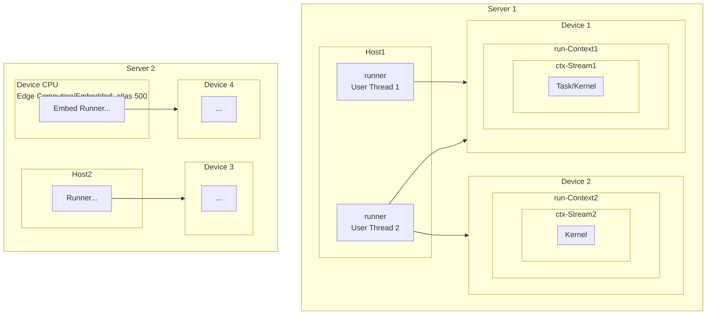
```mermaid
graph TD
    subgraph Server1[Server 1]
        Host1
        Device
        Device2
    end

    subgraph Server2[Server 2]
        Host3
        Host2
        Device3
        Device4

    end

    subgraph Host1[Host1]
        Runner1[runner<br>User Thread 1]
        Runner2[runner<br>User Thread 2]
    end

    subgraph Host2[Host2]
        Runner3[Runner...]
    end

    subgraph Host3[Device CPU<br>Edge Computing/Embedded: atlas 500]
        embedRunner[Embed Runner...]
    end

    subgraph Device[Device 1]
        Context1
    end

    subgraph Context1[run-Context1]
        Stream1
    end

    subgraph Stream1[ctx-Stream1]
        TaskKernel
    end

    subgraph TaskKernel[Task/Kernel]

    end

    subgraph Device2[Device 2]
        Context2
    end

    subgraph Context2[run-Context2]
        Stream2
    end

    subgraph Stream2[ctx-Stream2]
        Kernel
    end

    subgraph Kernel[Kernel]
    end

    subgraph Device3[Device 3]
        ctxM[...]
    end

    subgraph Device4[Device 4]
        ctxN[...]
    end

    Runner1-->Device
    Runner2-->Device
    Runner2-->Device2
    Runner3-->Device3
    embedRunner-->Device4

```

### 2.1 Basic Device Relationship Modeling

#### 2.1.1 Hierarchical Structure Overview

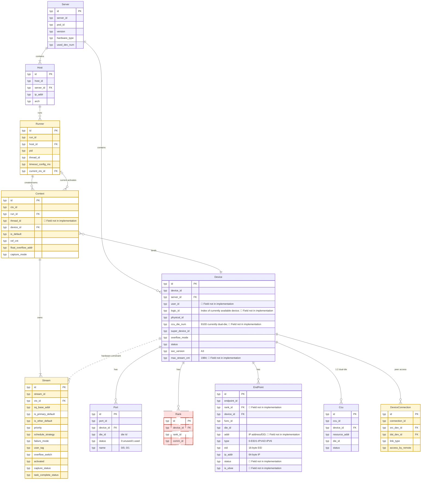
```mermaid
erDiagram
    %% ==========================================
    %% Layer 1: Physical Topology Layer (Server -> Host/Device)
    %% 🧠 Process-private candidate: Context / Stream / DeviceConnection (only accessed by src/proxy, cmd only dumps)
    %% ==========================================
    Server {
        typ id PK
        typ server_id
        typ pod_id
        typ version
        typ hardware_type
        typ used_dev_num
    }
    Host {
        typ id PK
        typ host_id
        typ server_id FK
        typ ip_addr
        typ arch
    }
    Device {
        typ id PK
        typ device_id
        typ server_id FK
        typ user_id "🚧 Field not in implementation"
        typ logic_id "Index of currently available device; 🚧 Field not in implementation"
        typ physical_id
        typ ccu_die_num "910D currently dual-die; 🚧 Field not in implementation"
        typ super_device_id
        typ overflow_mode
        typ status
        typ soc_version "A3"
        typ max_stream_cnt "1984; 🚧 Field not in implementation"
    }
    %% Implementation has no ccu_die_num (die count see §3.2); max_stream_cnt is a capability value (aclrt_stream_stub.cc:287)
    Server ||--|{ Host : contains
    Server ||--o{ Device : contains

    %% ==========================================
    %% Layer 2: Process and Context Layer (Runner -> Context -> Stream)
    %% ==========================================
    Runner {
        typ id PK
        typ run_id
        typ host_id FK
        typ pid
        typ thread_id
        typ timeout_config_ms
        typ current_ctx_id FK
    }
    Context {
        typ id PK
        typ ctx_id
        typ run_id FK
        typ thread_id "🚧 Field not in implementation"
        typ device_id FK
        typ is_default
        typ ref_cnt
        typ float_overflow_addr
        typ capture_mode
    }
    %% Context implementation has no thread_id (thread field is Runner.thread_id); ref_cnt is the implemented reference count
    Stream {
        typ id PK
        typ stream_id
        typ ctx_id FK
        typ sq_base_addr
        typ is_primary_default
        typ is_other_default
        typ priority
        typ schedule_strategy
        typ failure_mode
        typ user_tag
        typ overflow_switch
        typ activated
        typ capture_status
        typ task_complete_status
    }
    Host ||--o{ Runner : runs
    Runner ||--o{ Context : "creates/owns"
    Runner |o--o{ Context : "current activates"
    Context }o--|| Device : binds
    Context ||--|{ Stream : owns
    Device ||..|{ Stream : "hardware constraint"

    %% ==========================================
    %% Layer 3: Device Internal Resource Layer (Port/EndPoint/Ccu)
    %% ==========================================
    Port {
        typ id PK
        typ port_id
        typ device_id FK
        typ die_id "die Id"
        typ status "0:unused/1:used"
        typ name "0/0, 0/1"
    }
    Rank {
        typ id PK
        typ device_id FK
        typ rank_id
        typ comm_id
    }
    EndPoint {
        typ id PK
        typ endpoint_id
        typ rank_id FK "🚧 Field not in implementation"
        typ device_id FK
        typ func_id
        typ die_id
        typ addr "IP address/EID; 🚧 Field not in implementation"
        typ type "0-EID/1-IPV4/2-IPV6"
        typ eid "16-byte EID"
        typ ip_addr "64-byte IP"
        typ status "🚧 Field not in implementation"
        typ is_uboe "🚧 Field not in implementation"
    }
    Ccu {
        typ id PK
        typ ccu_id
        typ device_id FK
        typ resource_addr
        typ die_id
        typ status
    }
    DeviceConnection {
        typ id PK
        typ connection_id
        typ src_dev_id FK
        typ dst_dev_id FK
        typ link_type
        typ access_by_remote
    }
    Device ||--o{ Port : "has"
    Device ||--o{ Rank : "has"
    Device ||--o{ EndPoint : "has"
    Device ||--o{ Ccu : "1:2 dual-die"
    Device ||--o{ DeviceConnection : "peer access"

    %% Legend: 🟥 Unimplemented (no entity with same name in entire repo) 🟨 Process-private/dump-access only No color Has cross-process consumption
    classDef unimplemented fill:#ffe0e0,stroke:#c0392b,stroke-width:2px,stroke-dasharray:5 3
    classDef inproc fill:#fff6d6,stroke:#d4a017,stroke-width:2px
    class Rank unimplemented
    class Runner,Context,Stream,DeviceConnection inproc
```

#### 2.1.2 Network Communication Resources

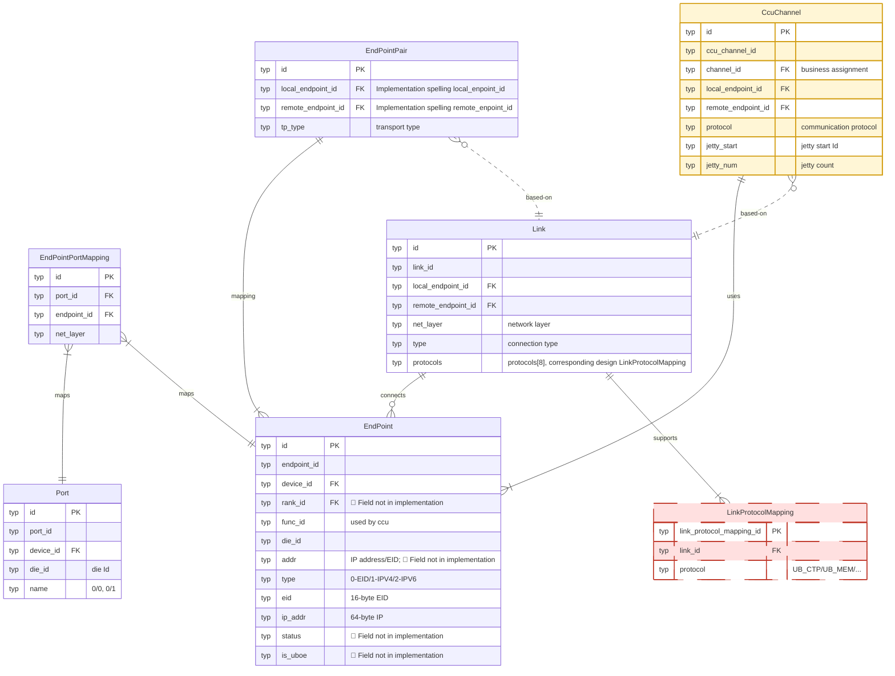
```mermaid
erDiagram
    %% ==========================================
    %% Network Topology and Connection Layer
    %% CcuChannel: only accessed by cmd dump, no writer in entire repo (empty table)
    %% ==========================================
    EndPoint {
        typ id PK
        typ endpoint_id
        typ device_id FK
        typ rank_id FK "🚧 Field not in implementation"
        typ func_id "used by ccu"
        typ die_id
        typ addr "IP address/EID; 🚧 Field not in implementation"
        typ type "0-EID/1-IPV4/2-IPV6"
        typ eid "16-byte EID"
        typ ip_addr "64-byte IP"
        typ status "🚧 Field not in implementation"
        typ is_uboe "🚧 Field not in implementation"
    }
    Port {
        typ id PK
        typ port_id
        typ device_id FK
        typ die_id "die Id"
        typ name "0/0, 0/1"
    }
    EndPointPortMapping {
        typ id PK
        typ port_id FK
        typ endpoint_id FK
        typ net_layer
    }
    %% Physical connections defined by topo.json
    Link {
        typ id PK
        typ link_id
        typ local_endpoint_id FK
        typ remote_endpoint_id FK
        typ net_layer "network layer"
        typ type "connection type"
        typ protocols "protocols[8], corresponding design LinkProtocolMapping"
    }
    LinkProtocolMapping {
        typ link_protocol_mapping_id PK
        typ link_id FK
        typ protocol "UB_CTP/UB_MEM/..."
    }

    EndPointPair {
        typ id PK
        typ local_endpoint_id FK "Implementation spelling local_enpoint_id"
        typ remote_endpoint_id FK "Implementation spelling remote_enpoint_id"
        typ tp_type "transport type"
    }
    CcuChannel {
        typ id PK
        typ ccu_channel_id
        typ channel_id FK   "business assignment"
        typ local_endpoint_id FK
        typ remote_endpoint_id FK
        typ protocol "communication protocol"
        typ jetty_start "jetty start Id"
        typ jetty_num "jetty count"
    }

    EndPointPortMapping }|--|| Port : maps
    EndPointPortMapping }|--|| EndPoint : maps
    Link ||--o{ EndPoint : connects
    Link ||--|{ LinkProtocolMapping : "supports"
    EndPointPair ||--|{ EndPoint : mapping
    EndPointPair }o..|| Link : "based-on"
    CcuChannel ||--|{ EndPoint : uses
    CcuChannel }o..|| Link : "based-on"

    classDef unimplemented fill:#ffe0e0,stroke:#c0392b,stroke-width:2px,stroke-dasharray:5 3
    classDef inproc fill:#fff6d6,stroke:#d4a017,stroke-width:2px
    class LinkProtocolMapping unimplemented
    class CcuChannel inproc
```

> `LinkProtocolMapping` is not an independent struct/table in the implementation, but rather the `Link.protocols[8]` array field (see `include/runnerdb/sim_models.h`) — handle as an array field when troubleshooting or creating tables, do not split into independent tables per this diagram.

#### 2.1.3 Key Relationship Description

##### Layer 1: Physical Topology Layer

| Relationship | Meaning | Description/Notes |
| --- | --- | --- |
| Server → Host | One Server may contain multiple Host instances | E.g., multi-socket CPU or virtualized environments |
| Server → Device | One Server contains multiple AI devices | Corresponds to /dev/davinci0, /dev/davinci1, etc. |

##### Layer 2: Process and Context Layer

| Relationship | Meaning | Description/Notes |
| --- | --- | --- |
| Host → Runner | Each host runs multiple application threads (Runner) | Each Runner can create multiple Contexts |
| Runner → Context | Thread creates or switches to different Contexts | Using aclrtCreateContext() and aclrtSetCurrentContext() |
| Context → Device | Context is bound to a Device | Cannot cross devices once created |
| Context → Stream | Each Context can create multiple Streams | Corresponds to aclrtCreateStream() |
| Runner ↔ Context (current) | Current context activation state | aclrtGetCurrentContext(), aclrtSetCurrentContext() |
| Device .. Stream | Resource upper limit constraint | Stream count is hardware-limited (`max_stream_cnt`, source `src/proxy/level2/aclrt_stream_stub.cc:244,287`) |

##### Layer 3: Device Internal Resource Layer

| Relationship | Meaning | Description/Notes |
| --- | --- | --- |
| Device → Port | Device contains multiple communication ports | Used for network topology connections, format such as "0/0, 0/1" |
| Device → Rank | Device is associated with communication Rank | Rank is the participating node identifier in the communication domain |
| Device → EndPoint | Device contains multiple endpoints | IP address/EID addressing identifiers, used for network communication |
| Device → Ccu | Device contains multiple CCU units | 910D is dual-die architecture, one CCU per die |
| Device → DeviceConnection | Inter-device communication channel | aclrtDeviceCanAccessPeer(), aclrtDeviceEnablePeerAccess() |

##### Network Communication Resource Layer

| Relationship | Meaning | Description/Notes |
| --- | --- | --- |
| EndPoint ↔ Port | Endpoint-to-port mapping | Many-to-many mapping via EndPointPortMapping |
| Link → EndPoint | Physical connection associated endpoints | Defined by topo.json, describing physical topology |
| Link → LinkProtocolMapping | Protocols supported by connection | One Link can support multiple protocols (UB_CTP/UB_MEM, etc.) |

#### 2.1.4 Interface Mapping Table

##### Basic and Device Layer (Device / Server)

| Entity/Attribute           | Key API Interfaces                                                                                         |
| --------------------------- | ---------------------------------------------------------------------------------------------------- |
| Server/Host                 | `aclInit`, `aclFinalize`                                                                             |
| Runner.pid                  | `rtDeviceGetBareTgid`                                                                                |
| Device                      | `rtGetDeviceCount`                                                                                   |
| Device.id             | `rtSetDevice`,`rtResetDevice`,`rtGetDevice`,`rtsGetLogicDevIdByPhyDevId`                             |
| Device.id          | `rtGetPhyDevIdByLogicDevId`                                                                          |
| Device.name             | `rtGetSocName`                                                                                       |
| Device.mode        | `rtSetDeviceSatMode`,`rtGetDeviceSatMode`                                                            |
| DeviceConnection            | `rtGetDevicesTopo`,`rtDeviceDisablePeerAccess`,`rtDeviceEnablePeerAccess`,`rtDevicePeerAccessStatus` |
| Context.id          | `rtCreateContext`,`rtDestroyContext`                                                                 |
| Context.default          | `rtSetCurrentContext`,`rtGetCurrentContext`                                                          |
| Context.addr | `rtCtxGetFloatOverflowAddr`                                                                          |
| Stream Table                    | `aclrtGetStreamAvailableNum`                                                                         |
| Stream.id            | `rtCreateStream`,`rtCreateStreamWithConfig`,`rtDestroyStream`,`rtDestroyStreamForce`                 |
| Stream.status | `rtSynchronizeStream`, `rtSynchronizeStreamWithTimeout`                                              |
| Stream.activated            | `rtStreamStop`                                                                                       |
| Stream.mode         | `rtSetStreamAttribute`,`rtGetStreamAttribute`                                                        |

### 2.2 Basic Memory Management Relationship Modeling

Local memory blocks and remote memory import (`RaCtxLmemRegister` / `RaCtxRmemImport`) corresponding interfaces are covered in [§4.1.4 Data Plane: UB Unified Bus](#414-data-plane-ub-unified-bus).

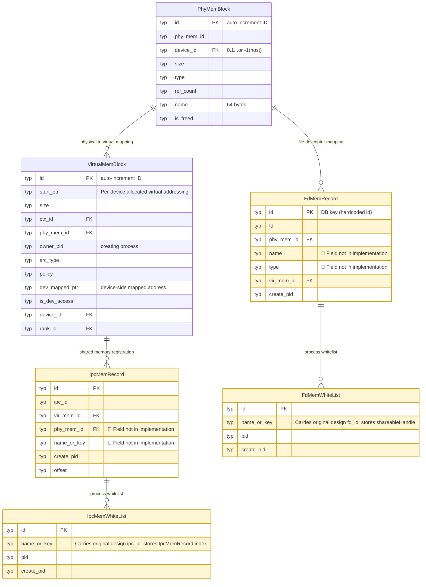
```mermaid
erDiagram
    %% 🧠 Process-private candidate: IpcMemRecord / IpcMemWhiteList / FdMemWhiteList (only accessed by src/proxy)
    %% FdMemRecord only cmd dump, no writer (empty table)
    PhyMemBlock ||--o{ VirtualMemBlock : "physical to virtual mapping"
    PhyMemBlock ||--o{ FdMemRecord : "file descriptor mapping"
    PhyMemBlock {
        typ id PK "auto-increment ID"
        typ phy_mem_id
        typ device_id FK "0,1...or -1(host)"
        typ size
        typ type
        typ ref_count
        typ name "64 bytes"
        typ is_freed
    }

    VirtualMemBlock {
        typ id PK "auto-increment ID"
        typ start_ptr "Per-device allocated virtual addressing"
        typ size
        typ ctx_id FK
        typ phy_mem_id FK
        typ owner_pid "creating process"
        typ src_type ""
        typ policy
        typ dev_mapped_ptr "device-side mapped address"
        typ is_dev_access
        typ device_id FK
        typ rank_id FK
    }

    VirtualMemBlock ||--o{ IpcMemRecord : "shared memory registration"
    IpcMemRecord {
        typ id PK
        typ ipc_id
        typ vir_mem_id FK
        typ phy_mem_id FK "🚧 Field not in implementation"
        typ name_or_key "🚧 Field not in implementation"
        typ create_pid
        typ offset
    }

    IpcMemRecord ||--o{ IpcMemWhiteList : "process whitelist"
    IpcMemWhiteList {
        typ id PK
        typ name_or_key "Carries original design ipc_id: stores IpcMemRecord index"
        typ pid
        typ create_pid
    }

    FdMemRecord {
        typ id PK "DB key (hardcoded id)"
        typ fd
        typ phy_mem_id FK
        typ name "🚧 Field not in implementation"
        typ type "🚧 Field not in implementation"
        typ vir_mem_id FK
        typ create_pid
    }

    FdMemRecord ||--o{ FdMemWhiteList : "process whitelist"
    FdMemWhiteList {
        typ id PK
        typ name_or_key "Carries original design fd_id: stores shareableHandle"
        typ pid
        typ create_pid
    }

    %%VirtualMemBlock ||--o{ MemMapRecord : "mapping relationship"
    %%MemMapRecord {
    %%    typ ptr FK
    %%    typ phy_mem_id FK
    %%}

    classDef inproc fill:#fff6d6,stroke:#d4a017,stroke-width:2px
    class IpcMemRecord,IpcMemWhiteList,FdMemRecord,FdMemWhiteList inproc
```

> **Database Table Names**: The entities in this diagram are stored in tables registered in `include/runnerdb/db_sim_sqlite_db.h`; use table names as the authority when querying/modifying tables — `PhyMemBlock`→`PhMem`, `VirtualMemBlock`→`VirMem`, `IpcMemWhiteList`→`IpMemWhiteList`; field names correspond to `include/runnerdb/sim_models.h`.

#### 2.2.1 Key Relationship Description (Basic Memory Management Relationship Modeling)

1. **Physical Memory's Core Role**.
   `PhyMemBlock` serves as the base entity, associating with all other entities via `phy_mem_id`, reflecting Huawei Ascend's "physical memory pooling" design philosophy.
2. **Three-Layer Mapping System**:

   - Physical→Virtual (`VirtualMemBlock`)
   - Physical→IPC Sharing (`IpcMemRecord`)
   - Physical→File Descriptor (`fdMemRecord`)
3. **Security Control**:
   `IpcMemWhiteList` implements Huawei HCCS (Huawei Collective Communication Service) secure sharing through process PID whitelists.
4. **Special Mapping Types**:
   `MemMapRecord` records dual virtual address mapping scenarios (e.g., mappings produced by `aclrtMapMem`), supporting Huawei NPU zero-copy data transfer.

#### 2.2.2 Interface Mapping Table (Basic Memory Management Relationship Modeling)

| Entity                           | Key Management Interfaces                                                                                                                                    |
| ------------------------------ | ----------------------------------------------------------------------------------------------------------------------------------------------- |
| PhyMemBlock                    | `rtMallocPhysical`, `rtFreePhysical`                                                                                                            |
| VirtualMemBlock            | `rtMallocWithCfg`,`rtMallocForTaskScheduler`,`rtMallocHostWithCfg`,`rtFree`,`rtReserveMemAddress`,`ReleaseMemAddress`, `rtMapMem`, `rtUnmapMem` |
| VirtualMemBlock.ctx_id | `rtPointerGetAttributes`                                                                                                                        |
| FdMemRecord.fd                 | `rtMemExportToShareableHandle`, `rtMemImportFromShareableHandle`                                                                                |
| FdMemWhiteList.pid             | `rtMemSetPidToShareableHandle`                                                                                                                  |
| IpcMemRecord.name_or_key       | `rtIpcMemGetExportKey`                                                                                                                          |
| IpcMemRecord.id            | `rtIpcMemImportByKey`,`IpcMemClose`                                                                                                             |
| IpcMemWhiteList.pid            | `rtIpcMemSetImportPid`                                                                                                                          |
| MemMapRecord                   | `rtHostRegister`, `rtHostUnRegister`                                                                                                            |

## 3. Extending Data Task Model on Top of Base Model

### 3.1 Data / Task Flow Modeling

Task arrangement on Streams; the Task family is carried by `Task` / `EventSyncTask` in the implementation, synchronization primitives are covered in [§3.3 Asynchronous / Synchronous Execution Modeling](#33-asynchronous--synchronous-execution-modeling).

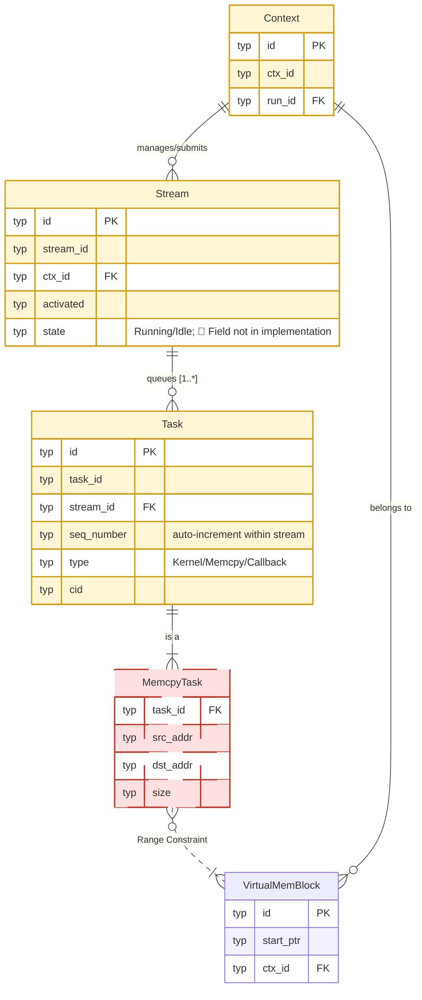
```mermaid
erDiagram
    Context {
        typ id PK
        typ ctx_id
        typ run_id FK
    }

    Stream {
        typ id PK
        typ stream_id
        typ ctx_id FK
        typ activated
        typ state "Running/Idle; 🚧 Field not in implementation"
    }
    %% Implementation has no state field; running state expressed by activated/capture_status/task_complete_status

    %% Stream contains an ordered task list
    Context ||--o{ Stream : "manages/submits"
    Stream ||--o{ Task : "queues [1..*]"

    Task {
        typ id PK
        typ task_id
        typ stream_id FK
        typ seq_number "auto-increment within stream"
        typ type "Kernel/Memcpy/Callback"
        typ cid
    }

    %% Various specific Task types (logical inheritance)
    MemcpyTask {
        typ task_id FK
        typ src_addr
        typ dst_addr
        typ size
    }

    %% Logical expression of inheritance (Task has multiple types)
    %% 🧠 Process-private candidate: Context / Stream / Task (only accessed by src/proxy)
    %% MemcpyTask distinguished by Task.type (implementation only creates Task table)
    Task ||--|{ MemcpyTask : "is a"

    %% MemcpyTask addresses should be addressable within VirtualMemBlock
    MemcpyTask }o..|{ VirtualMemBlock : "Range Constraint"
    VirtualMemBlock {
        typ id PK
        typ start_ptr
        typ ctx_id FK
    }

    VirtualMemBlock }o--|| Context : "belongs to"

    classDef unimplemented fill:#ffe0e0,stroke:#c0392b,stroke-width:2px,stroke-dasharray:5 3
    classDef inproc fill:#fff6d6,stroke:#d4a017,stroke-width:2px
    class MemcpyTask unimplemented
    class Context,Stream,Task inproc

```

### 3.2 CCU Resource Modeling

One NPU device contains 2 CCUs, for die0 and die1 respectively. CCU die-level hardware synchronization resources (Notify) are covered in [§3.3.1 Notify Resource Management](#331-notify-resource-management); UB-side context interfaces are covered in [§4.1.4 Data Plane: UB Unified Bus](#414-data-plane-ub-unified-bus).

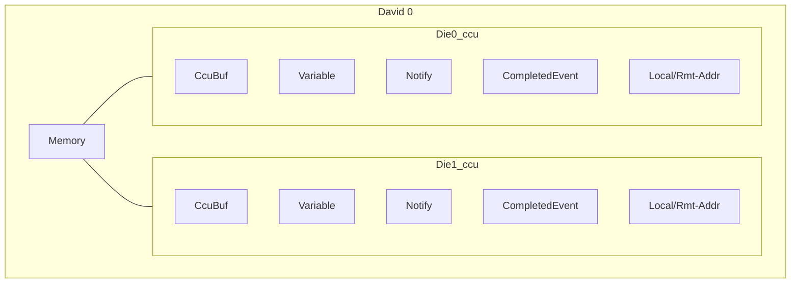
```mermaid
graph RL
    subgraph DavidDevice0[David 0]
        direction RL
        Memory0[Memory]
        David0Die0[Die0_ccu]
        David0Die1[Die1_ccu]
    end

    subgraph David0Die0[Die0_ccu]

        CcuBuf00[CcuBuf]
        Variable00[Variable]
        Notify00[Notify]
        CompletedEvent00[CompletedEvent]
        Local/Rmt-Addr00[Local/Rmt-Addr]
    end

    subgraph David0Die1[Die1_ccu]

        CcuBuf01[CcuBuf]
        Variable01[Variable]
        Notify01[Notify]
        CompletedEvent01[CompletedEvent]
        Local/Rmt-Addr01[Local/Rmt-Addr]
    end

    David0Die0---Memory0
    David0Die1---Memory0

```

#### 3.2.1 Interface Mapping Table (CCU Resource Modeling)

| Entity               | Key Management interfaces                                             |
| ------------------ | -------------------------------------------------------- |
| CcuBuf             | `rtCcuBufAlloc`, `rtCcuBufFree`, `rtCcuBufGetAddr`       |
| Variable           | `rtVariableCreate`, `rtVariableDestroy`, `rtVariableSet` |
| Notify             | `rtCreateNotify`, `rtDestroyNotify`                      |
| CompletedEvent     | `rtCreateEvent`, `rtDestroyEvent`                        |
| Local/Rmt-Addr     | `rtGetDeviceLocalAddr`, `rtGetDeviceRemoteAddr`          |
| CCU Resource Query        | `rtGetCcudieInfo`, `rtGetCcudieNum`                      |

#### 3.2.2 CCU Resource Lifecycle Description

**CCU Initialization Flow**:

1. At Device startup, two CCUs (die0/die1) are automatically initialized.
2. Each CCU is allocated independent CcuBuf, Variable, and Notify resource pools.
3. CompletedEvent is used to notify task completion status.

**Resource Constraints**:

- Each CCU has a limited number of CcuBuf (related to Device.version)
- Variable is used to store shared variables during communication.
- Notify is used for cross-CCU synchronization notification mechanism.
- Local/Rmt-Addr is used for address translation during cross-die communication.

> Note: The Notify inside CCU here is a die-level hardware synchronization resource (hcomm-side concept); it is not the same entity as the `Notify` entity managed by `rtCreateNotify` in §3.3.1 (Device/Context level, database table `sim::Notify`: `create_ctx_id` + `device_notify_seq`).

### 3.3 Asynchronous / Synchronous Execution Modeling

#### 3.3.1 [Notify Resource Management](https://www.hiascend.com/document/detail/zh/CANNCommunityEdition/850alpha001/appdevg/acldevg/aclcppdevg_000524.html)

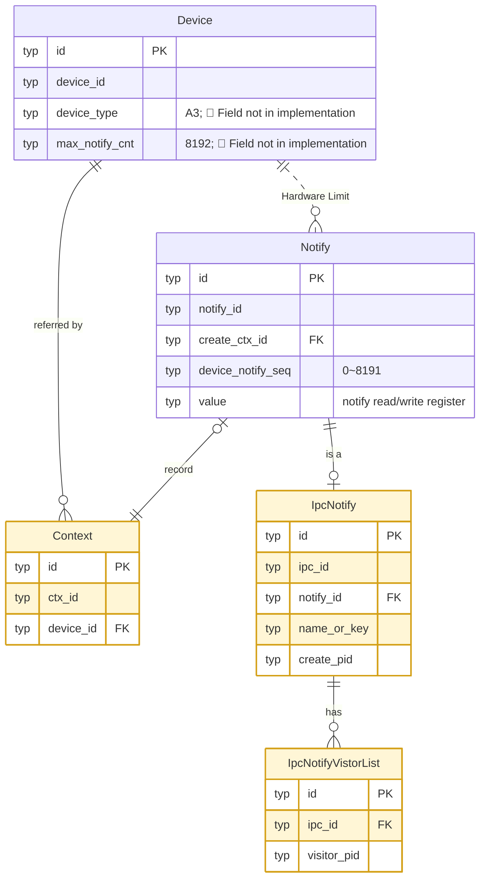
```mermaid
erDiagram
    %% 🧠 Process-private candidate: Context / IpcNotify / IpcNotifyVistorList (only accessed by src/proxy)
    Device ||..o{ Notify : "Hardware Limit"
    Device ||--o{ Context : "referred by"
    Device {
        typ id PK
        typ device_id
        typ device_type "A3; 🚧 Field not in implementation"
        typ max_notify_cnt "8192; 🚧 Field not in implementation"
    }
    Context {
        typ id PK
        typ ctx_id
        typ device_id FK
    }

    %% IpcNotify: IPC shared notification from the same source as Notify, not separately modeled in implementation
    Notify o|--|| Context : "record"
    Notify {
        typ id PK
        typ notify_id
        typ create_ctx_id FK
        typ device_notify_seq "0~8191"
        typ value "notify read/write register"
    }

    IpcNotify {
        typ id PK
        typ ipc_id
        typ notify_id FK
        typ name_or_key
        typ create_pid
    }

    Notify ||--o| IpcNotify : "is a"
    IpcNotify ||--o{ IpcNotifyVistorList : "has"
    IpcNotifyVistorList {
        typ id PK
        typ ipc_id FK
        typ visitor_pid
    }

    classDef inproc fill:#fff6d6,stroke:#d4a017,stroke-width:2px
    class Context,IpcNotify,IpcNotifyVistorList inproc
```

##### Key Relationship Description ([Notify Resource Management](https://www.hiascend.com/document/detail/zh/CANNCommunityEdition/850alpha001/appdevg/acldevg/aclcppdevg_000524.html))

**Notify and Device Hardware Constraints**:

- Each Device has a maximum Notify count of `max_notify_cnt` (e.g., 8192 for A3 chip, source `src/plugin/runner/runner_utils/device_resource.h:22 MAX_NOTIFY_NUM`)
- `device_notify_seq` is the physical index of Notify within the Device (0~8191)
- Notify must specify its owning Context when created, and Context is bound to a specific Device.

**Notify IPC Sharing Mechanism**:

- `IpcNotify` allows cross-process sharing of Notify instances.
- `name_or_key` is the sharing identifier, obtained via `rtNotifyGetExportKey`.
- Other processes import and use it via `rtNotifyImportByKey`.
- `IpcNotifyVistorList` records the PIDs of processes authorized to access the Notify.

**Notify State Management**:

- The `value` field maps to hardware registers, used for read/write status.
- `rtWaitAndResetNotify` waits for Notify to become Ready state and resets it.
- Notify is used for inter-Stream synchronization and cross-process synchronization scenarios.

##### Interface Mapping Table ([Notify Resource Management](https://www.hiascend.com/document/detail/zh/CANNCommunityEdition/850alpha001/appdevg/acldevg/aclcppdevg_000524.html))

| Entity                       | Key Management interfaces                                        |
| -------------------------- | --------------------------------------------------- |
| Notify.id           | `rtCreateNotify`,`rtDestroyNotify`,`rtGetNotifyId` |
| Notify.value               | `lrtWaitAndResetNotify`, `rtWaitAndResetNotify`     |
| IpcNotify.name_or_key      | `rtNotifyGetExportKey`,`rtNotifyImportByKey`        |
| IpcNotifyVistorList.ipc_id | `rtNotifySetImportPid`                              |

#### 3.3.2 Notify Synchronization Control

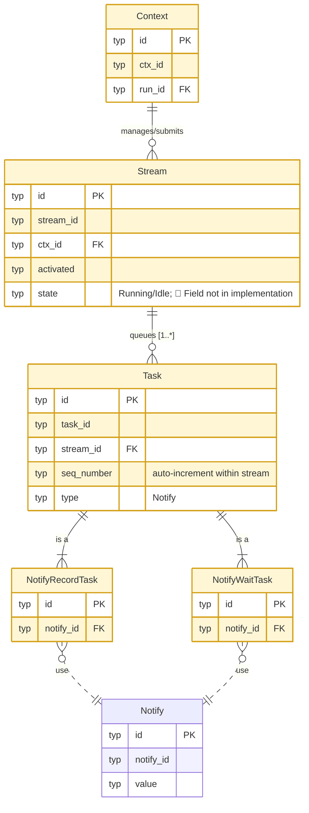
```mermaid
erDiagram
    Context {
        typ id PK
        typ ctx_id
        typ run_id FK
    }

    Stream {
        typ id PK
        typ stream_id
        typ ctx_id FK
        typ activated
        typ state "Running/Idle; 🚧 Field not in implementation"
    }
    %% Implementation has no state field; running state expressed by activated/capture_status/task_complete_status

    %% Stream contains an ordered task list
    Context ||--o{ Stream : "manages/submits"
    Stream ||--o{ Task : "queues [1..*]"

    Task {
        typ id PK
        typ task_id
        typ stream_id FK
        typ seq_number "auto-increment within stream"
        typ type "Notify"
    }

    %% Various specific Task types (logical inheritance)
    NotifyRecordTask {
        typ id PK
        typ notify_id FK

    }

    NotifyWaitTask {
        typ id PK
        typ notify_id FK
    }

    NotifyRecordTask }o..|| Notify : "use"
    NotifyWaitTask }o..|| Notify : "use"
    Notify {
        typ id PK
        typ notify_id
        typ value
    }
    %% Logical expression of inheritance (Task has multiple types)
    %% 🧠 Process-private candidate: Context / Stream / Task (only accessed by src/proxy)
    %% NotifyRecordTask/NotifyWaitTask distinguished by Task.type (implementation only creates Task table)
    Task ||--|{ NotifyRecordTask : "is a"
    Task ||--|{ NotifyWaitTask : "is a"

    classDef inproc fill:#fff6d6,stroke:#d4a017,stroke-width:2px
    class Context,Stream,Task,NotifyRecordTask,NotifyWaitTask inproc
```

##### Key Relationship Description (Notify Synchronization Control)

**Notify Task Types**:

- `NotifyRecordTask`: Sets the Notify status to Ready, indicating that an event has completed.
- `NotifyWaitTask`: Waits for Notify status to become Ready, implementing inter-Stream synchronization.

**Task Execution Order**:

- NotifyRecordTask executes on StreamA, setting Notify to Ready.
- NotifyWaitTask executes on StreamB, waiting for the same Notify.
- StreamB's subsequent tasks can only continue executing after Notify becomes Ready.

**Cross-Stream Synchronization Example**:

```text
StreamA: Task1 -> NotifyRecordTask(notify_id=1) -> Task2
StreamB: NotifyWaitTask(notify_id=1) -> Task3
// Task3 must wait for Task1 to complete before executing
```

##### Interface Mapping Table (Notify Synchronization Control)

| Entity             | Key Management interfaces            |
| ---------------- | ----------------------- |
| NotifyRecordTask | `rtRecordNotify`        |
| NotifyWaitTask   | `lrtWaitAndResetNotify` |

#### 3.3.3 Event Resource Management

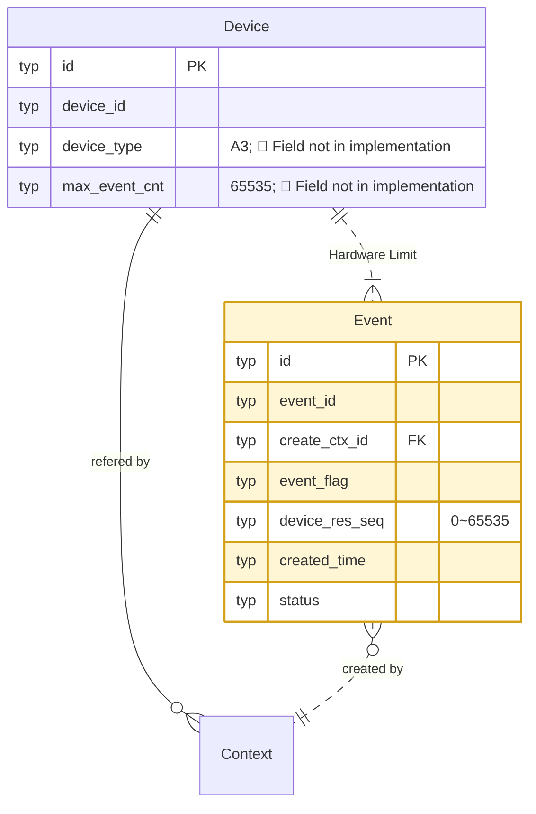
```mermaid
erDiagram
    %% 🧠 Process-private candidate: Event (only accessed by src/proxy)
    Device ||..|{ Event : "Hardware Limit"
    Device ||--o{ Context : "refered by"
    Device {
        typ id PK
        typ device_id
        typ device_type "A3; 🚧 Field not in implementation"
        typ max_event_cnt "65535; 🚧 Field not in implementation"
    }

    Event }o..|| Context : "created by"
    Event {
        typ id PK
        typ event_id
        typ create_ctx_id FK
        typ event_flag
        typ device_res_seq "0~65535"
        typ created_time
        typ status
    }

    classDef inproc fill:#fff6d6,stroke:#d4a017,stroke-width:2px
    class Event inproc
```

##### Key Relationship Description (Event Resource Management)

**Event and Device Hardware Constraints**:

- Each Device has a maximum Event count of `max_event_cnt` (e.g., 65535 for A3 chip, source `src/proxy/level2/aclrt_event_stub.cc:191,220`)
- `device_res_seq` is the physical index of Event within the Device (0~65535)
- Event must specify its owning Context when created, and Context is bound to a specific Device.

**Event and Context Relationship**:

- `create_ctx_id` records the Context in which the Event was created.
- Events can be shared across multiple Streams, but must belong to the same Context.
- Cross-Context Event sharing requires IPC mechanisms (similar to Notify)

**Event State Management**:

- The `status` field indicates the current Event state: NotRecorded/Recorded/Completed.
- `event_flag` is used to control Event behavior (e.g., whether to auto-reset)
- `created_time` is used for performance statistics.

##### Interface Mapping Table (Event Resource Management)

| Entity           | Key Management interfaces                                                             |
| -------------- | ------------------------------------------------------------------------ |
| Event.id | `rtCreateEvent`, `rtCreateEventWithFlag`,`rtDestroyEvent`,`rtGetEventId` |
| Event.status   | `rtRecordEvent`,`rtQueryEventStatus`                                     |

#### 3.3.4 Event Flow Control

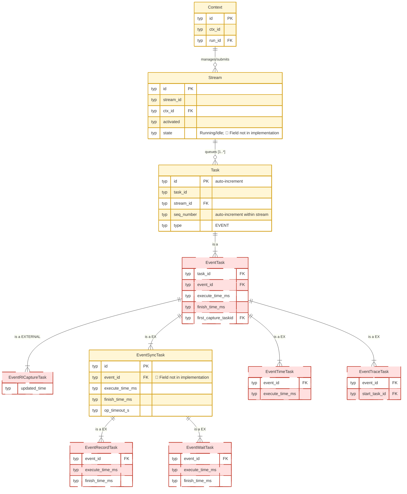
```mermaid
erDiagram
    Context {
        typ id PK
        typ ctx_id
        typ run_id FK
    }

    Stream {
        typ id PK
        typ stream_id
        typ ctx_id FK
        typ activated
        typ state "Running/Idle; 🚧 Field not in implementation"
    }
    %% Implementation has no state field; running state expressed by activated/capture_status/task_complete_status

    %% Stream contains an ordered task list
    Context ||--o{ Stream : "manages/submits"
    Stream ||--o{ Task : "queues [1..*]"

    Task {
        typ id PK "auto-increment"
        typ task_id
        typ stream_id FK
        typ seq_number "auto-increment within stream"
        typ type "EVENT"
    }

    %% Various specific Task types (logical inheritance)
    EventTask {
        typ task_id FK
        typ event_id FK
        typ execute_time_ms
        typ finish_time_ms
        typ first_capture_taskid FK
    }

    EventRICaptureTask {
        typ updated_time
    }

    EventSyncTask {
        typ id PK
        typ event_id FK "🚧 Field not in implementation"
        typ execute_time_ms
        typ finish_time_ms
        typ op_timeout_s
    }
    EventRecordTask {
        typ event_id FK
        typ execute_time_ms
        typ finish_time_ms
    }
    EventWaitTask {
        typ event_id FK
        typ execute_time_ms
        typ finish_time_ms
    }
    EventTimeTask {
        typ event_id FK
        typ execute_time_ms
    }
    EventTraceTask {
        typ event_id FK
        typ start_task_id FK
    }

    %% 🧠 Process-private candidate: Context / Stream / Task (only accessed by src/proxy)
    %% Logical expression of inheritance (Task has multiple types): distinguished by Task.type, implementation only creates Task table
    Task ||--|{ EventTask : "is a "
    EventTask ||--|{ EventRICaptureTask : "is a EXTERNAL"
    EventTask ||--|{ EventSyncTask : "is a EX"
    EventTask ||--|{ EventTimeTask : "is a EX"
    EventTask ||--|{ EventTraceTask : "is a EX"
    EventSyncTask ||--|{ EventRecordTask : "is a EX"
    EventSyncTask ||--|{ EventWaitTask : "is a EX"

    classDef unimplemented fill:#ffe0e0,stroke:#c0392b,stroke-width:2px,stroke-dasharray:5 3
    classDef inproc fill:#fff6d6,stroke:#d4a017,stroke-width:2px
    class EventTask,EventRICaptureTask,EventRecordTask,EventWaitTask,EventTimeTask,EventTraceTask unimplemented
    class Context,Stream,Task,EventSyncTask inproc
```

##### Key Relationship Description (Event Flow Control)

**Event Task Type Classification**:

- `EventRecordTask`: Sets the Event status to Recorded/Completed.
- `EventWaitTask`: Waits for Event status to become Completed.
- `EventSyncTask`: Synchronously waits for Event completion (blocking call)
- `EventRICaptureTask`: Special recording task in RI Capture mode.
- `EventTimeTask`: Timestamp recording related task.
- `EventTraceTask`: Task record used for performance tracing.

**Event Task Inheritance Hierarchy**:

- `EventTask` is the base class, containing task-id, event-id, execute-time, finish-time. 🚧 (Implementation `EventSyncTask` has no `task_id`/`event_id`, Event identity is `Event.id`; time field implementation names are `execute_time_ms`/`finish_time_ms`)
- `EventSyncTask` inherits EventTask, adding op_timeout_s timeout parameter.
- `EventRecordTask` and `EventWaitTask` inherit EventSyncTask.
- `EventRICaptureTask`, `EventTimeTask`, `EventTraceTask` directly inherit EventTask.

**Event Execution Flow**:

```text
StreamA: KernelTask -> EventRecordTask(event_id=1)
StreamB: EventWaitTask(event_id=1) -> KernelTask2
// StreamB's KernelTask2 must wait for StreamA's KernelTask to complete
```

**Task Tracing Relationships**:

- `first_capture_task_id` records the Task ID of the first Capture.
- `EventTraceTask.id` associates with the tracing start task.
- EventRecordTask maps through EventWaitTask to implement cross-Stream synchronization.

##### Interface Mapping Table (Event Flow Control)

| Entity            | Key Management interfaces                                         |
| --------------- | ---------------------------------------------------- |
| EventTask       | `rtRecordEvent`, `rtResetEvent`,`rtSynchronizeEvent` |
| EventRecordTask | `rtRecordEvent`, `rtResetEvent`                      |
| EventWaitTask   | `rtStreamWaitEvent`, `rtQueryEventWaitStatus`        |
| EventTimeTask   | `rtResetEvent`, `rtRecordEvent`                      |
| EventTraceTask  | `rtResetEvent`, `rtRecordEvent`                      |

## 4. Communication Domain Modeling

Cross-machine communication involves hybrid task orchestration across multiple communication domains.
The essence of a communication domain is a multi-card network topology maintained in the host process by HCCL at the framework layer through the link-establishment capability provided by Rdma_Agent. Interface lists for each plane are covered in [§4.1.8 HCCP Interface Classification](#418-hccp-interface-classification).

### 4.1 Communication Domain Core Concepts

A Communicator is the basic abstraction for HCCL collective communication. Each communication domain defines a set of participating Ranks and their topology relationships. Rank / EndPoint entity modeling is covered in [§2.1.2 Network Communication Resources](#212-network-communication-resources).

#### 4.1.1 Communication Domain Basic Definition

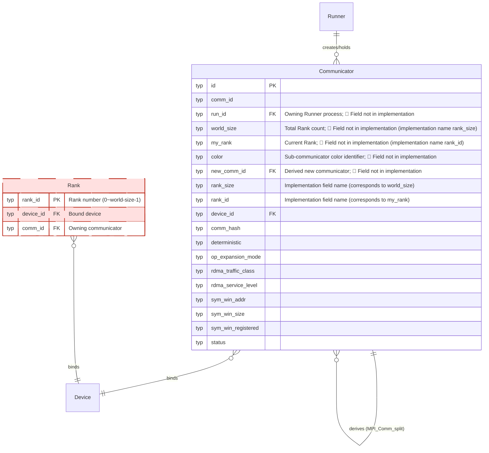
```mermaid
erDiagram
    %% ==========================================
    %% Communication Domain Definition (HCCL Communicator)
    %% ==========================================
    Communicator {
        typ id PK
        typ comm_id
        typ run_id FK "Owning Runner process; 🚧 Field not in implementation"
        typ world_size "Total Rank count; 🚧 Field not in implementation (implementation name rank_size)"
        typ my_rank "Current Rank; 🚧 Field not in implementation (implementation name rank_id)"
        typ color "Sub-communicator color identifier; 🚧 Field not in implementation"
        typ new_comm_id FK "Derived new communicator; 🚧 Field not in implementation"
        typ rank_size "Implementation field name (corresponds to world_size)"
        typ rank_id "Implementation field name (corresponds to my_rank)"
        typ device_id FK
        typ comm_hash
        typ deterministic
        typ op_expansion_mode
        typ rdma_traffic_class
        typ rdma_service_level
        typ sym_win_addr
        typ sym_win_size
        typ sym_win_registered
        typ status
    }
    Rank {
        typ rank_id PK "Rank number (0~world-size-1)"
        typ device_id FK "Bound device"
        typ comm_id FK "Owning communicator"
    }
    Runner ||--o{ Communicator : "creates/holds"
    Communicator }o--|| Device : "binds"
    Rank }o--|| Device : "binds"
    Communicator ||--o{ Communicator : "derives (MPI_Comm_split)"

    classDef unimplemented fill:#ffe0e0,stroke:#c0392b,stroke-width:2px,stroke-dasharray:5 3
    class Rank unimplemented
```

#### 4.1.2 Control Plane: Socket Communication

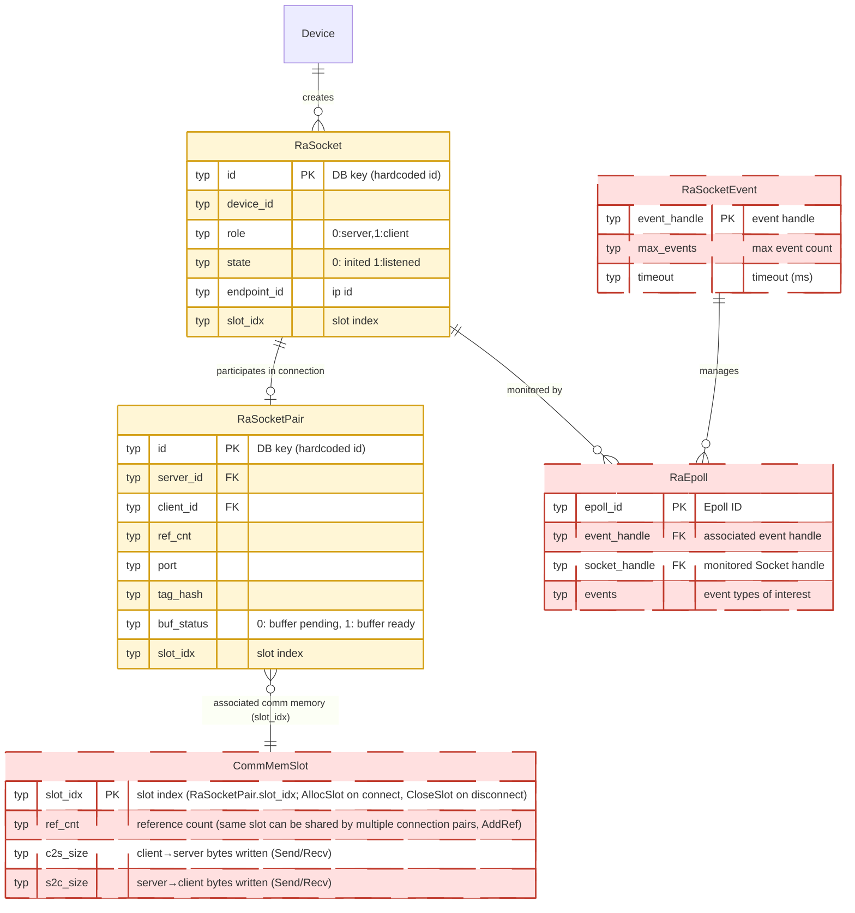
```mermaid
erDiagram
    %% ==========================================
    %% Socket Communication (RaSocket Series Interfaces)
    %% 🧠 Process-private candidate: RaSocketPair (only accessed by src/proxy; RaSocket in same section is 🧊)
    %% 🧊 RaSocket table: zero references in entire repo (only registered, no read/write) — no need to persist to DB
    %% ==========================================
    Device ||--o{ RaSocket : creates
    %% 🧊 Zero-reference table: only has struct and registration entry, no DB read/write
    RaSocket {
        typ id PK "DB key (hardcoded id)"
        typ device_id
        typ role "0:server,1:client"
        typ state "0: inited 1:listened"
        typ endpoint_id "ip id"
        typ slot_idx "slot index"
    }
    RaSocketPair {
        typ id PK "DB key (hardcoded id)"
        typ server_id FK
        typ client_id FK
        typ ref_cnt
        typ port
        typ tag_hash
        typ buf_status "0: buffer pending, 1: buffer ready"
        typ slot_idx "slot index"
    }
    RaSocket ||--o| RaSocketPair : "participates in connection"
    RaSocketPair }o--|| CommMemSlot : "associated comm memory (slot_idx)"

    %% store layer communication memory pool: mmap shared memory divided by slots (store_sim_comm_memory_manager.h), not a RunnerDB registered table
    CommMemSlot {
        typ slot_idx PK "slot index (RaSocketPair.slot_idx; AllocSlot on connect, CloseSlot on disconnect)"
        typ ref_cnt "reference count (same slot can be shared by multiple connection pairs, AddRef)"
        typ c2s_size "client→server bytes written (Send/Recv)"
        typ s2c_size "server→client bytes written (Send/Recv)"
    }

    %% Socket Event Management (Epoll mechanism)
    RaSocketEvent {
        typ event_handle PK "event handle"
        typ max_events "max event count"
        typ timeout "timeout (ms)"
    }
    RaEpoll {
        typ epoll_id PK "Epoll ID"
        typ event_handle FK "associated event handle"
        typ socket_handle FK "monitored Socket handle"
        typ events "event types of interest"
    }
    RaSocketEvent ||--o{ RaEpoll : "manages"
    RaSocket ||--o{ RaEpoll : "monitored by"

    classDef unimplemented fill:#ffe0e0,stroke:#c0392b,stroke-width:2px,stroke-dasharray:5 3
    classDef inproc fill:#fff6d6,stroke:#d4a017,stroke-width:2px
    class CommMemSlot,RaSocketEvent,RaEpoll unimplemented
    class RaSocket,RaSocketPair inproc
```

#### 4.1.3 Data Plane: RDMA Communication

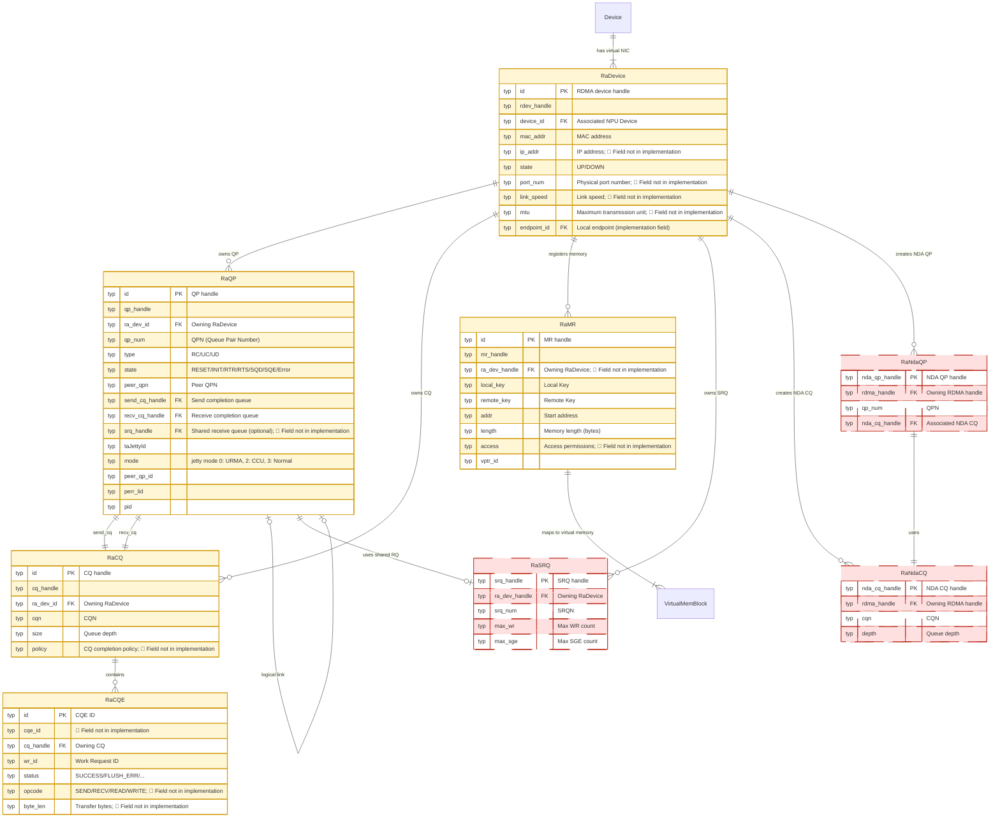
```mermaid
erDiagram
    %% ==========================================
    %% RDMA Devices and Resources (RaRdev, RaQp, RaMr Interfaces)
    %% 🧠 Process-private candidate: RaQP / RaCQ / RaCQE / RaMR / RaDevice (only accessed by src/proxy; RaQP has peer filtering)
    %% ==========================================
    Device ||--|{ RaDevice : "has virtual NIC"
    RaDevice {
        typ id PK "RDMA device handle"
        typ rdev_handle
        typ device_id FK "Associated NPU Device"
        typ mac_addr "MAC address"
        typ ip_addr "IP address; 🚧 Field not in implementation"
        typ state "UP/DOWN"
        typ port_num "Physical port number; 🚧 Field not in implementation"
        typ link_speed "Link speed; 🚧 Field not in implementation"
        typ mtu "Maximum transmission unit; 🚧 Field not in implementation"
        typ endpoint_id FK "Local endpoint (implementation field)"
    }

    %% RDMA core: QP (Queue Pair)
    RaQP {
        typ id PK "QP handle"
        typ qp_handle
        typ ra_dev_id FK "Owning RaDevice"
        typ qp_num "QPN (Queue Pair Number)"
        typ type "RC/UC/UD"
        typ state "RESET/INIT/RTR/RTS/SQD/SQE/Error"
        typ peer_qpn "Peer QPN"
        typ send_cq_handle FK "Send completion queue"
        typ recv_cq_handle FK "Receive completion queue"
        typ srq_handle FK "Shared receive queue (optional); 🚧 Field not in implementation"
        typ taJettyId
        typ mode "jetty mode 0: URMA, 2: CCU, 3: Normal"
        typ peer_qp_id
        typ perr_lid
        typ pid
    }
    RaDevice ||--o{ RaQP : "owns QP"
    RaQP ||--|| RaCQ : "send_cq"
    RaQP ||--|| RaCQ : "recv_cq"
    RaQP |o--o| RaQP : "logical link"
    RaQP ||--o| RaSRQ : "uses shared RQ"

    %% Completion Queue CQ
    RaCQ {
        typ id PK "CQ handle"
        typ cq_handle
        typ ra_dev_id FK "Owning RaDevice"
        typ cqn "CQN"
        typ size "Queue depth"
        typ policy "CQ completion policy; 🚧 Field not in implementation"
    }
    RaCQE {
        typ id PK "CQE ID"
        typ cqe_id "🚧 Field not in implementation"
        typ cq_handle FK "Owning CQ"
        typ wr_id "Work Request ID"
        typ status "SUCCESS/FLUSH_ERR/..."
        typ opcode "SEND/RECV/READ/WRITE; 🚧 Field not in implementation"
        typ byte_len "Transfer bytes; 🚧 Field not in implementation"
    }
    RaDevice ||--o{ RaCQ : "owns CQ"
    RaCQ ||--o{ RaCQE : "contains"

    %% Memory Registration MR
    RaMR {
        typ id PK "MR handle"
        typ mr_handle
        typ ra_dev_handle FK "Owning RaDevice; 🚧 Field not in implementation"
        typ local_key "Local Key"
        typ remote_key "Remote Key"
        typ addr "Start address"
        typ length "Memory length (bytes)"
        typ access "Access permissions; 🚧 Field not in implementation"
        typ vptr_id
    }
    RaDevice ||--o{ RaMR : "registers memory"
    RaMR ||--|{ VirtualMemBlock : "maps to virtual memory"

    %% Shared Receive Queue SRQ
    RaSRQ {
        typ srq_handle PK "SRQ handle"
        typ ra_dev_handle FK "Owning RaDevice"
        typ srq_num "SRQN"
        typ max_wr "Max WR count"
        typ max_sge "Max SGE count"
    }
    RaDevice ||--o{ RaSRQ : "owns SRQ"

    %% NDA Direct Access
    RaNdaCQ {
        typ nda_cq_handle PK "NDA CQ handle"
        typ rdma_handle FK "Owning RDMA handle"
        typ cqn "CQN"
        typ depth "Queue depth"
    }
    RaNdaQP {
        typ nda_qp_handle PK "NDA QP handle"
        typ rdma_handle FK "Owning RDMA handle"
        typ qp_num "QPN"
        typ nda_cq_handle FK "Associated NDA CQ"
    }
    RaDevice ||--o{ RaNdaCQ : "creates NDA CQ"
    RaDevice ||--o{ RaNdaQP : "creates NDA QP"
    RaNdaQP ||--|| RaNdaCQ : "uses"

    classDef unimplemented fill:#ffe0e0,stroke:#c0392b,stroke-width:2px,stroke-dasharray:5 3
    classDef inproc fill:#fff6d6,stroke:#d4a017,stroke-width:2px
    class RaSRQ,RaNdaCQ,RaNdaQP unimplemented
    class RaDevice,RaQP,RaCQ,RaCQE,RaMR inproc
```

#### 4.1.4 Data Plane: UB Unified Bus

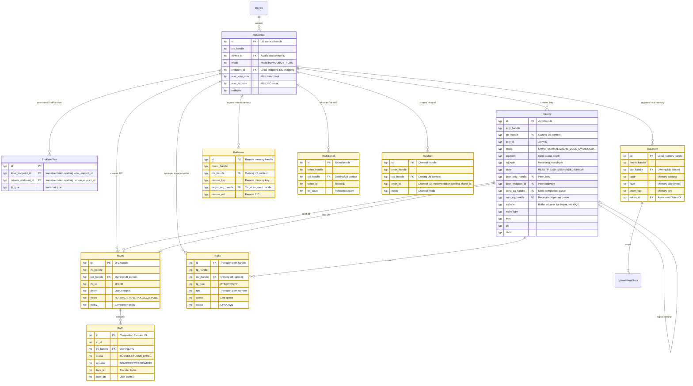
```mermaid
erDiagram
    %% ==========================================
    %% UB Context (RaContext Series Interfaces)
    %% 🧠 Process-private candidate: RaChan / RaLmem / RaRmem / RaTokenId / RaTp (only accessed by src/proxy)
    %% RaCr / RaJfc: only accessed by cmd dump, no writer in entire repo (empty tables)
    %% ==========================================
    Device ||--o{ RaContext : creates
    RaContext {
        typ id PK "UB context handle"
        typ ctx_handle
        typ device_id FK "Associated device ID"
        typ mode "Mode:RDMA/UB/UB_PLUS"
        typ endpoint_id FK "Local endpoint, EID mapping"
        typ max_jetty_num "Max Jetty count"
        typ max_jfc_num "Max JFC count"
        typ eidIndex
    }

    EndPointPair {
        typ id PK
        typ local_endpoint_id FK "Implementation spelling local_enpoint_id"
        typ remote_endpoint_id FK "Implementation spelling remote_enpoint_id"
        typ tp_type "transport type"
    }

    %% UB core resources
    RaContext ||--o{ RaJetty : "creates Jetty"
    RaContext ||--o{ RaJfc : "creates JFC"
    RaContext ||--o{ RaLmem : "registers local memory"
    RaContext ||--o{ RaRmem : "imports remote memory"
    RaContext ||--o{ RaTp : "manages transport paths"
    RaContext ||--o{ RaTokenId : "allocates TokenID"
    RaContext ||--o{ RaChan : "creates channel"
    RaContext ||--o{ EndPointPair : "associates EndPointPair"

    %% Jetty (QP equivalent)
    RaJetty {
        typ id PK "Jetty handle"
        typ jetty_handle
        typ ctx_handle FK "Owning UB context"
        typ jetty_id "Jetty ID"
        typ mode "URMA_NORMAL/CACHE_LOCK_DWQE/CCU/..."
        typ sqDepth "Send queue depth"
        typ rqDepth "Receive queue depth"
        typ state "RESET/READY/SUSPENDED/ERROR"
        typ peer_jetty_handle FK "Peer Jetty"
        typ peer_endpoint_id FK "Peer EndPoint"
        typ send_cq_handle FK "Send completion queue"
        typ recv_cq_handle FK "Receive completion queue"
        typ sqBuffer "Buffer address for dispatched WQE"
        typ sqBufType
        typ type
        typ pid
        typ dieId
    }
    RaJetty ||--o| RaJfc : "send_jfc"
    RaJetty ||--o| RaJfc : "recv_jfc"
    RaJetty |o--o| RaJetty : "logical binding"

    %% JFC (CQ equivalent)
    RaJfc {
        typ id PK "JFC handle"
        typ jfc_handle
        typ ctx_handle FK "Owning UB context"
        typ jfc_id "JFC ID"
        typ depth "Queue depth"
        typ mode "NORMAL/STARS_POLL/CCU_POLL"
        typ policy "Completion policy"
    }
    RaCr {
        typ id PK "Completion Request ID"
        typ cr_id
        typ jfc_handle FK "Owning JFC"
        typ status "SUCCESS/FLUSH_ERR/..."
        typ opcode "SEND/RECV/READ/WRITE"
        typ byte_len "Transfer bytes"
        typ user_ctx "User context"
    }
    RaJfc ||--o{ RaCr : "contains"

    %% Local memory registration
    RaLmem {
        typ id PK "Local memory handle"
        typ lmem_handle
        typ ctx_handle FK "Owning UB context"
        typ addr "Memory address"
        typ size "Memory size (bytes)"
        typ mem_key "Memory key"
        typ token_id FK "Associated TokenID"
    }
    RaLmem ||--|{ VirtualMemBlock : "maps"

    %% Remote memory import
    RaRmem {
        typ id PK "Remote memory handle"
        typ rmem_handle
        typ ctx_handle FK "Owning UB context"
        typ remote_key "Remote memory key"
        typ target_seg_handle FK "Target segment handle"
        typ remote_eid "Remote EID"
    }

    %% Transport path
    RaTp {
        typ id PK "Transport path handle"
        typ tp_handle
        typ ctx_handle FK "Owning UB context"
        typ tp_type "RTP/CTP/UTP"
        typ tpn "Transport path number"
        typ speed "Link speed"
        typ status "UP/DOWN"
    }
    RaJetty ||--o{ RaTp : "uses"

    %% TokenID
    RaTokenId {
        typ id PK "Token handle"
        typ token_handle
        typ ctx_handle FK "Owning UB context"
        typ token_id "Token ID"
        typ ref_count "Reference count"
    }

    RaChan {
        typ id PK "Channel handle"
        typ chan_handle
        typ ctx_handle FK "Owning UB context"
        typ chan_id "Channel ID; implementation spelling chann_id"
        typ mode "Channel mode"
    }

    classDef inproc fill:#fff6d6,stroke:#d4a017,stroke-width:2px
    class RaJfc,RaCr,RaLmem,RaRmem,RaTp,RaTokenId,RaChan inproc
```

#### 4.1.5 Asynchronous Request Management

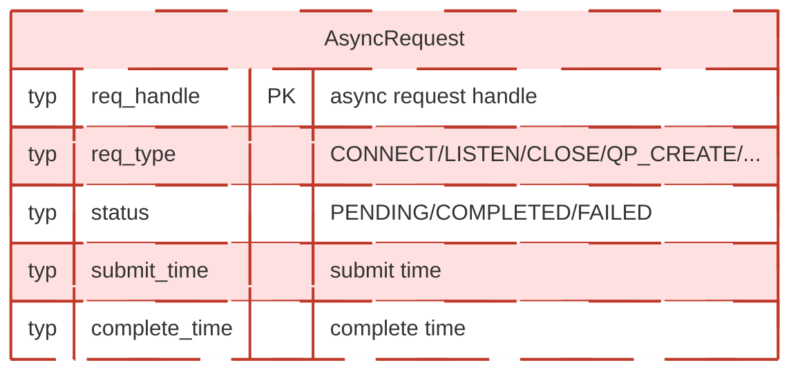
```mermaid
erDiagram
    AsyncRequest {
        typ req_handle PK "async request handle"
        typ req_type "CONNECT/LISTEN/CLOSE/QP_CREATE/..."
        typ status "PENDING/COMPLETED/FAILED"
        typ submit_time "submit time"
        typ complete_time "complete time"
    }

    classDef unimplemented fill:#ffe0e0,stroke:#c0392b,stroke-width:2px,stroke-dasharray:5 3
    class AsyncRequest unimplemented
```

> Note: `AsyncRequest` is an internal implementation object and does not need to be modeled currently (no corresponding struct or database table).

#### 4.1.6 Communication Domain Architecture Summary

```text
┌─────────────────────────────────────────────────────────────────┐
│                    HCCL Communication Domain Architecture        │
├─────────────────────────────────────────────────────────────────┤
│  Application Layer                                               │
│  ┌──────────────────────────────────────────────────────────┐   │
│  │  Communicator                                             │   │
│  │  └── Rank[0..N] (Participating nodes, each bound to a Device) │
│  └──────────────────────────────────────────────────────────┘   │
├─────────────────────────────────────────────────────────────────┤
│  Control Plane (Link Establishment / Handshake)                  │
│  ┌──────────────────────────────────────────────────────────┐   │
│  │  RaSocket (Socket Communication)                          │   │
│  │  ├── RaSocketPair (Connection Pairs)                      │   │
│  │  └── RaEpoll (Event Monitoring)                           │   │
│  └──────────────────────────────────────────────────────────┘   │
├─────────────────────────────────────────────────────────────────┤
│  Data Plane (Data Transfer)                                     │
│  ┌─────────────────────┐    ┌─────────────────────┐            │
│  │  RDMA (Legacy Mode)  │    │  UB (Unified Bus)   │            │
│  │  ├── RaDevice        │    │  ├── RaContext      │            │
│  │  ├── RaQP (Queue Pair)│   │  ├── RaJetty (QP)   │            │
│  │  ├── RaCQ (Completion │    │  ├── RaJfc (CQ)     │            │
│  │  │   Queue)           │    │  │                   │            │
│  │  ├── RaMR (Memory     │    │  ├── RaLmem/Rmem    │            │
│  │  │   Registration)    │    │  └── RaTp (Transport │            │
│  │  └── RaSRQ (Shared RQ)│    │      Path)           │            │
│  └─────────────────────┘    └─────────────────────┘            │
└─────────────────────────────────────────────────────────────────┘
```

#### 4.1.7 Key Entity Comparison Table

| Concept | RDMA Mode | UB Mode | Description |
| --- | --- | --- | --- |
| Context | RaDevice | RaContext | Device/context handle |
| Queue Pair | RaQP | RaJetty | Data transfer channel |
| Completion Queue | RaCQ | RaJfc | Completion notification |
| Completion Element | RaCQE | RaCr | Completion status |
| Local Memory | RaMR | RaLmem | Memory registration |
| Remote Memory | - | RaRmem | Remote memory import |
| Transport Path | - | RaTp | Physical path management |
| Security Token | - | RaTokenId | Access control |

#### 4.1.8 HCCP Interface Classification

> Table "Implementation" column: paths omit common prefix `src/proxy/level2/`; `hcomm/ only` means no implementation in this repo (implementation is in `hcomm/src/base_comm/resources/hccp/inc/network/hccp_nda.h`); 🚧 means not modeled.

```text
HCCP Network API
├── Control Plane (Socket Communication)
|   ├── Initialization: RaSocketInit/RaSocketDeinit (Socket)
│   ├── Connection Management: RaSocketBatchConnect/Close/Abort
│   ├── Listen Management: RaSocketListenStart/Stop
│   ├── Data Send/Recv: RaSocketSend/Recv
│   ├── Status Query: RaGetSockets
│   └── Event Management: RaEpollCtlAdd/Mod/Del
├── Data Plane - RDMA
|   ├── Initialization: RaRdevInit/RaRdevDeinit (RDMA device)
│   ├── QP Management: RaQpCreate/Destroy/ConnectAsync
│   ├── CQ Management: RaCqCreate/Destroy
│   ├── MR Management: RaMrReg/Dereg
│   ├── Work Requests: RaSendWr/RaRecvWrlist
│   └── Completion Polling: RaPollCq
├── Data Plane - UB
|   ├── Initialization: RaCtxInit/RaCtxDeinit (Unified context)
│   ├── Jetty Management: RaCtxQpCreate/Destroy/Import/Bind
│   ├── JFC Management: RaCtxCqCreate/Destroy
│   ├── Memory Management: RaCtxLmemRegister/RmemImport
│   ├── Token Management: RaCtxTokenIdAlloc/Free
│   └── Work Requests: RaBatchSendWr
├── Asynchronous Operations
│   ├── RaSocketBatchConnectAsync
│   ├── RaCtxQpCreateAsync/DestroyAsync
│   └── RaGetAsyncReqResult
├── Network Diagnostics
|   ├── RaPingInit/RaPingDeinit (Ping)
│   ├── RaPingTargetAdd/Del
│   ├── RaPingTaskStart/Stop
│   └── RaPingGetResults
└── TLV Messages
|   ├── RaTlvInit/RaTlvDeinit (TLV)
    └── RaTlvRequest
```

##### Socket Communication Interfaces

| Interface                   | Function           | Key Parameters                                                                 | Implementation |
| ---------------------- | -------------- | ------------------------------------------------------------------------ | -------- |
| `RaSocketInit`         | Socket initialization    | `mode`, `rdevInfo`, `socketHandle`                                      | `hccp_ra_socket_stub.cc:66` |
| `RaSocketDeinit`       | Socket de-initialization | `socketHandle`                                                           | `hccp_ra_socket_stub.cc:110` |
| `RaSocketBatchConnect` | Batch connect       | `SocketConnectInfoT[]`, `num`                                            | `hccp_ra_socket_stub.cc:138` |
| `RaSocketBatchClose`   | Batch close       | `SocketCloseInfoT[]`, `num`                                              | `hccp_ra_socket_stub.cc:254` |
| `RaSocketBatchAbort`   | Batch abort       | `SocketConnectInfoT[]`, `num`                                            | `hccp_ra_socket_stub.cc:279` |
| `RaSocketListenStart`  | Start listen       | `SocketListenInfoT[]`, `num`                                             | `hccp_ra_socket_stub.cc:118` |
| `RaSocketListenStop`   | Stop listen       | `SocketListenInfoT[]`, `num`                                             | `hccp_ra_socket_stub.cc:128` |
| `RaGetSockets`         | Get Socket status | `role`, `SocketInfoT[]`, `num`, `connectedNum`                           | `hccp_ra_socket_stub.cc:188` |
| `RaSocketSend`         | Send data       | `fdHandle`, `data`, `size`, `sentSize`                                   | `hccp_ra_socket_stub.cc:286` |
| `RaSocketRecv`         | Receive data       | `fdHandle`, `data`, `size`, `receivedSize`                               | `hccp_ra_socket_stub.cc:298` |
| `RaEpollCtlAdd`        | Add Epoll event  | `fdHandle`, `event`                                                      | `hccp_ra_socket_stub.cc:313` |
| `RaEpollCtlMod`        | Modify Epoll event  | `fdHandle`, `event`                                                      | `hccp_ra_socket_stub.cc:320` |
| `RaEpollCtlDel`        | Delete Epoll event  | `fdHandle`                                                               | `hccp_ra_socket_stub.cc:327` |
| `RaCreateEventHandle`  | Create event handle   | `eventHandle`                                                            | `hccp_stub.cc:486` |
| `RaWaitEventHandle`    | Wait for event       | `eventHandle`, `SocketEventInfoT[]`, `timeout`, `maxevents`, `eventsNum` | `hccp_stub.cc:498` |
| `RaDestroyEventHandle` | Destroy event handle   | `eventHandle`                                                            | `hccp_stub.cc:505` |
| `RaSocketWhiteListAdd` | Add whitelist     | `socketHandle`, `SocketWlistInfoT[]`, `num`                              | `hccp_stub.cc:1605` |
| `RaSocketWhiteListDel` | Delete whitelist     | `socketHandle`, `SocketWlistInfoT[]`, `num`                              | `hccp_stub.cc:1611` |

###### RDMA Operation Interfaces

| Interface                  | Function           | Key Parameters                                                                | Implementation |
| --------------------- | -------------- | ----------------------------------------------------------------------- | -------- |
| `RaRdevInit`           | RDMA device initialization       | `mode`, `notifyType`, `rdevInfo`, `rdmaHandle`      | `hccp_stub.cc:976` |
| `RaRdevInitV2`         | RDMA device initialization (extended) | `RdevInitInfo`, `rdevInfo`, `rdmaHandle`            | `hccp_stub.cc:948` |
| `RaRdevInitWithBackup` | Initialization with backup       | `initInfo`, `rdevInfo`, `backupRdevInfo`            | `hccp_stub.cc:796` |
| `RaRdevDeinit`         | RDMA device de-initialization     | `rdmaHandle`, `notifyType`                          | `hccp_stub.cc:983` |
| `RaQpCreate`          | Create QP         | `rdevHandle`, `flag`, `qpMode`, `qpHandle`                              | `hccp_stub.cc:1049` |
| `RaQpCreateWithAttrs` | Create QP (with attributes) | `rdevHandle`, `QpExtAttrs`, `qpHandle`                                  | `hccp_stub.cc:1085` |
| `RaAiQpCreate`        | Create AI QP      | `rdevHandle`, `QpExtAttrs`, `AiQpInfo`, `qpHandle`                      | `hccp_stub.cc:1126` |
| `RaLoopbackQpCreate`  | Create loopback QP     | `rdevHandle`, `LoopbackQpPair`, `qpHandle`                              | `hccp_stub.cc:522` |
| `RaTypicalQpCreate`   | Create typical QP     | `rdevHandle`, `flag`, `qpMode`, `TypicalQp`, `qpHandle`                 | `hccp_stub.cc:1132` |
| `RaQpDestroy`         | Destroy QP         | `qpHandle`                                                              | `hccp_stub.cc:1217` |
| `RaQpConnectAsync`    | Async connect QP     | `qpHandle`, `fdHandle`                                                  | `hccp_stub.cc:587` |
| `RaGetQpStatus`       | Get QP status     | `qpHandle`, `status`                                                    | `hccp_stub.cc:803` |
| `RaTypicalQpModify`   | Modify typical QP     | `qpHandle`, `localQpInfo`, `remoteQpInfo`                               | `hccp_stub.cc:1483` |
| `RaMrReg`             | Register MR         | `qpHandle`, `MrInfoT`                                                   | `hccp_stub.cc:324` |
| `RaMrDereg`           | Deregister MR         | `qpHandle`, `MrInfoT`                                                   | `hccp_stub.cc:353` |
| `RaRegisterMr`        | Standalone register MR     | `rdmaHandle`, `MrInfoT`, `mrHandle`                                     | `hccp_stub.cc:376` |
| `RaDeregisterMr`      | Standalone deregister MR     | `rdmaHandle`, `mrHandle`                                                | `hccp_stub.cc:407` |
| `RaRemapMr`           | Remap MR       | `rdmaHandle`, `MemRemapInfo[]`, `num`                                   | `hccp_stub.cc:401` |
| `RaGetNotifyMrInfo`   | Get notify MR info | `rdevHandle`, `MrInfoT`                                                 | `hccp_stub.cc:918` |
| `RaSendWr`            | Send work request   | `qpHandle`, `SendWr`, `SendWrRsp`                                       | `hccp_stub.cc:426` |
| `RaSendWrV2`          | Send work request V2 | `qpHandle`, `SendWrV2`, `SendWrRsp`                                     | `hccp_stub.cc:607` |
| `RaSendWrlist`        | Batch send       | `qpHandle`, `SendWrlistData[]`, `SendWrRsp[]`, `sendNum`, `completeNum` | `hccp_stub.cc:822` |
| `RaRecvWrlist`        | Batch receive       | `qpHandle`, `RecvWrlistData`, `recvNum`, `completeNum`                  | `hccp_stub.cc:669` |
| `RaPollCq`            | Poll CQ         | `qpHandle`, `isSendCq`, `numEntries`, `wc`                              | `hccp_stub.cc:630` |
| `RaCqCreate`          | Create CQ         | `rdevHandle`, `CqAttr`                                                  | `hccp_stub.cc:991` |
| `RaCqDestroy`         | Destroy CQ         | `rdevHandle`, `CqAttr`                                                  | `hccp_stub.cc:1025` |
| `RaCreateSrq`         | Create SRQ        | `rdmaHandle`, `SrqAttr`                                                 | `hccp_stub.cc:474` |
| `RaDestroySrq`        | Destroy SRQ        | `rdmaHandle`, `SrqAttr`                                                 | `hccp_stub.cc:480` |
| `RaSetQpAttrQos`      | Set QP QoS     | `qpHandle`, `QosAttr`                                                   | `hccp_stub.cc:450` |
| `RaSetQpAttrTimeout`  | Set QP timeout     | `qpHandle`, `timeout`                                                   | `hccp_stub.cc:456` |
| `RaSetQpAttrRetryCnt` | Set QP retry count | `qpHandle`, `retryCnt`                                                  | `hccp_stub.cc:462` |
| `RaGetQpAttr`         | Get QP attributes     | `qpHandle`, `QpAttr`                                                    | `hccp_stub.cc:1562` |
| `RaGetQpContext`      | Get QP context   | `qpHandle`, `qp`, `sendCq`, `recvCq`                                    | `hccp_stub.cc:696` |

###### UB Unified Bus Interfaces

| Interface                    | Function             | Key Parameters                                                         | Implementation |
| ----------------------- | ---------------- | ---------------------------------------------------------------- | -------- |
| `RaCtxInit`            | Context initialization         | `CtxInitCfg`, `CtxInitAttr`, `ctxHandle`            | `hccp_stub.cc:1138` |
| `RaCtxDeinit`          | Context de-initialization       | `ctxHandle`                                         | `hccp_stub.cc:1175` |
| `RaGetDevEidInfoNum`    | Get EID count      | `RaInfo`, `num`                                                  | `hccp_ccu_stub.cc:575` |
| `RaGetDevEidInfoList`   | Get EID list      | `RaInfo`, `HccpDevEidInfo[]`, `num`                              | `hccp_ccu_stub.cc:586` |
| `RaGetEidByIp`          | Get EID by IP    | `ctxHandle`, `IpInfo[]`, `HccpEid[]`, `num`                      | `hccp_stub.cc:2306` |
| `RaGetDevBaseAttr`      | Get device attributes     | `ctxHandle`, `DevBaseAttr`                                       | `hccp_stub.cc:1182` |
| `RaCtxGetAsyncEvents`   | Get async events     | `ctxHandle`, `AsyncEvent[]`, `num`                               | `hccp_ccu_stub.cc:553` |
| `RaCtxTokenIdAlloc`     | Allocate TokenID      | `ctxHandle`, `HccpTokenId`, `tokenIdHandle`                      | `hccp_stub.cc:1885` |
| `RaCtxTokenIdFree`      | Free TokenID      | `ctxHandle`, `tokenIdHandle`                                     | `hccp_stub.cc:2036` |
| `RaCtxLmemRegister`     | Register local memory     | `ctxHandle`, `MrRegInfoT`, `lmemHandle`                          | `hccp_stub.cc:2047` |
| `RaCtxLmemUnregister`   | Unregister local memory     | `ctxHandle`, `lmemHandle`                                        | `hccp_stub.cc:1906` |
| `RaCtxRmemImport`       | Import remote memory     | `ctxHandle`, `MrImportInfoT`, `rmemHandle`                       | `hccp_stub.cc:1968` |
| `RaCtxRmemUnimport`     | Unimport remote memory | `ctxHandle`, `rmemHandle`                                        | `hccp_stub.cc:1919` |
| `RaCtxChanCreate`       | Create channel         | `ctxHandle`, `ChanInfoT`, `chanHandle`                           | `hccp_stub.cc:1993` |
| `RaCtxChanDestroy`      | Destroy channel         | `ctxHandle`, `chanHandle`                                        | `hccp_stub.cc:2005` |
| `RaCtxCqCreate`         | Create CQ           | `ctxHandle`, `CqInfoT`, `cqHandle`                               | `hccp_stub.cc:2142` |
| `RaCtxCqDestroy`        | Destroy CQ           | `ctxHandle`, `cqHandle`                                          | `hccp_stub.cc:2148` |
| `RaCtxQpCreate`         | Create QP/Jetty     | `ctxHandle`, `QpCreateAttr`, `QpCreateInfo`, `qpHandle`          | `hccp_stub.cc:1254` |
| `RaCtxQpQueryBatch`     | Batch query QP       | `qpHandle[]`, `JettyAttr[]`, `num`                               | `hccp_stub.cc:2106` |
| `RaCtxQpDestroy`        | Destroy QP/Jetty     | `qpHandle`                                                       | `hccp_stub.cc:2012` |
| `RaCtxQpImport`         | Import Jetty        | `ctxHandle`, `QpImportInfoT`, `remQpHandle`                      | `hccp_stub.cc:1321` |
| `RaCtxQpUnimport`       | Unimport Jetty    | `ctxHandle`, `remQpHandle`                                       | `hccp_stub.cc:1425` |
| `RaCtxQpBind`           | Bind Jetty        | `qpHandle`, `remQpHandle`                                        | `hccp_stub.cc:1394` |
| `RaCtxQpUnbind`         | Unbind Jetty        | `qpHandle`                                                       | `hccp_stub.cc:2112` |
| `RaBatchSendWr`         | Batch send         | `qpHandle`, `SendWrData[]`, `SendWrResp[]`, `num`, `completeNum` | `hccp_stub.cc:2135` |
| `RaCtxUpdateCi`         | Update CI           | `qpHandle`, `ci`                                                 | `hccp_stub.cc:2154` |
| `RaCtxGetAuxInfo`       | Get auxiliary info     | `ctxHandle`, `HccpAuxInfoIn`, `HccpAuxInfoOut`                   | `hccp_stub.cc:2270` |
| `RaCtxGetCrErrInfoList` | Get CR error info       | `ctxHandle`, `CrErrInfo[]`, `num`                                | `hccp_stub.cc:2276` |

###### Asynchronous Operation Interfaces

| Interface                        | Function           | Key Parameters                                                             | Implementation |
| --------------------------- | -------------- | -------------------------------------------------------------------- | -------- |
| `RaGetAsyncReqResult`       | Get async result   | `reqHandle`, `reqResult`                                             | `hccp_ra_socket_stub.cc:341` |
| `RaSocketBatchConnectAsync` | Async batch connect   | `SocketConnectInfoT[]`, `num`, `reqHandle`                           | `hccp_ra_socket_stub.cc:348` |
| `RaSocketListenStartAsync`  | Async start listen   | `SocketListenInfoT[]`, `num`, `reqHandle`                            | `hccp_ra_socket_stub.cc:354` |
| `RaSocketListenStopAsync`   | Async stop listen   | `SocketListenInfoT[]`, `num`, `reqHandle`                            | `hccp_ra_socket_stub.cc:362` |
| `RaSocketBatchCloseAsync`   | Async batch close   | `SocketCloseInfoT[]`, `num`, `reqHandle`                             | `hccp_ra_socket_stub.cc:370` |
| `RaSocketSendAsync`         | Async send       | `fdHandle`, `data`, `size`, `sentSize`, `reqHandle`                  | `hccp_ra_socket_stub.cc:377` |
| `RaSocketRecvAsync`         | Async receive       | `fdHandle`, `data`, `size`, `receivedSize`, `reqHandle`              | `hccp_ra_socket_stub.cc:384` |
| `RaCtxLmemRegisterAsync`    | Async register memory   | `ctxHandle`, `MrRegInfoT`, `lmemHandle`, `reqHandle`                 | `hccp_stub.cc:2075` |
| `RaCtxLmemUnregisterAsync`  | Async unregister memory   | `ctxHandle`, `lmemHandle`, `reqHandle`                               | `hccp_stub.cc:1937` |
| `RaCtxQpCreateAsync`        | Async create QP     | `ctxHandle`, `QpCreateAttr`, `QpCreateInfo`, `qpHandle`, `reqHandle` | `hccp_stub.cc:2239` |
| `RaCtxQpDestroyAsync`       | Async destroy QP     | `qpHandle`, `reqHandle`                                              | `hccp_stub.cc:1943` |
| `RaCtxQpDestroyBatchAsync`  | Async batch destroy   | `ctxHandle`, `qpHandle[]`, `num`, `reqHandle`                        | `hccp_stub.cc:1958` |
| `RaCtxQpImportAsync`        | Async import Jetty  | `ctxHandle`, `QpImportInfoT`, `remQpHandle`, `reqHandle`             | `hccp_stub.cc:1378` |
| `RaGetTpInfoListAsync`      | Async get TP info | `ctxHandle`, `GetTpCfg`, `HccpTpInfo[]`, `num`, `reqHandle`          | `hccp_stub.cc:2082` |
| `RaGetEidByIpAsync`         | Async get EID    | `ctxHandle`, `IpInfo[]`, `HccpEid[]`, `num`, `reqHandle`             | `hccp_stub.cc:2091` |
| `RaGetTpAttrAsync`          | Async get TP attributes | `ctxHandle`, `tpHandle`, `attrBitmap`, `TpAttr`, `reqHandle`         | `hccp_stub.cc:2098` |
| `RaSetTpAttrAsync`          | Async set TP attributes | `ctxHandle`, `tpHandle`, `attrBitmap`, `TpAttr`, `reqHandle`         | `hccp_stub.cc:2263` |

###### Network Diagnostic Interfaces

| Interface               | Function         | Key Parameters                                     | Implementation |
| ------------------ | ------------ | -------------------------------------------- | -------- |
| `RaPingInit`       | Ping initialization    | `PingInitAttr`, `PingInitInfo`, `pingHandle`| `hccp_stub.cc:1843` |
| `RaPingDeinit`     | Ping de-initialization  | `pingHandle`                                | `hccp_stub.cc:1849` |
| `RaPingTargetAdd`  | Add ping target | `pingHandle`, `PingTargetInfo[]`, `num`      | `hccp_stub.cc:1855` |
| `RaPingTargetDel`  | Delete ping target | `pingHandle`, `PingTargetCommInfo[]`, `num`  | `hccp_stub.cc:1873` |
| `RaPingTaskStart`  | Start ping task | `pingHandle`, `PingTaskAttr`                 | `hccp_stub.cc:1861` |
| `RaPingTaskStop`   | Stop ping task | `pingHandle`                                 | `hccp_stub.cc:1879` |
| `RaPingGetResults` | Get ping results | `pingHandle`, `PingTargetResult[]`, `num`    | `hccp_stub.cc:1867` |

###### TLV Message Interfaces

| Interface           | Function        | Key Parameters                                      | Implementation |
| -------------- | ----------- | --------------------------------------------- | -------- |
| `RaTlvInit`    | TLV initialization   | `TlvInitInfo`, `bufferSize`, `tlvHandle`      | `hccp_stub.cc:1670` |
| `RaTlvDeinit`  | TLV de-initialization | `tlvHandle`                                   | `hccp_stub.cc:1680` |
| `RaTlvRequest` | TLV request handling | `tlvHandle`, `moduleType`, `TlvMsg`, `TlvMsg` | `hccp_stub.cc:1821` |

###### NDA (Network Direct Access) Interfaces

| Interface                 | Function             | Key Parameters                                               | Implementation |
| -------------------- | ---------------- | ------------------------------------------------------ | -------- |
| `RaNdaGetDirectFlag` | Get direct access flag | `rdmaHandle`, `directFlag`                             | `hcomm/ only` |
| `RaNdaCqCreate`      | Create NDA CQ       | `rdmaHandle`, `NdaCqInitAttr`, `NdaCqInfo`, `cqHandle` | `hcomm/ only` |
| `RaNdaCqDestroy`     | Destroy NDA CQ       | `rdmaHandle`, `cqHandle`                               | `hcomm/ only` |
| `RaNdaQpCreate`      | Create NDA QP       | `rdmaHandle`, `NdaQpInitAttr`, `NdaQpInfo`, `qpHandle` | `hcomm/ only` |

###### General Query Interfaces

| Interface                     | Function           | Key Parameters                                       | Implementation |
| ------------------------ | -------------- | ---------------------------------------------- | -------- |
| `RaGetIfnum`             | Get interface count   | `RaGetIfattr`, `num`                           | `hccp_stub.cc:1622` |
| `RaGetIfaddrs`           | Get interface addresses   | `RaGetIfattr`, `InterfaceInfo[]`, `num`        | `hccp_stub.cc:1640` |
| `RaSocketGetVnicIpInfos` | Get virtual NIC IP info | `phyId`, `IdType`, `ids[]`, `num`, `IpInfo[]`  | `hccp_stub.cc:99` |
| `RaGetTlsEnable`         | Get TLS status    | `RaInfo`, `tlsEnable`                          | `hccp_stub.cc:936` |
| `RaGetHccnCfg`           | Get HCCN config   | `RaInfo`, `HccnCfgKey`, `value`, `valueLen`    | `hccp_stub.cc:942` |
| `RaGetInterfaceVersion`  | Get interface version   | `phyId`, `interfaceOpcode`, `interfaceVersion` | `hccp_stub.cc:130` |
| `RaRdevGetHandle`        | Get Rdev handle   | `phyId`, `rdmaHandle`                          | `hccp_stub.cc:759` |
| `RaRdevGetSupportLite`   | Get Lite support   | `rdmaHandle`, `supportLite`                    | `hccp_stub.cc:147` |
| `RaSaveSnapshot`         | Save snapshot       | `RaInfo`, `SaveSnapshotAction`                 | `hccp_stub.cc:785` |
| `RaRestoreSnapshot`      | Restore snapshot       | `RaInfo`                                       | `hccp_stub.cc:791` |
| `RaGetSecRandom`         | Get security random | `RaInfo`, `value`                              | `hccp_stub.cc:1900` |

##### Key Relationship Description (HCCP Interface Classification)

**Communication Domain Hierarchical Structure**:

- `Communicator` is the core abstraction for HCCL collective communication, defining a set of participating Ranks.
- `Rank` is a participating node in the communication domain, each Rank is bound to a specific Device.
- Parent communicators derive child communicators (e.g., grouping via `color` attribute)

**Control Plane and Data Plane Separation**:

- **Control Plane (Socket)**: Used for link establishment, QP information exchange, control signaling, based on TCP protocol.
- **Data Plane (RDMA/UB)**: Used for high-performance data transfer, based on RDMA Verbs or UB protocol.

**RDMA Resource Hierarchy**:

- `RaDevice` is the virtual NIC abstraction; one Device can create multiple RaDevice instances.
- `RaQP` is a Queue Pair, containing Send Queue and Receive Queue.
- `RaCQ` is a Completion Queue, used for polling WR completion status.
- `RaMR` is Memory Registration, mapping virtual memory to RDMA-accessible physical memory.
- `RaSRQ` is a Shared Receive Queue; multiple QPs can share the same SRQ to improve resource utilization.

**UB Resource Hierarchy**:

- `RaContext` is the UB unified context, replacing RaDevice's device abstraction.
- `RaJetty` is the QP equivalent, supporting multiple modes (URMA_NORMAL/CCU, etc.)
- `RaJfc` is the CQ equivalent, used for completion request management.
- `RaLmem/RaRmem` are local/remote memory management, replacing RaMR.
- `RaTp` is transport path management, supporting three types: RTP/CTP/UTP.
- `RaTokenId` is a security communication token, used for cross-process memory access control.

**Entity Association Key Points**:

1. `RaSocketPair` requires two `RaSocket` instances (client-side and server-side) to establish a connection.
2. `RaQP.state` must go through RESET→INIT→RTR→RTS state transitions before normal communication.
3. `RaMR.lkey` is used for local access, `RaMR.rkey` is used for remote RDMA access.
4. `RaJetty` establishes a logical connection with the peer Jetty via the `Bind` operation.
5. `RaLmem` must be registered before `RaRmem` can import and access from the peer side.

**NDA (Network Direct Access) Mechanism**:

- `RaNdaQP` and `RaNdaCQ` are QP/CQ variants for Network Direct Access.
- NDA mode allows bypassing parts of the protocol stack to reduce latency.
- `RaNdaGetDirectFlag` checks whether the device supports NDA mode.

**Asynchronous Request Management**:

- `AsyncRequest` uniformly manages request handles for all asynchronous operations.
- Asynchronous operations include: connect, listen, QP create/destroy, memory registration, etc.
- `RaGetAsyncReqResult` polls asynchronous operation results.

**Socket Event Mechanism**:

- `RaSocketEvent` is the handle for the event waiting mechanism.
- `RaEpoll` implements a Linux Epoll-like event monitoring mechanism.
- Supports adding, modifying, and deleting monitored Socket events.

**Network Interfaces and Configuration**:

- `InterfaceInfo` describes network interface properties such as IP/MAC/MTU.
- `HccnConfig` stores HCCN network configuration key-value pairs.
- `Snapshot` supports saving and restoring device state.

##### Control Plane vs Data Plane

| Dimension         | Control Plane                                                      | Data Plane                                   |
| ------------ | ------------------------------------------------------------- | ------------------------------------------ |
| **Core Function** | Link establishment, QP info exchange, control signaling                                    | Data transfer, RDMA operations                         |
| **Key Entities** | RaSocket 🧊, SocketConnection, RaEpoll                           | RaQP, RaCQ, RaMR, RaJetty                  |
| **Key Interfaces** | `RaSocketBatchConnect`, `RaSocketListenStart`, `RaGetSockets` | `RaSendWr`, `RaPollCq`, `RaQpConnectAsync` |
| **Communication Method** | TCP Socket                                                    | RDMA Verbs / UB                            |

##### RDMA Mode vs UB Mode

| Comparison Item       | RDMA Mode         | UB Mode                 |
| ------------ | ---------------- | ---------------------- |
| **Device Abstraction** | RaDevice         | RaContext              |
| **Queue Pair**   | RaQP (QP)        | RaJetty (Jetty)        |
| **Completion Queue** | RaCQ (CQ)        | RaJfc (JFC)            |
| **Memory Registration** | RaMR (lkey/rkey) | RaLmem/RaRmem (MemKey) |
| **Address Identifier** | IP + GID         | EID (Endpoint ID)      |
| **Transport Path** | QPN + GID        | RaTp (TPN)             |

##### Key Points

1. **RaContext/RaDevice**: Unified context entity, supporting both RDMA and UB dual modes.
2. **RaJetty/RaJfc/RaQP/RaCQ**: QP/CQ equivalents in UB mode.
3. **RaLmem/RaRmem/RaMR**: Local/remote memory management in UB mode.
4. **RaTp**: UB transport path management.
5. **RaTokenId**: Security communication token.

##### Key Attribute Supplements

- **QP Mode**: `NOR` (Normal), `GDR_TMPL` (Template), `OP` (Operation), `GDR_ASYN` (Async GDR)
- **Transport Mode**: `RC` (Reliable Connection), `RM` (Reliable Message, UB only)
- **Jetty Mode**: `URMA_NORMAL`, `CACHE_LOCK_DWQE`, `CCU`, `USER_CTL_NORMAL`
- **JFC Mode**: `NORMAL`, `STARS_POLL`, `CCU_POLL`

##### Interface Mapping Table (HCCP Interface Classification)

| Entity             | Init Interfaces                   | Create Interfaces                                                 | Operation Interfaces                                   | Destroy/Cleanup Interfaces                               |
| --------------- | ---------------------------- | -------------------------------------------------------- | ------------------------------------------ | ------------------------------------------ |
| **Communicator** | -                            | `HcclCommInitRankInfo`, `HcclCommInitClusterInfo`        | `HcclGetRankId`, `HcclGetRankSize`         | `HcclCommDestroy`                          |
| **Rank**         | -                            | -                                          | -                   | -                        |
| **RaSocket**     | `RaSocketInit`               | `RaSocketBatchConnect`                                   | `RaSocketSend`, `RaSocketRecv`, `RaGetSockets` | `RaSocketDeinit`, `RaSocketBatchClose`, `RaSocketBatchAbort` |
| **RaSocketPair** | -                            | `RaSocketBatchConnect`                                   | `RaGetSockets`                             | `RaSocketBatchClose`                       |
| **RaSocketEvent** | `RaCreateEventHandle`       | -                                                        | `RaWaitEventHandle`                        | `RaDestroyEventHandle`                     |
| **RaEpoll**      | -                            | `RaEpollCtlAdd`                                          | `RaEpollCtlMod`                            | `RaEpollCtlDel`                            |
| **RaDevice**     | `RaRdevInit`, `RaRdevInitV2`, `RaRdevInitWithBackup` | -                                                        | `RaRdevGetHandle`, `RaRdevGetSupportLite`  | `RaRdevDeinit`                             |
| **RaQP**         | -                            | `RaQpCreate`, `RaQpCreateWithAttrs`, `RaTypicalQpCreate`, `RaAiQpCreate`, `RaLoopbackQpCreate` | `RaQpConnectAsync`, `RaSendWr`, `RaSendWrV2`, `RaSendWrlist`, `RaRecvWrlist`, `RaPollCq`, `RaGetQpStatus`, `RaTypicalQpModify` | `RaQpDestroy`                              |
| **RaCQ**         | -                            | `RaCqCreate`                                             | `RaPollCq`                                 | `RaCqDestroy`                              |
| **RaSRQ**        | -                            | `RaCreateSrq`                                            | `RaModifySrq`                              | `RaDestroySrq`                             |
| **RaMR**         | -                            | `RaMrReg`, `RaRegisterMr`                                | `RaRemapMr`, `RaGetNotifyMrInfo`           | `RaMrDereg`, `RaDeregisterMr`              |
| **RaCQE**        | -                            | -                                                        | `RaPollCq`                                 | -                                          |
| **RaQPAttr**     | -                            | -                                                        | `RaGetQpAttr`, `RaSetQpAttrQos`, `RaSetQpAttrTimeout`, `RaSetQpAttrRetryCnt`, `RaGetQpContext` | -                                          |
| **RaNdaQP**      | -                            | `RaNdaQpCreate`                                          | -                                          | -                                          |
| **RaNdaCQ**      | -                            | `RaNdaCqCreate`                                          | -                                          | `RaNdaCqDestroy`                           |
| **RaContext**    | `RaCtxInit`                  | -                                                        | `RaGetDevBaseAttr`, `RaGetDevEidInfoList`, `RaGetDevEidInfoNum`, `RaGetEidByIp`, `RaCtxGetAsyncEvents` | `RaCtxDeinit`                              |
| **RaJetty**      | -                            | `RaCtxQpCreate`                                          |  `RaBatchSendWr`, `RaCtxUpdateCi`, `RaCtxQpQueryBatch` | `RaCtxQpDestroy`        |
| **EndPointPair**      | -                            | -                                         | `RaCtxQpBind`, `RaCtxQpUnbind`, `RaCtxQpImport`, `RaCtxQpUnimport` | - |
| **RaJfc**        | -                            | `RaCtxCqCreate`                                          | `RaCtxGetAuxInfo`, `RaCtxGetCrErrInfoList` | `RaCtxCqDestroy`                           |
| **RaCr**         | -                            | -                                                        | `RaCtxGetAuxInfo`                          | -                                          |
| **RaLmem**       | -                            | `RaCtxLmemRegister`                                      | -                                          | `RaCtxLmemUnregister`                      |
| **RaRmem**       | -                            | `RaCtxRmemImport`                                        | -                                          | `RaCtxRmemUnimport`                        |
| **RaTp**         | -                            | `RaGetTpInfoListAsync`                                   | `RaGetTpAttrAsync`, `RaSetTpAttrAsync`     | -                                          |
| **RaTokenId**    | -                            | `RaCtxTokenIdAlloc`                                      | -                                          | `RaCtxTokenIdFree`                         |
| **RaChan**       | -                            | `RaCtxChanCreate`                                        | -                                          | `RaCtxChanDestroy`                         |
| **RaPing**       | `RaPingInit`                 | `RaPingTargetAdd`                                        | `RaPingTaskStart`, `RaPingGetResults`      | `RaPingDeinit`, `RaPingTargetDel`          |
| **RaTlv**        | `RaTlvInit`                  | -                                                        | `RaTlvRequest`                             | `RaTlvDeinit`                              |
| **AsyncRequest** | -                            | `RaSocketBatchConnectAsync`, `RaCtxQpCreateAsync`, `RaCtxQpDestroyAsync`, `RaCtxQpDestroyBatchAsync`, `RaCtxQpImportAsync`, `RaCtxLmemRegisterAsync`, `RaSocketListenStartAsync`, `RaSocketListenStopAsync`, `RaSocketBatchCloseAsync`, `RaSocketSendAsync`, `RaSocketRecvAsync`, `RaGetTpInfoListAsync`, `RaGetEidByIpAsync`, `RaGetTpAttrAsync`, `RaSetTpAttrAsync` | `RaGetAsyncReqResult` | - |
| **InterfaceInfo** | -                           | -                                                        | `RaGetIfnum`, `RaGetIfaddrs`, `RaSocketGetVnicIpInfos` | -                                          |
| **HccnConfig**   | -                            | -                                                        | `RaGetHccnCfg`, `RaGetTlsEnable`, `RaGetInterfaceVersion`, `RaGetSecRandom` | -                                          |
| **Snapshot**     | -                            | -                                                        | `RaSaveSnapshot`, `RaRestoreSnapshot`      | -                                          |

##### Entity Attribute and Interface Mapping Supplement Table

| Entity Attribute                    | Corresponding Interfaces                                                                 |
| -------------------------- | ------------------------------------------------------------------------ |
| RaSocket.state             | `RaGetSockets` returns status                                                  |
| RaSocket.list 🚧        | `RaSocketWhiteListAdd`, `RaSocketWhiteListDel`                           |
| RaQP.qp_num/peer_qpn/perr_lid     | `RaQpConnectAsync` exchanges peer info                                          |
| RaQP.mode/type/state                  | `RaGetQpAttr`, `RaSetQpAttrQos`, `RaSetQpAttrTimeout`, `RaSetQpAttrRetryCnt` |
| RaQP.send_cq_handle/recv_cq_handle               | `RaGetQpContext` returns QP's send_cq and recv_cq                                |
| RaCQE.wr_id                | Set by `RaSendWr`, `RaSendWrV2`, `RaSendWrlist`, `RaRecvWrlist`             |
| RaCQE.status               | Returned by `RaPollCq`                                                          |
| RaJetty.state              | Returned by `RaCtxQpQueryBatch`                                                 |
| RaJetty.jetty_id/peer_jetty_handle  | Set by `RaCtxQpBind`, `RaCtxQpImport`                                      |
| RaMR.local_key/remote_key                | Set by `RaMrReg` parameters                                                       |
| RaLmem.id            | Pre-allocated by `RaCtxTokenIdAlloc`                                               |
| RaTp.tp_type               | Returned by `RaGetTpInfoListAsync`                                              |
| RaContext.endpoint_id        | Obtained by `RaGetDevEidInfoList`, `RaGetEidByIp`                               |
| RaContext.mode             | Returned by `RaGetDevBaseAttr`                                                  |
| AsyncRequest.status 🚧        | Returned by `RaGetAsyncReqResult`                                               |
| InterfaceInfo.* 🚧            | Obtained by `RaGetIfnum`, `RaGetIfaddrs`, `RaSocketGetVnicIpInfos`              |
| HccnConfig.value 🚧           | Obtained by `RaGetHccnCfg`                                                      |
| RaNdaQP.flag 🚧    | Checked by `RaNdaGetDirectFlag` for NDA support                                         |
| Snapshot.data 🚧              | Saved by `RaSaveSnapshot`, restored by `RaRestoreSnapshot`                          |
| RaSocketEvent.events 🚧       | Managed by `RaEpollCtlAdd`, `RaEpollCtlMod`, `RaEpollCtlDel`                   |
| RaDevice.flag 🚧       | Checked by `RaNdaGetDirectFlag` for NDA support                                         |

> Note: Field names in the table are based on `include/runnerdb/sim_models.h`; 🚧 indicates the field or entity is not modeled in the implementation; 🧠 indicates only accessed by the current process, candidate for process-private memory; 🧊 indicates a registered DB table but zero DB calls across the entire repo (zombie table). Classification criteria are covered in the "DB Persistence Necessity Classification" subsection below.
>
> **ER Diagram Coloring** (based on full-repo `struct`/`class`/`enum` definition scanning + actual DB call directory attribution review):
> - 🟥 `unimplemented` Not implemented: No entity with the same name in the entire repo; pure design or conceptual entities (30, see 31 instances in diagrams).
> - 🟨 `inproc` Process-private/dump-access only: DB tables only accessed by `src/proxy` stubs or `cmd` dumps at runtime, no cross-process/cross-component consumption (33).
> - No color: `src/device_arm`/`src/plugin`/`src/store`/`src/topo` and other external components have actual DB calls (15).

##### DB Persistence Coverage Comparison (`include/runnerdb/db_sim_sqlite_db.h`)

The DB registration has 64 tables total. After cross-referencing with entities in this document, there are three categories of discrepancies:

- **Table name ≠ struct name**: `VirMem`(VirtualMemBlock), `PhMem`(PhyMemBlock), `IpMemWhiteList`(IpcMemWhiteList).
- **In DB but not modeled in this document (16 tables)**: `HcclBuffer`, `HcclChannel`, `HcclEngineCtx` 🧊, `HcclMem`, `HcclThread`, `HcommEndpoint`, `HcommMemReg`, `DpuDeviceInfo`, `DpuPendingNotify`, `CommunicatorDestroySync`, `SimModelData`, `MemoryLayout`, `RunModeConfig`, `TopoMetaConfig`, `Plugin`, `RaTlv`.
- **In this document but not registered in DB (30 entities)**: `AsyncRequest`, `Rank`, `ReportChannel`, `RaEpoll`, `RaSRQ`, `RaNdaCQ`, `RaNdaQP`, `RaSocketEvent`, `CommMemSlot` (store layer mmap communication memory pool slot, not a DB table), `LinkProtocolMapping` (implemented as `Link.protocols[8]` array field), `KernelBinary`/`KernelBinaryHandle`/`KernelFuncHandle`/`KernelFuncArgsHandle`/`KernelFuncArgsParamHandle`/`KernelLaunchCfg` (ACL-side configuration types), `CPU`/`Scalar`/`CcuInternal`/`Cube`/`Vector`/`HybridComputeDie` (conceptual entities), `MemcpyTask`/`CallbackTask`/`EventTask`/`EventRICaptureTask`/`EventRecordTask`/`EventWaitTask`/`EventTimeTask`/`EventTraceTask` (carried by `Task`/`EventSyncTask` in implementation).

##### DB Persistence Necessity Classification (Process-Private Candidates)

The criterion is **whether any other process/component makes actual DB API calls at runtime** (`Add`/`Get*`/`Update*`/`Delete*` `` `sim::X` ``); an entity's name appearing in other directories does not count — the original criterion mistakenly counted `cmd`'s `PrintTable` dumps and local variables of same-named structs as runtime usage; this section corrects that.

- **C1 Cross-process shared**: `src/device_arm` (independent aarch64 `device` executable, links `db_sim_sqlite_db.cc` separately), `src/plugin/runner`, `src/plugin/checker`, `src/store` (shm channel), `src/plugin/hccl_plugin_manager.cc` have actual DB calls ⇒ Must persist to DB.
- **C2 Topology/hardware facts**: Written by `src/topo/topo_ascend_cluster_parser.cc`, shared read by multiple processes from the same copy ⇒ Must persist to DB.
- **C3 Process-private only**: Only `src/proxy` has actual DB calls, `cmd` only does `PrintTable` dumps ⇒ Can be process-private.
- **C4 No runtime access**: Only `cmd` calls (dumps + `DeleteAll` resets) or zero calls in entire repo ⇒ Should not persist to DB.

| Classification | Table Count | Tables |
| --- | --- | --- |
| A Must persist to DB (C1/C2) | 19 | `Ccu`, `Communicator`, `Device`, `DpuDeviceInfo`, `EndPoint`, `EndPointPair`, `EndPointPortMapping`, `HcclChannel`, `HcclThread`, `Host`, `Link`, `Notify`, `PhyMemBlock`, `Plugin`, `Port`, `RaContext`, `RaJetty`, `Server`, `VirtualMemBlock` |
| B 🧠 Can be process-private (C3) | 29 | `Context`, `DeviceConnection`, `DeviceStatus`, `DpuPendingNotify`, `Event`, `FdMemWhiteList`, `HcclBuffer`, `HcclMem`, `HcommEndpoint`, `HcommMemReg`, `IpcMemRecord`, `IpcMemWhiteList`, `IpcNotify`, `IpcNotifyVistorList`, `RaCQ`, `RaCQE`, `RaChan`, `RaDevice`, `RaLmem`, `RaMR`, `RaQP`, `RaRmem`, `RaSocketPair`, `RaTlv`, `RaTokenId`, `RaTp`, `SimModelData`, `Stream`, `Task` |
| C Only cmd access (C4) | 9 | `CcuChannel`, `EventSyncTask`, `FdMemRecord`, `MemoryLayout`, `NotifyRecordTask`, `NotifyWaitTask`, `RaCr`, `RaJfc`, `RunModeConfig` |
| D Only ops layer self-use (caller TBD) | 5 | `CommunicatorDestroySync`, `ComputeDie`, `Runner`, `TaskSchedulerDevice`, `TopoMetaConfig` |
| E 🧊 Zero DB calls (zombie registrations) | 2 | `HcclEngineCtx`: Data only lives in `src/proxy/level1/level1_proxy_common.h`'s `unordered_map<uint64_t, sim::HcclEngineCtx>`, zero DB calls; `cmd` only `dlsym`s its `HcclEngineCtxResetAll`. `RaSocket`: Only has struct definition and registration entry, what's actually in use is `RaSocketPair`/`RaSocketEvent`. |

> 23 tables "persisted to DB only because of dump visibility": `Context`, `Stream`, `Task`, `Event`, `Runner`, `Plugin`, `SimModelData`, `DeviceStatus`, `DeviceConnection`, `HcclBuffer`, `HcclMem`, `HcommEndpoint`, `HcommMemReg` — 13 tables only written by `src/proxy` and read by `cmd`, and `cmd` only does `PrintTable` (`src/cmd/cmd_table_utils.cc`); additionally `CcuChannel`, `ComputeDie`, `CommunicatorDestroySync`, `EventSyncTask`, `MemoryLayout`, `NotifyRecordTask`, `NotifyWaitTask`, `RunModeConfig`, `TaskSchedulerDevice`, `TopoMetaConfig` — 10 tables only referenced by `cmd` (writers on the runner side, TBD). If later changed to "export on process exit", these 23 tables can be entirely converted to process-private.

## 5. Callback and Report Relationship Modeling

Callbacks (`CallbackTask`) and report channels (`ReportChannel`) are consumed by the Host Runner thread; Task family definition is covered in [§3.1 Data / Task Flow Modeling](#31-data--task-flow-modeling).

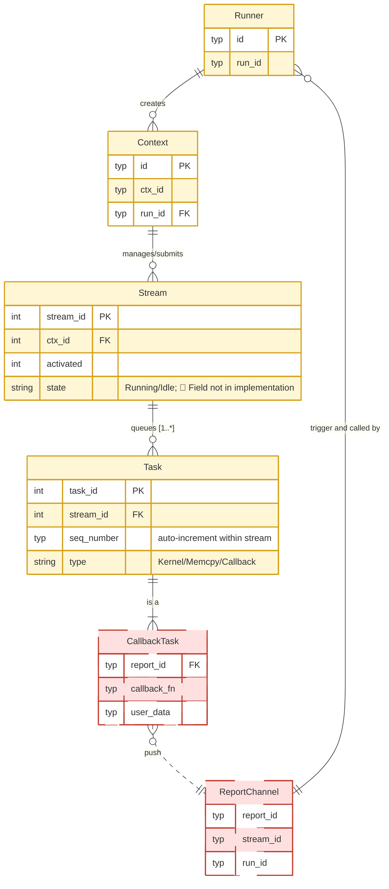
```mermaid
erDiagram
    Runner ||--o{ Context: "creates"
    Runner {
        typ id PK
        typ run_id
    }

    Context {
        typ id PK
        typ ctx_id
        typ run_id FK
    }

    Stream {
        int stream_id PK
        int ctx_id FK
        int activated
        string state "Running/Idle; 🚧 Field not in implementation"
    }
    %% Implementation has no state field; running state expressed by activated/capture_status/task_complete_status

    %% Stream contains an ordered task list
    Context ||--o{ Stream : "manages/submits"
    Stream ||--o{ Task : "queues [1..*]"

    Task {
        int task_id PK
        int stream_id FK
        typ seq_number "auto-increment within stream"
        string type "Kernel/Memcpy/Callback"
    }

    %% Various specific Task types (logical inheritance)
    CallbackTask {
        typ report_id FK
        typ callback_fn
        typ user_data
    }

    %% Logical expression of inheritance (Task has multiple types)
    %% 🧠 Process-private candidate: Context / Stream / Task (only accessed by src/proxy)
    %% CallbackTask distinguished by Task.type (implementation only creates Task table)
    Task ||--|{ CallbackTask : "is a"

    ReportChannel {
        typ report_id
        typ stream_id
        typ run_id
    }

    CallbackTask }o..|| ReportChannel : "push"
    ReportChannel ||--o{ Runner : "trigger and called by"

    classDef unimplemented fill:#ffe0e0,stroke:#c0392b,stroke-width:2px,stroke-dasharray:5 3
    classDef inproc fill:#fff6d6,stroke:#d4a017,stroke-width:2px
    class CallbackTask,ReportChannel unimplemented
    class Runner,Context,Stream,Task inproc

```

### 5.1 Key Relationship Description (Callback and Report Relationship Modeling)

When the **Device** executes a CallbackTask, it triggers the Host Runner thread to execute the callback.

#### 5.1.1 Interface Mapping Table (Callback and Report Relationship Modeling)

| Entity          | Key Management interfaces                                                          |
| ------------- | --------------------------------------------------------------------- |
| CallbackTask  | `rtSetExceptionInfoCallback`, `rtLaunchCallback`,`rtSynchronizeEvent` |
| ReportChannel | `rtSubscribeReport`, `rtUnSubscribeReport`                            |
| Runner        | `rtProcessReport`                                                     |

## 6. Fine-Grained Low-Level Extension of Base `Device` Model

Fine-grained low-level scheduling entities refined on top of the Device hierarchy from [§2.1.1 Hierarchical Structure Overview](#211-hierarchical-structure-overview) (`Die` / `SuperPod` / `Plane` and other conceptual entities have no corresponding structs in this repo's implementation).

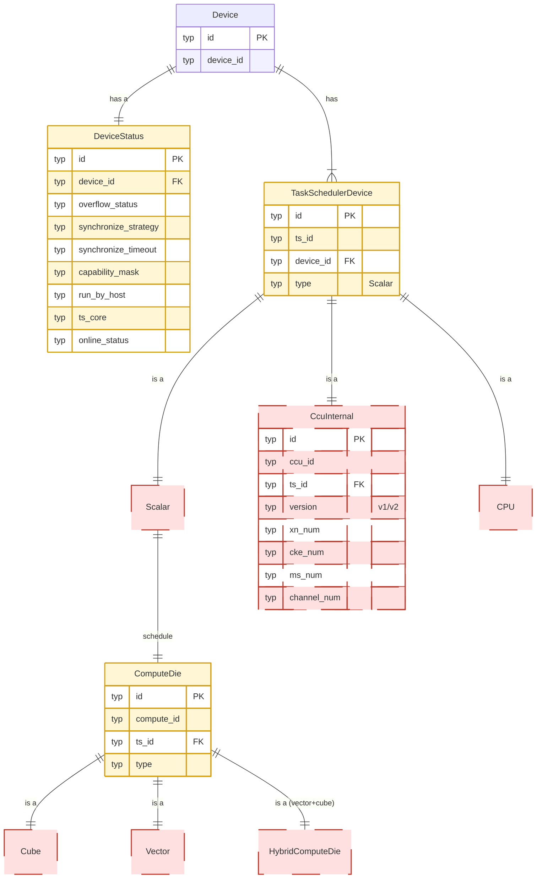
```mermaid
erDiagram

    %% 🧠 Process-private candidate: DeviceStatus (only accessed by src/proxy)
    Device ||--|| DeviceStatus : "has a"
    Device ||--|{ TaskSchedulerDevice : "has "
    Device {
        typ id PK
        typ device_id
    }
    DeviceStatus {
        typ id PK
        typ device_id FK
        typ overflow_status
        typ synchronize_strategy
        typ synchronize_timeout
        typ capability_mask
        typ run_by_host
        typ ts_core
        typ online_status
    }

    %% Scalar/CcuInternal/CPU distinguished by TaskSchedulerDevice.type (conceptual entities, not separately tabled)
    TaskSchedulerDevice ||--|| Scalar :"is a"
    TaskSchedulerDevice ||--|| CcuInternal :"is a"
    TaskSchedulerDevice ||--|| CPU :"is a"
    TaskSchedulerDevice {
        typ id PK
        typ ts_id
        typ device_id FK
        typ type "Scalar"
    }

   CPU {
       %% Conceptual entity: no independent fields, distinguished by ComputeDie.type
   }

   Scalar ||--|| ComputeDie :"schedule"
   Scalar {
       %% Conceptual entity: no independent fields, distinguished by ComputeDie.type
   }

   CcuInternal {
        typ id PK
        typ ccu_id
        typ ts_id FK
        typ version "v1/v2"
        typ xn_num
        typ cke_num
        typ ms_num
        typ channel_num
    }

    %% Cube/Vector/HybridComputeDie distinguished by ComputeDie.type (implementation only creates ComputeDie table)
    ComputeDie ||--|| Cube :"is a"
    ComputeDie ||--|| Vector :"is a"
    ComputeDie ||--|| HybridComputeDie :"is a (vector+cube)"
    ComputeDie {
        typ id PK
        typ compute_id
        typ ts_id FK
        typ type
    }
    Cube {
        %% Conceptual entity: no independent fields, distinguished by ComputeDie.type
    }
    Vector {
        %% Conceptual entity: no independent fields, distinguished by ComputeDie.type
    }
    HybridComputeDie {
        %% Conceptual entity: no independent fields, distinguished by ComputeDie.type
    }

    classDef unimplemented fill:#ffe0e0,stroke:#c0392b,stroke-width:2px,stroke-dasharray:5 3
    classDef inproc fill:#fff6d6,stroke:#d4a017,stroke-width:2px
    class CPU,Scalar,CcuInternal,Cube,Vector,HybridComputeDie unimplemented
    class DeviceStatus,TaskSchedulerDevice,ComputeDie inproc
```

### 6.1 Key Relationship Description (Fine-Grained Low-Level Extension of Base `Device` Model)

**Device Scheduler Hierarchical Structure**:

- `TaskSchedulerDevice` is the abstraction of device schedulers; one Device can contain multiple schedulers.
- Scheduler types include: `Scalar` (scalar processor), `CCU` (collective communication unit), `CPU` (AI CPU)
- In the entity block, this CCU is noted as `CcuInternal` to distinguish from the `Ccu` (CCU resource allocation table) modeled for DB persistence in §2.1.1; the `type` field takes values `Scalar`/`CCU`/`CPU`.
- Different scheduler types handle different computation task types.

**ComputeDie Computation Unit**:

- `ComputeDie` is the abstraction of computation units; inheritance relationships represent computation unit types.
- `Vector`: Vector computation unit, handles vector operations.
- `Cube`: Cube computation unit, handles matrix operations.
- `HybridComputeDie`: Hybrid computation unit, supports both Vector and Cube simultaneously. 🚧 (This type does not exist in the implementation, distinguished by `ComputeDie.type`; zero hits in both this repo and `hcomm/`)

**CCU Internal Structure**:

- `xn_num`: XN node count (cross-node communication)
- `cke_num`: CKE engine count (Checksum engine)
- `ms_num`: MS module count (Memory Scheduler)
- `channel_num`: Communication channel count.
- `version`: CCU version (v1/v2, determines feature differences)

**DeviceStatus State Management**:

- `overflow_status`: Overflow status.
- `synchronize_strategy`: Synchronization strategy configuration.
- `synchronize_timeout`: Synchronization timeout setting.
- `capability_mask`: Device capability mask.
- `run_by_host`: Whether running in Host mode.
- `ts_core`: Scheduler core count.
- `online_status`: Device online status.

**Scalar Scheduling Relationship**:

- `Scalar` scheduler manages `ComputeDie` execution.
- Different ComputeDie types correspond to different computational workloads.

#### 6.1.1 Interface Mapping Table (Fine-Grained Low-Level Extension of Base Device Model)

| Entity                | Key Management interfaces                       |
| ------------------- | ---------------------------------- |
| TaskSchedulerDevice | `rtGetDeviceInfo`, `rtSetTsDevice` |
| DeviceStatus        | `rtGetRunMode`                     |

## 7. Kernel Runtime Relationship Modeling

Kernel-side entities are submitted via ACL interfaces and carried by Task / EventSyncTask (see [§3.1 Data / Task Flow Modeling](#31-data--task-flow-modeling)); interfaces corresponding to each entity are covered in [§7.1.1 Interface Mapping Table](#711-interface-mapping-table-kernel-runtime-relationship-modeling).

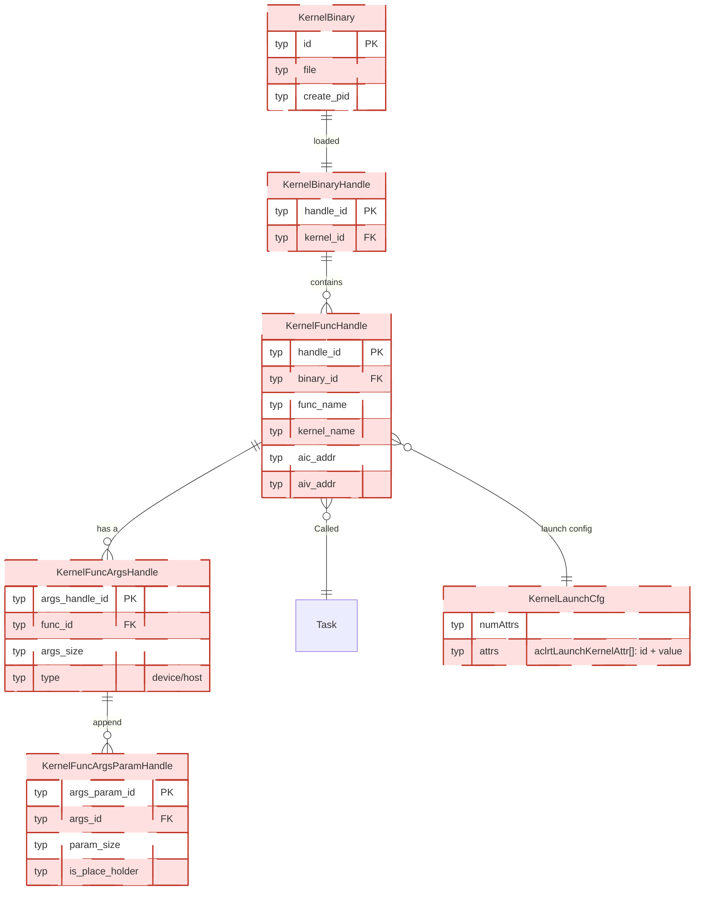
```mermaid
erDiagram
    KernelBinary {
        typ id PK
        typ file
        typ create_pid
    }

    KernelBinary  ||--|| KernelBinaryHandle :"loaded"
    KernelBinaryHandle  ||--o{ KernelFuncHandle :"contains"
    KernelBinaryHandle {
        typ handle_id PK
        typ kernel_id FK
    }

    KernelFuncHandle  ||--o{ KernelFuncArgsHandle :"has a"
    KernelFuncHandle  }o--|| Task :"Called "
    KernelFuncHandle  }o--|| KernelLaunchCfg :"launch config"
    %% KernelLaunchCfg = ACL-side aclrtLaunchKernelCfg (numAttrs/attrs[]), not a sim model, not persisted to DB
    KernelFuncHandle {
        typ handle_id PK
        typ binary_id FK
        typ func_name
        typ kernel_name
        typ aic_addr
        typ aiv_addr
    }

    KernelFuncArgsHandle  ||--o{ KernelFuncArgsParamHandle :"append"
    KernelFuncArgsHandle {
        typ args_handle_id PK
        typ func_id FK
        typ args_size
        typ type "device/host"
    }

    KernelFuncArgsParamHandle {
        typ args_param_id PK
        typ args_id FK
        typ param_size
        typ is_place_holder
    }

    KernelLaunchCfg {
        typ numAttrs
        typ attrs "aclrtLaunchKernelAttr[]: id + value"
    }

    classDef unimplemented fill:#ffe0e0,stroke:#c0392b,stroke-width:2px,stroke-dasharray:5 3
    class KernelBinary,KernelBinaryHandle,KernelFuncHandle,KernelFuncArgsHandle,KernelFuncArgsParamHandle,KernelLaunchCfg unimplemented
```

### 7.1 Key Relationship Description (Kernel Runtime Relationship Modeling)

**KernelBinary Loading Flow**:

1. `KernelBinary` stores .o/.so binary file paths and creating process PID.
2. `rtBinaryLoadFromFile` or `rtBinaryLoadFromData` loads the binary into device memory.
3. After loading, a `KernelBinaryHandle` is generated, containing handle_id and kernel_id.
4. `KernelFuncHandle` represents specific functions within the binary, containing func_name, kernel_name, and address information.

**Kernel Function Call Relationships**:

- `aic_addr` is the AI Core function address.
- `aiv_addr` is the AI Vector function address.
- `KernelFuncArgsHandle` stores function argument information.
- `KernelFuncArgsParamHandle` records argument size and whether it is a placeholder.
- `KernelLaunchCfg` configures Kernel launch parameters (block/grid, etc.) 🚧 (Not a `sim_models.h` entity, not persisted to DB; implementation side uses ACL type `aclrtLaunchKernelCfg`: `numAttrs` + `attrs[]`, with 9 attribute IDs — `SCHEM_MODE`(1)/`DYN_UBUF_SIZE`(2)/`ENGINE_TYPE`(3)/`BLOCKDIM_OFFSET`(4)/`BLOCK_TASK_PREFETCH`(5)/`DATA_DUMP`(6)/`TIMEOUT`(7)/`TIMEOUT_US`(8)/`ENABLE_PROFILING`(9), authoritative definition at `runtime/include/external/acl/acl_rt.h:527-541` (`aclrtLaunchKernelAttrId`); where `LOCAL_MEMORY_SIZE` is a deprecated alias for `DYN_UBUF_SIZE` (same value 2, `acl_rt.h:529-532`), `TIMEOUT` and `TIMEOUT_US` cannot be carried simultaneously (`acl_rt.h:538`); stubs in this repo only recognize the first 8 types, the 9th is not implemented, see `src/proxy/level2/aclrt_kernel_stub.cc:564,1101`)

**Kernel Lifecycle**:

```text
rtCreateBinary -> rtBinaryLoad -> rtBinaryGetFunction
                -> rtLaunchKernel(funcHandle, argsHandle, cfg)
                -> rtBinaryUnLoad -> rtDestroyBinary
```

**Argument Management Mechanism**:

- args_handle_id supports both device and host types.
- is_place_holder identifies whether the argument is a placeholder (deferred binding)
- param_size records the size of a single argument.

#### 7.1.1 Interface Mapping Table (Kernel Runtime Relationship Modeling)

| Entity               | Key Management interfaces                                                                                                    |
| ------------------ | --------------------------------------------------------------------------------------------------------------- |
| KernelBinary       | `rtCreateBinary`, `rtDestroyBinary`                                                                             |
| KernelBinaryHandle | `rtBinaryLoad`, `rtBinaryUnLoad`,`rtBinaryLoadFromFile`,`rtBinaryLoadFromData`                                  |
| KernelFuncHandle   | `rtBinaryGetFunction`, `rtBinaryGetFunctionByEntry`,`rtGetFunctionAddr`,`rtGetFunctionName`,`rtRegisterCpuFunc` |
| KernelLaunchCfg 🚧 | `rtLaunchKernelWithConfig` (ACL-side type, not a sim model)                                                       |

## 8. Model Loading Relationship Modeling