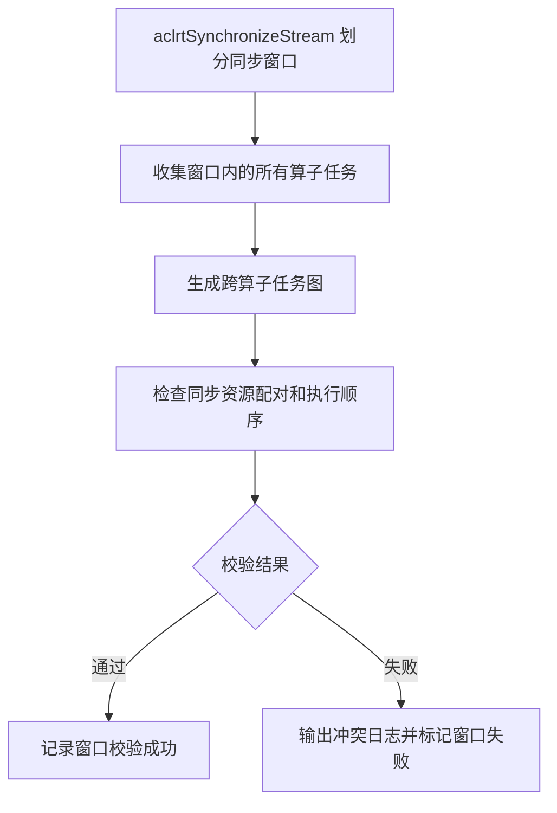

# Checker V3 大图校验

**发布日期：** 2026-07-27

## 摘要

本次发布新增 Checker V3 大图校验能力。工具以 `aclrtSynchronizeStream()` 的调用边界划分同步窗口，将窗口内多个算子的任务合并为一张跨算子任务图，统一检查同步资源的配对关系和执行顺序。

Checker 执行结束后会输出结果总览，分别展示每个算子的单算子校验状态和每个同步窗口的大图校验状态。

## 新功能

- 自动聚合同一同步窗口内的多个算子，生成跨算子任务图。
- 支持检查 AICPU notify、CCU CKE、AIV event 和 AIV flag 四类同步资源。
- 检查跨算子的同步资源配对关系、复用顺序和任务依赖。
- 冲突日志包含资源标识、算子位置和相关任务，便于定位问题。
- 大图校验与单算子校验独立运行，互不影响。
- Checker 执行结束后新增结果总览，集中展示单算子和多算子校验状态。

## 如何使用

### 前提条件

- 已安装并启动 `hccl-vm`。
- 已安装 Checker 插件。
- 用例包含多个连续执行的 HCCL 算子。

### 开启大图校验

Checker 插件配置文件为：

```text
/pathto/hccl_vm_install/plugin/checker/manifest.json
```

确认 `setting.enable_big_graph_checker` 设置为 `true`。

Checker 配置默认开启大图校验。

```json
{
  "setting": {
    "enable_new_checker": true,       // Checker V3 单算子校验流程
    "enable_old_checker": false,      // 老 Checker 单算子校验流程
    "enable_big_graph_checker": true  // 大图校验
  }
}
```


### 执行 Checker

进入 `hccl-vm` 工具命令行后执行：

```bash
(hvm)$> hccl-vm plugin run @checker
```

Checker 会自动按同步窗口生成大图并执行校验，无需额外参数。

## 结果总览

Checker 执行结束后会统一打印结果总览，包含单算子校验结果和多算子大图校验结果。状态取值如下：

| 状态 | 含义 |
|------|------|
| `success` | 对应校验已执行并通过 |
| `failed` | 对应校验已执行但发现问题 |
| `disable` | 对应校验未开启 |

单算子结果按算子编号展示 old checker 和 new checker 的状态：

```text
Checker execution result (success/failed/disable):
Single-op checker result:
| op[id]  | old checker   | new checker   |
| 0       | disable       | success       |
| 1       | disable       | success       |
```

多算子结果按同步窗口编号展示大图校验状态：

```text
Multi-op checker result:
| syncIter   | multi op checker   |
| 0          | success            |
| 1          | failed             |
```

结果总览用于快速判断每个算子和同步窗口是否通过；定位具体问题时，继续查看对应的错误日志。

## 校验范围

| 同步资源 | 校验规则 |
|----------|----------|
| AICPU notify | 严格检查 post/wait 一对一关系和跨算子复用顺序 |
| CCU CKE | 按 `ckeMask` 的每个 bit 建立独立资源并检查复用顺序 |
| AIV event | 严格检查 `AIV_SET_FLAG` 与 `AIV_WAIT_FLAG` 的配对和复用顺序 |
| AIV flag | 允许一个 `AIV_SEND_FLAG` 对应到多个 `AIV_RECV_FLAG`，检查跨组顺序 |

当前大图校验执行同步资源冲突检查。单算子检查、内存冲突检查和语义检查仍由对应的 Checker 流程负责。

## 典型场景

- 一个算子产生的同步资源被多个后续算子消费，形成一打多。
- 多个算子连续生产同一个同步资源，前一轮消费尚未完成，形成多打一。
- 同步资源在多个算子之间复用，但任务图中缺少必要的先后依赖。
- AIV flag 的一个生产方合法对应到多个消费方，但不同生产组之间顺序错误。

## 校验流程

每个同步窗口按以下流程处理：



## 结果查看

校验成功时，日志会输出当前窗口生成的大图规模：

```text
[info] BigGraphCheckerV3 generated graph successfully, syncIter=0, operatorCount=3,
nodeCount=624, rankCount=8
```

检测到大图同步冲突时，重点关注以下日志：

```text
[error] Big graph sync-conflict check failed, syncIter=0, ret=...
[error] BigGraphCheckerV3 failed, syncIter=0, ret=...
```

同步资源冲突日志使用错误码 `602`（`SYNC_RESOURCE_CONFLICT`），并包含冲突类型、资源标识和相关任务：

```text
[ErrorCode: 602] Sync resource has a many-to-one ordering conflict,
conflictType=many-to-one, producerTaskType=RECORD, consumerTaskType=WAIT,
resource=kind=AICPU_NOTIFY, notifyId=42,
consumer=[TaskWaitAICPU] node=128, rank=0, stream=1, queue=0,
previousProducer=[TaskRecordAICPU] node=64, rank=1, stream=0, queue=0,
nextProducer=[TaskRecordAICPU] node=192, rank=1, stream=0, queue=1
```

## 排查建议

1. 根据日志确定发生问题的同步窗口。
2. 根据 `conflictType` 判断问题方向：`many-to-one` 表示多打一，`one-to-many` 表示一打多。
3. 根据 `resource`、`notifyId`、CKE 的 rank/die/ID/bit 或 AIV 资源字段定位同步资源。
4. 结合日志中的算子、rank、stream、queue 和 node 信息，检查跨算子生产/消费任务的依赖关系。
5. 如果出现 `BigGraphCheckerV3 failed`，同时检查用例任务数据和通信资源是否完整。

## 兼容性说明

- 大图校验与 `enable_new_checker`、`enable_old_checker` 相互独立，可单独开启或关闭。
- 关闭 `enable_big_graph_checker` 后，单算子 Checker 仍可按原流程执行。
- 大图校验不需要修改现有用例或增加运行参数。
- 某个同步窗口校验失败不会阻断其他 Checker 流程，但需要根据错误日志处理问题。
