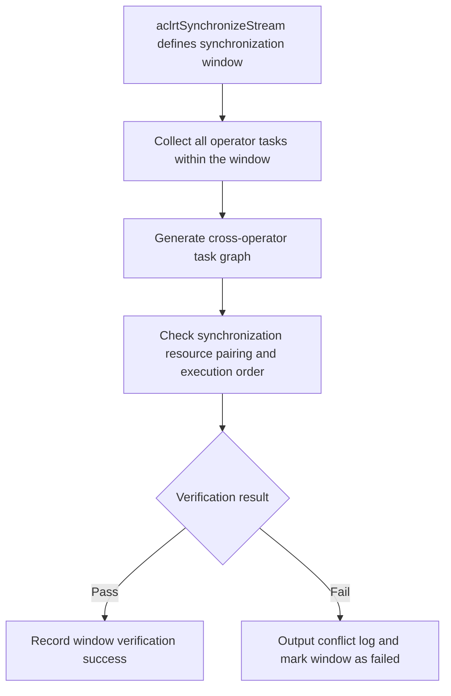

# Checker V3 Big Graph Verification

**Release Date:** 2026-07-27

## Summary

This release introduces Checker V3 big graph verification capability. The tool uses `aclrtSynchronizeStream()` call boundaries to define synchronization windows, merges the tasks of multiple operators within a window into a single cross-operator task graph, and uniformly checks the pairing relationships and execution order of synchronization resources.

After Checker finishes execution, it outputs a result overview showing the single-operator verification status for each operator and the big graph verification status for each synchronization window.

## New Features

- Automatically aggregates multiple operators within the same synchronization window to generate a cross-operator task graph.
- Supports checking four types of synchronization resources: AICPU notify, CCU CKE, AIV event, and AIV flag.
- Checks cross-operator synchronization resource pairing relationships, reuse order, and task dependencies.
- Conflict logs include resource identifiers, operator locations, and related tasks to facilitate issue localization.
- Big graph verification and single-operator verification run independently without interfering with each other.
- After Checker finishes execution, a new result overview is added to centrally display single-operator and multi-operator verification statuses.

## How to Use

### Prerequisites

- `hccl-vm` is installed and running.
- The Checker plugin is installed.
- The test case contains multiple consecutively executed HCCL operators.

### Enabling Big Graph Verification

The Checker plugin configuration file is located at:

```text
/pathto/hccl_vm_install/plugin/checker/manifest.json
```

Ensure `setting.enable_big_graph_checker` is set to `true`.

The Checker configuration enables big graph verification by default.

```json
{
  "setting": {
    "enable_new_checker": true,       // Checker V3 single-operator verification flow
    "enable_old_checker": false,      // Legacy Checker single-operator verification flow
    "enable_big_graph_checker": true  // Big graph verification
  }
}
```


### Running Checker

After entering the `hccl-vm` tool command line, execute:

```bash
(hvm)$> hccl-vm plugin run @checker
```

Checker automatically generates big graphs by synchronization window and performs verification without requiring additional parameters.

## Result Overview

After Checker finishes execution, it displays a unified result overview, including single-operator verification results and multi-operator big graph verification results. Status values are as follows:

| Status | Meaning |
|------|------|
| `success` | The corresponding verification was executed and passed |
| `failed` | The corresponding verification was executed but issues were found |
| `disable` | The corresponding verification is not enabled |

Single-operator results are displayed by operator number showing old checker and new checker statuses:

```text
Checker execution result (success/failed/disable):
Single-op checker result:
| op[id]  | old checker   | new checker   |
| 0       | disable       | success       |
| 1       | disable       | success       |
```

Multi-operator results are displayed by synchronization window number showing big graph verification status:

```text
Multi-op checker result:
| syncIter   | multi op checker   |
| 0          | success            |
| 1          | failed             |
```

The result overview is used to quickly determine whether each operator and synchronization window has passed; when locating specific issues, continue to examine the corresponding error logs.

## Verification Scope

| Synchronization Resource | Verification Rule |
|----------|----------|
| AICPU notify | Strictly checks post/wait one-to-one relationships and cross-operator reuse order |
| CCU CKE | Establishes independent resources per bit of `ckeMask` and checks reuse order |
| AIV event | Strictly checks `AIV_SET_FLAG` and `AIV_WAIT_FLAG` pairing and reuse order |
| AIV flag | Allows one `AIV_SEND_FLAG` to correspond to multiple `AIV_RECV_FLAG` entries, checks cross-group order |

The current big graph verification performs synchronization resource conflict checking. Single-operator checks, memory conflict checks, and semantic checks are still handled by the corresponding Checker flow.

## Typical Scenarios

- A synchronization resource produced by one operator is consumed by multiple subsequent operators, forming a one-to-many pattern.
- Multiple operators consecutively produce the same synchronization resource, and the previous round of consumption has not yet completed, forming a many-to-one pattern.
- A synchronization resource is reused across multiple operators, but the task graph lacks the necessary ordering dependencies.
- An AIV flag's single producer legitimately corresponds to multiple consumers, but the order between different producer groups is incorrect.

## Verification Flow

Each synchronization window is processed according to the following flow:



## Viewing Results

When verification succeeds, the log outputs the scale of the big graph generated for the current window:

```text
[info] BigGraphCheckerV3 generated graph successfully, syncIter=0, operatorCount=3,
nodeCount=624, rankCount=8
```

When a big graph synchronization conflict is detected, focus on the following logs:

```text
[error] Big graph sync-conflict check failed, syncIter=0, ret=...
[error] BigGraphCheckerV3 failed, syncIter=0, ret=...
```

Synchronization resource conflict logs use error code `602` (`SYNC_RESOURCE_CONFLICT`) and include the conflict type, resource identifier, and related tasks:

```text
[ErrorCode: 602] Sync resource has a many-to-one ordering conflict,
conflictType=many-to-one, producerTaskType=RECORD, consumerTaskType=WAIT,
resource=kind=AICPU_NOTIFY, notifyId=42,
consumer=[TaskWaitAICPU] node=128, rank=0, stream=1, queue=0,
previousProducer=[TaskRecordAICPU] node=64, rank=1, stream=0, queue=0,
nextProducer=[TaskRecordAICPU] node=192, rank=1, stream=0, queue=1
```

## Troubleshooting Guide

1. Determine which synchronization window has the issue based on the log.
2. Determine the issue direction based on `conflictType`: `many-to-one` indicates many-to-one, `one-to-many` indicates one-to-many.
3. Locate the synchronization resource based on `resource`, `notifyId`, CKE rank/die/ID/bit, or AIV resource fields.
4. Combined with the operator, rank, stream, queue, and node information in the log, check the dependency relationships of cross-operator producer/consumer tasks.
5. If `BigGraphCheckerV3 failed` appears, also verify that the test case task data and communication resources are complete.

## Compatibility Notes

- Big graph verification is independent of `enable_new_checker` and `enable_old_checker`, and can be enabled or disabled separately.
- When `enable_big_graph_checker` is disabled, the single-operator Checker can still execute according to its original flow.
- Big graph verification does not require modifying existing test cases or adding runtime parameters.
- A failed synchronization window verification does not block other Checker flows, but issues need to be addressed based on error logs.
