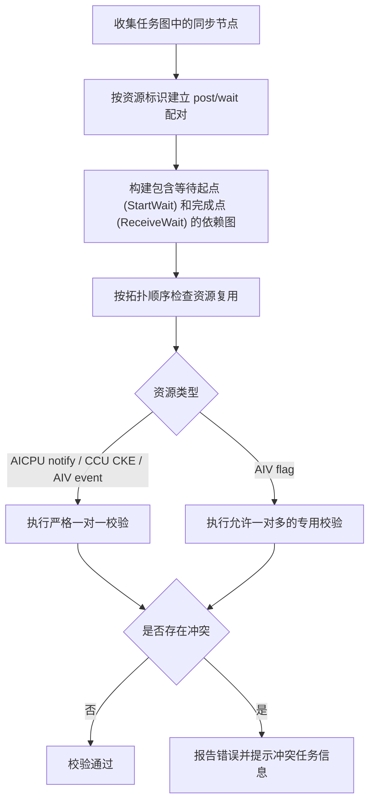

# 同步资源一打多/多打一校验

**发布日期：** 2026-07-23

## 摘要

本次发布新增同步资源一打多/多打一校验。Checker V3 会对 HCCL 任务图中的同步资源（post/wait）建立配对关系，并结合任务图拓扑顺序检查资源复用是否符合预期，提前发现可能导致死锁、信号覆盖或执行乱序的同步冲突。

## 新功能

- 支持校验 AICPU notify、CCU CKE、AIV event 和 AIV flag 四类同步资源。
- 检查同步资源的生产方（post）与消费方（wait）是否存在一对多、多对一或未匹配关系。
- 检查同一同步资源跨轮次复用时的生产/消费顺序，覆盖任务图中的跨流依赖。
- 对 AIV flag 的合法一对多关系单独建模，校验同一 flag cell 内不同分组之间的顺序，避免误报。
- 冲突日志包含错误码、冲突类型、资源标识和相关任务节点，便于定位算法编排问题。

## 校验范围

| 同步资源 | 生产任务 | 消费任务 | 校验规则 |
|----------|----------|----------|----------|
| AICPU notify | `RECORD` | `WAIT` | 严格一对一，并校验跨轮次复用顺序 |
| CCU CKE | `RECORD` | `WAIT` | 按 `ckeMask` 的每个 bit 建立独立资源并校验 |
| AIV event | `AIV_SET_FLAG` | `AIV_WAIT_FLAG` | 严格一对一，并校验跨轮次复用顺序 |
| AIV flag | `AIV_SEND_FLAG` | `AIV_RECV_FLAG` | 允许合法的一对多关系，校验跨组顺序 |

## 校验逻辑

校验流程如下：



### 正确的资源复用

上一轮 wait 完成后，下一轮 post 和 wait 按任务图依赖顺序执行，属于合法的同步资源复用：


通用的一对一资源主要检查以下问题：

- 一个生产方对应多个消费方（一打多）。
- 多个生产方对应一个消费方（多打一）。
- 消费方没有匹配的生产方，或生产方在首个有效配对前提前执行。
- 上一轮消费尚未完成，下一轮生产或消费已经越过依赖顺序。

AIV flag 允许一个 `AIV_SEND_FLAG` 对应多个 `AIV_RECV_FLAG`。校验器会以 `flagOwnerRank`、`launchIdx` 和 `commInfoOffset` 标识同一个 flag cell，要求前一生产组的所有消费方完成后，下一生产组才能继续执行。

## 典型冲突场景

### 多打一

同一个同步资源存在多个连续的生产方，但前一轮消费尚未完成时，后续生产方已经执行，可能覆盖前一次同步结果：


### 一打多

同一个同步资源的生产方与多个消费方之间缺少正确的顺序约束，后续消费方可能越过前一轮同步完成点：


## 如何使用

Checker V3 单算子校验和大图校验流程均已内置该功能，无需额外配置。按原有方式执行 Checker 即可触发同步资源校验。

校验通过时不输出冲突错误；检测到冲突时，日志会打印错误码 `602`（`SYNC_RESOURCE_CONFLICT`）以及以下关键信息：

- `conflictType`：冲突类型，包含 `many-to-one`（多打一）或 `one-to-many`（一打多）。
- `resource`：同步资源标识，例如 notifyId、CKE 的 rank/die/ID/bit 或 AIV event 字段。
- `consumer` / `producer`：当前消费方或生产方任务。
- `previousProducer` / `nextProducer`、`previousConsumer` / `nextConsumer`：发生顺序冲突的前后任务。

## 效果展示

以下为 AICPU notify 资源发生多打一顺序冲突时的日志示例：

```text
[ErrorCode: 602] Sync resource has a many-to-one ordering conflict, conflictType=many-to-one,
producerTaskType=RECORD, consumerTaskType=WAIT, resource=kind=AICPU_NOTIFY, notifyId=42, order=1,
consumer=[TaskWaitAICPU] node=128, rank=0, stream=1, queue=0, protocol=SDMA,
notify={recordRank=1, waitRank=0, notifyId=42},
previousProducer=[TaskRecordAICPU] node=64, rank=1, stream=0, queue=0, protocol=SDMA,
notify={recordRank=1, waitRank=0, notifyId=42},
nextProducer=[TaskRecordAICPU] node=192, rank=1, stream=0, queue=1, protocol=SDMA,
notify={recordRank=1, waitRank=0, notifyId=42}
```

其中：

- `resource=kind=AICPU_NOTIFY` 表示冲突资源类型，任务中的 `notifyId=42` 用于定位具体资源。
- `consumer` 表示当前被消费的 wait 任务。
- `previousProducer` 和 `nextProducer` 表示可能发生抢跑的前后两个生产任务。

## 排查建议

1. 先根据 `conflictType` 判断问题方向：`many-to-one` 表示多打一，`one-to-many` 表示一打多。
2. 根据 `resource` 或 AIV flag 日志中的 `cell` 字段定位具体同步资源。
3. 对照日志中的 rank、stream、queue、node 和任务类型，检查生产/消费任务是否属于同一轮次，且依赖关系是否完整。
4. 对跨轮次复用场景，确认上一轮 wait 的完成点已经先于下一轮 post 和 wait 执行。

## 兼容性说明

- 原有 Checker V3 校验流程和其他类型检查不受影响。
- 不需要修改现有用例或增加运行参数。

## 相关代码

- 核心实现：`src/plugin/checker/src/framework/task_graph_generator_v3/task_graph_sync_conflict_v3.cc`
- Checker V3 单算子入口：`src/plugin/checker/src/checker/checker.cc`
- 大图校验入口：`src/plugin/checker/src/framework/big_graph_check/big_graph_checker.cc`
- 单元测试：`test/plugin/checker/framework/task_graph_generator_v3/task_graph_sync_conflict_v3_test.cc`
