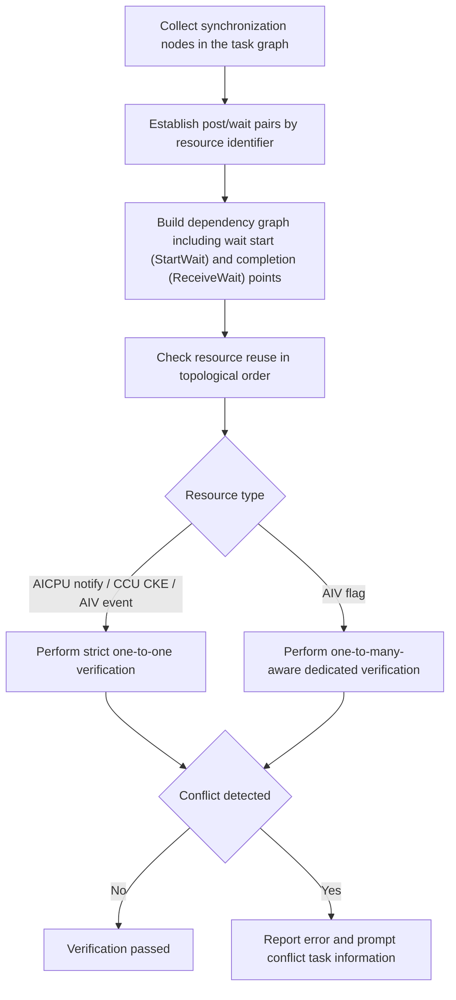

# Synchronization Resource One-to-Many/Many-to-One Verification

**Release Date:** 2026-07-23

## Summary

This release adds synchronization resource one-to-many/many-to-one verification. Checker V3 establishes pairing relationships for synchronization resources (post/wait) in the HCCL task graph, and checks whether resource reuse conforms to expectations based on the task graph topological order, proactively detecting synchronization conflicts that could lead to deadlocks, signal overwrites, or out-of-order execution.

## New Features

- Supports verification of four types of synchronization resources: AICPU notify, CCU CKE, AIV event, and AIV flag.
- Checks whether the producer (post) and consumer (wait) of synchronization resources have one-to-many, many-to-one, or unmatched relationships.
- Checks the producer/consumer order when the same synchronization resource is reused across rounds, covering cross-stream dependencies in the task graph.
- Separately models legitimate one-to-many relationships for AIV flag, verifying the order between different groups within the same flag cell to avoid false positives.
- Conflict logs include error codes, conflict types, resource identifiers, and related task nodes to facilitate localization of algorithm orchestration issues.

## Verification Scope

| Synchronization Resource | Producer Task | Consumer Task | Verification Rule |
|----------|----------|----------|----------|
| AICPU notify | `RECORD` | `WAIT` | Strict one-to-one, and verifies cross-round reuse order |
| CCU CKE | `RECORD` | `WAIT` | Establishes independent resources per bit of `ckeMask` and verifies |
| AIV event | `AIV_SET_FLAG` | `AIV_WAIT_FLAG` | Strict one-to-one, and verifies cross-round reuse order |
| AIV flag | `AIV_SEND_FLAG` | `AIV_RECV_FLAG` | Allows legitimate one-to-many relationships, verifies cross-group order |

## Verification Logic

The verification flow is as follows:



### Correct Resource Reuse

After the previous round's wait completes, the next round's post and wait execute according to the task graph dependency order, which constitutes legitimate synchronization resource reuse:


General one-to-one resources primarily check for the following issues:

- One producer corresponding to multiple consumers (one-to-many).
- Multiple producers corresponding to one consumer (many-to-one).
- A consumer with no matching producer, or a producer executing prematurely before the first valid pairing.
- The previous round's consumption has not completed, but the next round's production or consumption has already bypassed the dependency order.

AIV flag allows one `AIV_SEND_FLAG` to correspond to multiple `AIV_RECV_FLAG` entries. The verifier identifies the same flag cell using `flagOwnerRank`, `launchIdx`, and `commInfoOffset`, requiring that all consumers of the previous producer group complete before the next producer group can proceed.

## Typical Conflict Scenarios

### Many-to-One

The same synchronization resource has multiple consecutive producers, but the subsequent producer has already executed before the previous round's consumption completed, potentially overwriting the previous synchronization result:


### One-to-Many

The same synchronization resource's producer and multiple consumers lack correct ordering constraints, and subsequent consumers may bypass the previous round's synchronization completion point:


## How to Use

Checker V3 single-operator verification and big graph verification flows both include this functionality built-in, requiring no additional configuration. Execute Checker in the usual way to trigger synchronization resource verification.

When verification passes, no conflict errors are output; when a conflict is detected, the log prints error code `602` (`SYNC_RESOURCE_CONFLICT`) along with the following key information:

- `conflictType`: Conflict type, including `many-to-one` or `one-to-many`.
- `resource`: Synchronization resource identifier, such as notifyId, CKE rank/die/ID/bit, or AIV event fields.
- `consumer` / `producer`: Current consumer or producer task.
- `previousProducer` / `nextProducer`, `previousConsumer` / `nextConsumer`: The preceding and succeeding tasks involved in the ordering conflict.

## Output Examples

The following is a log example when an AICPU notify resource has a many-to-one ordering conflict:

```text
[ErrorCode: 602] Sync resource has a many-to-one ordering conflict, conflictType=many-to-one,
producerTaskType=RECORD, consumerTaskType=WAIT, resource=kind=AICPU_NOTIFY, notifyId=42, order=1,
consumer=[TaskWaitAICPU] node=128, rank=0, stream=1, queue=0, protocol=SDMA,
notify={recordRank=1, waitRank=0, notifyId=42},
previousProducer=[TaskRecordAICPU] node=64, rank=1, stream=0, queue=0, protocol=SDMA,
notify={recordRank=1, waitRank=0, notifyId=42},
nextProducer=[TaskRecordAICPU] node=192, rank=1, stream=0, queue=1, protocol=SDMA,
notify={recordRank=1, waitRank=0, notifyId=42}
```

Where:

- `resource=kind=AICPU_NOTIFY` indicates the conflict resource type, and `notifyId=42` in the task is used to locate the specific resource.
- `consumer` indicates the currently consumed wait task.
- `previousProducer` and `nextProducer` indicate the two producer tasks that may be racing.

## Troubleshooting Guide

1. First determine the issue direction based on `conflictType`: `many-to-one` indicates many-to-one, `one-to-many` indicates one-to-many.
2. Locate the specific synchronization resource based on `resource` or the `cell` field in AIV flag logs.
3. Cross-reference the rank, stream, queue, node, and task type in the log to check whether the producer/consumer tasks belong to the same round and whether the dependency relationships are complete.
4. For cross-round reuse scenarios, confirm that the previous round's wait completion point executes before the next round's post and wait.

## Compatibility Notes

- The existing Checker V3 verification flow and other types of checks are not affected.
- No need to modify existing test cases or add runtime parameters.

## Related Code

- Core implementation: `src/plugin/checker/src/framework/task_graph_generator_v3/task_graph_sync_conflict_v3.cc`
- Checker V3 single-operator entry: `src/plugin/checker/src/checker/checker.cc`
- Big graph verification entry: `src/plugin/checker/src/framework/big_graph_check/big_graph_checker.cc`
- Unit tests: `test/plugin/checker/framework/task_graph_generator_v3/task_graph_sync_conflict_v3_test.cc`
